# Introduction

**INF8422 : Perception Robotique et Intelligence Spatiale**

Prof. Pierre-Yves Lajoie


---
hideInToc: true
---
# Agenda

<Toc />

---
hideInToc: true
---

# Prérequis

<div class="grid grid-cols-3 gap-4 mt-6">
  <div class="text-center">
    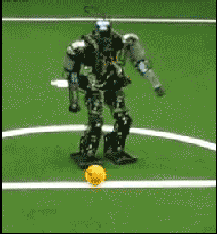
    <p class="text-sm text-black mt-2">Algèbre linéaire et calcul de base</p>
  </div>
  <div class="text-center">
    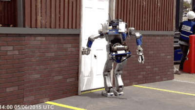
    <p class="text-sm text-black mt-2">Programmation en Python</p>
  </div>
  <div class="text-center">
    
    <p class="text-sm text-black mt-2">Patience et débrouillardise</p>
  </div>
</div>
<div v-click>
<p   class="text-center mt-6 text-lg font-semibold">Le cours en est à sa première itération.</p>
<p   class="text-center mt-6 text-lg">Aidez-nous à le faire converger : partagez vos commentaires (et vos gradients).</p>
</div>

---
layout: center
hideInToc: true
---

### Pierre-Yves Lajoie ing. Ph.D.

Professeur adjoint - Département de génie informatique et génie logiciel

Laboratoire MIST : [mistlab.ca](https://mistlab.ca)

<div class="grid grid-cols-3 gap-0.5 mt-6">
  <div class="text-center">
    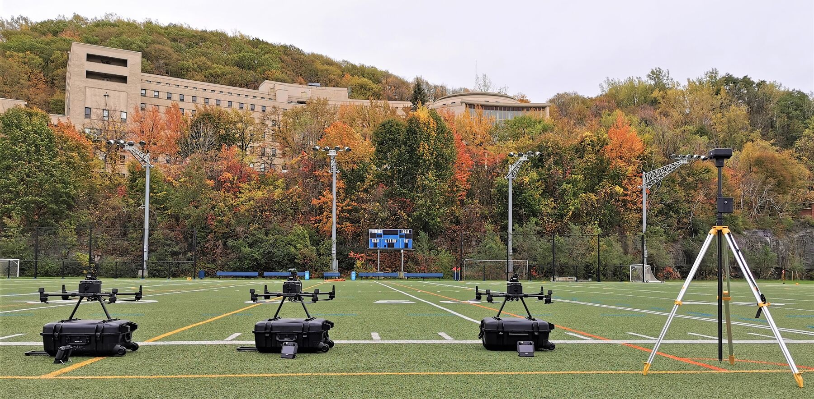
  </div>
  <div class="text-center">
    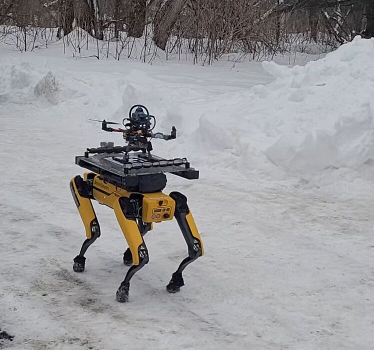
  </div>
  <div class="text-center">
    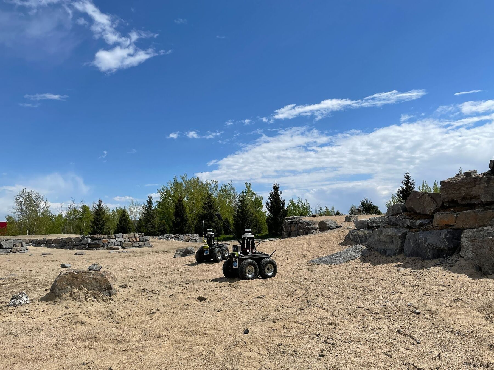
  </div>
</div>

<div>
<p   class="text-center mt-6 text-lg font-semibold">Laboratoire de recherche en robotique autonome</p>
<p   class="text-center mt-6 text-lg">Intelligence Spatiale, Localisation, Cartographie, Planification, Systèmes multi-agent, etc.</p>
</div>

---
layout: section
---

# Logistique du cours

---
hideInToc: true
---

# Évaluations

<div class="grid grid-cols-2 gap-4 mt-3">
<div>

| Évaluation | Pondération |
|---|---|
| 5 Travaux Pratiques | 5 × 5 % = **25 %** |
| 4 meilleurs Quiz / 5 | 4 × 7.5 % = **30 %** |
| Projet de session | **25 %** |
| Examen final | **20 %** |

**Double seuil**: Vous devez avoir au minimum avoir une moyenne de **50% aux évaluations individuelles** (Quizs et Examen) pour obtenir la note de passage.
</div>
<div>

<InfoBlock title="Quiz en classe">

- Environ aux deux semaines, **25 min**, début de cours.
- Porte sur la matière des cours précédents.
- 5 quiz au total, **seuls les 4 meilleurs** comptent.
- Premier quiz : **11 septembre**.

</InfoBlock>

</div>
</div>

---
hideInToc: true
---

# Travaux Pratiques

<div class="grid grid-cols-2 gap-5 mt-2">
<div>

<InfoBlock title="Organisation">

- **5 TPs** individuels ou en équipe de 2.
- Chargé de laboratoire : **Julien Lagacé**.
- Toutes les ressources sur **Moodle**.
- Rejoignez le **Discord** du cours pour le support (lien sur Moodle).

</InfoBlock>

</div>
<div>

<AlertBlock title="Labos">

Les séances de laboratoire débutent le 9 septembre.

Première remise:

**TP 1**: mercredi **15 septembre**, 23h30.


</AlertBlock>

</div>
</div>


---
hideInToc: true
---

# Projet de session

<div class="grid grid-cols-2 gap-5 mt-2">
<div>

<InfoBlock title="Format">

- Équipe de **2 à 3 personnes**.
- Rapport de **4 à 6 pages**, double colonne, format **IEEE**.
- Une liste de suggestions de sujets est disponible sur **Moodle**.
- Critères: Rigueur scientifique, expérimentations, interprétation des résultats.

</InfoBlock>

</div>
<div>

<AlertBlock title="Échéancier">

**9 octobre, 8h30** — Composition de l'équipe + description du sujet (max. 1 page) : objectif (Quoi?), motivation (Pourquoi?) et expérimentations prévues (Comment?).

**27 novembre** — Présentation de **10 minutes**.

**22 décembre, 8h30** — Remise du rapport final.

</AlertBlock>

</div>
</div>

---
hideInToc: true
---

# Intelligence artificielle - Point de vue des étudiant

<div class="grid grid-cols-2 gap-5 mt-2">
<div>

<InfoBlock title="Impact sur vos apprentissages">

- Nuit de développer des compétences.
- Baisse de l’esprit critique.
- Créativité limitée.

</InfoBlock>

<div class="text-center">
    
</div>

</div>
<div>

<AlertBlock title="Vos contraintes">

- Vous voulez de bonnes notes.
- Vous n'avez pas beaucoup de temps (cours, recherche, etc.).
- Parfois ce qui est demandé est irréaliste sans l'IA.

</AlertBlock>

</div>
</div>

---
hideInToc: true
---

# Intelligence artificielle - Point de vue de l'enseignant

<div></div>

**Problème majeur**: Comment concevoir des travaux pratiques permettant de comprendre les concepts vue en classe **ET**  suffisamment complexe pour déjouer l'IA...

<div class="grid grid-cols-2 gap-5 mt-2">
<div>

<AlertBlock title="Solution 1 - Rendre les travaux plus difficiles">

Positif:
- Permet des travaux plus ambitieux.
- Plus proche du contexte de travail.
- Apprendre à utiliser les outils d'IA.

Négatif:
- Vous n'avez pas le choix de les utiliser et ça limite les apprentissages.

C'est notre solution pour le **projet de session**.

</AlertBlock>

</div>
<div>

<InfoBlock title="Solution 2 - Rendre les travaux plus faciles">

Positif:
- Peut se faire sans l'IA
- Maximise l'apprentissage

Négatif:
- Peut être résoud par l'IA
- Difficile à évaluer

C'est notre solution pour les **travaux pratiques**.
</InfoBlock>

</div>
</div>

---
hideInToc: true
---

# Intelligence artificielle - Point de vue de l'enseignant

<div></div>

<div class="grid grid-cols-2 gap-5 mt-2">
<div>

<AlertBlock title="Solution 1 - Projet de session">

**Projet de session:**

Vous pouvez utiliser l'IA et faire un projet le plus ambitieux possibles.

**Ceci dit**, si vous souhaitez *ne pas utiliser l'IA* pour le projet, veuillez nous l'indiquer, on va moduler nos attentes en conséquences.

</AlertBlock>

</div>
<div>

<InfoBlock title="Solution 2 - Travaux Pratiques">

On vous demande de ne pas utiliser l'IA dans les travaux pratiques, pour votre apprentissage.

En contrepartie:
- Support de l'équipe enseignante
- Ajustements si le TP est trop difficile ou trop long

**Avant de vous résoudre à utiliser l'IA pour résoudre le TP, venez nous voir.**

On pourra vous expliquer, vous aider, et ajuster si nécessaire.

</InfoBlock>

</div>
</div>

---
hideInToc: true
---

# Calendrier de la session

<div class="grid grid-cols-4 gap-3 mt-3 text-xs">

<div>
<p class="font-bold text-sm mb-2 text-gray-600">Septembre</p>
<div class="space-y-1">
  <div class="rounded bg-orange-100 px-2 py-1 font-semibold">11 sept. — Quiz 1</div>
  <div class="rounded bg-red-100 px-2 py-1 font-semibold">15 sept. — TP 1 dû</div>
  <div class="rounded bg-blue-100 px-2 py-1 font-bold">23-25 sept. — Labo et Cours à distance</div>
  <div class="rounded bg-red-100 px-2 py-1 font-semibold">29 sept. — TP 2 dû</div>
</div>
</div>

<div>
<p class="font-bold text-sm mb-2 text-gray-600">Octobre</p>
<div class="space-y-1">
  <div class="rounded bg-orange-100 px-2 py-1 font-semibold">2 oct. — Quiz 2</div>
  <div class="rounded bg-purple-100 px-2 py-1 font-semibold">9 oct. — 📋 Équipe + sujet</div>
  <div class="rounded bg-red-100 px-2 py-1 font-semibold">20 oct. — TP 3 dû</div>
  <div class="rounded bg-orange-100 px-2 py-1 font-semibold">23 oct. — Quiz 3</div>
</div>
</div>

<div>
<p class="font-bold text-sm mb-2 text-gray-600">Novembre</p>
<div class="space-y-1">
  <div class="rounded bg-red-100 px-2 py-1 font-semibold">3 nov. — TP 4 dû</div>
  <div class="rounded bg-orange-100 px-2 py-1 font-semibold">6 nov. — Quiz 4</div>
  <div class="rounded bg-red-100 px-2 py-1 font-semibold">17 nov. — TP 5 dû</div>
  <div class="rounded bg-orange-100 px-2 py-1 font-semibold">20 nov. — Quiz 5</div>
  <div class="rounded bg-purple-100 px-2 py-1 font-semibold">27 nov. — 🎤 Présentation</div>
</div>
</div>

<div>
<p class="font-bold text-sm mb-2 text-gray-600">Décembre</p>
<div class="space-y-1 mb-3">
  <div class="rounded bg-purple-100 px-2 py-1 font-semibold">22 déc. — 📄 Rapport dû</div>
</div>
<div class="rounded border border-gray-200 p-2 text-xs space-y-1 mt-4">
  <p class="font-semibold mb-1">Légende</p>
  <p><span class="inline-block w-3 h-3 rounded bg-orange-200 mr-1"></span>Quiz</p>
  <p><span class="inline-block w-3 h-3 rounded bg-red-200 mr-1"></span>Remises TP</p>
  <p><span class="inline-block w-3 h-3 rounded bg-purple-200 mr-1"></span>Projet</p>
</div>
</div>

</div>


---
layout: section
---

# Qu'est-ce que la perception robotique et l'intelligence spatiale ?

---
layout: center
class: text-center
hideInToc: true
---

<p class="text-gray-400 text-xl mb-8">Mythe ou Réalité ?</p>

# « perception robotique == vision par ordinateur. »

---
layout: two-cols-header
hideInToc: true
---

# Perception ≠ Vision

::left::

<span class="text-red-500 font-bold">Partiellement faux.</span> La vision par ordinateur traite des images et vidéos :
détection d'objets, segmentation, reconnaissance de formes, etc.

Les robots ont besoin de plus d'informations :

- **Géométrie 3D de tout l'environnement:** profondeur, obstacles, traversabilité, structures.
- **Propriétés physiques :** articulation, masse, forces.
- **Contraintes temps-réel :** une erreur = une collision.

::right::

<div class="flex flex-col gap-3 mt-2">
  <div class="rounded border border-gray-200 p-3 text-sm">
    <p class="font-bold mb-1">Vision : « Qu'est-ce que c'est ? »</p>
    <p class="text-gray-500">→ Classification, segmentation, etc.</p>
  </div>
  <div class="rounded border border-blue-300 bg-blue-50 p-3 text-sm">
    <p class="font-bold mb-1">Perception robotique:</p>
    <p class="text-gray-500">→ Où suis-je?</p>
    <p class="text-gray-500">→ Comment me rendre au point B sans collision?</p>
    <p class="text-gray-500">→ Comment prendre un objet?</p>
    <p class="text-gray-500">→ Quel sera l'état de l'environnement suivant une action?</p>
  </div>
</div>

---
layout: center
class: text-center
hideInToc: true
---

<p class="text-gray-400 text-xl mb-8">Mythe ou Réalité ?</p>

# « La perception robotique est plus difficile que la vision par ordinateur. »

---
layout: two-cols-header
hideInToc: true
---

# Tout est relatif

::left::

**Parfois oui :**
- Doit produire des sorties plus riches (3D, propriétés physiques, etc).
- Sensible à la vitesse de traitement.
- Les erreurs ont des conséquences réelles.

**Parfois non** : le robot peut agir pour simplifier la perception.

::right::

<AlertBlock title="Le robot n'est pas passif">

Contrairement à la vision classique, le robot peut :
- Se déplacer pour trouver un meilleur angle de vue.
- S'approcher pour améliorer la résolution.
- Interagir pour révéler des propriétés cachées.

</AlertBlock>

---
layout: center
class: text-center
hideInToc: true
---

<p class="text-gray-400 text-xl mb-8">Mythe ou Réalité ?</p>

# « La perception robotique se limite aux données visuelles. »

---
hideInToc: true
---


# La perception robotique est multimodale

<span class="text-red-500 font-bold">Faux.</span> Chaque modalité apporte une information complémentaire.

<div class="grid grid-cols-3 gap-3 mt-4 text-sm">
  <div class="rounded border border-gray-200 p-3">
    <p class="font-bold mb-1">📷 Vision</p>
    <p class="text-gray-500">Caméra RGB, RGB-D, stéréo</p>
  </div>
  <div class="rounded border border-gray-200 p-3">
    <p class="font-bold mb-1">📡 Géométrie active</p>
    <p class="text-gray-500">LiDAR, Radar, Sonar</p>
  </div>
  <div class="rounded border border-gray-200 p-3">
    <p class="font-bold mb-1">⚡ Inertiel</p>
    <p class="text-gray-500">IMU (accéléromètre, gyroscope, magnétomètre)</p>
  </div>
  <div class="rounded border border-gray-200 p-3">
    <p class="font-bold mb-1">🤚 Tactile</p>
    <p class="text-gray-500">Force, pression, texture</p>
  </div>
  <div class="rounded border border-gray-200 p-3">
    <p class="font-bold mb-1">🌍 Infrastructure</p>
    <p class="text-gray-500">GPS, UWB, WiFi</p>
  </div>
  <div class="rounded border border-gray-200 p-3">
    <p class="font-bold mb-1">🔊 Acoustique</p>
    <p class="text-gray-500">Microphones</p>
  </div>
</div>

---
layout: center
class: text-center
hideInToc: true
---

<p class="text-gray-400 text-xl mb-8">Mythe ou Réalité ?</p>

# « La perception robotique == l'estimation d'état. »

---
layout: two-cols-header
hideInToc: true

---


# Construire une représentation

::left::

**Pas seulement.**

La perception robotique cherche à construire une représentation de l'environnement pour la planification/autonomie.

- Certaines propriétés sont qualitatives (ex. sémantique).
- Certaines représentations sont implicites (ex. espace latent d'un réseau neuronal).
- L'estimation d'état est généralement passive, alors que la perception robotique peut être active.
- La structure de l'environnement et ses ambiguités pour informer l'estimation de l'incertitude.

::right::


---

# Survol du semestre

Le cours couvre plusieurs sujets :

1. **Fondements:** Géométrie 3D et outils mathématiques
2. **SLAM (Cartographie et Localisation Simultanées):** Extraction de données de capteurs, Estimation d'état.
3. **Représentation :** Comment modéliser le monde et gérer l'incertitude.
4. **Perception Dynamique et en Action :** Dynamique, interaction, manipulation, multi-agent.
5. **Applications :** Sujets avancés et études de cas.

<div class="grid grid-cols-3 gap-0.5 mt-1">
  <div class="text-center">
    
  </div>
  <div class="text-center">
    
  </div>
  <div class="text-center">
    
  </div>
</div>

---
layout: section
---

# Robotique autonome

---
hideInToc: true
---

# Le cycle de l'autonomie : Percevoir-Planifier-Agir

Le paradigme classique de la robotique autonome (Sense-Plan-Act) :


- **Percevoir (Sense) :** Acquisition de données et estimation de l'état du monde.

<div v-click>
<strong>Prédire (Predict) :</strong> Prédire l'évolution de l'environnement.
</div>

- **Planifier (Plan) :** Prise de décision basée sur l'état estimé pour atteindre un but.
- **Agir (Act) :** Exécution des commandes motrices. Change l'état du robot et de l'environnement.

<InfoBlock title="Rôle de la perception">
C'est l'interface entre le monde physique réel et le modèle numérique du robot et de son environnement.
</InfoBlock>

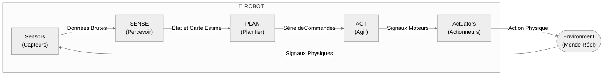

---
hideInToc: true
---


# Paradigme 1 : La Perception pour l'Autonomie

Historiquement, la perception est vue comme étant au service de la navigation.

- **Objectif :** Permettre au robot de se déplacer sans collision et de se localiser.
- **Approche classique :** Le robot crée et maintient une carte de son environnement en temps réel. Le défi est de trouver la carte et l'estimation de position qui expliquent le mieux les données bruitées des capteurs.

<AlertBlock title="Applications types">

- Véhicules autonomes (Waymo, Tesla).
- Robots aspirateurs (iRobot).
- Logistique (Gestion d'entrepôt, Amazon).

</AlertBlock>

---
hideInToc: true
---


# Paradigme 2 : L'Autonomie pour la Perception

**Perception Active** : Le robot agit pour mieux percevoir.

- **Exemple :** "Se déplacer pour voir derrière l'obstacle" ou "S'approcher pour mieux classifier".
- **Objectif :** Maximisation de l'information, qualité de la carte, etc.

<ExampleBlock title="Applications types">

- Inspection d'infrastructures.
- Recherche et sauvetage (SAR).
- Exploration d'environnements inconnus.
- Agriculture de précision.

</ExampleBlock>


---
layout: section
---

# Géométrie 3D

---
hideInToc: true
---

# Géométrie 3D

La navigation robotique repose sur la géométrie 3D :


- **Repères de coordonnées** (Frames)
- **Positions et Translations**
- **Représentation de l'Orientation**
- **Représentation de la Pose** (Position + Orientation)


---
layout: two-cols-header
hideInToc: true
---

# Repères de Coordonnées (Coordinate Frames)

Un repère est un ensemble d'axes orthogonaux attachés à un corps.

::left::

**Repères usuels en robotique :**

- **Robot frame ($r$)** : Attaché au robot (souvent au centre de masse).
- **Sensor frame ($c, l \dots$)** : Attaché au capteur (ex : caméra, LiDAR).
- **World frame ($w$)** : Fixe dans l'environnement (ex : point de départ).

::right::

<div class="grid grid-cols-2 gap-4 h-4/5 items-center mt-2">
  
  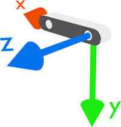
</div>

---
layout: two-cols-header
hideInToc: true
---

# Convention Main Droite (Right-Handed)

$$x \times y = z$$

::left::

<InfoBlock title="Mnémoniques">

- Pouce ($z$), Index ($x$), Majeur ($y$).
- Pouce vers $z$, les doigts s'enroulent de $x$ vers $y$.

</InfoBlock>

::right::


<p class="text-xs text-center text-gray-500 mt-1">Repères usuels (gauche: robot frame, droite: camera/image frames)</p>

---
layout: two-cols-header
hideInToc: true
---

# Conventions de Repères

::left::

**Robot Frame ($r$)**
- Origine : Centre de masse.
- $x_r$ : Vers l'avant (Forward).
- $y_r$ : Vers la gauche (Left).
- $z_r$ : Vers le haut (Up).

<br/>

**Image Frame ($i$)** (2D)
- Origine : Coin haut-gauche.
- $x$ droite, $y$ bas.

::right::

**Camera Frame ($c$)**
- Origine : Centre optique.
- $z_c$ : Regarde la scène (Optical Axis).
- $x_c$ : Vers la droite.
- $y_c$ : Vers le bas.


---
layout: two-cols-header
hideInToc: true
---

# Points et Positions

La position d'un point $p$ dans le repère $w$ est un vecteur :

$$p^w = \begin{bmatrix} p_x^w \\ p_y^w \\ p_z^w \end{bmatrix} \in \mathbb{R}^3$$

Les scalaires $p_x^w, p_y^w, p_z^w$ sont les projections sur les axes $x_w, y_w, z_w$.

::left::

::right::


---
layout: two-cols-header
hideInToc: true
---
<style>
.two-cols-header {
  grid-template-columns: 7fr 6fr;
}
</style>
# Translations et Composition

::left::

**Déplacement (Translation) :** entre deux points $p_1$ et $p_2$ :

$$p_{12}^w = p_2^w - p_1^w$$

**Composition :**

$$p_2^w = p_1^w + p_{12}^w$$

**Inverse :**

$$p_{12}^w = -p_{21}^w$$

*Note : La notation explicite le repère ($w$, i.e. world) en exposant.*

::right::


---
hideInToc: true
---

# Représentations de la Rotation

Comment décrire l'orientation du repère $r$ (robot) par rapport à $w$ (monde) ?


1. **Matrice de Rotation** (Rotation Matrix)
2. **Angles d'Euler** (Roll-Pitch-Yaw)
3. **Axe-Angle** (Axis-Angle)
4. **Quaternions**


---
layout: two-cols-header
hideInToc: true
---

# 1. Matrice de Rotation

On projette les axes de $r$ ($x_r, y_r, z_r$) dans le repère $w$ et on empile ces vecteurs en colonnes.

::left::

$$R_r^w = \begin{bmatrix} | & | & | \\ x_r^w & y_r^w & z_r^w \\ | & | & | \end{bmatrix} \in SO(3)$$

**Exemple 2D :**

$$R_r^w = \begin{bmatrix} \cos\theta & -\sin\theta \\ \sin\theta & \cos\theta \end{bmatrix} \in SO(2)$$

::right::


---
hideInToc: true
---

# Propriétés du Groupe $SO(3)$

<div class="grid grid-cols-2 gap-6 mt-4">
<div>

<InfoBlock title="Orthogonalité">

Colonnes unitaires et perpendiculaires :

$$({R_r^w})^T R_r^w = I_3 \implies (R_r^w)^{-1} = (R_r^w)^T$$

</InfoBlock>

</div>
<div>

<InfoBlock title="Repère direct (Right-Handed)">

$$\det(R_r^w) = +1$$

Le produit mixte des colonnes : $(x \times y) \cdot z = 1$.

</InfoBlock>

</div>
</div>

---
layout: two-cols-header
hideInToc: true
---

<style>
.two-cols-header {
  grid-template-columns: 9fr 6fr;
}
</style>
# Opérations avec Matrices de Rotation

::left::

**Rotation de point :** convertir $p^r$ (repère robot) en $p^w$ (repère monde) :

$$p^w = R_r^w \, p^r$$

**Composition :** rotation du capteur dans le repère du monde :

$$R_c^w = R_r^w \, R_c^r$$

<AlertBlock title="Non commutatif">

$$R_r^w R_c^r \neq R_c^r R_r^w$$

</AlertBlock>

**Inverse :**

$$R_r^w = (R_w^r)^{-1} = (R_w^r)^T$$

::right::


---
layout: two-cols-header
hideInToc: true
---

<style>
.two-cols-header {
  grid-template-columns: 7fr 15fr;
}
</style>
# 2. Angles d'Euler (Roll-Pitch-Yaw)

Une rotation RPY exige de préciser l'ordre des axes et la convention intrinsèque ou extrinsèque.

::left::

**Convention extrinsèque XYZ (axes fixes) :**

$$R = R_z(\gamma) \, R_y(\beta) \, R_x(\alpha)$$

Équivalente à une séquence intrinsèque ZYX (axes mobiles).

$\alpha$ : roll autour de $x$; $\beta$ : pitch autour de $y$; $\gamma$ : yaw autour de $z$.

<InfoBlock title="Avantages">

Intuitif. Minimal (3 paramètres).

</InfoBlock>

::right::

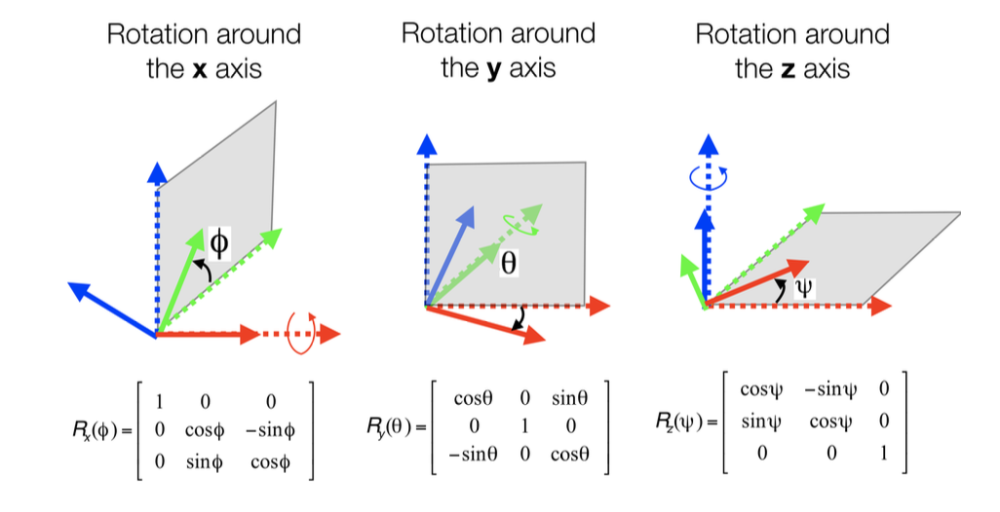

---
layout: two-cols-header
hideInToc: true
---

# Angles d'Euler — Limitations

::left::

<AlertBlock title="Gimbal Lock (Singularité)">

Si le pitch $\beta = \pm\pi/2$, on perd un degré de liberté : deux axes de rotation deviennent colinéaires.

</AlertBlock>

**Autres inconvénients :**
- Calculs trigonométriques coûteux pour la composition et l'inverse.
- Plusieurs conventions possibles (RPY, YPR, XYZ, ZYX...) → sources de confusion fréquentes.

::right::


---
hideInToc: true
---

# 3. Représentation Axe-Angle

Théorème d'Euler : toute rotation est équivalente à une rotation d'angle $\theta$ autour d'un axe fixe $\mathbf{u}$ ($\|\mathbf{u}\|=1$).

Le **vecteur de rotation** $\boldsymbol{\omega}=\theta\mathbf{u}\in\mathbb{R}^3$ contient les trois paramètres indépendants.

**Formule de Rodrigues (Axe-Angle $\to$ Matrice) :**

$$R_r^w = \cos(\theta)\,\mathbf{I}_3 + \sin(\theta)[\mathbf{u}]_\times + (1-\cos(\theta))\,\mathbf{u}\mathbf{u}^T$$

Où $[\mathbf{u}]_\times$ est la matrice antisymétrique (*skew-symmetric*) telle que $[\mathbf{u}]_\times v = \mathbf{u} \times v$ :

$$[\mathbf{u}]_\times = \begin{bmatrix} 0 & -u_z & u_y \\ u_z & 0 & -u_x \\ -u_y & u_x & 0 \end{bmatrix}$$

---
hideInToc: true
---

# Conversion Matrice $\to$ Axe-Angle

Comment retrouver $(\mathbf{u}, \theta)$ à partir d'une matrice $R$ ?

<div class="grid grid-cols-2 gap-12 mt-3">
<div>

**Angle $\theta$ :** via la trace de la matrice :

$$\text{tr}(R) = 1 + 2\cos(\theta) \implies \theta = \arccos\!\left(\frac{\text{tr}(R)-1}{2}\right)$$

**Axe $\mathbf{u}$ :** vecteur propre associé à la valeur propre $\lambda = 1$ :

$$R\,\mathbf{u} = \mathbf{u}$$

L'axe de rotation est invariant par la rotation.

</div>
<div>

<InfoBlock title="Valeurs propres de R">

Les valeurs propres de toute matrice de rotation sont :

$$\{1,\ e^{i\theta},\ e^{-i\theta}\}$$

</InfoBlock>


</div>
</div>

---
hideInToc: true
---

# 4. Quaternions

Extension des nombres complexes : $q = q_4 + i\,q_1 + j\,q_2 + k\,q_3$ avec $i^2 = j^2 = k^2 = ijk = -1$, $\;ij = -ji = k$, $\;jk = -kj = i$, $\;ki = -ik = j$.

<div class="grid grid-cols-2 gap-6 mt-3">
<div>

**Convention :** $q = \begin{bmatrix} v \\ w \end{bmatrix} = \begin{bmatrix} q_1 \\ q_2 \\ q_3 \\ q_4 \end{bmatrix}$,

avec $v$ la partie vectorielle et $w$ la partie scalaire.

</div>
<div>

**Lien avec Axe-Angle $(\mathbf{u}, \theta)$ :**

$$q = \begin{bmatrix} \mathbf{u}\sin(\theta/2) \\ \cos(\theta/2) \end{bmatrix}$$

</div>
</div>

**Lien avec la matrice de rotation $R(q)$ :**

$$R(q) = \begin{bmatrix} q_1^2-q_2^2-q_3^2+q_4^2 & 2(q_1q_2 - q_3q_4) & 2(q_1q_3 + q_2q_4) \\ 2(q_1q_2 + q_3q_4) & -q_1^2+q_2^2-q_3^2+q_4^2 & 2(q_2q_3 - q_1q_4) \\ 2(q_1q_3 - q_2q_4) & 2(q_2q_3 + q_1q_4) & -q_1^2-q_2^2+q_3^2+q_4^2 \end{bmatrix}$$


---
hideInToc: true
---

# Opérations sur les Quaternions Unitaires

Pour représenter une rotation : quaternions unitaires ($\|q\| = 1$), avec $q=\begin{bmatrix}v\\w\end{bmatrix}$.

<div class="grid grid-cols-2 gap-6 mt-4">
<div>

**Composition (Produit) :**

$$q_a \otimes q_b = \begin{bmatrix} w_a v_b + w_b v_a + v_a \times v_b \\ w_a w_b - v_a^T v_b \end{bmatrix}$$

**Inverse :**

$$q^{-1} = \begin{bmatrix} -q_{1:3} \\ q_4 \end{bmatrix}$$

</div>
<div>

**Expression d'un point dans un repère différent :**

$$q_r^w \otimes \begin{bmatrix} p^r \\ 0 \end{bmatrix} \otimes (q_r^w)^{-1} = \begin{bmatrix} p^w \\ 0 \end{bmatrix} = \begin{bmatrix} R(q_r^w)\,p^r \\ 0 \end{bmatrix}$$

</div>
</div>

---
hideInToc: true
---

# Avantages des Quaternions

<div class="grid grid-cols-2 gap-6 mt-4">
<div>

<InfoBlock title="Avantages">

- **Sans singularité** — pas de Gimbal Lock.
- **Compact** — 4 scalaires et une contrainte d'unité, donc 3 degrés de liberté.
- **Calculs efficaces** — la composition ne requiert pas de trigonométrie : 16 multiplications vs 27 pour les matrices.
- **Interpolation** — SLERP (Spherical Linear Interpolation) naturelle.

</InfoBlock>

</div>
<div>

<AlertBlock title="Inconvénient : Double Couverture">

$q$ et $-q$ représentent la **même rotation**.

Cela cause des problèmes pour les interpolations et l'optimisation (discontinuités).

</AlertBlock>

</div>
</div>

---
layout: section
hideInToc: true
---

# Poses et Transformations Rigides

---
layout: two-cols-header
hideInToc: true
---

# Pose et Transformation Rigide

::left::

Une **Pose** combine position et orientation de $r$ relative à $w$ :

$$(R_{r}^w,\ t_r^w)$$

- $R_{r}^w$ : Orientation du robot $r$ dans le repère monde $w$.
- $t_r^w$ : Position du repère du robot $r$ dans le repère monde $w$.

**Transformation de point (changement de repère) :**

$$p^w = R_{r}^w\,p^r + t_r^w$$

::right::

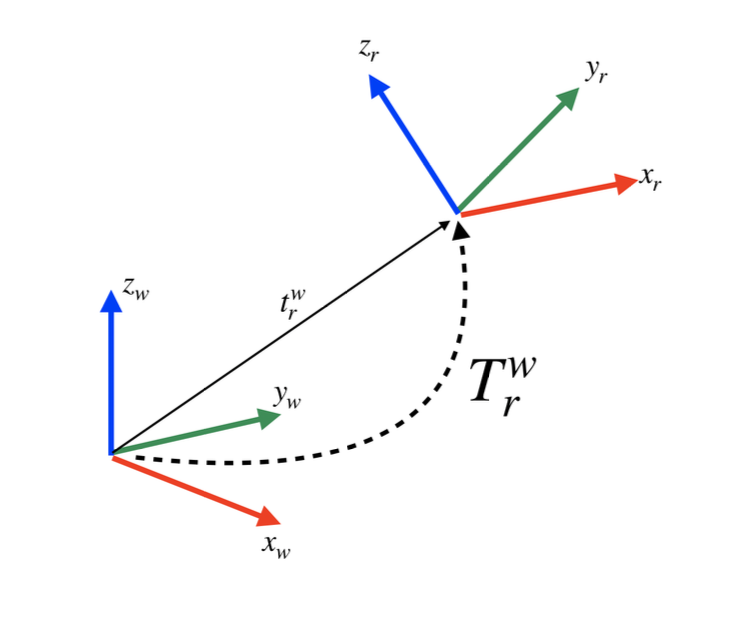

---
hideInToc: true
---

# Coordonnées Homogènes

<div></div>

Les coordonnées homogènes permettent de représenter une transformation affine par une multiplication matricielle $4 \times 4$.

Point homogène : $\tilde{p}^r = \begin{bmatrix} p^r \\ 1 \end{bmatrix}$

**Matrice de Transformation $T_{r}^w \in SE(3)$ :**

$$T_{r}^w = \begin{bmatrix} R_{r}^w & t_r^w \\ 0_{1\times3} & 1 \end{bmatrix}$$

L'équation de changement de repère devient :

$$p^w = R_{r}^w\,p^r + t_r^w \quad \Longleftrightarrow \quad \tilde{p}^w = T_{r}^w\,\tilde{p}^r$$

---
layout: two-cols-header
hideInToc: true
---

# Opérations sur les Poses $SE(3)$

::left::

**Transformation d'un point :**

$$\begin{bmatrix} p^w \\ 1 \end{bmatrix} = \begin{bmatrix} R_{r}^w & t_r^w \\ 0 & 1 \end{bmatrix} \begin{bmatrix} p^r \\ 1 \end{bmatrix}$$

**Composition (repère intermédiaire commun) :**

$$T_{c}^w = T_{r}^w\,T_{c}^r$$

**Inverse :**

$$T_{w}^r = (T_{r}^w)^{-1} = \begin{bmatrix} (R_r^w)^T & -(R_r^w)^T t_r^w \\ 0 & 1 \end{bmatrix}$$

*Note : $(T_{r}^w)^{-1} \neq (T_{r}^w)^T$ car la matrice $T$ n'est pas orthogonale.*

::right::


---
hideInToc: true
---

# Résumé des Représentations

<div class="mt-4">

| Représentation | Scalaires (contraintes) | Singularités | Usage principal |
|---|:---:|:---:|---|
| Matrice de Rotation | 9 (6) | Non | Opérations sur les vecteurs |
| Angles d'Euler (RPY) | 3 | **Oui** | Affichage intuitif |
| Axe-Angle | 3 ($\boldsymbol{\omega}$) | **Oui, à $\theta=0$** | Calculs, conversions |
| Quaternion | 4 (1) | Non | Stockage, interpolation |

</div>

<div class="mt-3">
<InfoBlock title="En général pour">

- **Stocker / interpoler** → Quaternion
- **Calculer / appliquer** → Matrice de Rotation ou Axe-Angle
- **Communiquer à un humain** → Angles d'Euler

</InfoBlock>
</div>

---
layout: section
---

# Capteur LiDAR

---
layout: two-cols-header
hideInToc: true
---

# Taxonomie des Capteurs

::left::

<InfoBlock title="Proprioceptifs (Interne)">

Mesurent l'état interne du système.
- Ex : Encodeurs de roues, IMU, Batterie.

</InfoBlock>

<InfoBlock title="Extéroceptifs (Externe)">

Mesurent l'environnement.
- Ex : Caméras, LiDAR, Radar.

</InfoBlock>


::right::

<AlertBlock title="Passif">

Reçoit l'énergie. Consomme moins d'énergie.
- Ex: Caméras

</AlertBlock>


<AlertBlock title="Actif">
Émet l'énergie. Consomme beaucoup d'énergie. Généralement plus robuste.

- Ex: LiDAR, Sonar, Radar
</AlertBlock>


---
hideInToc: true
---


# Capteurs Time-of-Flight (ToF)

Principe de base pour LiDAR, Radar, Sonar.

$$d = \frac{c \cdot \Delta t}{2}$$

- $c$ : Vitesse de l'onde ($3 \cdot 10^8$ m/s pour la lumière, $343$ m/s pour le son).
- $\Delta t$ : Temps aller-retour.

<ExampleBlock title="Comparaison">

- **LiDAR :** Faisceau collimaté (Laser). Mesure ponctuelle très précise.
- **Sonar :** Cône d'émission. Mesure la première réflexion dans le cône (ambiguïté angulaire).

</ExampleBlock>

---
layout: two-cols-header
hideInToc: true
---

# LiDAR 3D et Nuages de points

Combinaison de distance ToF + mécanisme de scan (miroir rotatif).

::left::

- **Output :** Nuage de points $\mathcal{P} = \{p_1, \dots, p_N\}$ avec $p_i = (x,y,z,\text{reflectivity})$.
- **Géométrie sphérique :**

$$p_i = \begin{bmatrix} x_i \\ y_i \\ z_i \end{bmatrix} = r \begin{bmatrix} \cos\phi \sin\theta \\ \cos\phi \cos\theta \\ \sin\phi \end{bmatrix}$$

où $r$ est la distance, $\theta$ l'azimut (rotation), $\phi$ l'élévation (laser ID).

::right::

<div class="flex flex-col gap-2 items-center mt-2">
  
  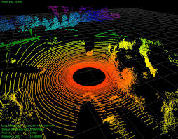
</div>

---
layout: two-cols-header
hideInToc: true
---

# Un problème du LiDAR : Distorsion de mouvement

Un scan (rotation du laser) n'est pas instantané (ex : 10 Hz → 100 ms).

::left::

<AlertBlock title="Le Phénomène">

Le point $p_0$ est acquis à $t$. Le point $p_N$ est acquis à $t + 100\,\text{ms}$.

- Entre-temps, le robot peut avoir avancé de 2 m (vitesse de 72 km/h).
- Le robot peut avoir fait une rotation rapide ou subi des vibrations.
- Résultat : Les murs droits deviennent courbes, les objets sont dédoublés.

</AlertBlock>

::right::


<p class="text-xs text-center text-gray-500 mt-1">Gauche: scan distordu. Milieu: correction. Droite: scan corrigé (Deskew).</p>

---
hideInToc: true
---


# Deskewing — Correction de la distorsion de mouvement

**La Solution : Deskewing**

On projette tous les points à un temps de référence $t_{\text{ref}}$ (début ou fin de scan).

$$p_{\text{corrigé}} = T_{\text{ref}}^{-1} \cdot T(t_i) \cdot p_{\text{brut}}$$

<small>Nécessite de connaître la vitesse du robot à haute fréquence (IMU) pour interpoler $T(t_i)$.</small>


---
layout: section
---

# Iterative Closest Point (ICP)

---
layout: two-cols-header
hideInToc: true
---


# Alignement de Nuages de Points

::left::

<AlertBlock title="Algorithme fondamental pour la robotique autonome.">

- Estimer le déplacement d'une voiture autonome.
- Associer un nuage de points avec un modèle CAD.
- Guider un outil chirurgical
- etc.
</AlertBlock>

::right::

<PointCloudAnimation />

---
layout: two-cols-header
hideInToc: true
---

# Alignement de Nuages de Points

::left::

**Le Problème :**
Soit deux nuages de points :
- **Cible (Target, $Q$)** : Le nuage fixe (ex : la carte).
- **Source (Source, $P$)** : Le nuage à aligner (ex : scan courant).

**Objectif :**
Trouver la transformation rigide $(R, t)$ qui aligne $P$ sur $Q$ en minimisant l'erreur quadratique moyenne.

$$E(R, t) = \sum_{i=1}^{N} \| q_i - (R p_i + t) \|^2$$

::right::

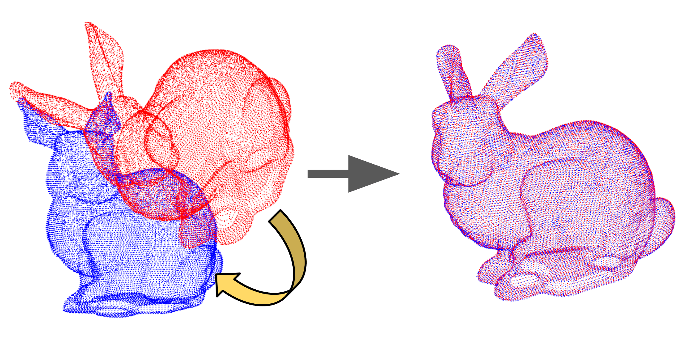

---
hideInToc: true
---


# L'œuf ou la poule ?

<AlertBlock title="Le dilemme">

- Si on connaissait les **correspondances** exactes, on pourrait calculer $(R,t)$ directement en une seule étape (solution fermée).
- Si on connaissait la **transformation** $(R,t)$, on pourrait trouver les correspondances facilement.

</AlertBlock>

**Solution de l'ICP :** Procéder itérativement.

1. Estimer les correspondances (au plus proche voisin).
2. Calculer la transformation optimale pour ces correspondances.
3. Appliquer la transformation et recommencer.

---
hideInToc: true
---

# L'Algorithme ICP Standard

**Entrée :** $P$ (Source), $Q$ (Cible), estimation initiale $(R_0, t_0)$.

1. **Association de données :** Pour chaque point $p_i \in P$, trouver le point le plus proche $q_j \in Q$ (Nearest Neighbor).

2. **Estimation :** Trouver $(R, t)$ qui minimisent l'erreur pour ces paires :
   $$(R^*, t^*) = \underset{R,t}{\text{argmin}} \sum \| q_j - (R p_i + t) \|^2$$

3. **Transformation :** Appliquer $P \leftarrow R^* P + t^*$.

4. **Convergence :** Si le changement d'erreur $< \epsilon$, arrêter. Sinon retour à 1.

<small>*Note : L'étape 1 (Nearest Neighbor) est coûteuse → structures KD-Tree.*</small>

---
hideInToc: true
---


# Démonstration interactive : ICP

<div style="height: calc(100% - 3.5rem)">
  <IcpAnimation />
</div>

---
hideInToc: true
---

# Le Problème du Voisin le Plus Proche

Pour chaque point $p_i \in P$, trouver le point le plus proche $q_j \in Q$.

**Solution naïve :**
- Pour chacun des $n$ points de $P$ : parcourir les $n$ points de $Q$ et calculer la distance.
- Trouver une correspondance : $O(n)$
- Trouver **toutes** les correspondances : $O(n^2)$ ← trop lent !

<AlertBlock title="Problème de passage à l'échelle">

Un LiDAR produit ~100 000 points par scan. $O(n^2)$ signifie $10^{10}$ opérations par itération ICP — impraticable en temps réel.

</AlertBlock>

---
layout: two-cols-header
hideInToc: true
---

# K-D Tree : Structure de données spatiale

<div></div>

Solution efficace : organiser les points dans un **arbre binaire de partitionnement spatial**.

::left::

**Principe :**
- Construire un arbre binaire représentant le nuage cible $Q$.
- Parcourir l'arbre au lieu d'une liste pour trouver les correspondances.

::right::


---
hideInToc: true
---


# K-D Tree : Construction de l'arbre

**Étapes récursives :**

1. Choisir un axe (en alternance $x$, $y$, $z$, ...).
2. Diviser le nuage en deux en fonction du **point médian** sur cet axe.
3. Ajouter le point médian à l'arbre (nœud).
4. Aller récursivement dans les deux moitiés.

<div class="grid grid-cols-2 gap-4 mt-4">
<div>

```
Niveau 0 (axe X) : médiane → nœud racine
├── Niveau 1 (axe Y) : médiane gauche
│   ├── Niveau 2 (axe X) : ...
│   └── Niveau 2 (axe X) : ...
└── Niveau 1 (axe Y) : médiane droite
    └── ...
```

</div>
</div>

---
hideInToc: true
---

# Démonstration interactive : Construction du K-D Tree

<div style="height: calc(100% - 3.5rem)">
  <KdTreeAnimation />
</div>

---
hideInToc: true
---

# K-D Tree : Complexité de la construction

<div class="grid grid-cols-2 gap-6 mt-2">
<div>

**Pourquoi $O(n \log n)$ ?**

L'arbre a $\log_2 n$ niveaux de profondeur. À chaque niveau, on partitionne **tous les $n$ points** pour trouver la médiane :

$$\underbrace{\log n}_{\text{niveaux}} \times \underbrace{O(n)}_{\text{médiane}} = O(n \log n)$$

| Méthode | Complexité |
|---------|-----------|
| Points non-triés | $O(n \log^2 n)$ |
| Points pré-triés par axe | $O(n \log n)$ |
| Médiane approx. en $O(n)$ | $O(n \log n)$ |

</div>
<div>

<InfoBlock title="Intuition : coupes récursives">

```
n points → 1 médiane    (niveau 0)
n/2 + n/2 → 2 médianes  (niveau 1)
...
1 point par feuille     (niveau log₂n)
```

À chaque niveau, le travail total est $O(n)$.
La somme sur $\log n$ niveaux donne $O(n \log n)$.

</InfoBlock>

</div>
</div>

---
hideInToc: true
---

# K-D Tree : Recherche du plus proche voisin

**Algorithme de recherche pour un point requête $q$ :**

1. À partir de la **racine**, calculer la distance avec le nœud courant.
2. Comparer $q$ selon l'axe du nœud → descendre dans la branche correspondante.
3. À la feuille, conserver le meilleur candidat trouvé.
4. **Remonter l'arbre** pour vérifier s'il peut exister un point plus proche dans l'autre branche (comparer la distance au plan de séparation).

<InfoBlock title="Étape clé : la vérification en remontant">

Une sphère de rayon = distance courante peut traverser le plan de séparation → il faut explorer l'autre sous-arbre si c'est le cas.

</InfoBlock>

---
hideInToc: true
---

# Démonstration interactive : Recherche dans le K-D Tree

<div style="height: calc(100% - 3.5rem)">
  <KdTreeSearchAnimation />
</div>

---
hideInToc: true
---

# K-D Tree : Complexité de la recherche

<div class="grid grid-cols-2 gap-6 mt-2">
<div>

**Pourquoi $O(\log n)$ en moyenne ?**

Chaque comparaison sur un axe **élimine ~½ de l'espace restant**, comme une recherche binaire :

$$\underbrace{\log n}_{\text{décisions}} \times O(1) = O(\log n)$$

| Opération | Complexité |
|-----------|-----------|
| 1 correspondance | $O(\log n)$ moy. |
| $n$ correspondances | $O(n \log n)$ moy. |
| Pire cas (dim. élevée) | $O(n)$ |

</div>
<div>

<InfoBlock title="Pourquoi O(n) en pire cas ?">

En remontant l'arbre, on vérifie si la sphère de rayon = distance courante **traverse le plan de séparation**. En haute dimension ($k \gg 3$), cette sphère traverse presque tous les hyperplans → on finit par visiter tous les nœuds.

</InfoBlock>

<AlertBlock title="Gain vs solution naïve">

$$O(n^2) \xrightarrow{\text{K-D Tree}} O(n \log n)$$

Pour $n = 100\,000$ points :
- Naïf : $10^{10}$ opérations
- K-D Tree : $\sim 1{,}7 \times 10^6$ opérations

</AlertBlock>

</div>
</div>

---
hideInToc: true
---


# K-D Tree : Limitations

<div class="grid grid-cols-2 gap-6 mt-4">
<div>

**Avantages :**
- Très efficace pour représenter des **points** en faible dimension.
- Simple à implémenter, largement disponible (Open3D, PCL, scipy).

**Limitations :**
- Pour des géométries complexes (surfaces, volumes), on préfère les **hiérarchies de volumes englobants** (BVH).
- L'efficacité **diminue avec la dimension $k$** — en haute dimension, on doit remonter l'arbre très souvent (*malédiction de la dimensionnalité*).

</div>
<div>

**Amélioration possible :**

Peut être construit en $O(n \log n)$ en utilisant un algorithme **approximatif** en $O(n)$ pour trouver les médianes (algorithme de sélection linéaire). Nécessite de rééquilibrer l'arbre périodiquement si les données changent.

<ExampleBlock title="En pratique">

Les bibliothèques comme **FLANN** ou **nanoflann** utilisent des variantes approximatives ($\epsilon$-NN) pour accélérer encore la recherche.

</ExampleBlock>

</div>
</div>

---
hideInToc: true
---


# Résolution par SVD : Centrage

Comment résoudre l'étape 2 de manière exacte ? (Méthode de Kabsch / Arun).

**1. Calcul des centres de masse (Centroids) :**

$$\mu_P = \frac{1}{N} \sum_{i=1}^N p_i, \quad \mu_Q = \frac{1}{N} \sum_{i=1}^N q_i$$

**2. Centrage des nuages :**
On définit les points par rapport au centre du nuage :

$$p'_i = p_i - \mu_P, \quad q'_i = q_i - \mu_Q$$

*Intuition : Cela permet de découpler la rotation de la translation.*

---
hideInToc: true
---


# Résolution par SVD : Rotation

**3. Matrice de covariance croisée (Cross-Covariance Matrix) :**

$$W = \sum_{i=1}^N q'_i (p'_i)^T = Q' P'^T$$

**4. Décomposition en Valeurs Singulières (SVD) :**

$$W = U D V^T$$

**5. Calcul de la Rotation :**

$$R = U V^T$$

<small>Attention : Si $\det(R) = -1$ (réflexion), on doit corriger $V$.</small>

---
layout: two-cols-header
hideInToc: true
---

# Intuition : Pourquoi la SVD donne la rotation ?

::left::

**1. Ce que contient $W$ ($Q' P'^T$)**

Cette matrice capture comment les axes du nuage $P$ sont corrélés avec les axes du nuage $Q$.

**2. Le rôle de la SVD ($U D V^T$)**

La SVD décompose toute transformation linéaire en :
- $V^T$ : Rotation (aligne $P$ sur une base canonique).
- $D$ : Étirement (scaling).
- $U$ : Rotation (projette vers la base de $Q$).

::right::

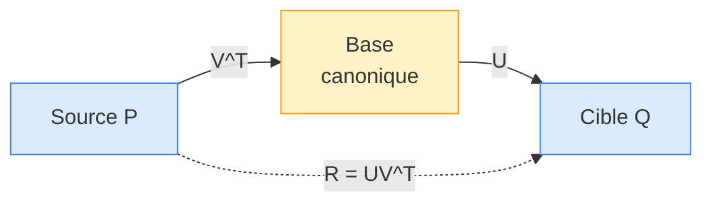

<AlertBlock title="Le Secret">

Comme on cherche une transformation **rigide** (pas de déformation), on ignore l'étirement $D$ :

$$R = U \cdot \underbrace{I}_{\text{ignore } D} \cdot V^T = UV^T$$

</AlertBlock>

---
hideInToc: true
---

# Résolution par SVD : Translation

Une fois la rotation optimale $R$ connue, la translation est la différence entre les centres de masse, corrigée par la rotation.

$$t = \mu_Q - R \, \mu_P$$

<InfoBlock title="Résumé de l'étape d'estimation">

L'approche SVD donne la solution optimale au sens des moindres carrés pour des correspondances fixes, sans itération interne.

</InfoBlock>

---
hideInToc: true
---

# Démonstration interactive : Estimation par SVD

<div style="height: calc(100% - 3.5rem)">
  <SVDAnimation />
</div>

---
layout: two-cols-header
hideInToc: true
---

# Variante importante : Point-to-Plane

La métrique "Point-to-Point" converge lentement dans les environnements avec des ambiguïtés géométriques (ex : couloirs).

::left::

**Point-to-Point :**
$$\| q - (R p + t) \|^2$$
Minimise la distance euclidienne directe.

**Point-to-Plane :**
$$\| n_q \cdot (q - (R p + t)) \|^2$$
Minimise la distance projetée sur la normale $n_q$ de la surface cible.

::right::

- **Avantage :** Permet au nuage de "glisser" le long des surfaces planes, convergence plus rapide et meilleure précision géométrique.
- **Requis :** Il faut calculer les normales de surface.

---
hideInToc: true
---


# Gestion des Outliers (Données aberrantes)

L'ICP naïf est très sensible aux outliers (moindres carrés quadratiques).

**Stratégies de rejet de correspondances :**

1. **Seuil de distance max :** Si $\|p_i - q_j\| > d_{\max}$, on ignore la paire.
2. **Compatibilité des normales :** Si l'angle entre les normales $n_p$ et $n_q$ est trop grand ($> 45°$), ce n'est pas la même surface.
3. **Trimmed ICP :** On trie les erreurs et on ne garde que les $X\%$ meilleures (ex : 90%) pour calculer la transformation.

---
hideInToc: true
---


# Limitations de l'ICP

<AlertBlock title="Problème de convergence locale">

- Il converge vers le minimum local le plus proche.
- **Conséquence :** Il nécessite une bonne initialisation (ex : odométrie, vitesse constante).
- **TP 1:** Vous verrez comment associer des points caractéristiques permet de résoudre ce problème.


</AlertBlock>

**Applications typiques :**
- Recalage scan-à-scan (Odométrie LiDAR).
- Recalage scan-à-carte (Localisation).
- Suivi d'objets (Object Tracking).
