# Introduction

**INF8422: Robotic Perception and Spatial Intelligence**

Prof. Pierre-Yves Lajoie


---
hideInToc: true
---
# Agenda

<Toc />

---
hideInToc: true
---

# Prerequisites

<div class="grid grid-cols-3 gap-4 mt-6">
  <div class="text-center">
    
    <p class="text-sm text-black mt-2">Linear algebra and basic calculus</p>
  </div>
  <div class="text-center">
    
    <p class="text-sm text-black mt-2">Python programming</p>
  </div>
  <div class="text-center">
    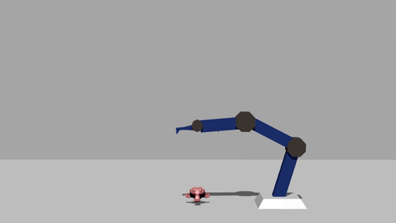
    <p class="text-sm text-black mt-2">Patience and resourcefulness</p>
  </div>
</div>
<div v-click>
<p   class="text-center mt-6 text-lg font-semibold">This is the first iteration of the course.</p>
<p   class="text-center mt-6 text-lg">Help us make it converge: share your feedback (and your gradients).</p>
</div>

---
layout: center
hideInToc: true
---

### Pierre-Yves Lajoie eng. Ph.D.

Assistant Professor - Department of Computer and Software Engineering

MIST Laboratory: [mistlab.ca](https://mistlab.ca)

<div class="grid grid-cols-3 gap-0.5 mt-6">
  <div class="text-center">
    
  </div>
  <div class="text-center">
    
  </div>
  <div class="text-center">
    
  </div>
</div>

<div>
<p   class="text-center mt-6 text-lg font-semibold">Autonomous robotics research laboratory</p>
<p   class="text-center mt-6 text-lg">Spatial Intelligence, Localization, Mapping, Planning, Multi-agent Systems, etc.</p>
</div>

---
layout: section
---

# Course Logistics

---
hideInToc: true
---

# Assessment

<div class="grid grid-cols-2 gap-4 mt-3">
<div>

| Assessment | Weight |
|---|---|
| 5 Lab Assignments | 5 × 5% = **25%** |
| 4 best Quizzes / 5 | 4 × 7.5% = **30%** |
| Course Project | **25%** |
| Final Exam | **20%** |

**Double threshold**: You must have a minimum average of **50% on individual assessments** (Quizzes and Exam) to obtain a passing grade.
</div>
<div>

<InfoBlock title="In-class quiz">

- About every two weeks, **25 min**, start of class.
- Covers material from previous lectures.
- 5 quizzes total, **only the 4 best** count.
- First quiz: **September 11**.

</InfoBlock>

</div>
</div>

---
hideInToc: true
---

# Labs

<div class="grid grid-cols-2 gap-5 mt-2">
<div>

<InfoBlock title="Organization">

- **5 labs**, individually or in teams of 2.
- Lab instructor: **Julien Lagacé**.
- All resources on **Moodle**.
- Join the course **Discord** for support (link on Moodle).

</InfoBlock>

</div>
<div>

<AlertBlock title="Labs">

Lab sessions start on September 9.

First submission:

**Lab 1**: Wednesday, **September 15**, 11:30 PM.


</AlertBlock>

</div>
</div>


---
hideInToc: true
---

# Session project

<div class="grid grid-cols-2 gap-5 mt-2">
<div>

<InfoBlock title="Format">

- Team of **2 to 3 people**.
- Report of **4 to 6 pages**, double column, **IEEE** format.
- A guide for the project is available on **Moodle**.
- Criteria: scientific rigor, experiments, interpretation of results.

</InfoBlock>

</div>
<div>

<AlertBlock title="Schedule">

**October 9, 8:30 AM** — Team composition + topic description (max. 1 page): objective (What?), motivation (Why?), and planned experiments (How?).

**November 27** — **10-minute** presentation.

**December 22, 8:30 AM** — Final report submission.

</AlertBlock>

</div>
</div>

---
hideInToc: true
---

# Artificial intelligence - Students' point of view

<div class="grid grid-cols-2 gap-5 mt-2">
<div>

<InfoBlock title="Impact on your learning">

- Hinders skill development.
- Decline in critical thinking.
- Limited creativity.

</InfoBlock>

<div class="text-center">
    
</div>

</div>
<div>

<AlertBlock title="Your constraints">

- You want good grades.
- You don't have much time (courses, research, etc.).
- Sometimes what is asked is unrealistic without AI.

</AlertBlock>

</div>
</div>

---
hideInToc: true
---

# Artificial intelligence - Teacher's point of view

<div></div>

**Major problem**: How to design labs that allow understanding the concepts seen in class **AND** are complex enough to outsmart AI...

<div class="grid grid-cols-2 gap-5 mt-2">
<div>

<AlertBlock title="Solution 1 - Make the labs harder">

Positive:
- Allows more ambitious labs.
- Closer to the work context.
- Learn to use AI tools.

Negative:
- You have no choice but to use them, and it limits learning.


</AlertBlock>

</div>
<div>

<InfoBlock title="Solution 2 - Make the labs easier">

Proposed in *Manifesto for Human Education*, J. Pilon, 2026

Positive:
- Can be done without AI
- Maximizes learning

Negative:
- Can be solved by AI and hard to evaluate

</InfoBlock>

</div>
</div>

---
hideInToc: true
---

# Artificial Intelligence - Instructor's Point of View

<div></div>

<div class="grid grid-cols-2 gap-5 mt-2">
<div>

<AlertBlock title="Solution 1 - Term Project">

**Term project:**

You can use AI if you want and make the project as ambitious as possible.

**That said**, if you wish *not to use AI* for the project, please let us know, we will adjust our expectations accordingly.

</AlertBlock>

</div>
<div>

<InfoBlock title="Solution 2 - Labs">

We ask you not to use AI in the labs, for the sake of your learning.

In return:
- Support from the teaching team
- Adjustments if the lab is too difficult or too long

**Before using AI to solve the lab, come see us and ask for help.**

We can explain, help you, and adjust if necessary.

</InfoBlock>

</div>
</div>

---
hideInToc: true
---

# Session Calendar

<div class="grid grid-cols-4 gap-3 mt-3 text-xs">

<div>
<p class="font-bold text-sm mb-2 text-gray-600">September</p>
<div class="space-y-1">
  <div class="rounded bg-orange-100 px-2 py-1 font-semibold">Sep 11 — Quiz 1</div>
  <div class="rounded bg-red-100 px-2 py-1 font-semibold">Sep 15 — Lab 1 due</div>
  <div class="rounded bg-blue-100 px-2 py-1 font-bold">Sep 23-25 — Remote lab and course</div>
  <div class="rounded bg-red-100 px-2 py-1 font-semibold">Sep 29 — Lab 2 due</div>
</div>
</div>

<div>
<p class="font-bold text-sm mb-2 text-gray-600">October</p>
<div class="space-y-1">
  <div class="rounded bg-orange-100 px-2 py-1 font-semibold">Oct 2 — Quiz 2</div>
  <div class="rounded bg-purple-100 px-2 py-1 font-semibold">Oct 9 — 📋 Team + topic</div>
  <div class="rounded bg-red-100 px-2 py-1 font-semibold">Oct 20 — Lab 3 due</div>
  <div class="rounded bg-orange-100 px-2 py-1 font-semibold">Oct 23 — Quiz 3</div>
</div>
</div>

<div>
<p class="font-bold text-sm mb-2 text-gray-600">November</p>
<div class="space-y-1">
  <div class="rounded bg-red-100 px-2 py-1 font-semibold">Nov 3 — Lab 4 due</div>
  <div class="rounded bg-orange-100 px-2 py-1 font-semibold">Nov 6 — Quiz 4</div>
  <div class="rounded bg-red-100 px-2 py-1 font-semibold">Nov 17 — Lab 5 due</div>
  <div class="rounded bg-orange-100 px-2 py-1 font-semibold">Nov 20 — Quiz 5</div>
  <div class="rounded bg-purple-100 px-2 py-1 font-semibold">Nov 27 — 🎤 Presentation</div>
</div>
</div>

<div>
<p class="font-bold text-sm mb-2 text-gray-600">December</p>
<div class="space-y-1 mb-3">
  <div class="rounded bg-purple-100 px-2 py-1 font-semibold">Dec 22 — 📄 Report due</div>
</div>
<div class="rounded border border-gray-200 p-2 text-xs space-y-1 mt-4">
  <p class="font-semibold mb-1">Legend</p>
  <p><span class="inline-block w-3 h-3 rounded bg-orange-200 mr-1"></span>Quiz</p>
  <p><span class="inline-block w-3 h-3 rounded bg-red-200 mr-1"></span>Lab submissions</p>
  <p><span class="inline-block w-3 h-3 rounded bg-purple-200 mr-1"></span>Project</p>
</div>
</div>

</div>


---
layout: section
---

# What is robot perception and spatial intelligence?

---
layout: center
class: text-center
hideInToc: true
---

<p class="text-gray-400 text-xl mb-8">Myth or Reality?</p>

# "robotic perception == computer vision."

---
layout: two-cols-header
hideInToc: true
---

# Perception ≠ Vision

::left::

<span class="text-red-500 font-bold">Partially false.</span> Computer vision deals with images and videos:
object detection, segmentation, shape recognition, etc.

Robots need more information:

- **3D geometry of the entire environment:** depth, obstacles, traversability, structures.
- **Physical properties:** articulation, mass, forces.
- **Real-time constraints:** an error = a collision.

::right::

<div class="flex flex-col gap-3 mt-2">
  <div class="rounded border border-gray-200 p-3 text-sm">
    <p class="font-bold mb-1">Vision: "What is it?"</p>
    <p class="text-gray-500">→ Classification, segmentation, etc.</p>
  </div>
  <div class="rounded border border-blue-300 bg-blue-50 p-3 text-sm">
    <p class="font-bold mb-1">Robotic perception:</p>
    <p class="text-gray-500">→ Where am I?</p>
    <p class="text-gray-500">→ How do I get to point B without colliding?</p>
    <p class="text-gray-500">→ How do I pick up an object?</p>
    <p class="text-gray-500">→ What will the state of the environment be after an action?</p>
  </div>
</div>

---
layout: center
class: text-center
hideInToc: true
---

<p class="text-gray-400 text-xl mb-8">Myth or Reality?</p>

# "Robotic perception is harder than computer vision."

---
layout: two-cols-header
hideInToc: true
---

# It's all relative

::left::

**Sometimes yes:**
- Must produce richer outputs (3D, physical properties, etc).
- Sensitive to processing speed.
- Errors have real consequences.

**Sometimes no**: the robot can act to simplify perception.

::right::

<AlertBlock title="The robot is not passive">

Unlike classical vision, the robot can:
- Move to find a better viewing angle.
- Get closer to improve resolution.
- Interact to reveal hidden properties.

</AlertBlock>

---
layout: center
class: text-center
hideInToc: true
---

<p class="text-gray-400 text-xl mb-8">Myth or Reality?</p>

# "Robotic perception is limited to visual data."

---
hideInToc: true
---


# Robotic perception is multimodal

<span class="text-red-500 font-bold">False.</span> Each modality provides complementary information.

<div class="grid grid-cols-3 gap-3 mt-4 text-sm">
  <div class="rounded border border-gray-200 p-3">
    <p class="font-bold mb-1">📷 Vision</p>
    <p class="text-gray-500">RGB, RGB-D, stereo camera</p>
  </div>
  <div class="rounded border border-gray-200 p-3">
    <p class="font-bold mb-1">📡 Active geometry</p>
    <p class="text-gray-500">LiDAR, Radar, Sonar</p>
  </div>
  <div class="rounded border border-gray-200 p-3">
    <p class="font-bold mb-1">⚡ Inertial</p>
    <p class="text-gray-500">IMU (accelerometer, gyroscope, magnetometer)</p>
  </div>
  <div class="rounded border border-gray-200 p-3">
    <p class="font-bold mb-1">🤚 Tactile</p>
    <p class="text-gray-500">Force, pressure, texture</p>
  </div>
  <div class="rounded border border-gray-200 p-3">
    <p class="font-bold mb-1">🌍 Infrastructure</p>
    <p class="text-gray-500">GPS, UWB, WiFi</p>
  </div>
  <div class="rounded border border-gray-200 p-3">
    <p class="font-bold mb-1">🔊 Acoustic</p>
    <p class="text-gray-500">Microphones</p>
  </div>
</div>

---
layout: center
class: text-center
hideInToc: true
---

<p class="text-gray-400 text-xl mb-8">Myth or Reality?</p>

# "Robotic perception == state estimation."

---
layout: two-cols-header
hideInToc: true

---


# Building a representation

::left::

**Not only.**

Robotic perception seeks to build a representation of the environment for planning/autonomy.

- Some properties are qualitative (e.g. semantics).
- Some representations are implicit (e.g. latent space of a neural network).
- State estimation is generally passive, whereas robotic perception can be active.
- The structure of the environment and its ambiguities inform uncertainty estimation.

::right::

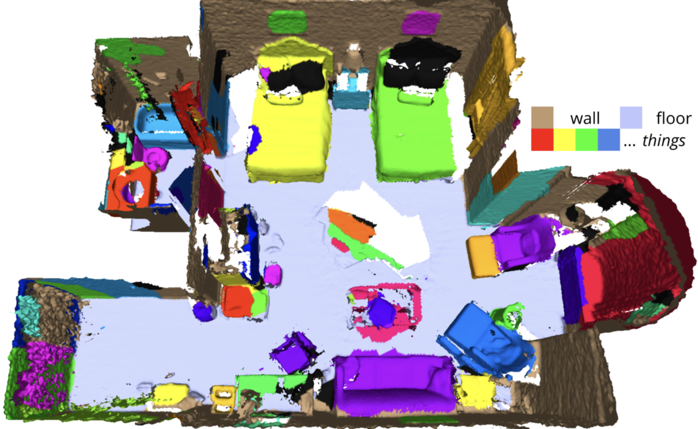


---

# Semester Overview

The course covers several topics:

1. **Foundations:** 3D geometry and mathematical tools
2. **SLAM (Simultaneous Localization and Mapping):** Sensor data extraction, state estimation.
3. **Representation:** How to model the world and handle uncertainty.
4. **Dynamic Perception and Action:** Dynamics, interaction, manipulation, multi-agent.
5. **Applications:** Advanced topics and case studies.

<div class="grid grid-cols-3 gap-0.5 mt-1">
  <div class="text-center">
    
  </div>
  <div class="text-center">
    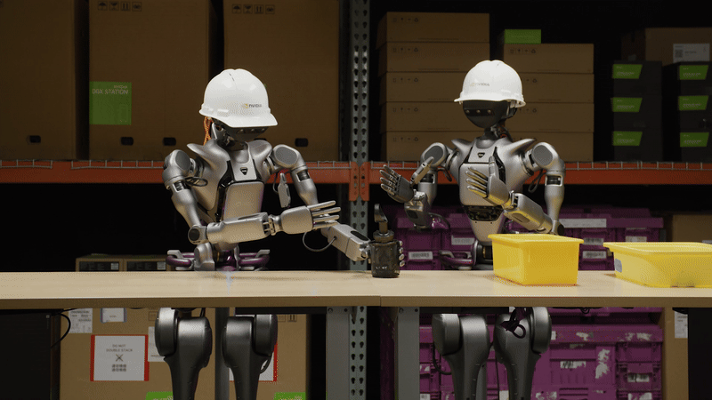
  </div>
  <div class="text-center">
    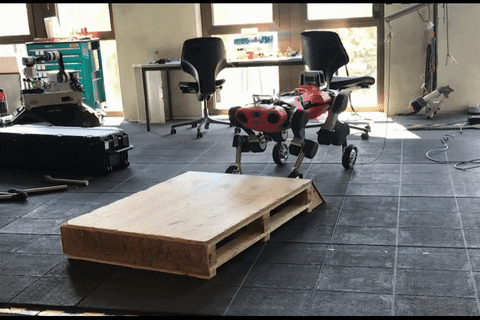
  </div>
</div>

---
layout: section
---

# Autonomous Robotics

---
hideInToc: true
---

# The Autonomy Cycle: Sense-Plan-Act

The classic paradigm of autonomous robotics (Sense-Plan-Act):


- **Sense:** Data acquisition and estimation of the state of the world.

<div v-click>
<strong>Predict:</strong> Predict the evolution of the environment.
</div>

- **Plan:** Decision-making based on the estimated state to achieve a goal.
- **Act:** Execution of motor commands. Changes the state of the robot and the environment.

<InfoBlock title="Role of perception">
This is the interface between the real physical world and the robot's digital model of itself and its environment.
</InfoBlock>

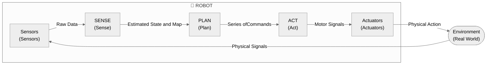

---
hideInToc: true
---


# Paradigm 1: Perception for Autonomy

Historically, perception has been seen as serving navigation.

- **Objective:** Enable the robot to move without collision and to localize itself.
- **Classical approach:** The robot creates and maintains a map of its environment in real time. The challenge is to find the map and position estimate that best explain the noisy sensor data.

<AlertBlock title="Typical Applications">

- Autonomous vehicles (Waymo, Tesla).
- Robot vacuums (iRobot).
- Logistics (Warehouse management, Amazon).

</AlertBlock>

---
hideInToc: true
---


# Paradigm 2: Autonomy for Perception

**Active Perception**: The robot acts to perceive better.

- **Example:** "Moving to see behind the obstacle" or "Approaching to classify better".
- **Objective:** Maximizing information, map quality, etc.

<ExampleBlock title="Typical Applications">

- Infrastructure inspection.
- Search and rescue.
- Exploration of unknown environments.
- Precision agriculture.

</ExampleBlock>


---
layout: section
---

# 3D Geometry

---
hideInToc: true
---

# 3D Geometry

Robotic navigation relies on 3D geometry:


- **Coordinate Frames** (Frames)
- **Positions and Translations**
- **Orientation Representation**
- **Pose Representation** (Position + Orientation)


---
layout: two-cols-header
hideInToc: true
---

# Coordinate Frames (Coordinate Frames)

A frame is a set of orthogonal axes attached to a body.

::left::

**Common frames in robotics:**

- **Robot frame ($r$)**: Attached to the robot (often at the center of mass).
- **Sensor frame ($c, l \dots$)**: Attached to the sensor (e.g., camera, LiDAR).
- **World frame ($w$)**: Fixed in the environment (e.g., starting point).

::right::

<div class="grid grid-cols-2 gap-4 h-4/5 items-center mt-2">
  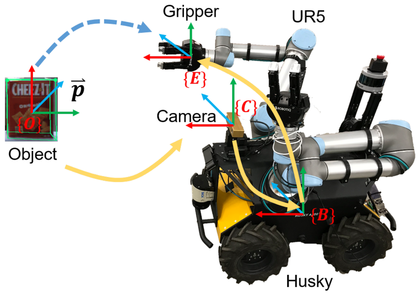
  
</div>

---
layout: two-cols-header
hideInToc: true
---

# Right-Handed Convention

$$x \times y = z$$

::left::

<InfoBlock title="Mnemonics">

- Thumb ($z$), Index ($x$), Middle finger ($y$).
- Thumb toward $z$, fingers curl from $x$ to $y$.

</InfoBlock>

::right::

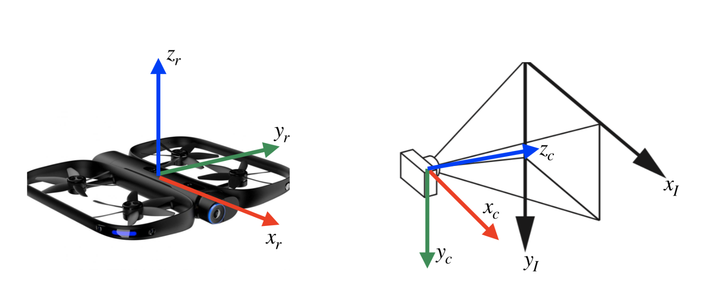
<p class="text-xs text-center text-gray-500 mt-1">Common frames (left: robot frame, right: camera/image frames)</p>

---
layout: two-cols-header
hideInToc: true
---

# Frame Conventions

::left::

**Robot Frame ($r$)**
- Origin: Center of mass.
- $x_r$: Forward.
- $y_r$: Left.
- $z_r$: Up.

<br/>

**Image Frame ($i$)** (2D)
- Origin: Top-left corner.
- $x$ right, $y$ down.

::right::

**Camera Frame ($c$)**
- Origin: Optical center.
- $z_c$: Looks at the scene (Optical Axis).
- $x_c$: To the right.
- $y_c$: Downward.


---
layout: two-cols-header
hideInToc: true
---

# Points and Positions

The position of a point $p$ in the frame $w$ is a vector:

$$p^w = \begin{bmatrix} p_x^w \\ p_y^w \\ p_z^w \end{bmatrix} \in \mathbb{R}^3$$

The scalars $p_x^w, p_y^w, p_z^w$ are the projections onto the axes $x_w, y_w, z_w$.

::left::

::right::

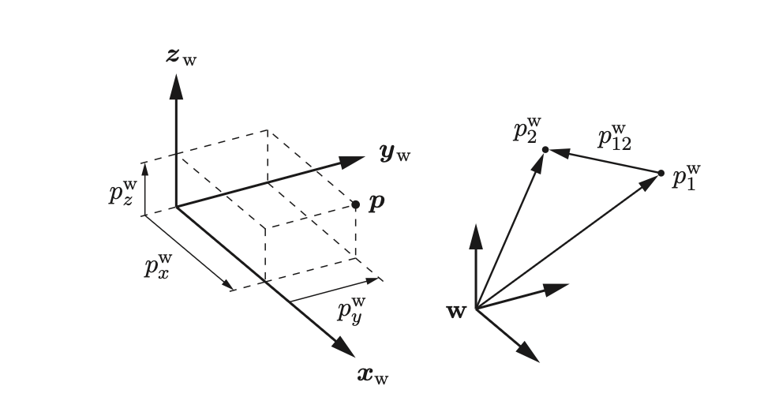

---
layout: two-cols-header
hideInToc: true
---
<style>
.two-cols-header {
  grid-template-columns: 7fr 6fr;
}
</style>
# Translations and Composition

::left::

**Translation:** between two points $p_1$ and $p_2$:

$$p_{12}^w = p_2^w - p_1^w$$

**Composition:**

$$p_2^w = p_1^w + p_{12}^w$$

**Inverse:**

$$p_{12}^w = -p_{21}^w$$

*Note: The notation makes the frame ($w$, i.e. world) explicit as a superscript.*

::right::


---
hideInToc: true
---

# Rotation Representations

How do we describe the orientation of frame $r$ (robot) relative to $w$ (world)?


1. **Euler Angles** (Roll-Pitch-Yaw)
2. **Axis-Angle**
3. **Quaternions**
4. **Rotation Matrix**

---
layout: two-cols-header
hideInToc: true
---

<style>
.two-cols-header {
  grid-template-columns: 7fr 15fr;
}
</style>
# 1. Euler Angles (Roll-Pitch-Yaw)

An RPY rotation requires specifying the order of the axes.

::left::

**Extrinsic XYZ convention (fixed axes):**

$$R = R_z(\gamma) \, R_y(\beta) \, R_x(\alpha)$$

$\alpha$: roll around $x$; $\beta$: pitch around $y$; $\gamma$: yaw around $z$.

<InfoBlock title="Advantages">

Intuitive. Minimal (3 parameters).

</InfoBlock>

::right::


---
layout: two-cols-header
hideInToc: true
---

# Euler Angles — Limitations

::left::

<AlertBlock title="Gimbal Lock (Singularity)">

If the pitch $\beta = \pm\pi/2$, one degree of freedom is lost: two rotation axes become collinear.

</AlertBlock>

**Other drawbacks:**
- Costly trigonometric computations for composition and inversion.
- Several possible conventions (RPY, YPR, XYZ, ZYX...) → frequent sources of confusion.

::right::

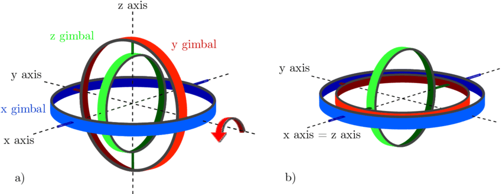

---
hideInToc: true
---

# 2. Axis-Angle Representation

Euler's theorem: any rotation is equivalent to a rotation of angle $\theta$ about a fixed axis $\mathbf{u}$ ($\|\mathbf{u}\|=1$).

The **rotation vector** $\boldsymbol{\omega}=\theta\mathbf{u}\in\mathbb{R}^3$ contains the three independent parameters.

**Rodrigues' Formula (Axis-Angle $\to$ Matrix):**

$$R_r^w = \cos(\theta)\,\mathbf{I}_3 + \sin(\theta)[\mathbf{u}]_\times + (1-\cos(\theta))\,\mathbf{u}\mathbf{u}^T$$

Where $[\mathbf{u}]_\times$ is the skew-symmetric matrix such that $[\mathbf{u}]_\times v = \mathbf{u} \times v$:

$$[\mathbf{u}]_\times = \begin{bmatrix} 0 & -u_z & u_y \\ u_z & 0 & -u_x \\ -u_y & u_x & 0 \end{bmatrix}$$

---
hideInToc: true
---

# Matrix $\to$ Axis-Angle Conversion

How to recover $(\mathbf{u}, \theta)$ from a matrix $R$?

<div class="grid grid-cols-2 gap-12 mt-3">
<div>

**Angle $\theta$:** via the trace of the matrix:

$$\text{tr}(R) = 1 + 2\cos(\theta) \implies \theta = \arccos\!\left(\frac{\text{tr}(R)-1}{2}\right)$$

**Axis $\mathbf{u}$:** eigenvector associated with the eigenvalue $\lambda = 1$:

$$R\,\mathbf{u} = \mathbf{u}$$

The axis of rotation is invariant under the rotation.

</div>
<div>

<InfoBlock title="Eigenvalues of R">

The eigenvalues of any rotation matrix are:

$$\{1,\ e^{i\theta},\ e^{-i\theta}\}$$

</InfoBlock>


</div>
</div>

---
hideInToc: true
---

# 3. Quaternions

Extension of complex numbers: $q = q_4 + i\,q_1 + j\,q_2 + k\,q_3$ with $i^2 = j^2 = k^2 = ijk = -1$, $\;ij = -ji = k$, $\;jk = -kj = i$, $\;ki = -ik = j$.

<div class="grid grid-cols-2 gap-6 mt-3">
<div>

**Convention:** $q = \begin{bmatrix} v \\ w \end{bmatrix} = \begin{bmatrix} q_1 \\ q_2 \\ q_3 \\ q_4 \end{bmatrix}$,

with $v$ the vector part and $w$ the scalar part.

</div>
<div>

**Link with Axis-Angle $(\mathbf{u}, \theta)$:**

$$q = \begin{bmatrix} \mathbf{u}\sin(\theta/2) \\ \cos(\theta/2) \end{bmatrix}$$

</div>
</div>

**Link with the rotation matrix $R(q)$:**

$$R(q) = \begin{bmatrix} q_1^2-q_2^2-q_3^2+q_4^2 & 2(q_1q_2 - q_3q_4) & 2(q_1q_3 + q_2q_4) \\ 2(q_1q_2 + q_3q_4) & -q_1^2+q_2^2-q_3^2+q_4^2 & 2(q_2q_3 - q_1q_4) \\ 2(q_1q_3 - q_2q_4) & 2(q_2q_3 + q_1q_4) & -q_1^2-q_2^2+q_3^2+q_4^2 \end{bmatrix}$$


---
hideInToc: true
---

# Unit Quaternion Operations

To represent a rotation: unit quaternions ($\|q\| = 1$), with $q=\begin{bmatrix}v\\w\end{bmatrix}$.

<div class="grid grid-cols-2 gap-6 mt-4">
<div>

**Composition (Product):**

$$q_a \otimes q_b = \begin{bmatrix} w_a v_b + w_b v_a + v_a \times v_b \\ w_a w_b - v_a^T v_b \end{bmatrix}$$

**Inverse:**

$$q^{-1} = \begin{bmatrix} -q_{1:3} \\ q_4 \end{bmatrix}$$

</div>
<div>

**Expressing a point in a different frame:**

$$q_r^w \otimes \begin{bmatrix} p^r \\ 0 \end{bmatrix} \otimes (q_r^w)^{-1} = \begin{bmatrix} p^w \\ 0 \end{bmatrix} = \begin{bmatrix} R(q_r^w)\,p^r \\ 0 \end{bmatrix}$$

</div>
</div>

---
hideInToc: true
---

# Advantages of Quaternions

<div class="grid grid-cols-2 gap-6 mt-4">
<div>

<InfoBlock title="Advantages">

- **No singularity** — no Gimbal Lock.
- **Compact** — 4 scalars and a normalization constraint, so 3 degrees of freedom.
- **Efficient computation** — composition requires no trigonometry: 16 multiplications vs 27 for matrices.
- **Generation** — simply generate 4 real numbers and normalize to obtain a valid quaternion.

</InfoBlock>

</div>
<div>

<AlertBlock title="Drawback: Double Cover">

$q$ and $-q$ represent the **same rotation**.

This causes problems for interpolation and optimization (discontinuities).

</AlertBlock>

</div>
</div>


---
layout: two-cols-header
hideInToc: true
---

# 4. Rotation Matrix

We project the axes of $r$ ($x_r, y_r, z_r$) into the frame $w$ and stack these vectors as columns.

::left::

$$R_r^w = \begin{bmatrix} | & | & | \\ x_r^w & y_r^w & z_r^w \\ | & | & | \end{bmatrix} \in SO(3)$$

**2D example:**

$$R_r^w = \begin{bmatrix} \cos\theta & -\sin\theta \\ \sin\theta & \cos\theta \end{bmatrix} \in SO(2)$$

::right::

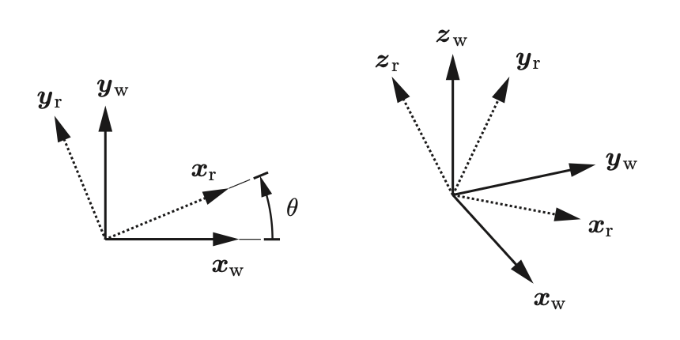

---
hideInToc: true
---

# Properties of the $SO(3)$ Group

<div class="grid grid-cols-2 gap-6 mt-4">
<div>

<InfoBlock title="Orthogonality">

Unit and perpendicular columns:

$$({R_r^w})^T R_r^w = I_3 \implies (R_r^w)^{-1} = (R_r^w)^T$$

</InfoBlock>

</div>
<div>

<InfoBlock title="Right-Handed Frame">

$$\det(R_r^w) = +1$$

Scalar triple product of the columns: $(x \times y) \cdot z = 1$.

</InfoBlock>

</div>
</div>

---
layout: two-cols-header
hideInToc: true
---

<style>
.two-cols-header {
  grid-template-columns: 9fr 6fr;
}
</style>
# Operations with Rotation Matrices

::left::

**Point rotation:** convert $p^r$ (robot frame) to $p^w$ (world frame):

$$p^w = R_r^w \, p^r$$

**Composition:** rotation of the sensor in the world frame:

$$R_c^w = R_r^w \, R_c^r$$

<AlertBlock title="Non-commutative">

$$R_r^w R_c^r \neq R_c^r R_r^w$$

</AlertBlock>

**Inverse:**

$$R_r^w = (R_w^r)^{-1} = (R_w^r)^T$$

::right::

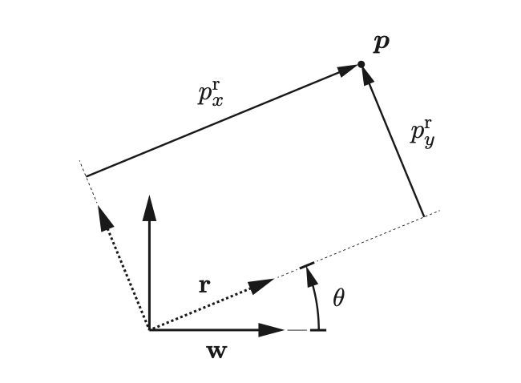


---
layout: section
hideInToc: true
---

# Poses and Rigid Transformations

---
layout: two-cols-header
hideInToc: true
---

# Pose and Rigid Transformation

::left::

A **Pose** combines the position and orientation of $r$ relative to $w$:

$$(R_{r}^w,\ t_r^w)$$

- $R_{r}^w$: Orientation of robot $r$ in the world frame $w$.
- $t_r^w$: Position of the robot's frame $r$ in the world frame $w$.

**Point transformation (change of frame):**

$$p^w = R_{r}^w\,p^r + t_r^w$$

::right::


---
hideInToc: true
---

# Homogeneous Coordinates

<div></div>

Homogeneous coordinates allow an affine transformation to be represented by a $4 \times 4$ matrix multiplication.

Homogeneous point: $\tilde{p}^r = \begin{bmatrix} p^r \\ 1 \end{bmatrix}$

**Transformation Matrix $T_{r}^w \in SE(3)$:**

$$T_{r}^w = \begin{bmatrix} R_{r}^w & t_r^w \\ 0_{1\times3} & 1 \end{bmatrix}$$

The frame change equation becomes:

$$p^w = R_{r}^w\,p^r + t_r^w \quad \Longleftrightarrow \quad \tilde{p}^w = T_{r}^w\,\tilde{p}^r$$

---
layout: two-cols-header
hideInToc: true
---

# $SE(3)$ Pose Operations

::left::

**Transformation of a point:**

$$\begin{bmatrix} p^w \\ 1 \end{bmatrix} = \begin{bmatrix} R_{r}^w & t_r^w \\ 0 & 1 \end{bmatrix} \begin{bmatrix} p^r \\ 1 \end{bmatrix}$$

**Composition (common intermediate frame):**

$$T_{c}^w = T_{r}^w\,T_{c}^r$$

**Inverse:**

$$T_{w}^r = (T_{r}^w)^{-1} = \begin{bmatrix} (R_r^w)^T & -(R_r^w)^T t_r^w \\ 0 & 1 \end{bmatrix}$$

*Note: $(T_{r}^w)^{-1} \neq (T_{r}^w)^T$ because the matrix $T$ is not orthogonal.*

::right::


---
hideInToc: true
---

# Summary of Representations

<div class="mt-4">

| Representation | Scalars (constraints) | Singularities | Main Use |
|---|:---:|:---:|---|
| Rotation Matrix | 9 (6) | No | Operations on vectors |
| Euler Angles (RPY) | 3 | **Yes** | Intuitive display |
| Axis-Angle | 3 ($\boldsymbol{\omega}$) | **Yes, at $\theta=0$** | Calculations, conversions |
| Quaternion | 4 (1) | No | Storage, generation |

</div>

<div class="mt-3">
<InfoBlock title="Generally for">

- **Store / generate** → Quaternion
- **Compute / apply** → Rotation Matrix or Axis-Angle
- **Communicate to a human** → Euler Angles

</InfoBlock>
</div>

---
layout: section
---

# LiDAR Sensor

---
layout: two-cols-header
hideInToc: true
---

# Sensor Taxonomy

::left::

<InfoBlock title="Proprioceptive (Internal)">

Measures the internal state of the system.
- Ex: Wheel encoders, IMU, Battery.

</InfoBlock>

<InfoBlock title="Exteroceptive (External)">

Measures the environment.
- Ex: Cameras, LiDAR, Radar.

</InfoBlock>


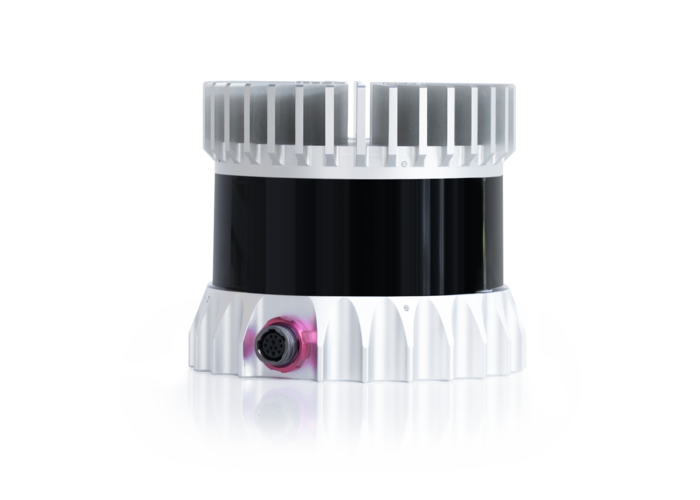

::right::

<AlertBlock title="Passive">

Receives energy. Consumes less energy.
- Ex: Cameras

</AlertBlock>


<AlertBlock title="Active">
Emits energy. Consumes a lot of energy. Generally more robust.

- Ex: LiDAR, Sonar, Radar
</AlertBlock>

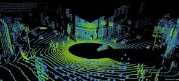

---
hideInToc: true
---


# Time-of-Flight (ToF) Sensors

Basic principle for LiDAR, Radar, Sonar.

$$d = \frac{c \cdot \Delta t}{2}$$

- $c$: Wave speed ($3 \cdot 10^8$ m/s for light, $343$ m/s for sound).
- $\Delta t$: Round-trip time.

<ExampleBlock title="Comparison">

- **LiDAR:** Collimated beam (Laser). Very precise pointwise measurement.
- **Sonar:** Emission cone. Measures the first reflection in the cone (angular ambiguity).

</ExampleBlock>

---
layout: two-cols-header
hideInToc: true
---

# 3D LiDAR and Point Clouds

Combination of ToF distance + scanning mechanism (rotating mirror).

::left::

- **Output:** Point cloud $\mathcal{P} = \{p_1, \dots, p_N\}$ with $p_i = (x,y,z,\text{reflectivity})$.
- **Spherical geometry:**

$$p_i = \begin{bmatrix} x_i \\ y_i \\ z_i \end{bmatrix} = r \begin{bmatrix} \cos\phi \sin\theta \\ \cos\phi \cos\theta \\ \sin\phi \end{bmatrix}$$

where $r$ is the distance, $\theta$ the azimuth (rotation), $\phi$ the elevation (laser ID).

::right::

<div class="flex flex-col gap-2 items-center mt-2">
  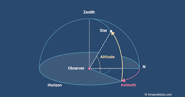
  
</div>

---
layout: two-cols-header
hideInToc: true
---

# A LiDAR Problem: Motion Distortion

A scan (rotation of the laser) is not instantaneous (e.g., 10 Hz → 100 ms).

::left::

<AlertBlock title="The Phenomenon">

Point $p_0$ is acquired at $t$. Point $p_N$ is acquired at $t + 100\,\text{ms}$.

- In the meantime, the robot may have moved forward 2 m (at a speed of 72 km/h).
- The robot may have made a fast rotation or experienced vibrations.
- Result: Straight walls become curved, objects are duplicated.

</AlertBlock>

::right::

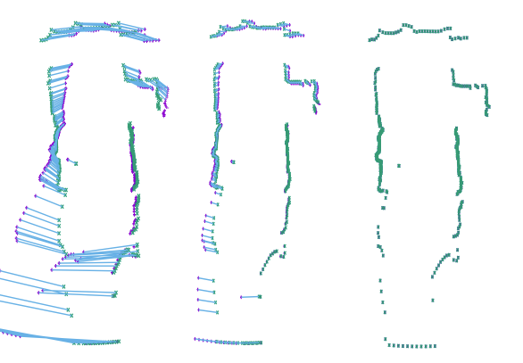
<p class="text-xs text-center text-gray-500 mt-1">Left: distorted scan. Middle: correction. Right: corrected scan (Deskew).</p>

---
hideInToc: true
---


# Deskewing — Motion Distortion Correction

**The Solution: Deskewing**

We project all points to a reference time $t_{\text{ref}}$ (start or end of scan).

$$p_{\text{corrected}} = T_{\text{ref}}^{-1} \cdot T(t_i) \cdot p_{\text{raw}}$$

<small>Requires knowing the robot's velocity at high frequency (IMU) to interpolate $T(t_i)$.</small>


---
class: act1
hideInToc: true
---

# A scan is not a snapshot

<LidarScanAnimation class="mt-1" />

---
layout: section
---

# Iterative Closest Point (ICP)

---
layout: two-cols-header
hideInToc: true
---


# Point Cloud Alignment

::left::

<AlertBlock title="Fundamental algorithm for autonomous robotics.">

- Estimate the displacement of an autonomous car.
- Associate a point cloud with a CAD model.
- Guide a surgical tool
- etc.
</AlertBlock>

::right::

<PointCloudAnimation />

---
layout: two-cols-header
hideInToc: true
---

# Point Cloud Alignment

::left::

**The Problem:**
Let two point clouds be given:
- **Target ($Q$)**: The fixed cloud (e.g., the map).
- **Source ($P$)**: The cloud to align (e.g., current scan).

**Objective:**
Find the rigid transformation $(R, t)$ that aligns $P$ onto $Q$ by minimizing the mean squared error.

$$E(R, t) = \sum_{i=1}^{N} \| q_i - (R p_i + t) \|^2$$

::right::


---
hideInToc: true
---


# The Chicken or the Egg?

<AlertBlock title="The Dilemma">

- If we knew the exact **correspondences**, we could compute $(R,t)$ directly in a single step (closed-form solution).
- If we knew the **transformation** $(R,t)$, we could find the correspondences easily.

</AlertBlock>

**ICP solution:** Proceed iteratively.

1. Estimate the correspondences (nearest neighbor).
2. Compute the optimal transformation for these correspondences.
3. Apply the transformation and start over.

---
hideInToc: true
---

# The Standard ICP Algorithm

**Input:** $P$ (Source), $Q$ (Target), initial estimate $(R_0, t_0)$.

1. **Data association:** For each point $p_i \in P$, find the closest point $q_j \in Q$ (Nearest Neighbor).

2. **Estimation:** Find $(R, t)$ that minimize the error for these pairs:
   $$(R^*, t^*) = \underset{R,t}{\text{argmin}} \sum \| q_j - (R p_i + t) \|^2$$

3. **Transformation:** Apply $P \leftarrow R^* P + t^*$.

4. **Convergence:** If the change in error $< \epsilon$, stop. Otherwise return to 1.

<small>*Note: Step 1 (Nearest Neighbor) is expensive → KD-Tree structures.*</small>

---
hideInToc: true
---


# Interactive demonstration: ICP

<div style="height: calc(100% - 3.5rem)">
  <IcpAnimation />
</div>

---
hideInToc: true
---

# The Nearest Neighbor Problem

For each point $p_i \in P$, find the closest point $q_j \in Q$.

**Naive solution:**
- For each of the $n$ points in $P$: iterate over the $n$ points in $Q$ and compute the distance.
- Finding one correspondence: $O(n)$
- Finding **all** correspondences: $O(n^2)$ ← too slow!

<AlertBlock title="Scalability problem">

A LiDAR produces ~100,000 points per scan. $O(n^2)$ means $10^{10}$ operations per ICP iteration — impractical in real time.

</AlertBlock>

---
layout: two-cols-header
hideInToc: true
---

# K-D Tree: Spatial Data Structure

<div></div>

Efficient solution: organize the points in a **binary spatial partitioning tree**.

::left::

**Principle:**
- Build a binary tree representing the target point cloud $Q$.
- Traverse the tree instead of a list to find matches.

::right::


---
hideInToc: true
---


# K-D Tree: Building the Tree

**Recursive steps:**

1. Choose an axis (alternating $x$, $y$, $z$, ...).
2. Split the point cloud in two based on the **median point** on this axis.
3. Add the median point to the tree (node).
4. Recurse into both halves.

<div class="grid grid-cols-2 gap-4 mt-4">
<div>

```
Level 0 (X axis): median → root node
├── Level 1 (Y axis): left median
│   ├── Level 2 (X axis): ...
│   └── Level 2 (X axis): ...
└── Level 1 (Y axis): right median
    └── ...
```

</div>
</div>

---
hideInToc: true
---

# Interactive Demonstration: Building a K-D Tree

<div style="height: calc(100% - 3.5rem)">
  <KdTreeAnimation />
</div>

---
hideInToc: true
---

# K-D Tree: Construction Complexity

<div class="grid grid-cols-2 gap-6 mt-2">
<div>

**Why $O(n \log n)$?**

The tree has $\log_2 n$ levels of depth. At each level, **all $n$ points** are partitioned to find the median:

$$\underbrace{\log n}_{\text{levels}} \times \underbrace{O(n)}_{\text{median}} = O(n \log n)$$

</div>
<div>

<InfoBlock title="Intuition: recursive splits">

```
n points → 1 median      (level 0)
n/2 + n/2 → 2 medians    (level 1)
...
1 point per leaf         (level log₂n)
```

At each level, the total work is $O(n)$.
The sum over $\log n$ levels gives $O(n \log n)$.

</InfoBlock>

</div>
</div>

---
hideInToc: true
---

# K-D Tree: Nearest Neighbor Search

**Search algorithm for a query point $q$:**

1. Starting from the **root**, compute the distance to the current node.
2. Compare $q$ along the node's axis → descend into the corresponding branch.
3. At the leaf, keep the best candidate found.
4. **Backtrack up the tree** to check whether a closer point could exist in the other branch (compare the distance to the splitting plane).

<InfoBlock title="Key step: backtracking check">

A sphere of radius = current distance may cross the splitting plane → the other subtree must be explored if this is the case.

</InfoBlock>

---
hideInToc: true
---

# Interactive Demo: Search in the K-D Tree

<div style="height: calc(100% - 3.5rem)">
  <KdTreeSearchAnimation />
</div>

---
hideInToc: true
---

# K-D Tree: Search Complexity

<div class="grid grid-cols-2 gap-6 mt-2">
<div>

**Why $O(\log n)$ on average?**

Each comparison on an axis **eliminates ~½ of the remaining space**, like a binary search:

$$\underbrace{\log n}_{\text{decisions}} \times O(1) = O(\log n)$$

| Operation | Complexity |
|-----------|-----------|
| 1 match | $O(\log n)$ avg. |
| Worst case (high dim.) | $O(n)$ |
| $n$ matches | $O(n \log n)$ avg. |

</div>
<div>

<InfoBlock title="Why O(n) in the worst case?">

Going back up the tree, we check whether the sphere of radius = current distance **crosses the separating plane**. In high dimension ($k \gg 3$), this sphere crosses almost all hyperplanes → we end up visiting every node.

</InfoBlock>

<AlertBlock title="Gain vs naive solution">

$$O(n^2) \xrightarrow{\text{K-D Tree}} O(n \log n)$$

For $n = 100,000$ points:
- Naive: $10^{10}$ operations
- K-D Tree: $\sim 1.7 \times 10^6$ operations

</AlertBlock>

</div>
</div>

---
hideInToc: true
---


# K-D Tree: Limitations

<div class="grid grid-cols-2 gap-6 mt-4">
<div>

**Advantages:**
- Very efficient for representing **points** in low dimension.
- Simple to implement, widely available (Open3D, PCL, scipy).

**Limitations:**
- For complex geometries (surfaces, volumes), **bounding volume hierarchies** (BVH) are preferred.
- Efficiency **decreases with dimension $k$** — in high dimension, one must backtrack up the tree very often (*curse of dimensionality*).

</div>
<div>

**Approximation:**

Can be built in $O(n \log n)$ using an **approximate** $O(n)$ algorithm to find medians (linear selection algorithm). Requires periodic rebalancing of the tree if the data changes.

<ExampleBlock title="In practice">

Libraries like **FLANN** or **nanoflann** use approximate variants ($\epsilon$-NN) to further speed up the search.

</ExampleBlock>

</div>
</div>

---
hideInToc: true
---

# The Standard ICP Algorithm

**Input:** $P$ (Source), $Q$ (Target), initial estimate $(R_0, t_0)$.

1. **Data association:** For each point $p_i \in P$, find the closest point $q_j \in Q$ (Nearest Neighbor).

2. **Estimation:** Find $(R, t)$ that minimize the error for these pairs:
   $$(R^*, t^*) = \underset{R,t}{\text{argmin}} \sum \| q_j - (R p_i + t) \|^2$$

3. **Transformation:** Apply $P \leftarrow R^* P + t^*$.

4. **Convergence:** If the change in error $< \epsilon$, stop. Otherwise return to 1.

<small>*Note: Step 1 (Nearest Neighbor) is expensive → KD-Tree structures.*</small>


---
hideInToc: true
---


# SVD Resolution: Centering

How to solve step 2 exactly? (Kabsch / Arun method).

**1. Computing the centroids:**

$$\mu_P = \frac{1}{N} \sum_{i=1}^N p_i, \quad \mu_Q = \frac{1}{N} \sum_{i=1}^N q_i$$

**2. Centering the point clouds:**
We define the points relative to the center of the point cloud:

$$p'_i = p_i - \mu_P, \quad q'_i = q_i - \mu_Q$$

*Intuition: This decouples rotation from translation.*

---
hideInToc: true
---


# SVD Resolution: Rotation

**3. Cross-Covariance Matrix:**

$$W = \sum_{i=1}^N q'_i (p'_i)^T = Q' P'^T$$

**4. Singular Value Decomposition (SVD):**

$$W = U D V^T$$

**5. Rotation Computation:**

$$R = U V^T$$


---
layout: two-cols-header
hideInToc: true
---

# Intuition: Why does SVD give the rotation?

::left::

**1. What $W$ contains ($Q' P'^T$)**

This matrix captures how the axes of the point cloud $P$ correlate with the axes of the point cloud $Q$.

**2. The role of SVD ($U D V^T$)**

SVD decomposes any linear transformation into:
- $V^T$: Rotation (aligns $P$ with a canonical basis).
- $D$: Stretch (scaling).
- $U$: Rotation (projects onto the basis of $Q$).

::right::

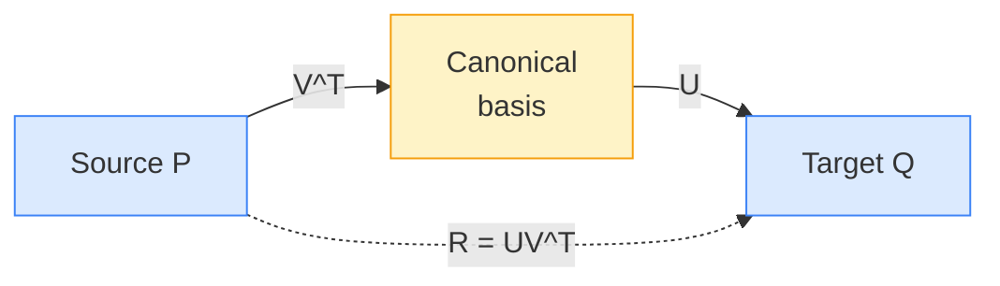

<AlertBlock title="">

Since we are looking for a **rigid** transformation (no deformation), we ignore the stretch $D$:

$$R = U \cdot \underbrace{I}_{\text{ignore } D} \cdot V^T = UV^T$$

</AlertBlock>

---
hideInToc: true
---

# Solving with SVD: Translation

<div></div>

Once the optimal rotation $R$ is known, the translation is the difference between the centroids, corrected by the rotation.

$$t = \mu_Q - R \, \mu_P$$

<InfoBlock title="Summary of the estimation step">

The SVD approach gives the optimal solution in the least-squares sense for fixed correspondences, without inner iteration.

</InfoBlock>

---
hideInToc: true
---

# Interactive Demo: SVD Estimation

<div style="height: calc(100% - 3.5rem)">
  <SVDAnimation />
</div>

---
layout: two-cols-header
hideInToc: true
---

# An Important Variant: Point-to-Plane

<div></div>

The "Point-to-Point" metric converges slowly in environments with geometric ambiguities (e.g., corridors).

::left::

**Point-to-Point:**
$$\| q - (R p + t) \|^2$$
Minimizes the direct Euclidean distance.

**Point-to-Plane:**
$$\| n_q \cdot (q - (R p + t)) \|^2$$
Minimizes the distance projected onto the normal $n_q$ of the target surface.

::right::

- **Advantage:** Allows the cloud to "slide" along planar surfaces, faster convergence and better geometric accuracy.
- **Required:** Surface normals must be computed.

---
hideInToc: true
---


# Outlier Management (Aberrant Data)

Naive ICP is very sensitive to outliers (quadratic least squares).

**Correspondence rejection strategies:**

1. **Max distance threshold:** If $\|p_i - q_j\| > d_{\max}$, the pair is ignored.
2. **Normal compatibility:** If the angle between normals $n_p$ and $n_q$ is too large ($> 45°$), it is not the same surface.
3. **Trimmed ICP:** The errors are sorted and only the best $X\%$ (e.g., 90%) are kept to compute the transformation.

---
hideInToc: true
---


# Limitations of ICP

<AlertBlock title="Local convergence problem">

- It converges to the nearest local minimum.
- **Consequence:** It requires a good initialization (e.g., odometry, constant velocity).
- **Lab 1:** You will see how matching characteristic points can solve this problem.


</AlertBlock>

**Typical applications:**
- Scan-to-scan registration (LiDAR odometry).
- Scan-to-map registration (Localization).
- Object tracking.
