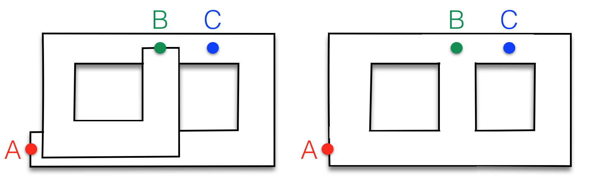
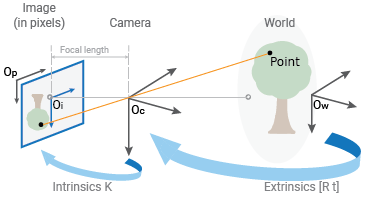
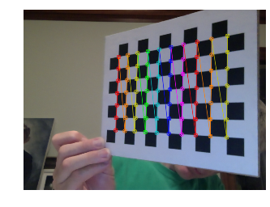
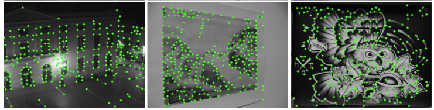
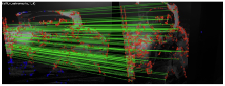

# SLAM

**INF8422 : Perception Robotique et Intelligence Spatiale**

Prof. Pierre-Yves Lajoie


<div class="cover-footer-bar mt-4">
  <span style="background:#CF1C24" />
  <span style="background:#F15A22" />
  <span style="background:#25B34B" />
  <span style="background:#00BDF2" />
</div>

---
hideInToc: true
---

# Agenda

<Toc />

---
layout: section
---

# Introduction au SLAM

---
hideInToc: true
---

# Qu'est-ce que le SLAM ?

**S**imultaneous **L**ocalization **A**nd **M**apping

<div class="grid grid-cols-2 gap-6 mt-3">
<div>

- **Simultanée** : Les deux processus s'effectuent en même temps.
- **Localisation** : Estimer la pose du robot (position et orientation) dans l'environnement.
- **Cartographie** : Construire un modèle (une carte) de l'environnement.

<InfoBlock title="Objectif fondamental">

Rendre un robot **autonome** dans un environnement **inconnu**, sans avoir besoin d'infrastructure externe (GPS, balises, etc.).

</InfoBlock>

</div>
<div>

La carte et la trajectoire sont **estimées conjointement** à partir des données des capteurs :

$$P(X, M \mid Z)$$

- $X = \{x_0, x_1, \ldots, x_k\}$ : Trajectoire (poses).
- $M = \{l_1, \ldots, l_m\}$ : Carte (landmarks).
- $Z$ : Observations capteurs.

</div>
</div>

---
hideInToc: true
---

# Le problème

<div class="grid grid-cols-2 gap-6 mt-4">
<div>

**Si je connais ma position exacte** → construire la carte est facile *(mapping avec poses connues)*.

**Si je connais la carte exacte** → me localiser est facile *(localisation sur carte connue)*.

<AlertBlock title="Le dilemme du SLAM">

Nous ne connaissons **ni l'un ni l'autre** au départ.

Les erreurs de localisation *corrompent* la carte, et les erreurs de carte *dégradent* la localisation.

</AlertBlock>

</div>
<div>

**Pourquoi est-ce difficile ?**

1. **Bruit capteurs** : Aucune mesure n'est parfaite.
2. **Dérive** : L'incertitude s'accumule au fil du temps.
3. **Association de données** : Ce que je vois est-il un lieu connu ou nouveau ?
4. **Environnements dynamiques** : Le monde bouge.
5. **Complexité** : Le problème grossit avec le temps.

</div>
</div>

---
hideInToc: true
---

# 2D LiDAR SLAM

<SlamDilemmaAnimation class="mt-2" />

---
hideInToc: true
---

# Entrées et Sorties du SLAM

<div class="grid grid-cols-2 gap-6 mt-4">
<div>

### Entrées — Données Capteurs

**Proprioception** *(mesures internes)* :
- Encodeurs de roues
- Unité de Mesure Inertielle (IMU)

**Extéroception** *(mesures de l'environnement)* :
- Caméras (mono, stéréo, RGB-D)
- LiDAR (3D, 2D)
- Radar, Sonar

</div>
<div>

### Sorties — Estimations

**Trajectoire du robot :**
$$X = \{x_0,\, x_1,\, \dots,\, x_k\} \in SE(3)^k$$

**Carte de l'environnement :**
$$M = \{l_1,\, l_2,\, \dots,\, l_m\}$$

Points (sparse), voxels (dense), objets (sémantique)…

<!-- <InfoBlock>

En SLAM, $X$ et $M$ sont estimés **simultanément** à partir des seules observations $Z = \{z_1, \dots, z_k\}$

</InfoBlock> -->

</div>
</div>

---
hideInToc: true
disabled: true
---

# Formulation Probabiliste du SLAM

<div class="grid grid-cols-2 gap-6 mt-4">
<div>

Le SLAM est fondamentalement un problème d'**estimation bayésienne** :

$$\boxed{P(X, M \mid Z)}$$

Estimer la densité jointe sur la trajectoire $X$ et la carte $M$, étant données :
- $Z = \{z_1,\dots,z_k\}$ : les **observations** (features, points LiDAR…)

</div>
<div>

**Factorisation du joint (règle de Bayes + Markov) :**

$$P(X,M|Z) \propto P(x_0) \prod_t P(x_t|x_{t-1}) \prod_{(i,j)} P(z_{ij}|x_i,l_j)$$

| Terme | Signification |
|---|---|
| $P(x_0)$ | Prior sur la pose initiale |
| $P(x_t\|x_{t-1})$ | Modèle de mouvement |
| $P(z_{ij}\|x_i,l_j)$ | Modèle d'observation |

En prenant le **maximum** de ce joint → MAP → moindres carrés non-linéaires sur graphe de facteurs.

</div>
</div>

---
layout: two-cols-header
hideInToc: true
---

# Navigation à l'aveugle vs SLAM

::left::

**Dead Reckoning (sans carte)**

- Intégration des mesures de mouvement (IMU, roues).
- Les erreurs s'accumulent avec le temps.

<AlertBlock>

Sans correction extérieure, le robot finit par ne plus savoir où il est.

</AlertBlock>

::right::

**SLAM (avec fermetures de boucle)**

- Utilise des repères de l'environnement pour corriger l'estimation.
- Chaque fois qu'un **lieu connu est reconnu**, l'erreur accumulée est **bornée**.
- La trajectoire et la carte sont **corrigées globalement**.

<ExampleBlock title="Exemple : l'aspirateur robot">

En parcourant une pièce, il reconnaît qu'il repasse près du chargeur et recale sa position.

</ExampleBlock>

---
hideInToc: true
---

# Fermeture de Boucle

<div class="grid grid-cols-2 gap-6 mt-3">
<div>

Une **fermeture de boucle** se produit quand le robot reconnaît un lieu **déjà visité**.

C'est le moment crucial où l'on peut :
- **Borner** l'erreur accumulée.
- **Corriger** toute la trajectoire passée.
- **Fusionner** deux parties de la carte.

<InfoBlock title="Sans fermeture de boucle">

Le monde ressemble à un "couloir infini" : le robot ne réalise jamais qu'il est revenu à un point connu.

</InfoBlock>

</div>
<div>


<p class="text-xs text-center text-gray-500 mt-1">Sans vs avec fermeture de boucle</p>

</div>
</div>

---
hideInToc: true
---

# Fermeture de Boucle — Visualisation Interactive

<LoopClosureAnimation class="mt-1" />

---
layout: two-cols-header
hideInToc: true
---

# Architecture : Front-end / Back-end

Le découpage standard de tout système SLAM moderne.


::left::

### Front-end

Transforme les données brutes des capteurs en **contraintes géométriques** :

- Extraction de caractéristiques.
- Association de données (tracking, loop detection).
- Estimation de mouvement local.


::right::

### Back-end

Reçoit les contraintes du Front-end et résout le **problème global** :

- Maximum A Posteriori (MAP).
- Optimisation de graphe de facteurs.
- Correction globale de trajectoire et carte.


---
hideInToc: true
disabled: true
---

# Back-end : Graphes de Facteurs

<div class="grid grid-cols-2 gap-6 mt-2">
<div>

Le Back-end représente le problème SLAM comme un **graphe de facteurs** :

- **Nœuds (variables)** : Poses du robot $x_i$, positions des landmarks $l_j$.
- **Facteurs (contraintes)** : Mesures probabilistes: odométrie, observations visuelles, fermetures de boucle.

Le Back-end minimise l'erreur globale :
$$\min_{X, M} \sum_{i,j} \| z_{ij} - h(x_i, l_j) \|^2_{\Sigma_{ij}}$$

</div>
<div>

<InfoBlock title="Bibliothèques populaires">

- **GTSAM** : Georgia Tech Smoothing and Mapping.
- **g2o** : Graph Optimization, utilisée dans ORB-SLAM.
- **Ceres** : Bibliothèque d'optimisation de Google.

</InfoBlock>

<!-- <ExampleBlock title="Clé de l'efficacité">

La matrice Jacobienne est **creuse** (sparse) : chaque mesure ne connecte que quelques nœuds. On peut résoudre des milliers de variables en temps réel.

</ExampleBlock> -->

</div>
</div>

---
hideInToc: true
disabled: true
---

# Un Défi du Front-end : Aliasing Perceptuel

<div class="grid grid-cols-2 gap-6 mt-4">
<div>

**Aliasing perceptuel :** deux lieux *différents* paraissent *identiques* aux capteurs.

Exemples : couloirs, parkings, forêts uniformes, murs blancs.

**Conséquences :**
- Le front-end génère un **faux positif** de fermeture de boucle
- Le back-end reçoit une contrainte entre deux poses qui ne devraient PAS être liées
- La carte s'**effondre** ou se déforme de façon irréversible → **échec catastrophique**

</div>

<div>
<AlertBlock>

Le front-end doit être **conservateur** : il vaut mieux rater une vraie fermeture de boucle que d'en injecter une fausse dans le back-end.

</AlertBlock>

**Autres solutions courantes :**

- Vérification géométrique. Ex: RANSAC sur poses candidates
- Optimisation robuste (coûteux). Ex: PCM, GNC.

</div>
</div>

---
hideInToc: true
---

# Modalités de Capteurs pour le SLAM

<div class="grid grid-cols-1 gap-6 mt-3">
<div>

| Capteur | Points forts | Limites |
|---|---|---|
| **Caméra mono** | Légère, bon marché, riche en texture | Pas d'échelle absolue, sensible à la luminosité |
| **Stéréo / RGB-D** | Profondeur directe, échelle métrique | Portée limitée (RGB-D < 5m) |
| **LiDAR 3D** | Très précis, fonctionne dans l'obscurité | Coût élevé, sparse |
| **IMU** | 6-DOF haute fréquence (100-1000 Hz) | Dérive, biais |

</div>
</div>

---
hideInToc: true
---
# Modalités de Capteurs pour le SLAM
<div class="grid grid-cols-1 gap-6 mt-3">
<div>

| Fusion | Avantage principal |
|---|---|
| **Visual SLAM** | Richesse texturale, compact |
| **LiDAR SLAM** | Précision géométrique absolue |
| **VIO** (Visual-Inertial) | Robustesse aux flous, fast motion |
| **LIO** (LiDAR-Inertial) | Précision + distorsion corrigée |
| **Radar SLAM** | Brouillard, pluie, nuit |

<InfoBlock title="Robustesse">

Les systèmes les plus robustes combinent **plusieurs modalités** : VIO + LiDAR pour la conduite autonome, caméra + radar pour conditions extrêmes.

</InfoBlock>

</div>
</div>

---
hideInToc: true
---

# Représentations de la Carte

<div class="grid grid-cols-2 gap-6 mt-3">
<div>

### Clairsemée (Sparse)
**Points d'intérêt / landmarks** — suffisante pour la localisation, légère.

*Exemple : ORB-SLAM3*

### Dense
**Reconstruction 3D complète** (mesh, voxels, TSDF) — nécessaire pour la navigation, manipulation, visualisation.

*Exemples : KinectFusion, ElasticFusion*

</div>
<div>

### Sémantique
**Objets étiquetés** (chaise, porte, mur) — compréhension de la scène, landmarks stables pour la localisation à long terme.

*Exemples : SemanticFusion, Kimera*

### Topologique
**Graphe de lieux** (nœud A connecté à nœud B) — navigation haut niveau, compact.


</div>
</div>

<AlertBlock>

Le choix de la représentation dépend de la **tâche** : localisation → sparse ; planification → dense ; interaction → sémantique.

</AlertBlock>
---
hideInToc: true
---

# Ce cours : le Front-end visuel et inertiel

<div class="mt-4">

<InfoBlock title="">

| Section | Contenu | Rôle dans le système |
|---|---|---|
| **2 — Caméras** | Modèle pinhole, calibration, stéréo, RGB-D | Entrée sensorielle du Front-end |
| **3 — Odométrie Visuelle** | Features, géométrie, BA local | Estimation locale du mouvement |
| **4 — IMU** | Accéléromètre, gyroscope, intégration | Capteur proprioceptif haute fréquence |
| **5 — VIO** | Facteur IMU, fusion, observabilité | Pont Front-end → Back-end |

</InfoBlock>

</div>


---
layout: section
---

# Les Caméras

---
hideInToc: true
---

# Modèle Pinhole : La projection perspective

Le modèle sténopé (pinhole) décrit comment un point 3D se projette sur le plan image.

<div class="grid grid-cols-2 gap-6 mt-2">
<div>

**Principe :**
L'image se forme à une distance focale $F$ (en mm) du point focal.

**Projection :**
Soit $p^c = [p_x^c,\, p_y^c,\, p_z^c]^T$ un point exprimé dans le repère caméra ($c$). Ses coordonnées physiques sur le capteur sont :

$$x = F \frac{p_x^c}{p_z^c}, \quad y = F \frac{p_y^c}{p_z^c}$$

<small>Note : $x$ et $y$ sont des distances physiques (mm), pas encore des pixels.</small>


</div>
<div>


<p class="text-xs text-center text-gray-500 mt-1">Projection géométrique (Source: MathWorks)</p>

</div>
</div>

<InfoBlock title="">

C'est la **projection perspective** : les objets lointains apparaissent petits. L'information de profondeur est **perdue** dans la projection.

</InfoBlock>
---
hideInToc: true
---

# Modèle Pinhole — Projection Interactive

<PinholeAnimation class="mt-1" />

---
hideInToc: true
zoom: 0.9
---

# Paramètres Intrinsèques : Caméra → Pixels $(u, v)$

Conversion des coordonnées physiques (mm) vers les pixels $(u, v)$.

<InfoBlock>

On convertit la focale $F$ (mm) en pixels via la taille des pixels $(p_u, p_v)$ :
$$f_u = \frac{F}{p_u}, \quad f_v = \frac{F}{p_v}$$

</InfoBlock>

**Matrice Intrinsèque $K$ :**
$$\begin{bmatrix} u \\ v \\ 1 \end{bmatrix} =
\underbrace{\begin{bmatrix} f_u & 0 & c_u \\ 0 & f_v & c_v \\ 0 & 0 & 1 \end{bmatrix}}_{K}
\begin{bmatrix} p_x^c / p_z^c \\ p_y^c / p_z^c \\ 1 \end{bmatrix}$$

- $(f_u, f_v)$ : Focales en pixels.
- $(c_u, c_v)$ : Point principal, centre optique de l'image en pixels.

---
layout: two-cols-header
hideInToc: true
zoom: 0.9
---

# Paramètres Extrinsèques : Monde → Caméra

Passage du repère monde ($w$) au repère caméra ($c$).

::left::

Transformation rigide composée d'une rotation $R_w^c$ et d'une translation $t_w^c$ :

$$\begin{bmatrix} p^c \\ 1 \end{bmatrix} =
\underbrace{\begin{bmatrix} R_w^c & t_w^c \\ 0 & 1 \end{bmatrix}}_{T_w^c}
\begin{bmatrix} p^w \\ 1 \end{bmatrix}$$

- $R_w^c$ ($3 \times 3$), $t_w^c$ ($3 \times 1$) : rotation et translation **monde → caméra**.
- La **pose de la caméra dans le monde** est l'inverse (cours 1) : $T_c^w = (T_w^c)^{-1}$, soit $R_c^w = (R_w^c)^T$ et $t_c^w = -(R_w^c)^T\, t_w^c$.
- **En SLAM** : c'est cette pose $T_c^w$ (ou son inverse $T_w^c$) qui est l'**inconnue à estimer**.

::right::


<p class="text-xs text-center text-gray-500 mt-1">Repère Monde vs Repère Caméra</p>

---
hideInToc: true
zoom: 0.85
---

# Fonction d'observation $h(\cdot)$

Dans le SLAM visuel, la **fonction d'observation** relie un point 3D du monde à un pixel dans l'image :

<div class="grid grid-cols-2 gap-6 mt-3">
<div>

**Étape 1 de $h(\cdot)$ — Extrinsèques** (Monde → Caméra) :
$$p^c = R_w^c \, p^w + t_w^c$$

**Étape 2 de $h(\cdot)$ — Intrinsèques** (Caméra → Pixels) :
$$\begin{bmatrix} u \\ v \end{bmatrix} = \underbrace{\begin{bmatrix} f_u & 0 & c_u \\ 0 & f_v & c_v \\ 0 & 0 & 1 \end{bmatrix}}_{K} \begin{bmatrix} p_x^c / p_z^c \\ p_y^c / p_z^c \\ 1 \end{bmatrix} = \begin{bmatrix} f_u \frac{p_x^c}{p_z^c} + c_u \\ f_v \frac{p_y^c}{p_z^c} + c_v \end{bmatrix}$$

</div>
<div>

On peut donc modéliser une observation :
$$\bar{z} = h(T^w_c, p^w) + \epsilon, \quad \epsilon \sim \mathcal{N}(0, \Sigma)$$

- $T^w_c$ : Pose caméra (paramètre extrinsèque).
- $p$ : Position 3D du landmark.
- $\bar{z} = (u, v)$ : Observation en pixels.
- $\epsilon$ : bruit.


</div>
</div>

<InfoBlock title="Reprojection Error">

L'erreur de reprojection pour un point est $\| \bar{z} - h(T^w_c, p^w) \|^2$.
Le Back-End (prochain cours) va ensuite trouver les $T^w_{c_i}$ et $p_i^w$ qui minise la somme des erreurs de reprojection pour tous les points :
$$\text{min } \sum_{i=1}^{N} \| \bar{z_i} - h(T^w_{c_i}, p_i^w) \|^2$$
</InfoBlock>
---
layout: two-cols-header
hideInToc: true
---

# Réalité physique : Les Distorsions

Les lentilles réelles ont des imperfections optiques, **il faut corriger avant toute estimation**.

::left::

**1. Distorsion Radiale**
- Causée par la courbure de la lentille.
- Les rayons sont déviés davantage **loin du centre**.
- **Conséquence** : Les lignes droites apparaissent **courbes**.
- **Effets** : "Barillet" (GoPro, fisheye) ou "Pincushion".

**2. Distorsion Tangentielle**
- Causée par un défaut d'assemblage.
- La lentille n'est pas parfaitement parallèle au capteur.


::right::

<small>Ces défauts sont constants → corrigés par calibration. On trouve les paramètres de calibration en observant un échéquier de taille connu. Ensuite on corrige l'image avec par exemple OpenCV `cv2.undistort`.</small>

<p class="text-xs text-center text-gray-500 mt-1 italic">Distorsion radiale en barillet (à gauche) et pincushion (à droite)</p>


<p class="text-xs text-center text-gray-500 mt-1 italic">Calibration avec un patron connu. On compare les distances observées sur l'image avec les distances réelles entre les coins de l'échiquier.</p>

---
layout: two-cols-header
hideInToc: true
zoom: 0.9
---

# Vision Stéréo — Disparité

Comment retrouver la profondeur $Z$ à partir de **deux images** ?

::left::

**Configuration standard :**
- Deux caméras identiques, axes optiques **parallèles**.
- Séparées par une distance $b$ (**baseline**).
- Focale $f$ (en pixels).

**Disparité $d$ :**
Différence de position horizontale d'un même point $P$ dans les deux images :

$$d = u_L - u_R$$

Un objet **proche** se déplace beaucoup entre les deux images → grande disparité.

Un objet **lointain** se déplace peu → petite disparité.

::right::


<p class="text-xs text-center text-gray-500 mt-1">Géométrie stéréo standard (Source: MIT Vision Book)</p>

---
layout: two-cols-header
hideInToc: true
---

# Vision Stéréo — Profondeur

::left::

**Relation de profondeur $Z$ :**
Par triangles semblables (Thalès) :

$$\frac{b}{Z} = \frac{d}{f} \implies \boxed{Z = \frac{f \cdot b}{d}}$$

<AlertBlock title="Intuition clé">

La profondeur est **inversement proportionnelle** à la disparité.

- Grande $d$ → objet proche.
- Petite $d$ → objet lointain (et plus incertaine).

Pour voir loin avec précision, il faut une **grande baseline** $b$ (appelée T dans la figure.).

</AlertBlock>

::right::


<p class="text-xs text-center text-gray-500 mt-1">Géométrie stéréo standard (Source: MIT Vision Book)</p>

---
hideInToc: true
---

# Vision Stéréo — Visualisation Interactive

<StereoAnimation class="mt-1" />

---
hideInToc: true
---

# Capteurs RGB-D — Profondeur Active

Alternatives à la stéréoscopie passive pour mesurer $Z$ directement.

<div class="grid grid-cols-2 gap-5 mt-2">
<div>

**1. Stéréo IR Actif** *(ex : Intel RealSense D435)*

<div class="ml-2 mt-1 text-sm space-y-1">

**① Projecteur IR** — projette un motif de points invisibles à l'œil nu sur la scène.

**② Deux caméras IR** — voient le motif simultanément ; comme deux yeux, elles perçoivent chaque point légèrement décalé.

**③ Calcul de profondeur** — le processeur mesure le *décalage* de chaque point entre les deux images → $Z = f \cdot b / d$.

- **Limite** : IR saturé en plein soleil.
</div>

<!-- **2. Lumière structurée** *(ex : Kinect v1)*
- Une seule caméra mesure la **déformation** du motif projeté. -->

**3. Time-of-Flight (ToF)** *(ex : Kinect v2)*
- Mesure le déphasage d'une lumière modulée → profondeur directe.

</div>
<div>


<p class="text-xs text-center text-gray-500 mt-1">Intel RealSense D435 — stéréo IR active (Source: Intel)</p>

<InfoBlock title="Avantage pour le SLAM">

- Profondeur directe → pas d'ambiguïté d'échelle en monoculaire.
- Facilite l'association de points, ne nécessite pas de features.
- Très utilisé en intérieur (robot domestique, scan de bâtiment).

</InfoBlock>

</div>
</div>

---
layout: section
---

# Odométrie Visuelle

---
hideInToc: true
zoom: 0.9
disabled: true
---

# SfM vs V-SLAM vs Odométrie Visuelle

<div class="grid grid-cols-3 gap-4 mt-3">
<div>

**Structure from Motion (SfM)**

- **Offline** : toutes les images disponibles d'un coup.
- **Non-ordonné** : l'ordre n'importe pas.
- **Lent** : peut prendre des heures (reconstructions de villes).

*Ex : COLMAP, Metashape*

</div>
<div>

**Visual Odometry (VO)**

- **Online** : images séquentielles $t_1, t_2, \ldots$
- **Local** : estimation incrémentale de $T_{k-1,k}$.
- **Pas de carte globale** : on oublie les points hors-champ.
- **Pas de loop closure** : dérive non bornée.

</div>
<div>

**Visual SLAM**

- **Online + global** : carte persistante.
- **Loop closure** : correction de dérive.
- **V-SLAM = VO + Carte Globale + Loop Closure**

*Ex : ORB-SLAM3, PTAM*

</div>
</div>

<InfoBlock title="Dans ce cours">

On part du VO (brique de base) pour comprendre comment le Front-end génère les contraintes que le Back-end va optimiser globalement.

</InfoBlock>

---
hideInToc: true
---

# Pipeline Feature-Based — Vue d'ensemble

<div class="mt-4">

La méthode classique, encore dominante en pratique (ORB-SLAM, VINS-Mono) :

</div>

<div class="grid grid-cols-4 gap-3 mt-4">
<div class="example-block text-center">

**① Détection**

Trouver des *interest points* (coins, blobs) dans l'image $I_k$.

</div>
<div class="info-block text-center">

**② Description**

Calculer un vecteur descripteur robuste autour de chaque point.

</div>
<div class="info-block text-center">

**③ Matching**

Trouver les correspondances entre $I_{k-1}$ et $I_k$. Filtrer avec RANSAC.

</div>
<div class="example-block text-center">

**④ Estimation**

Calculer $T_{k-1,k}$ par contrainte de coplanarité (2D-2D) ou PnP (3D-2D).

</div>
</div>

<div class="mt-4">

<AlertBlock title="Similaire à ICP">

On associe les pixels des deux images (étapes 1 à 3).

Puis, on calcule la rotation et translation entre les deux images.

</AlertBlock>

</div>

---
layout: two-cols-header
hideInToc: true
---

# Feature Detectors — Détecter les Points d'Intérêt
<div></div>

On veut des points **répétables** et **stables** sous rotation, changement d'échelle et d'illumination.

::left::

**FAST** *(Features from Accelerated Segment Test)*
- Test binaire sur un cercle de 16 pixels.
- Détecte des coins dans les images.
- **Très rapide** pour le temps réel.

**Autres détecteurs :**
- **Harris** : réponse au coin, plus lent.
- **SIFT** / **SURF** : invariant à l'échelle, coûteux.
- **ORB** = FAST + orientation → **rapide et invariant**.

::right::


<p class="text-xs text-center text-gray-500 mt-1">Keypoints détectés sur une image</p>

---
layout: default
hideInToc: true
zoom: 0.9
---

# Trouver les Correspondances

<div class="grid gap-6 mt-3" style="grid-template-columns: 2fr 1fr;">
<div>

**Comment savoir que le point $A$ dans $I_1$ est le point $B$ dans $I_2$ ?**

**BRIEF / ORB Descriptor :**
- Vecteur **binaire** (128–256 bits) construit par comparaisons d'intensité par paires autour du keypoint.
- Matching via **distance de Hamming** (XOR bit-à-bit) → très rapide.
- **Inconvénient majeur**: les descripteurs étant imparfaits, ils produisent beaucoup de mauvaises correspondances.

**Filtrage des mauvaises correspondances — RANSAC :**

1.Choisir **N points** au hasard.

2.Calculer le modèle. 3. Compter les **inliers**.

4.Répéter → garder le **meilleur modèle**.

</div>
<div>



<p class="text-xs text-center text-gray-500 mt-1">Matchings bruts (haut) et après RANSAC (bas)</p>

</div>
</div>

---
hideInToc: true
---

# Matching & RANSAC — Visualisation Interactive

<RansacAnimation class="mt-2" />

---
layout: default
hideInToc: true
---

# Trouver la transformation entre deux images : Contrainte de Coplanarité

<div></div>

Utilisée pour l'**initialisation** (pas encore de carte 3D) — entrée : correspondances 2D-2D .

<div class="grid gap-5 mt-2" style="grid-template-columns: 55% 45%;">
<div>

**Le même point 3D, vu deux fois** *(coordonnées normalisées $x = K^{-1}\tilde m$)* :

$$\lambda_1\,x_1 = t_2^1 + \lambda_2\,R_2^1\,x_2$$

Les profondeurs $\lambda_1, \lambda_2$ sont **inconnues**, mais $x_1$, $t_2^1$ et $R_2^1 x_2$ sont dans un **même plan** : leur produit mixte est nul.

$$x_1^T\,(t_2^1 \times R_2^1 x_2) = 0 \quad\Longleftrightarrow\quad \boxed{\,x_1^T\,E\,x_2 = 0\,}$$

**Matrice essentielle** $E = [t_2^1]_\times\,R_2^1$ : chaque correspondance donne **une** équation. Plusieurs correspondances → $E$ → $R$ et la **direction** de $t$.

**Limite :** $\|t\| = 1$ → **échelle inconnue** en monoculaire.
<div style="font-size: 0.75em;">

*Note : les bibliothèques écrivent souvent la contrainte transposée, $x_2^T E x_1 = 0$ (caméra 2 comme repère de travail). Même géométrie, autre convention — en choisir une et s'y tenir.*
</div>
</div>
<div>

**La procédure :**

$$\text{correspondances }(x_1, x_2) \;\longrightarrow\; E \;\longrightarrow\; R,\ t$$

<div style="font-size: 0.8em;">

Chaque correspondance apporte **une** contrainte sur la pose relative. Avec plusieurs correspondances on estime $E$, puis on la **décompose** pour retrouver $R$ et la **direction** de $t$.

</div>

```python
# OpenCV — Matrice Essentielle + pose
E, mask = cv2.findEssentialMat(
    pts1, pts2, K, method=cv2.RANSAC)
_, R, t, _ = cv2.recoverPose(E, pts1, pts2, K)
# t est unitaire : pas d'échelle absolue
```

</div>
</div>

---
hideInToc: true
---

# Contrainte de Coplanarité — Visualisation Interactive

<CoplanarityAnimation class="mt-2" />

---
hideInToc: true
zoom: 0.9
disabled: true
---

# Contrainte de Coplanarité — Intuition

<div class="grid gap-6 mt-2" style="grid-template-columns: 1fr 1fr;">
<div style="font-size: 0.75em;">

**Légende de l'animation :**
- **C₁, C₂** : centres optiques des deux caméras
- **P** : point 3D observé par les deux
- **x₁** : rayon de C₁ vers P *(direction normalisée)*
- **R x₂** : rayon de C₂ vers P, ramené dans le repère de C₁
- **t** : baseline C₁→C₂
- **plan grisé** : les trois vecteurs y vivent — c'est toute la contrainte
- **n = t × Rx₂** : normale à ce plan


<InfoBlock title="">

`cv2.findEssentialMat(..., method=cv2.RANSAC)` + `cv2.recoverPose()` → **R, t**

</InfoBlock>

</div>
<div>
<div style="font-size: 0.75em;">

**D'où vient la contrainte $x_1^\top E\, x_2 = 0$ ?**

C₁, P, C₂ définissent **un plan** : les deux rayons et la baseline y sont tous les trois.

$$\underbrace{x_1^\top}_{\text{dans Image 1}} \underbrace{[\mathbf{t}]_\times R}_{\displaystyle E} \underbrace{x_2}_{\text{dans Image 2}} = 0$$

- $R\,x_2$ : ramène $x_2$ dans le repère de C₁.
- $[\mathbf{t}]_\times (R\,x_2)$ : produit vectoriel avec la baseline → vecteur **normal** à ce plan.
- $x_1^\top \cdot \mathbf{n} = 0$ : $x_1$ est dans le plan ↔ produit scalaire nul.

</div>
</div>
</div>

<div style="font-size: 0.75em;">

**Pourquoi plusieurs points ?**

Chaque paire ne donne qu'**une équation scalaire** : il en faut plusieurs (5 au minimum) pour estimer $E$, puis on la décompose en $R$ et direction de $\mathbf{t}$.

En pratique avec RANSAC : on tire un échantillon minimal, on résout $E$, on compte les inliers, les mauvais matches sont rejetés.


</div>
---
hideInToc: true
zoom: 0.85
---

# 3D-2D : Perspective-n-Point (PnP)


<div></div>

Utilisé pour le **tracking** (carte 3D disponible) — entrée : points 3D de la carte + pixels 2D détectés.

<div class="grid gap-5 mt-2" style="grid-template-columns: 55% 45%;">
<div>

**D'où viennent les points 3D ?** Triangulés lors de l'initialisation (2D-2D) et ajoutés à la carte.

Pour chaque correspondance, en coordonnées normalisées $x_i = K^{-1}\tilde m_i$ :

$$\boxed{\,\lambda_i\,x_i = R_w^c\,p_i^w + t_w^c\,}$$

L'amer ramené dans le repère caméra doit tomber **sur le rayon** de son observation ; sa profondeur $\lambda_i$ reste inconnue.

- En pratique : **solvePnPRansac** → robuste aux faux positifs.

<InfoBlock title="">

Si les points 3D sont en mètres (ex: via stéréo) → pose avec **échelle métrique**. Si les points 3D sont normalisés (monoculaire) → pose sans échelle (*up-to-scale*).

</InfoBlock>

</div>
<div>

```python
# OpenCV — PnP robuste avec RANSAC
ret, rvec, tvec, inliers = cv2.solvePnPRansac(
    pts3d,        # (N,3) float32 — carte
    pts2d,        # (N,2) float32 — pixels
    K, dist_coeffs)

# Convertir vecteur rotation → matrice
R, _ = cv2.Rodrigues(rvec)
# T = [R | t]
```

<div style="font-size: 0.8em;">

|  | **2D-2D** | **PnP (3D-2D)** |
|---|---|---|
| Entrée | 2D ↔ 2D | 3D ↔ 2D |
| Équation | $x_1^T E x_2 = 0$ | $\lambda_i x_i = R_w^c\,p_i^w + t_w^c$ |
| Sortie | pose **relative** | pose **dans la carte** |
| Échelle | inconnue | celle de la carte |
| Usage | initialisation | tracking |

</div>

</div>
</div>

---
hideInToc: true
---

# PnP — Minimiser la différence entre la pose estimée de la caméra et les observations.

<PnPAnimation class="mt-2" />

---
hideInToc: true
---

# PnP — Contrainte Géométrique

<div class="grid gap-6 mt-2" style="grid-template-columns: 1fr 1fr;">
<div style="font-size: 0.75em;">

**Légende de l'animation :**

| Symbole | Signification |
|---------|--------------|
| **$p_i^w$** | amer 3D de la carte — **connu** |
| rayon bleu | direction d'observation $x_i = K^{-1}\tilde m_i$, issue du pixel |
| segment rouge (3D) | écart entre l'amer et son rayon : ce que la pose doit annuler |
| **●** vert | observation $m_i$ dans l'image |
| **○** rouge | reprojection $\pi(K(R_w^c\,p_i^w + t_w^c))$ |
| segment rouge (image) | résidu $e_i$ |


</div>
<div>
<div style="font-size: 0.75em;">

**Objectif — minimiser l'erreur de reprojection :**

$$\underset{R_w^c,\,t_w^c}{\min}\ \sum_{i=1}^{N} \left\| m_i - \pi\!\left(K(R_w^c\,p_i^w + t_w^c)\right) \right\|^2$$

où $\pi(X,Y,Z) = (X/Z,\; Y/Z)$ est la projection perspective, sans la profondeur $\lambda_i$.

Chaque correspondance $(p_i^w, m_i)$ donne **2 équations** (u, v). La pose a **6 DDL** → il faut au moins 3 paires.

<InfoBlock title="">

```python
ret, rvec, tvec, inliers = cv2.solvePnPRansac(
    pts3d, pts2d, K, dist)
R, _ = cv2.Rodrigues(rvec)
```

</InfoBlock>

</div>
</div>
</div>

---
hideInToc: true
zoom: 0.9
---

# Méthodes Directes — Alternative aux Features

Au lieu d'extraire des descripteurs, on aligne directement **l'intensité des pixels** entre images.

- Pas d'extraction de keypoints → exploite toute la texture, même faible.
- Précision sub-pixel, mais sensible aux changements d'illumination.
- Besoin de **pyramides d'images** (coarse-to-fine) pour la convergence.
- Produisent des cartes **semi-denses** (tous les pixels à gradient fort).

<ExampleBlock title="Systèmes directs notables">

- **DSO** (Direct Sparse Odometry) — sparse direct, état de l'art vitesse/précision
- **LSD-SLAM** (Large-Scale Direct) — semi-dense, loop closure
- **SVO** (Semi-Direct VO) — hybride : features pour tracking, photométrique pour profondeur

</ExampleBlock>

<InfoBlock title="À retenir">

Les méthodes directes ne remplacent pas les features dans tous les cas : elles excellent en intérieur texturé, mais peinent sous éclairage variable ou en extérieur.

</InfoBlock>

---
hideInToc: true
zoom: 0.9
---

# Sélection de Keyframes

Pas besoin de traiter **chaque image** — on sélectionne des **keyframes** : les images les plus informatives.

<div class="grid grid-cols-2 gap-6 mt-3">
<div>

**Pourquoi des keyframes ?**

- Images consécutives sont très similaires → redondance inutile.
- Le BA n'est lancé que sur les keyframes → coût contrôlé.

**Critères de sélection :**

1. **Parallaxe** : déplacement suffisant depuis la dernière keyframe ($> \theta_{min}$).
2. **Tracking** : nombre de features trackées tombe en dessous d'un seuil.
3. **Temps** : intervalle minimal entre keyframes respecté.

</div>
<div>

<InfoBlock title="Cadence typique">

À 30 fps, on sélectionne ~1 image sur 5–10 comme keyframe.

</InfoBlock>

<AlertBlock title="Compromis">

Trop de keyframes → BA coûteux, lent.
Trop peu → manque de contraintes, dérive.

</AlertBlock>

</div>
</div>


---
hideInToc: true
---

# VO : Composition de Poses et Dérive

<div class="grid grid-cols-2 gap-6 mt-3">
<div>

L'odométrie visuelle estime le **mouvement relatif** $\hat{T}_{k-1,k}$ entre deux frames consécutives, puis **compose** les poses :

$$T_k = T_{k-1} \cdot \hat{T}_{k-1,k}$$

Chaque estimation $\hat{T}$ contient une petite erreur $\epsilon_k$.
En composant, ces erreurs **s'accumulent**, la trajectoire dérive de la réalité.

<AlertBlock title="Dérive du VO">

L'erreur croît à chaque nouvelle image. Sans correction externe, le robot ne sait plus où il est après quelques centaines de mètres.

</AlertBlock>

</div>
<div>

<svg viewBox="0 0 260 180" class="w-full mt-2">
  <!-- Axe temps -->
  <line x1="20" y1="160" x2="245" y2="160" stroke="#CBD5E1" stroke-width="1"/>
  <text x="248" y="163" font-size="2" fill="#94a3b8" font-family="sans-serif">k</text>
  <!-- Vraie trajectoire (droite) -->
  <polyline points="20,130 75,105 130,80 185,55 240,30"
    fill="none" stroke="#25B34B" stroke-width="2"/>
  <text x="188" y="27" font-size="2" fill="#25B34B" font-weight="700" font-family="sans-serif">Vérité terrain</text>
  <!-- Trajectoire VO (dérive) -->
  <polyline points="20,130 78,112 138,96 198,88 242,85"
    fill="none" stroke="#CF1C24" stroke-width="2" stroke-dasharray="6,3"/>
  <text x="195" y="98" font-size="2" fill="#CF1C24" font-weight="700" font-family="sans-serif">VO (dérive)</text>
  <!-- Erreur (accolade) -->
  <line x1="240" y1="30" x2="240" y2="85" stroke="#F59E0B" stroke-width="1.5" stroke-dasharray="3,2"/>
  <text x="243" y="60" font-size="2" fill="#F59E0B" font-weight="700" font-family="sans-serif">ε</text>
  <!-- Poses -->
  <circle cx="20"  cy="130" r="4" fill="#475569"/>
  <circle cx="78"  cy="112" r="3" fill="#CF1C24" opacity="0.8"/>
  <circle cx="138" cy="96"  r="3" fill="#CF1C24" opacity="0.8"/>
  <circle cx="198" cy="88"  r="3" fill="#CF1C24" opacity="0.8"/>
  <circle cx="242" cy="85"  r="4" fill="#CF1C24"/>
  <text x="14" y="145" font-size="2" fill="#475569" font-family="sans-serif">T_0</text>
</svg>

</div>
</div>

---
hideInToc: true
---

# Dérive et Bundle Adjustment Local

**Le problème :** chaque estimation $\hat{T}_{k-1,k}$ a une petite erreur → compositions successives → **dérive** (*drift*).

<div class="grid gap-5 mt-2" style="grid-template-columns: 55% 45%;">
<div>

**Bundle Adjustment local** : réoptimise simultanément les **K derniers keyframes** et leurs landmarks visibles :

$$\min_{T_j, P_i} \sum_{j \in \mathcal{W}} \sum_i \left\| z_{ij} - h(T_j, P_i) \right\|^2$$

- La fenêtre $\mathcal{W}$ glisse avec la caméra ($K \sim 10$).
- Coût $O(K^2)$ parce qu'on doit comparer chaque paire.

<AlertBlock title="Coût vs précision">

Plus la fenêtre est grande, plus la correction est précise, mais le coût augmente. En pratique K ≤ 10 pour du temps réel.

</AlertBlock>

</div>
<div>

| Approche | Précision | Coût calcul |
|---|---|---|
| VO simple (PnP seul) | Faible (drift ↑) | Très bas |
| VO + BA local | Moyenne | Modéré |
| VO + BA global ($W=\infty$) | Haute | Élevé |


</div>
</div>

---
hideInToc: true
---

# Bundle Adjustment (BA)

<div class="grid grid-cols-2 gap-6 mt-2">
<div>


**Bundle Adjustment (BA) :**
Optimise simultanément les poses $T_j$ **et** les points 3D $P_i$ :

$$\min_{T, P} \sum_{i,j} \left\| z_{ij} - h(T_j, P_i) \right\|^2_{\Sigma_{ij}}$$

<!--
**Pose Graph Optimization :**
Simplification. Optimise seulement les poses $T_1, \ldots, T_n$ avec des contraintes relatives. Plus rapide mais moins précis. -->

</div>
<div>

<InfoBlock title="En pratique">

Le BA **local** (fenêtre de keyframes) tourne en temps réel dans le Front-end.

Le pose graph optimization avec toute la trajectoire (BA **global**) tourne dans le Back-end après chaque loop closure, au prochain cours.

</InfoBlock>

</div>
</div>

---
hideInToc: true
---

# Bundle Adjustment — Visualisation Interactive

<BaAnimation class="mt-1" />

---
hideInToc: true
---

# Limites du Visual SLAM — Pourquoi ajouter l'IMU ?

<div class="grid grid-cols-2 gap-6 mt-3">
<div>

<AlertBlock title="Limitations du V-SLAM seul">

1. **Flou de mouvement** : à haute vitesse, les features deviennent inexploitables.
2. **Ambiguïté d'échelle** : en monoculaire.
3. **Occultation** : face à un mur blanc ou dans le noir, le système perd le tracking.
4. **Roll & Pitch** : une caméra seule ne peut pas mesurer l'orientation absolue par rapport à la gravité.

</AlertBlock>

</div>
<div>

**Solution : ajouter un capteur proprioceptif à haute fréquence.**

L'**IMU** (Inertial Measurement Unit) mesure :
- Accélérations linéaires
- Vitesses angulaires

Il continue de fonctionner ($>200$ Hz) **dans le noir, le brouillard, face à un mur blanc**.

<ExampleBlock title="Visual-Inertial Odometry (VIO)">

La fusion caméra + IMU résout simultanément l'échelle, le roll/pitch et la robustesse aux mouvements rapides.

</ExampleBlock>

</div>
</div>

---
layout: section
---

# IMU et Navigation Inertielle

---
hideInToc: true
---

# Unités de Mesure Inertielle (IMU) — Accéléromètre

Capteurs MEMS (Micro-Electro-Mechanical Systems). Dérivent rapidement.

<InfoBlock title="Modèle de l'Accéléromètre (a_m)">

Mesure la **force spécifique** dans le repère du robot ($r$) :

$$a_m^r = R_w^r \,(a^w - g^w) + b_a + n_a$$

- $a^w,\, g^w$ : Accélération réelle et gravité (repère monde $w$).
- $R_w^r = (R_r^w)^T$ : Rotation monde → robot.
- $b_a,\, n_a$ : Biais (lentement variable) et Bruit blanc Gaussien.

</InfoBlock>

<AlertBlock title="Point clé">

L'accéléromètre mesure la **force spécifique** $f = a - g$, **pas** l'accélération pure. Au repos sur une table, il mesure $+g$ vers le haut (réaction normale). En chute libre, il mesure **zéro**.

</AlertBlock>

---
hideInToc: true
zoom: 0.9
---

# Unités de Mesure Inertielle (IMU) — Gyroscope

<InfoBlock title="Modèle du Gyroscope (omega_m)">

Mesure la vitesse angulaire du robot dans son propre repère :

$$\omega_m^r = \omega^r + b_g + n_g$$

- $\omega^r$ : Vitesse angulaire réelle (exprimée dans le repère du robot $r$).
- $b_g,\, n_g$ : Biais du gyroscope et Bruit blanc Gaussien.

</InfoBlock>

<div class="grid grid-cols-2 gap-6 mt-3">
<div>

**Utilisé pour intégrer la rotation :**
$$R_{k+1} = R_k \cdot \text{Exp}\!\left( (\omega_k - b_g)\,\Delta t \right)$$

Le gyroscope donne une **orientation relative** très précise sur de courtes durées.

Nous verrons la carte Exp (opération matricielle) au prochain cours.
</div>
<div>

<ExampleBlock title="Complémentarité Caméra / Gyroscope">

La caméra donne une orientation **absolue** (par rapport à la scène) mais à basse fréquence.

Le gyroscope donne une orientation **relative** à très haute fréquence.


</ExampleBlock>

</div>
</div>

---
hideInToc: true
---

# IMU : Bruit et Biais — Pourquoi ça dérive ?

<div class="grid grid-cols-2 gap-6 mt-2">
<div>

**1. Bruit Blanc ($n$) :**
$$n \sim \mathcal{N}(0, \sigma^2)$$
Lors de l'intégration, le bruit cause un *Random Walk* en position :
$$\sigma_p(t) \propto \sigma_n \sqrt{t}$$

**2. Biais ($b$) :**
Erreur systématique qui évolue lentement (Random Walk du biais) :
$$\dot{b}(t) = \eta_b(t), \quad \eta_b \sim \mathcal{N}(0, \sigma_b^2)$$

</div>
<div>

<AlertBlock title="Dérive quadratique en position">

Un biais constant de seulement $0.1$ m/s² sur l'accéléromètre cause une erreur de position :
$$x(t) = \frac{1}{2} b \cdot t^2$$

Après **10 secondes** → erreur de **5 mètres** !

L'estimation des biais $b_a, b_g$ est **critique** et est réalisée conjointement avec la pose dans le Back-end.

</AlertBlock>

</div>
</div>

---
hideInToc: true
---

# Dérive IMU — Visualisation Interactive

<ImuDriftAnimation class="mt-1" />

---
hideInToc: true
---

# Cinématique Discrète

<div></div>

Si on connaît l'état $x_k = (R_k, v_k, p_k)$ et les mesures $(\omega_k, a_k)$, on prédit $x_{k+1}$ :

<div class="grid grid-cols-2 gap-6 mt-3">
<div>

**Rotation :**
$$R_{k+1} = R_k \cdot \text{Exp}\!\left( (\omega_k - b_g)\,\Delta t \right)$$

**Vitesse linéaire :**
$$v_{k+1} = v_k + \bigl( R_k\,(a_k - b_a) + g \bigr)\,\Delta t$$

**Position :**
$$p_{k+1} = p_k + v_k\,\Delta t + \frac{1}{2}\bigl( R_k\,(a_k - b_a) + g \bigr)\,\Delta t^2$$

</div>
<div>

<InfoBlock title="À retenir">

- L'IMU fonctionne à **très haute fréquence** (200–1000 Hz).
- La caméra fonctionne à basse fréquence (10–30 Hz).
- Entre deux images, on intègre **des dizaines à des centaines** de mesures IMU.

</InfoBlock>
<!--
<AlertBlock title="Problème pour l'optimisation">

Si on veut optimiser les biais ou les poses dans un graphe de facteurs, il faut **ré-intégrer** toutes les mesures à chaque itération. Très coûteux.

</AlertBlock> -->

</div>
</div>

---
layout: two-cols-header
disabled: true
hideInToc: true
---

# Pré-intégration IMU — L'idée clé (Forster 2015/2017)

**Problème :** Si l'optimisation change le biais $b_i$ ou la pose $x_i$, on doit ré-intégrer des centaines de mesures IMU entre chaque paire de keyframes $(i, j)$.

**Solution : Pré-intégration** — séparer ce qui dépend du mouvement de ce qui dépend de l'état global.

::left::

On définit des **termes relatifs** $\Delta R_{ij},\, \Delta v_{ij},\, \Delta p_{ij}$ calculés dans le repère du keyframe $i$ :

$$R_j = R_i \,\Delta R_{ij}$$
$$v_j = R_i \,\Delta v_{ij} + v_i + g\,\Delta t_{ij}$$
$$p_j = R_i \,\Delta p_{ij} + p_i + v_i\,\Delta t_{ij} + \tfrac{1}{2} g\,\Delta t_{ij}^2$$

::right::

**Rotation pré-intégrée :**
$$\Delta R_{ij} = \prod_{k=i}^{j-1} \text{Exp}\!\left( (\omega_k - b_g)\,\Delta t \right)$$

Ces termes sont calculés **une seule fois** tant que le biais ne change pas trop.

<InfoBlock title="Correction légère du biais">

Si l'optimisation change $b \leftarrow b + \delta b$, on corrige par approximation linéaire (Taylor) au lieu de tout recalculer :
$$\Delta R_{ij}(b + \delta b) \approx \Delta R_{ij}(b)\cdot\text{Exp}(J_R\,\delta b)$$

</InfoBlock>

---
hideInToc: true
disabled: true
---

# Pré-intégration IMU — Visualisation Interactive

<PreintAnimation class="mt-1" />

---
layout: section
---

# SLAM Visuel-Inertiel (VIO)

---
hideInToc: true
---

# Observabilité IMU

<VioObsAnimation class="mt-1" />

---
hideInToc: true
---

# Avantages du VIO

<div class="grid grid-cols-3 gap-4 mt-3">
<div>

<InfoBlock title="Roll & Pitch Observables">

La gravité $g$ est une référence absolue mesurée par l'accéléromètre.

→ Le roll et le pitch sont **observables**.


</InfoBlock>

</div>
<div>

<InfoBlock title="Échelle Métrique">

En monoculaire, la caméra estime $t$ en **unités relatives**.

L'accéléromètre mesure en **m/s²** → il fixe l'échelle métrique réelle.

→ L'ambiguïté d'échelle du monoculaire est **résolue**.

</InfoBlock>

</div>
<div>

<InfoBlock title="Robustesse">

L'IMU fonctionne :
- Dans le **noir**.
- Face à un **mur blanc**.
- Lors de **mouvements rapides** (flou de mouvement).


</InfoBlock>

</div>
</div>

<ExampleBlock title="Systèmes VIO populaires">

**ORB-SLAM3** (tightly coupled, multi-map) · **VINS-Mono** (préintégration) · **Kimera** (sémantique + VIO)

</ExampleBlock>

---
hideInToc: true
disabled: true
---

# Le Facteur IMU dans le Graphe de Facteurs

<div class="grid grid-cols-2 gap-6 mt-2">
<div>

Un **facteur IMU** connecte deux nœuds **NavState** $(R_i, p_i, v_i, b_i)$ et $(R_j, p_j, v_j, b_j)$.

**Résidus (erreurs à minimiser) :**
$$r_{\Delta R} = \text{Log}\!\left( \Delta R_{ij}^T R_i^T R_j \right)$$
$$r_{\Delta v} = R_i^T (v_j - v_i - g\,\Delta t) - \Delta v_{ij}$$
$$r_{\Delta p} = R_i^T (p_j - p_i - v_i\,\Delta t - \tfrac{1}{2}g\,\Delta t^2) - \Delta p_{ij}$$

On minimise la distance de Mahalanobis : $r^T \Sigma^{-1} r$.

</div>
<div>

<InfoBlock title="Structure du graphe VIO">

```
NavState_i ──── [IMU Factor] ──── NavState_j
     │                                 │
 [Vision Factor]               [Vision Factor]
     │                                 │
Landmark_1 ─────────────────── Landmark_1
```

Les facteurs visuels (reprojection) et les facteurs IMU coexistent dans le **même** graphe → optimisation conjointe.

</InfoBlock>

</div>
</div>

---
hideInToc: true
---

# Graphe de Facteurs — Intuition

Structure qui **organise l'optimisation** dans le Back-end.

<div class="grid grid-cols-2 gap-4 mt-3">
<div>

Un **graphe de facteurs** représente le problème d'estimation :

- **Nœuds (variables)** : ce qu'on veut estimer poses $T_i$, vitesses $v_i$, biais IMU $b_i$
- **Facteurs** : les contraintes imposées par les mesures: odométrie, reprojection, IMU
- **Optimisation** : trouver les valeurs des variables qui minimisent l'erreur de toutes les contraintes simultanément


</div>
<div>

<!-- <div class="mt-2 p-3 bg-slate-50 rounded border border-slate-200 font-mono text-xs">

```
  Caméra         IMU          Caméra
     ↓             ↓              ↓
[Vision] ←── NavState_i ──[IMU]──→ NavState_j ──→
             (T, v, b)                (T, v, b)
                  │                       │
             [Landmark]              [Landmark]
```

</div> -->

Chaque facteur ajoute une **contrainte** (erreur à minimiser).
Le **Back-end** (GTSAM, g2o) résout l'ensemble simultanément.

<AlertBlock title="Cours suivant">

Comment résoudre ce système efficacement ? Moindres carrés, sparsité, Lie groups.

</AlertBlock>

</div>
</div>

---
hideInToc: true
---

# Graphe de Facteurs VIO — Visualisation Interactive

<ImuFactorAnimation class="mt-1" :showSparsity="false" />

---
layout: section
---

# Histoire du SLAM

---
hideInToc: true
---

# L'Histoire du SLAM — Les 3 Âges

<div class="grid grid-cols-3 gap-4 mt-4">
<div class="border rounded-lg p-3" style="border-color:#00BDF2">

### Âge Classique
#### 1986 – 2004

- Formulation probabiliste (Smith, Self, Cheeseman 1986)
- Filtre de Kalman Étendu (EKF-SLAM)
- Filtres à particules (FastSLAM)
- Premiers succès en intérieur


</div>
<div class="border rounded-lg p-3" style="border-color:#F15A22">

### Âge Algorithmique
#### 2004 – 2015

- Exploitation de la sparsité (graph-SLAM)
- iSAM, g2o, GTSAM
- Standards open-source (ORB-SLAM, LSD-SLAM)
- Étude de l'observabilité et cohérence
- SLAM visuel temps réel possible


</div>
<div class="border rounded-lg p-3" style="border-color:#25B34B">

### Âge Robuste
#### 2016 – aujourd'hui

- Robustesse aux environnements difficiles
- Compréhension sémantique
- Conscience des ressources (embarqué vs cloud)
- SLAM basé apprentissage profond
- Fusion multi-modale (VIO, LIO)


</div>
</div>

---
hideInToc: true
---

# Est-ce que le SLAM est "Résolu" ?

<div class="grid grid-cols-2 gap-6 mt-4">
<div>

### Mature pour...

- Robots lents en intérieur (aspirateurs, entrepôts)
- Espaces de taille modérée et statiques
- Conditions d'éclairage contrôlées

*ORB-SLAM3, LOAM, Cartographer fonctionnent en production.*

</div>
<div>

### Encore ouvert pour...

- **Grande échelle** : opération sur plusieurs heures/jours.
- **Dynamique** : foules, trafic, objets mobiles
- **Conditions extrêmes** : nuit, brouillard, sous l'eau, etc.
- **Haute vitesse angulaire** : drones de course
- **Changements à long terme** : saisons, chantiers, etc.


</div>
</div>

<AlertBlock>

La réponse dépend du **triplet (robot, environnement, performance requise)**.

</AlertBlock>
---
hideInToc: true
---

# Récapitulatif — Pipeline SLAM Complet

<div class="mt-3">

```
Capteurs ──► [1. Front-end] ──────────────────────────────────────────────────►
                │                                                               │
                ├── Extraction features / nuages / intégration IMU         │
                │                                                               │
                ├── [2. Odométrie]  VO / LiDAR odometry / LIO                 │
                │       └──► Contraintes odométriques (courte portée)          │
                │                                                               │
                └── [3. Détection de boucle]  BoW / Scan Context               │
                        └──► Contraintes de fermeture de boucle                │
                                                                               ▼
                                                               [4. Back-end]
                                                               Graphe de facteurs
                                                               GTSAM / g2o
                                                                    │
                                                                    ▼
                                                        [5. Cartographie]
                                                  Nuage de points / TSDF / sémantique
```

</div>


---
hideInToc: true
disabled: true
---

# Cartographie Sémantique

<div class="grid grid-cols-2 gap-6 mt-3">
<div>

**Motivation :** le robot doit percevoir des objets signifiants ("chaise", "porte", "sol"), pas seulement des obstacles.

**Pipeline typique :**

1. Image RGB → CNN (**YOLO, Mask R-CNN**) → carte de segmentation
2. Projection 3D (raycasting depuis la pose courante)
3. **Fusion bayésienne** dans les voxels : chaque voxel maintient $P(\text{classe})$

**Utilité :** les objets détectés deviennent des **landmarks sémantiques stables** pour la localisation à long terme.

</div>
<div>

**Semantic SLAM :**

- Contraintes sémantiques dans le graphe de facteurs : $z_{ij} = $ "objet de classe $c$ vu depuis $x_i$"
- Loop closure plus robuste : reconnaître un canapé est plus fiable que matcher des coins FAST

**Question ouverte :**

Comment encoder efficacement géométrie **et** sémantique à grande échelle, avec mise à jour en temps réel ?

<AlertBlock>

→ Cours 4 : représentations denses et apprises (NeRF, 3D Gaussian Splatting) répondent partiellement à cette question.

</AlertBlock>

</div>
</div>

---
hideInToc: true
zoom: 0.9
---

# Prochain cours: Back-End et Inférence Probabiliste

<div class="grid grid-cols-2 gap-6 mt-3">
<div>

### Ce que le SLAM produit

- Trajectoire de poses $\{T_i\} \in SE(3)$
- Nuages de points **sparse** (VO, LiDAR)
- Facteurs IMU + Vision dans un graphe commun

**Mais on a utilisé des termes sans les définir rigoureusement :**

- *"Minimiser l'erreur"* — quelle erreur, au sens probabiliste ?
- *"Résoudre le graphe"* — quel algorithme ?
- *"Biais estimé conjointement"* — pourquoi ça marche ?

</div>
<div>

### Inférence Probabiliste

| Concept | Ce qu'on verra |
|---|---|
| **Bayésien / MAP** | Pourquoi minimiser = maximiser vraisemblance |
| **Moindres carrés** | Le lien avec le bruit Gaussien |
| **Graphes de facteurs** | Formulation rigoureuse |
| **Sparsité** | Pourquoi c'est scalable |
| **Lie groups** | Optimiser sur SO(3)/SE(3) |

</div>
</div>

---
hideInToc: true
zoom: 0.9
---

# Résumé

<div class="grid grid-cols-2 gap-6 mt-2">
<div>

**Architecture Front-end / Back-end :**

| Section | Front-end | Apport |
|---|---|---|
| Caméras | Entrée sensorielle | Pixels → géométrie |
| VO | Estimation locale | Poses incrémentales |
| IMU | Proprioception | Haute fréquence, échelle |
| VIO | Fusion | Robustesse, observabilité |

Le **Back-end** (g2o, GTSAM) reçoit toutes ces contraintes et résout le problème global d'optimisation.

</div>
<div>

<InfoBlock title="Prochains cours">

- **Inférence Probabiliste** : Bayes, MAP, graphes de facteurs, optimisation non-linéaire, Lie groups — les maths derrière le VIO.
- **Représentations de cartes** : Occupancy grids, TSDF, etc.
- **Représentations apprises** : VO appris, Place Recognition, NeRF, Gaussian Splatting, etc.

</InfoBlock>

<AlertBlock title="Pour approfondir">

- Forster et al. (2017), *"On-Manifold Preintegration for Real-Time VIO"*
- Campos et al. (2021), *"ORB-SLAM3"*

</AlertBlock>

</div>
</div>
