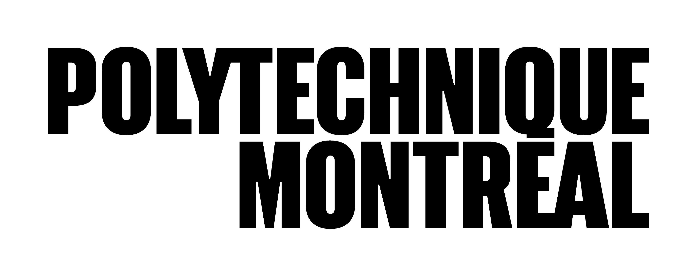
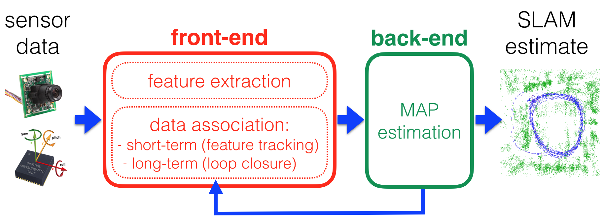
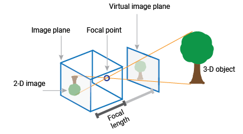
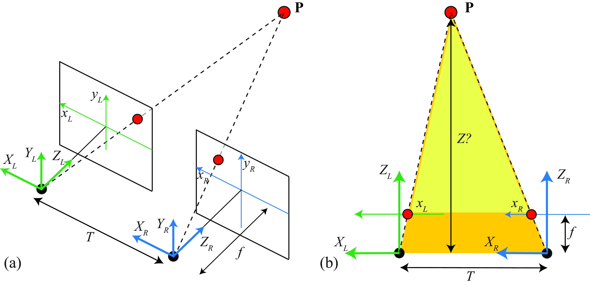
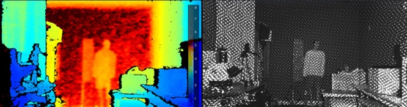
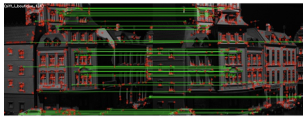

# SLAM

**INF8422: Robotic Perception and Spatial Intelligence**

Prof. Pierre-Yves Lajoie



<div class="cover-footer-bar mt-4">
  <span style="background:#CF1C24" />
  <span style="background:#F15A22" />
  <span style="background:#25B34B" />
  <span style="background:#00BDF2" />
</div>

---
hideInToc: true
---

# Agenda

<Toc />

---
layout: section
---

# Introduction to SLAM

---
hideInToc: true
---

# What is SLAM ?

**S**imultaneous **L**ocalization **A**nd **M**apping

<div class="grid grid-cols-2 gap-6 mt-3">
<div>

- **Simultaneous** : Both processes run at the same time.
- **Localization** : Estimate the robot's pose (position and orientation) within the environment.
- **Mapping** : Build a model (a map) of the environment.

<InfoBlock title="Fundamental objective">

Make a robot **autonomous** in an **unknown** environment, without needing any external infrastructure (GPS, beacons, etc.).

</InfoBlock>

</div>
<div>

The map and the trajectory are **estimated jointly** from the sensor data :

$$P(X, M \mid Z)$$

- $X = \{x_0, x_1, \ldots, x_k\}$ : Trajectory (poses).
- $M = \{l_1, \ldots, l_m\}$ : Map (landmarks).
- $Z$ : Sensor observations.

</div>
</div>

---
hideInToc: true
---

# The problem

<div class="grid grid-cols-2 gap-6 mt-4">
<div>

**If I know my exact position** → building the map is easy *(mapping with known poses)*.

**If I know the exact map** → localizing myself is easy *(localization on a known map)*.

<AlertBlock title="The SLAM dilemma">

We know **neither of the two** at the start.

Localization errors *corrupt* the map, and map errors *degrade* localization.

</AlertBlock>

</div>
<div>

**Why is it hard?**

1. **Sensor noise**: No measurement is perfect.
2. **Drift**: Uncertainty accumulates over time.
3. **Data association**: Is what I see a known place or a new one?
4. **Dynamic environments**: The world moves.
5. **Complexity**: The problem grows over time.

</div>
</div>

---
hideInToc: true
---

# 2D LiDAR SLAM

<SlamDilemmaAnimation class="mt-2" />

---
hideInToc: true
---

# SLAM Inputs and Outputs

<div class="grid grid-cols-2 gap-6 mt-4">
<div>

### Inputs — Sensor Data

**Proprioception** *(internal measurements)* :
- Wheel encoders
- Inertial Measurement Unit (IMU)

**Exteroception** *(measurements of the environment)* :
- Cameras (mono, stereo, RGB-D)
- LiDAR (3D, 2D)
- Radar, Sonar

</div>
<div>

### Outputs — Estimates

**Robot trajectory:**
$$X = \{x_0,\, x_1,\, \dots,\, x_k\} \in SE(3)^k$$

**Map of the environment:**
$$M = \{l_1,\, l_2,\, \dots,\, l_m\}$$

Points (sparse), voxels (dense), objects (semantic)…

<!-- <InfoBlock>

In SLAM, $X$ and $M$ are estimated **simultaneously** from the observations $Z = \{z_1, \dots, z_k\}$ alone

</InfoBlock> -->

</div>
</div>

---
hideInToc: true
disabled: true
---

# Probabilistic Formulation of SLAM

<div class="grid grid-cols-2 gap-6 mt-4">
<div>

SLAM is fundamentally a problem of **Bayesian estimation**:

$$\boxed{P(X, M \mid Z)}$$

Estimate the joint density over the trajectory $X$ and the map $M$, given:
- $Z = \{z_1,\dots,z_k\}$: the **observations** (features, LiDAR points…)

</div>
<div>

**Factorization of the joint (Bayes' rule + Markov):**

$$P(X,M|Z) \propto P(x_0) \prod_t P(x_t|x_{t-1}) \prod_{(i,j)} P(z_{ij}|x_i,l_j)$$

| Term | Meaning |
|---|---|
| $P(x_0)$ | Prior on the initial pose |
| $P(x_t\|x_{t-1})$ | Motion model |
| $P(z_{ij}\|x_i,l_j)$ | Observation model |

Taking the **maximum** of this joint → MAP → nonlinear least squares on a factor graph.

</div>
</div>

---
layout: two-cols-header
hideInToc: true
---

# Blind navigation vs SLAM

::left::

**Dead Reckoning (no map)**

- Integration of motion measurements (IMU, wheels).
- Errors accumulate over time.

<AlertBlock>

Without any external correction, the robot eventually no longer knows where it is.

</AlertBlock>

::right::

**SLAM (with loop closures)**

- Uses landmarks from the environment to correct the estimate.
- Every time a **known place is recognized**, the accumulated error is **bounded**.
- The trajectory and the map are **corrected globally**.

<ExampleBlock title="Example: the robot vacuum">

As it moves through a room, it recognizes that it is passing near the charger again and re-registers its position.

</ExampleBlock>

---
hideInToc: true
---

# Loop Closure

<div class="grid grid-cols-2 gap-6 mt-3">
<div>

A **loop closure** occurs when the robot recognizes a place it has **already visited**.

This is the crucial moment when we can:
- **Bound** the accumulated error.
- **Correct** the entire past trajectory.
- **Merge** two parts of the map.

<InfoBlock title="Without loop closure">

The world looks like an "infinite corridor": the robot never realizes that it has returned to a known point.

</InfoBlock>

</div>
<div>


<p class="text-xs text-center text-gray-500 mt-1">Without vs with loop closure</p>

</div>
</div>

---
hideInToc: true
---

# Loop Closure — Interactive Visualization

<LoopClosureAnimation class="mt-1" />

---
layout: two-cols-header
hideInToc: true
---

# Architecture: Front-end / Back-end

The standard breakdown of every modern SLAM system.



::left::

### Front-end

Turns raw sensor data into **geometric constraints**:

- Feature extraction.
- Data association (tracking, loop detection).
- Local motion estimation.


::right::

### Back-end

Takes the constraints from the Front-end and solves the **global problem**:

- Maximum A Posteriori (MAP).
- Factor graph optimization.
- Global correction of the trajectory and map.


---
hideInToc: true
disabled: true
---

# Back-end: Factor Graphs

<div class="grid grid-cols-2 gap-6 mt-2">
<div>

The Back-end represents the SLAM problem as a **factor graph**:

- **Nodes (variables)**: Robot poses $x_i$, landmark positions $l_j$.
- **Factors (constraints)**: Probabilistic measurements: odometry, visual observations, loop closures.

The Back-end minimizes the global error:
$$\min_{X, M} \sum_{i,j} \| z_{ij} - h(x_i, l_j) \|^2_{\Sigma_{ij}}$$

</div>
<div>

<InfoBlock title="Popular libraries">

- **GTSAM**: Georgia Tech Smoothing and Mapping.
- **g2o**: Graph Optimization, used in ORB-SLAM.
- **Ceres**: Google's optimization library.

</InfoBlock>

<!-- <ExampleBlock title="Key to efficiency">

The Jacobian matrix is **sparse**: each measurement connects only a few nodes. Thousands of variables can be solved in real time.

</ExampleBlock> -->

</div>
</div>

---
hideInToc: true
disabled: true
---

# A Front-end Challenge: Perceptual Aliasing

<div class="grid grid-cols-2 gap-6 mt-4">
<div>

**Perceptual aliasing:** two *different* places look *identical* to the sensors.

Examples: corridors, parking lots, uniform forests, white walls.

**Consequences:**
- The front-end produces a **false positive** loop closure
- The back-end receives a constraint between two poses that should NOT be linked
- The map **collapses** or deforms irreversibly → **catastrophic failure**

</div>

<div>
<AlertBlock>

The front-end must be **conservative**: it is better to miss a true loop closure than to inject a false one into the back-end.

</AlertBlock>

**Other common solutions:**

- Geometric verification. E.g. RANSAC on candidate poses
- Robust optimization (costly). E.g. PCM, GNC.

</div>
</div>

---
hideInToc: true
---

# Sensor Modalities for SLAM

<div class="grid grid-cols-1 gap-6 mt-3">
<div>

| Sensor | Strengths | Limitations |
|---|---|---|
| **Monocular camera** | Lightweight, cheap, texture-rich | No absolute scale, sensitive to lighting |
| **Stereo / RGB-D** | Direct depth, metric scale | Limited range (RGB-D < 5m) |
| **3D LiDAR** | Very accurate, works in darkness | High cost, sparse |
| **IMU** | High-frequency 6-DOF (100-1000 Hz) | Drift, bias |

</div>
</div>

---
hideInToc: true
---
# Sensor Modalities for SLAM
<div class="grid grid-cols-1 gap-6 mt-3">
<div>

| Fusion | Main advantage |
|---|---|
| **Visual SLAM** | Textural richness, compact |
| **LiDAR SLAM** | Absolute geometric precision |
| **VIO** (Visual-Inertial) | Robustness to blur, fast motion |
| **LIO** (LiDAR-Inertial) | Precision + corrected distortion |
| **Radar SLAM** | Fog, rain, night |

<InfoBlock title="Robustness">

The most robust systems combine **several modalities**: VIO + LiDAR for autonomous driving, camera + radar for extreme conditions.

</InfoBlock>

</div>
</div>

---
hideInToc: true
---

# Map Representations

<div class="grid grid-cols-2 gap-6 mt-3">
<div>

### Sparse
**Keypoints / landmarks** — sufficient for localization, lightweight.

*Example: ORB-SLAM3*

### Dense
**Full 3D reconstruction** (mesh, voxels, TSDF) — required for navigation, manipulation, visualization.

*Examples: KinectFusion, ElasticFusion*

</div>
<div>

### Semantic
**Labeled objects** (chair, door, wall) — scene understanding, stable landmarks for long-term localization.

*Examples: SemanticFusion, Kimera*

### Topological
**Place graph** (node A connected to node B) — high-level navigation, compact.


</div>
</div>

<AlertBlock>

The choice of representation depends on the **task**: localization → sparse; planning → dense; interaction → semantic.

</AlertBlock>
---
hideInToc: true
---

# This course: the Visual and Inertial Front-end

<div class="mt-4">

<InfoBlock title="">

| Section | Content | Role in the system |
|---|---|---|
| **2 — Cameras** | Pinhole model, calibration, stereo, RGB-D | Sensory input of the Front-end |
| **3 — Visual Odometry** | Features, geometry, local BA | Local motion estimation |
| **4 — IMU** | Accelerometer, gyroscope, integration | High-frequency proprioceptive sensor |
| **5 — VIO** | IMU factor, fusion, observability | Bridge Front-end → Back-end |

</InfoBlock>

</div>


---
layout: section
---

# Cameras

---
hideInToc: true
---

# Pinhole Model: Perspective Projection

The pinhole model describes how a 3D point projects onto the image plane.

<div class="grid grid-cols-2 gap-6 mt-2">
<div>

**Principle:**
The image forms at a focal distance $F$ (in mm) from the focal point.

**Projection:**
Let $p^c = [p_x^c,\, p_y^c,\, p_z^c]^T$ be a point expressed in the camera frame ($c$). Its physical coordinates on the sensor are:

$$x = F \frac{p_x^c}{p_z^c}, \quad y = F \frac{p_y^c}{p_z^c}$$

<small>Note: $x$ and $y$ are physical distances (mm), not yet pixels.</small>


</div>
<div>


<p class="text-xs text-center text-gray-500 mt-1">Geometric projection (Source: MathWorks)</p>

</div>
</div>

<InfoBlock title="">

This is the **perspective projection**: distant objects appear small. Depth information is **lost** in the projection.

</InfoBlock>
---
hideInToc: true
---

# Pinhole Model — Interactive Projection

<PinholeAnimation class="mt-1" />

---
hideInToc: true
zoom: 0.9
---

# Intrinsic Parameters: Camera → Pixels $(u, v)$

Converting physical coordinates (mm) to pixels $(u, v)$.

<InfoBlock>

The focal length $F$ (mm) is converted to pixels via the pixel size $(p_u, p_v)$:
$$f_u = \frac{F}{p_u}, \quad f_v = \frac{F}{p_v}$$

</InfoBlock>

**Intrinsic Matrix $K$:**
$$\begin{bmatrix} u \\ v \\ 1 \end{bmatrix} =
\underbrace{\begin{bmatrix} f_u & 0 & c_u \\ 0 & f_v & c_v \\ 0 & 0 & 1 \end{bmatrix}}_{K}
\begin{bmatrix} p_x^c / p_z^c \\ p_y^c / p_z^c \\ 1 \end{bmatrix}$$

- $(f_u, f_v)$: Focal lengths in pixels.
- $(c_u, c_v)$: Principal point, optical center of the image in pixels.

---
layout: two-cols-header
hideInToc: true
zoom: 0.9
---

# Extrinsic Parameters: World → Camera

Mapping from the world frame ($w$) to the camera frame ($c$).

::left::

Rigid transformation composed of a rotation $R_w^c$ and a translation $t_w^c$ :

$$\begin{bmatrix} p^c \\ 1 \end{bmatrix} =
\underbrace{\begin{bmatrix} R_w^c & t_w^c \\ 0 & 1 \end{bmatrix}}_{T_w^c}
\begin{bmatrix} p^w \\ 1 \end{bmatrix}$$

- $R_w^c$ ($3 \times 3$), $t_w^c$ ($3 \times 1$) : rotation and translation **world → camera**.
- The **pose of the camera in the world** is the inverse (course 1) : $T_c^w = (T_w^c)^{-1}$, i.e. $R_c^w = (R_w^c)^T$ and $t_c^w = -(R_w^c)^T\, t_w^c$.
- **In SLAM** : it is this pose $T_c^w$ (or its inverse $T_w^c$) that is the **unknown to be estimated**.

::right::


<p class="text-xs text-center text-gray-500 mt-1">World Frame vs Camera Frame</p>

---
hideInToc: true
zoom: 0.85
---

# Observation function $h(\cdot)$

In visual SLAM, the **observation function** relates a 3D point in the world to a pixel in the image:

<div class="grid grid-cols-2 gap-6 mt-3">
<div>

**Step 1 of $h(\cdot)$ — Extrinsics** (World → Camera):
$$p^c = R_w^c \, p^w + t_w^c$$

**Step 2 of $h(\cdot)$ — Intrinsics** (Camera → Pixels):
$$\begin{bmatrix} u \\ v \end{bmatrix} = \underbrace{\begin{bmatrix} f_u & 0 & c_u \\ 0 & f_v & c_v \\ 0 & 0 & 1 \end{bmatrix}}_{K} \begin{bmatrix} p_x^c / p_z^c \\ p_y^c / p_z^c \\ 1 \end{bmatrix} = \begin{bmatrix} f_u \frac{p_x^c}{p_z^c} + c_u \\ f_v \frac{p_y^c}{p_z^c} + c_v \end{bmatrix}$$

</div>
<div>

We can therefore model an observation:
$$\bar{z} = h(T^w_c, p^w) + \epsilon, \quad \epsilon \sim \mathcal{N}(0, \Sigma)$$

- $T^w_c$: Camera pose (extrinsic parameter).
- $p$: 3D position of the landmark.
- $\bar{z} = (u, v)$: Observation in pixels.
- $\epsilon$: noise.


</div>
</div>

<InfoBlock title="Reprojection Error">

The reprojection error for a point is $\| \bar{z} - h(T^w_c, p^w) \|^2$.
The Back-End (next course) will then find the $T^w_{c_i}$ and $p_i^w$ that minimize the sum of reprojection errors for all points:
$$\text{min } \sum_{i=1}^{N} \| \bar{z_i} - h(T^w_{c_i}, p_i^w) \|^2$$
</InfoBlock>
---
layout: two-cols-header
hideInToc: true
---

# Physical reality: Distortions

Real lenses have optical imperfections, **they must be corrected before any estimation**.

::left::

**1. Radial Distortion**
- Caused by the curvature of the lens.
- Rays are deviated more strongly **far from the center**.
- **Consequence**: Straight lines appear **curved**.
- **Effects**: "Barrel" (GoPro, fisheye) or "Pincushion".

**2. Tangential Distortion**
- Caused by an assembly defect.
- The lens is not perfectly parallel to the sensor.


::right::

<small>These defects are constant → corrected by calibration. The calibration parameters are found by observing a checkerboard of known size. The image is then corrected using, for example, OpenCV `cv2.undistort`.</small>

<p class="text-xs text-center text-gray-500 mt-1 italic">Radial barrel distortion (left) and pincushion (right)</p>


<p class="text-xs text-center text-gray-500 mt-1 italic">Calibration with a known pattern. The distances observed in the image are compared with the real distances between the corners of the checkerboard.</p>

---
layout: two-cols-header
hideInToc: true
zoom: 0.9
---

# Stereo Vision — Disparity

How do we recover the depth $Z$ from **two images**?

::left::

**Standard configuration:**
- Two identical cameras, **parallel** optical axes.
- Separated by a distance $b$ (**baseline**).
- Focal length $f$ (in pixels).

**Disparity $d$:**
Difference in horizontal position of the same point $P$ in the two images:

$$d = u_L - u_R$$

A **nearby** object moves a lot between the two images → large disparity.

A **distant** object moves little → small disparity.

::right::


<p class="text-xs text-center text-gray-500 mt-1">Standard stereo geometry (Source: MIT Vision Book)</p>

---
layout: two-cols-header
hideInToc: true
---

# Stereo Vision — Depth

::left::

**Depth relation $Z$:**
By similar triangles (Thales' theorem):

$$\frac{b}{Z} = \frac{d}{f} \implies \boxed{Z = \frac{f \cdot b}{d}}$$

<AlertBlock title="Key intuition">

Depth is **inversely proportional** to disparity.

- Large $d$ → nearby object.
- Small $d$ → distant object (and more uncertain).

To see far with precision, you need a **large baseline** $b$ (called T in the figure).

</AlertBlock>

::right::


<p class="text-xs text-center text-gray-500 mt-1">Standard stereo geometry (Source: MIT Vision Book)</p>

---
hideInToc: true
---

# Stereo Vision — Interactive Visualization

<StereoAnimation class="mt-1" />

---
hideInToc: true
---

# RGB-D Sensors — Active Depth

Alternatives to passive stereoscopy for measuring $Z$ directly.

<div class="grid grid-cols-2 gap-5 mt-2">
<div>

**1. Active IR Stereo** *(e.g. Intel RealSense D435)*

<div class="ml-2 mt-1 text-sm space-y-1">

**① IR projector** — projects a pattern of dots, invisible to the naked eye, onto the scene.

**② Two IR cameras** — see the pattern simultaneously; like two eyes, they perceive each dot slightly shifted.

**③ Depth computation** — the processor measures the *shift* of each dot between the two images → $Z = f \cdot b / d$.

- **Limitation** : IR saturated in bright sunlight.
</div>

<!-- **2. Structured light** *(e.g. Kinect v1)*
- A single camera measures the **deformation** of the projected pattern. -->

**3. Time-of-Flight (ToF)** *(e.g. Kinect v2)*
- Measures the phase shift of a modulated light → direct depth.

</div>
<div>


<p class="text-xs text-center text-gray-500 mt-1">Intel RealSense D435 — active IR stereo (Source: Intel)</p>

<InfoBlock title="Advantage for SLAM">

- Direct depth → no scale ambiguity in monocular.
- Eases point association, does not require features.
- Widely used indoors (domestic robot, building scan).

</InfoBlock>

</div>
</div>

---
layout: section
---

# Visual Odometry

---
hideInToc: true
zoom: 0.9
disabled: true
---

# SfM vs V-SLAM vs Visual Odometry

<div class="grid grid-cols-3 gap-4 mt-3">
<div>

**Structure from Motion (SfM)**

- **Offline**: all images available at once.
- **Unordered**: order does not matter.
- **Slow**: can take hours (city-scale reconstructions).

*E.g.: COLMAP, Metashape*

</div>
<div>

**Visual Odometry (VO)**

- **Online**: sequential images $t_1, t_2, \ldots$
- **Local**: incremental estimation of $T_{k-1,k}$.
- **No global map**: points out of view are forgotten.
- **No loop closure**: unbounded drift.

</div>
<div>

**Visual SLAM**

- **Online + global**: persistent map.
- **Loop closure**: drift correction.
- **V-SLAM = VO + Global Map + Loop Closure**

*E.g.: ORB-SLAM3, PTAM*

</div>
</div>

<InfoBlock title="In this course">

We start from VO (the basic building block) to understand how the Front-end generates the constraints that the Back-end will optimize globally.

</InfoBlock>

---
hideInToc: true
---

# Feature-Based Pipeline — Overview

<div class="mt-4">

The classical method, still dominant in practice (ORB-SLAM, VINS-Mono):

</div>

<div class="grid grid-cols-4 gap-3 mt-4">
<div class="example-block text-center">

**① Detection**

Find *interest points* (corners, blobs) in the image $I_k$.

</div>
<div class="info-block text-center">

**② Description**

Compute a robust descriptor vector around each point.

</div>
<div class="info-block text-center">

**③ Matching**

Find the correspondences between $I_{k-1}$ and $I_k$. Filter with RANSAC.

</div>
<div class="example-block text-center">

**④ Estimation**

Compute $T_{k-1,k}$ via a coplanarity constraint (2D-2D) or PnP (3D-2D).

</div>
</div>

<div class="mt-4">

<AlertBlock title="Similar to ICP">

We associate the pixels of the two images (steps 1 to 3).

Then we compute the rotation and translation between the two images.

</AlertBlock>

</div>

---
layout: two-cols-header
hideInToc: true
---

# Feature Detectors — Detecting Interest Points
<div></div>

We want points that are **repeatable** and **stable** under rotation, scale change and illumination change.

::left::

**FAST** *(Features from Accelerated Segment Test)*
- Binary test on a circle of 16 pixels.
- Detects corners in images.
- **Very fast** for real time.

**Other detectors:**
- **Harris**: corner response, slower.
- **SIFT** / **SURF**: scale invariant, expensive.
- **ORB** = FAST + orientation → **fast and invariant**.

::right::


<p class="text-xs text-center text-gray-500 mt-1">Keypoints detected on an image</p>

---
layout: default
hideInToc: true
zoom: 0.9
---

# Finding the Correspondences

<div class="grid gap-6 mt-3" style="grid-template-columns: 2fr 1fr;">
<div>

**How do we know that point $A$ in $I_1$ is point $B$ in $I_2$ ?**

**BRIEF / ORB Descriptor :**
- **Binary** vector (128–256 bits) built from pairwise intensity comparisons around the keypoint.
- Matching via **Hamming distance** (bitwise XOR) → very fast.
- **Major drawback**: since the descriptors are imperfect, they produce many bad correspondences.

**Filtering out bad correspondences — RANSAC :**

1.Pick **N points** at random.

2.Compute the model. 3. Count the **inliers**.

4.Repeat → keep the **best model**.

</div>
<div>



<p class="text-xs text-center text-gray-500 mt-1">Raw matches (top) and after RANSAC (bottom)</p>

</div>
</div>

---
hideInToc: true
---

# Matching & RANSAC — Interactive Visualization

<RansacAnimation class="mt-2" />

---
layout: default
hideInToc: true
---

# Finding the transformation between two images: Coplanarity Constraint

<div></div>

Used for **initialization** (no 3D map yet) — input: 2D-2D correspondences.

<div class="grid gap-5 mt-2" style="grid-template-columns: 55% 45%;">
<div>

**The same 3D point, seen twice** *(normalized coordinates $x = K^{-1}\tilde m$)* :

$$\lambda_1\,x_1 = t_2^1 + \lambda_2\,R_2^1\,x_2$$

The depths $\lambda_1, \lambda_2$ are **unknown**, but $x_1$, $t_2^1$ and $R_2^1 x_2$ lie in a **single plane**: their scalar triple product is zero.

$$x_1^T\,(t_2^1 \times R_2^1 x_2) = 0 \quad\Longleftrightarrow\quad \boxed{\,x_1^T\,E\,x_2 = 0\,}$$

**Essential matrix** $E = [t_2^1]_\times\,R_2^1$ : each correspondence gives **one** equation. Several correspondences → $E$ → $R$ and the **direction** of $t$.

**Limitation:** $\|t\| = 1$ → **unknown scale** in the monocular case.
<div style="font-size: 0.75em;">

*Note: libraries often write the transposed constraint, $x_2^T E x_1 = 0$ (camera 2 as the working frame). Same geometry, different convention — pick one and stick to it.*
</div>
</div>
<div>

**The procedure:**

$$\text{correspondences }(x_1, x_2) \;\longrightarrow\; E \;\longrightarrow\; R,\ t$$

<div style="font-size: 0.8em;">

Each correspondence contributes **one** constraint on the relative pose. With several correspondences we estimate $E$, then **decompose** it to recover $R$ and the **direction** of $t$.

</div>

```python
# OpenCV — Essential Matrix + pose
E, mask = cv2.findEssentialMat(
    pts1, pts2, K, method=cv2.RANSAC)
_, R, t, _ = cv2.recoverPose(E, pts1, pts2, K)
# t is unit-norm: no absolute scale
```

</div>
</div>

---
hideInToc: true
---

# Coplanarity Constraint — Interactive Visualization

<CoplanarityAnimation class="mt-2" />

---
hideInToc: true
zoom: 0.9
disabled: true
---

# Coplanarity Constraint — Intuition

<div class="grid gap-6 mt-2" style="grid-template-columns: 1fr 1fr;">
<div style="font-size: 0.75em;">

**Animation legend:**
- **C₁, C₂**: optical centers of the two cameras
- **P**: 3D point observed by both
- **x₁**: ray from C₁ to P *(normalized direction)*
- **R x₂**: ray from C₂ to P, brought into the frame of C₁
- **t**: baseline C₁→C₂
- **shaded plane**: the three vectors live in it — that is the whole constraint
- **n = t × Rx₂**: normal to this plane


<InfoBlock title="">

`cv2.findEssentialMat(..., method=cv2.RANSAC)` + `cv2.recoverPose()` → **R, t**

</InfoBlock>

</div>
<div>
<div style="font-size: 0.75em;">

**Where does the constraint $x_1^\top E\, x_2 = 0$ come from?**

C₁, P, C₂ define **a plane**: the two rays and the baseline all lie in it.

$$\underbrace{x_1^\top}_{\text{in Image 1}} \underbrace{[\mathbf{t}]_\times R}_{\displaystyle E} \underbrace{x_2}_{\text{in Image 2}} = 0$$

- $R\,x_2$: brings $x_2$ into the frame of C₁.
- $[\mathbf{t}]_\times (R\,x_2)$: cross product with the baseline → vector **normal** to this plane.
- $x_1^\top \cdot \mathbf{n} = 0$: $x_1$ lies in the plane ↔ dot product is zero.

</div>
</div>
</div>

<div style="font-size: 0.75em;">

**Why several points?**

Each pair gives only **one scalar equation**: several are needed (5 at minimum) to estimate $E$, which is then decomposed into $R$ and the direction of $\mathbf{t}$.

In practice with RANSAC: draw a minimal sample, solve for $E$, count the inliers, bad matches are rejected.


</div>
---
hideInToc: true
zoom: 0.85
---

# 3D-2D: Perspective-n-Point (PnP)


<div></div>

Used for **tracking** (3D map available) — input: 3D points from the map + detected 2D pixels.

<div class="grid gap-5 mt-2" style="grid-template-columns: 55% 45%;">
<div>

**Where do the 3D points come from?** Triangulated during initialization (2D-2D) and added to the map.

For each correspondence, in normalized coordinates $x_i = K^{-1}\tilde m_i$:

$$\boxed{\,\lambda_i\,x_i = R_w^c\,p_i^w + t_w^c\,}$$

The landmark brought into the camera frame must fall **on the ray** of its observation; its depth $\lambda_i$ remains unknown.

- In practice: **solvePnPRansac** → robust to false positives.

<InfoBlock title="">

If the 3D points are in meters (e.g. via stereo) → pose with **metric scale**. If the 3D points are normalized (monocular) → pose without scale (*up-to-scale*).

</InfoBlock>

</div>
<div>

```python
# OpenCV — robust PnP with RANSAC
ret, rvec, tvec, inliers = cv2.solvePnPRansac(
    pts3d,        # (N,3) float32 — map
    pts2d,        # (N,2) float32 — pixels
    K, dist_coeffs)

# Convert rotation vector → matrix
R, _ = cv2.Rodrigues(rvec)
# T = [R | t]
```

<div style="font-size: 0.8em;">

|  | **2D-2D** | **PnP (3D-2D)** |
|---|---|---|
| Input | 2D ↔ 2D | 3D ↔ 2D |
| Equation | $x_1^T E x_2 = 0$ | $\lambda_i x_i = R_w^c\,p_i^w + t_w^c$ |
| Output | **relative** pose | pose **in the map** |
| Scale | unknown | that of the map |
| Use | initialization | tracking |

</div>

</div>
</div>

---
hideInToc: true
---

# PnP — Minimize the difference between the estimated camera pose and the observations.

<PnPAnimation class="mt-2" />

---
hideInToc: true
---

# PnP — Geometric Constraint

<div class="grid gap-6 mt-2" style="grid-template-columns: 1fr 1fr;">
<div style="font-size: 0.75em;">

**Animation legend:**

| Symbol | Meaning |
|---------|--------------|
| **$p_i^w$** | 3D map landmark — **known** |
| blue ray | observation direction $x_i = K^{-1}\tilde m_i$, from the pixel |
| red segment (3D) | gap between the landmark and its ray: what the pose must cancel |
| **●** green | observation $m_i$ in the image |
| **○** red | reprojection $\pi(K(R_w^c\,p_i^w + t_w^c))$ |
| red segment (image) | residual $e_i$ |


</div>
<div>
<div style="font-size: 0.75em;">

**Objective — minimize the reprojection error:**

$$\underset{R_w^c,\,t_w^c}{\min}\ \sum_{i=1}^{N} \left\| m_i - \pi\!\left(K(R_w^c\,p_i^w + t_w^c)\right) \right\|^2$$

where $\pi(X,Y,Z) = (X/Z,\; Y/Z)$ is the perspective projection, without the depth $\lambda_i$.

Each correspondence $(p_i^w, m_i)$ gives **2 equations** (u, v). The pose has **6 DOF** → at least 3 pairs are needed.

<InfoBlock title="">

```python
ret, rvec, tvec, inliers = cv2.solvePnPRansac(
    pts3d, pts2d, K, dist)
R, _ = cv2.Rodrigues(rvec)
```

</InfoBlock>

</div>
</div>
</div>

---
hideInToc: true
zoom: 0.9
---

# Direct Methods — Alternative to Features

Instead of extracting descriptors, we directly align **pixel intensities** between images.

- No keypoint extraction → exploits all the texture, even weak texture.
- Sub-pixel precision, but sensitive to illumination changes.
- Requires **image pyramids** (coarse-to-fine) for convergence.
- Produce **semi-dense** maps (all pixels with strong gradient).

<ExampleBlock title="Notable direct systems">

- **DSO** (Direct Sparse Odometry) — sparse direct, state of the art in speed/accuracy
- **LSD-SLAM** (Large-Scale Direct) — semi-dense, loop closure
- **SVO** (Semi-Direct VO) — hybrid: features for tracking, photometric for depth

</ExampleBlock>

<InfoBlock title="Key takeaway">

Direct methods do not replace features in every case: they excel indoors with texture, but struggle under varying lighting or outdoors.

</InfoBlock>

---
hideInToc: true
zoom: 0.9
---

# Keyframe Selection

No need to process **every frame** — we select **keyframes**: the most informative frames.

<div class="grid grid-cols-2 gap-6 mt-3">
<div>

**Why keyframes?**

- Consecutive frames are very similar → useless redundancy.
- BA is only run on keyframes → controlled cost.

**Selection criteria:**

1. **Parallax**: sufficient displacement since the last keyframe ($> \theta_{min}$).
2. **Tracking**: the number of tracked features drops below a threshold.
3. **Time**: a minimum interval between keyframes is respected.

</div>
<div>

<InfoBlock title="Typical rate">

At 30 fps, we select ~1 frame out of 5–10 as a keyframe.

</InfoBlock>

<AlertBlock title="Trade-off">

Too many keyframes → expensive, slow BA.
Too few → lack of constraints, drift.

</AlertBlock>

</div>
</div>


---
hideInToc: true
---

# VO: Pose Composition and Drift

<div class="grid grid-cols-2 gap-6 mt-3">
<div>

Visual odometry estimates the **relative motion** $\hat{T}_{k-1,k}$ between two consecutive frames, then **composes** the poses:

$$T_k = T_{k-1} \cdot \hat{T}_{k-1,k}$$

Each estimate $\hat{T}$ contains a small error $\epsilon_k$.
As they are composed, these errors **accumulate**, and the trajectory drifts away from reality.

<AlertBlock title="VO Drift">

The error grows with every new image. Without an external correction, the robot no longer knows where it is after a few hundred meters.

</AlertBlock>

</div>
<div>

<svg viewBox="0 0 260 180" class="w-full mt-2">
  <!-- Time axis -->
  <line x1="20" y1="160" x2="245" y2="160" stroke="#CBD5E1" stroke-width="1"/>
  <text x="248" y="163" font-size="2" fill="#94a3b8" font-family="sans-serif">k</text>
  <!-- True trajectory (straight) -->
  <polyline points="20,130 75,105 130,80 185,55 240,30"
    fill="none" stroke="#25B34B" stroke-width="2"/>
  <text x="188" y="27" font-size="2" fill="#25B34B" font-weight="700" font-family="sans-serif">Ground truth</text>
  <!-- VO trajectory (drift) -->
  <polyline points="20,130 78,112 138,96 198,88 242,85"
    fill="none" stroke="#CF1C24" stroke-width="2" stroke-dasharray="6,3"/>
  <text x="195" y="98" font-size="2" fill="#CF1C24" font-weight="700" font-family="sans-serif">VO (drift)</text>
  <!-- Error (brace) -->
  <line x1="240" y1="30" x2="240" y2="85" stroke="#F59E0B" stroke-width="1.5" stroke-dasharray="3,2"/>
  <text x="243" y="60" font-size="2" fill="#F59E0B" font-weight="700" font-family="sans-serif">ε</text>
  <!-- Poses -->
  <circle cx="20"  cy="130" r="4" fill="#475569"/>
  <circle cx="78"  cy="112" r="3" fill="#CF1C24" opacity="0.8"/>
  <circle cx="138" cy="96"  r="3" fill="#CF1C24" opacity="0.8"/>
  <circle cx="198" cy="88"  r="3" fill="#CF1C24" opacity="0.8"/>
  <circle cx="242" cy="85"  r="4" fill="#CF1C24"/>
  <text x="14" y="145" font-size="2" fill="#475569" font-family="sans-serif">T_0</text>
</svg>

</div>
</div>

---
hideInToc: true
---

# Drift and Local Bundle Adjustment

**The problem:** each estimate $\hat{T}_{k-1,k}$ has a small error → successive compositions → **drift**.

<div class="grid gap-5 mt-2" style="grid-template-columns: 55% 45%;">
<div>

**Local Bundle Adjustment**: jointly re-optimizes the **last K keyframes** and their visible landmarks:

$$\min_{T_j, P_i} \sum_{j \in \mathcal{W}} \sum_i \left\| z_{ij} - h(T_j, P_i) \right\|^2$$

- The window $\mathcal{W}$ slides with the camera ($K \sim 10$).
- Cost $O(K^2)$ because every pair must be compared.

<AlertBlock title="Cost vs accuracy">

The larger the window, the more accurate the correction, but the higher the cost. In practice K ≤ 10 for real time.

</AlertBlock>

</div>
<div>

| Approach | Accuracy | Compute cost |
|---|---|---|
| Plain VO (PnP only) | Low (drift ↑) | Very low |
| VO + local BA | Medium | Moderate |
| VO + global BA ($W=\infty$) | High | High |


</div>
</div>

---
hideInToc: true
---

# Bundle Adjustment (BA)

<div class="grid grid-cols-2 gap-6 mt-2">
<div>


**Bundle Adjustment (BA):**
Simultaneously optimizes the poses $T_j$ **and** the 3D points $P_i$:

$$\min_{T, P} \sum_{i,j} \left\| z_{ij} - h(T_j, P_i) \right\|^2_{\Sigma_{ij}}$$

<!--
**Pose Graph Optimization:**
Simplification. Optimizes only the poses $T_1, \ldots, T_n$ with relative constraints. Faster but less accurate. -->

</div>
<div>

<InfoBlock title="In practice">

**Local** BA (window of keyframes) runs in real time in the Front-end.

Pose graph optimization over the whole trajectory (**global** BA) runs in the Back-end after each loop closure, in the next course.

</InfoBlock>

</div>
</div>

---
hideInToc: true
---

# Bundle Adjustment — Interactive Visualization

<BaAnimation class="mt-1" />

---
hideInToc: true
---

# Limits of Visual SLAM — Why add the IMU ?

<div class="grid grid-cols-2 gap-6 mt-3">
<div>

<AlertBlock title="Limitations of V-SLAM alone">

1. **Motion blur** : at high speed, features become unusable.
2. **Scale ambiguity** : in the monocular case.
3. **Occlusion** : facing a white wall or in the dark, the system loses tracking.
4. **Roll & Pitch** : a camera alone cannot measure the absolute orientation with respect to gravity.

</AlertBlock>

</div>
<div>

**Solution: add a high-frequency proprioceptive sensor.**

The **IMU** (Inertial Measurement Unit) measures :
- Linear accelerations
- Angular velocities

It keeps working ($>200$ Hz) **in the dark, in fog, facing a white wall**.

<ExampleBlock title="Visual-Inertial Odometry (VIO)">

Fusing camera + IMU simultaneously resolves scale, roll/pitch and robustness to fast motion.

</ExampleBlock>

</div>
</div>

---
layout: section
---

# IMU and Inertial Navigation

---
hideInToc: true
---

# Inertial Measurement Units (IMU) — Accelerometer

MEMS (Micro-Electro-Mechanical Systems) sensors. They drift quickly.

<InfoBlock title="Accelerometer Model (a_m)">

Measures the **specific force** in the robot frame ($r$):

$$a_m^r = R_w^r \,(a^w - g^w) + b_a + n_a$$

- $a^w,\, g^w$: True acceleration and gravity (world frame $w$).
- $R_w^r = (R_r^w)^T$: World → robot rotation.
- $b_a,\, n_a$: Bias (slowly varying) and white Gaussian noise.

</InfoBlock>

<AlertBlock title="Key point">

The accelerometer measures the **specific force** $f = a - g$, **not** pure acceleration. At rest on a table, it measures $+g$ upward (normal reaction). In free fall, it measures **zero**.

</AlertBlock>

---
hideInToc: true
zoom: 0.9
---

# Inertial Measurement Units (IMU) — Gyroscope

<InfoBlock title="Gyroscope Model (omega_m)">

Measures the robot's angular velocity in its own frame:

$$\omega_m^r = \omega^r + b_g + n_g$$

- $\omega^r$ : True angular velocity (expressed in the robot frame $r$).
- $b_g,\, n_g$ : Gyroscope bias and Gaussian white noise.

</InfoBlock>

<div class="grid grid-cols-2 gap-6 mt-3">
<div>

**Used to integrate rotation:**
$$R_{k+1} = R_k \cdot \text{Exp}\!\left( (\omega_k - b_g)\,\Delta t \right)$$

The gyroscope provides a very precise **relative orientation** over short durations.

We will see the Exp map (matrix operation) in the next lecture.
</div>
<div>

<ExampleBlock title="Camera / Gyroscope Complementarity">

The camera provides an **absolute** orientation (relative to the scene) but at low frequency.

The gyroscope provides a **relative** orientation at very high frequency.


</ExampleBlock>

</div>
</div>

---
hideInToc: true
---

# IMU: Noise and Bias — Why Does It Drift?

<div class="grid grid-cols-2 gap-6 mt-2">
<div>

**1. White Noise ($n$):**
$$n \sim \mathcal{N}(0, \sigma^2)$$
During integration, the noise causes a *Random Walk* in position:
$$\sigma_p(t) \propto \sigma_n \sqrt{t}$$

**2. Bias ($b$):**
A systematic error that evolves slowly (bias Random Walk):
$$\dot{b}(t) = \eta_b(t), \quad \eta_b \sim \mathcal{N}(0, \sigma_b^2)$$

</div>
<div>

<AlertBlock title="Quadratic drift in position">

A constant bias of only $0.1$ m/s² on the accelerometer causes a position error:
$$x(t) = \frac{1}{2} b \cdot t^2$$

After **10 seconds** → an error of **5 meters**!

Estimating the biases $b_a, b_g$ is **critical** and is performed jointly with the pose in the Back-end.

</AlertBlock>

</div>
</div>

---
hideInToc: true
---

# IMU Drift — Interactive Visualization

<ImuDriftAnimation class="mt-1" />

---
hideInToc: true
---

# Discrete Kinematics

<div></div>

If we know the state $x_k = (R_k, v_k, p_k)$ and the measurements $(\omega_k, a_k)$, we predict $x_{k+1}$ :

<div class="grid grid-cols-2 gap-6 mt-3">
<div>

**Rotation:**
$$R_{k+1} = R_k \cdot \text{Exp}\!\left( (\omega_k - b_g)\,\Delta t \right)$$

**Linear velocity:**
$$v_{k+1} = v_k + \bigl( R_k\,(a_k - b_a) + g \bigr)\,\Delta t$$

**Position:**
$$p_{k+1} = p_k + v_k\,\Delta t + \frac{1}{2}\bigl( R_k\,(a_k - b_a) + g \bigr)\,\Delta t^2$$

</div>
<div>

<InfoBlock title="Key points">

- The IMU runs at **very high frequency** (200–1000 Hz).
- The camera runs at low frequency (10–30 Hz).
- Between two images, we integrate **tens to hundreds** of IMU measurements.

</InfoBlock>
<!--
<AlertBlock title="Problème pour l'optimisation">

Si on veut optimiser les biais ou les poses dans un graphe de facteurs, il faut **ré-intégrer** toutes les mesures à chaque itération. Très coûteux.

</AlertBlock> -->

</div>
</div>

---
layout: two-cols-header
disabled: true
hideInToc: true
---

# IMU Pre-integration — The key idea (Forster 2015/2017)

**Problem:** If the optimization changes the bias $b_i$ or the pose $x_i$, we must re-integrate hundreds of IMU measurements between each pair of keyframes $(i, j)$.

**Solution: Pre-integration** — separate what depends on the motion from what depends on the global state.

::left::

We define **relative terms** $\Delta R_{ij},\, \Delta v_{ij},\, \Delta p_{ij}$ computed in the frame of keyframe $i$ :

$$R_j = R_i \,\Delta R_{ij}$$
$$v_j = R_i \,\Delta v_{ij} + v_i + g\,\Delta t_{ij}$$
$$p_j = R_i \,\Delta p_{ij} + p_i + v_i\,\Delta t_{ij} + \tfrac{1}{2} g\,\Delta t_{ij}^2$$

::right::

**Pre-integrated rotation:**
$$\Delta R_{ij} = \prod_{k=i}^{j-1} \text{Exp}\!\left( (\omega_k - b_g)\,\Delta t \right)$$

These terms are computed **only once** as long as the bias does not change too much.

<InfoBlock title="Light bias correction">

If the optimization changes $b \leftarrow b + \delta b$, we correct via a linear approximation (Taylor) instead of recomputing everything :
$$\Delta R_{ij}(b + \delta b) \approx \Delta R_{ij}(b)\cdot\text{Exp}(J_R\,\delta b)$$

</InfoBlock>

---
hideInToc: true
disabled: true
---

# IMU Pre-integration — Interactive Visualization

<PreintAnimation class="mt-1" />

---
layout: section
---

# Visual-Inertial SLAM (VIO)

---
hideInToc: true
---

# IMU Observability

<VioObsAnimation class="mt-1" />

---
hideInToc: true
---

# VIO Advantages

<div class="grid grid-cols-3 gap-4 mt-3">
<div>

<InfoBlock title="Roll & Pitch Observable">

Gravity $g$ is an absolute reference measured by the accelerometer.

→ Roll and pitch are **observable**.


</InfoBlock>

</div>
<div>

<InfoBlock title="Metric Scale">

In the monocular case, the camera estimates $t$ in **relative units**.

The accelerometer measures in **m/s²** → it fixes the true metric scale.

→ The monocular scale ambiguity is **resolved**.

</InfoBlock>

</div>
<div>

<InfoBlock title="Robustness">

The IMU works:
- In the **dark**.
- Facing a **white wall**.
- During **fast motions** (motion blur).


</InfoBlock>

</div>
</div>

<ExampleBlock title="Popular VIO systems">

**ORB-SLAM3** (tightly coupled, multi-map) · **VINS-Mono** (preintegration) · **Kimera** (semantics + VIO)

</ExampleBlock>

---
hideInToc: true
disabled: true
---

# The IMU Factor in the Factor Graph

<div class="grid grid-cols-2 gap-6 mt-2">
<div>

An **IMU factor** connects two **NavState** nodes $(R_i, p_i, v_i, b_i)$ and $(R_j, p_j, v_j, b_j)$.

**Residuals (errors to minimize):**
$$r_{\Delta R} = \text{Log}\!\left( \Delta R_{ij}^T R_i^T R_j \right)$$
$$r_{\Delta v} = R_i^T (v_j - v_i - g\,\Delta t) - \Delta v_{ij}$$
$$r_{\Delta p} = R_i^T (p_j - p_i - v_i\,\Delta t - \tfrac{1}{2}g\,\Delta t^2) - \Delta p_{ij}$$

We minimize the Mahalanobis distance: $r^T \Sigma^{-1} r$.

</div>
<div>

<InfoBlock title="VIO graph structure">

```
NavState_i ──── [IMU Factor] ──── NavState_j
     │                                 │
 [Vision Factor]               [Vision Factor]
     │                                 │
Landmark_1 ─────────────────── Landmark_1
```

Visual (reprojection) factors and IMU factors coexist in the **same** graph → joint optimization.

</InfoBlock>

</div>
</div>

---
hideInToc: true
---

# Factor Graph — Intuition

Structure that **organizes the optimization** in the Back-end.

<div class="grid grid-cols-2 gap-4 mt-3">
<div>

A **factor graph** represents the estimation problem:

- **Nodes (variables)**: what we want to estimate poses $T_i$, velocities $v_i$, IMU biases $b_i$
- **Factors**: the constraints imposed by the measurements: odometry, reprojection, IMU
- **Optimization**: find the values of the variables that minimize the error of all constraints simultaneously


</div>
<div>

<!-- <div class="mt-2 p-3 bg-slate-50 rounded border border-slate-200 font-mono text-xs">

```
  Camera         IMU          Camera
     ↓             ↓              ↓
[Vision] ←── NavState_i ──[IMU]──→ NavState_j ──→
             (T, v, b)                (T, v, b)
                  │                       │
             [Landmark]              [Landmark]
```

</div> -->

Each factor adds a **constraint** (error to minimize).
The **Back-end** (GTSAM, g2o) solves the whole set simultaneously.

<AlertBlock title="Next lecture">

How do we solve this system efficiently? Least squares, sparsity, Lie groups.

</AlertBlock>

</div>
</div>

---
hideInToc: true
---

# VIO Factor Graph — Interactive Visualization

<ImuFactorAnimation class="mt-1" :showSparsity="false" />

---
layout: section
---

# History of SLAM

---
hideInToc: true
---

# The History of SLAM — The 3 Ages

<div class="grid grid-cols-3 gap-4 mt-4">
<div class="border rounded-lg p-3" style="border-color:#00BDF2">

### Classical Age
#### 1986 – 2004

- Probabilistic formulation (Smith, Self, Cheeseman 1986)
- Extended Kalman Filter (EKF-SLAM)
- Particle filters (FastSLAM)
- First indoor successes


</div>
<div class="border rounded-lg p-3" style="border-color:#F15A22">

### Algorithmic Age
#### 2004 – 2015

- Exploiting sparsity (graph-SLAM)
- iSAM, g2o, GTSAM
- Open-source standards (ORB-SLAM, LSD-SLAM)
- Study of observability and consistency
- Real-time visual SLAM becomes possible


</div>
<div class="border rounded-lg p-3" style="border-color:#25B34B">

### Robust Age
#### 2016 – today

- Robustness to challenging environments
- Semantic understanding
- Resource awareness (embedded vs cloud)
- Deep-learning-based SLAM
- Multi-modal fusion (VIO, LIO)


</div>
</div>

---
hideInToc: true
---

# Is SLAM "Solved"?

<div class="grid grid-cols-2 gap-6 mt-4">
<div>

### Mature for...

- Slow indoor robots (vacuum cleaners, warehouses)
- Moderately sized, static spaces
- Controlled lighting conditions

*ORB-SLAM3, LOAM, Cartographer work in production.*

</div>
<div>

### Still open for...

- **Large scale**: operation over several hours/days.
- **Dynamic**: crowds, traffic, moving objects
- **Extreme conditions**: night, fog, underwater, etc.
- **High angular velocity**: racing drones
- **Long-term changes**: seasons, construction sites, etc.


</div>
</div>

<AlertBlock>

The answer depends on the **triplet (robot, environment, required performance)**.

</AlertBlock>
---
hideInToc: true
---

# Summary — Complete SLAM Pipeline

<div class="mt-3">

```
Sensors ──► [1. Front-end] ─────────────────────────────────────────────────────►
                │                                                               │
                ├── Feature extraction / point clouds / IMU integration         │
                │                                                               │
                ├── [2. Odometry]  VO / LiDAR odometry / LIO                     │
                │       └──► Odometry constraints (short range)                 │
                │                                                               │
                └── [3. Loop detection]  BoW / Scan Context                     │
                        └──► Loop closure constraints                           │
                                                                               ▼
                                                               [4. Back-end]
                                                               Factor graph
                                                               GTSAM / g2o
                                                                    │
                                                                    ▼
                                                        [5. Mapping]
                                                  Point cloud / TSDF / semantics
```

</div>


---
hideInToc: true
disabled: true
---

# Semantic Mapping

<div class="grid grid-cols-2 gap-6 mt-3">
<div>

**Motivation:** the robot must perceive meaningful objects ("chair", "door", "floor"), not just obstacles.

**Typical pipeline:**

1. RGB image → CNN (**YOLO, Mask R-CNN**) → segmentation map
2. 3D projection (raycasting from the current pose)
3. **Bayesian fusion** in the voxels: each voxel maintains $P(\text{class})$

**Usefulness:** detected objects become **stable semantic landmarks** for long-term localization.

</div>
<div>

**Semantic SLAM:**

- Semantic constraints in the factor graph: $z_{ij} = $ "object of class $c$ seen from $x_i$"
- More robust loop closure: recognizing a couch is more reliable than matching FAST corners

**Open question:**

How can geometry **and** semantics be encoded efficiently at large scale, with real-time updates?

<AlertBlock>

→ Course 4: dense and learned representations (NeRF, 3D Gaussian Splatting) partially answer this question.

</AlertBlock>

</div>
</div>

---
hideInToc: true
zoom: 0.9
---

# Next lecture: Back-End and Probabilistic Inference

<div class="grid grid-cols-2 gap-6 mt-3">
<div>

### What SLAM produces

- Trajectory of poses $\{T_i\} \in SE(3)$
- **Sparse** point clouds (VO, LiDAR)
- IMU + Vision factors in a common graph

**But we have used terms without defining them rigorously:**

- *"Minimize the error"* — which error, in the probabilistic sense?
- *"Solve the graph"* — which algorithm?
- *"Bias estimated jointly"* — why does that work?

</div>
<div>

### Probabilistic Inference

| Concept | What we will see |
|---|---|
| **Bayesian / MAP** | Why minimizing = maximizing likelihood |
| **Least squares** | The link with Gaussian noise |
| **Factor graphs** | Rigorous formulation |
| **Sparsity** | Why it is scalable |
| **Lie groups** | Optimizing over SO(3)/SE(3) |

</div>
</div>

---
hideInToc: true
zoom: 0.9
---

# Summary

<div class="grid grid-cols-2 gap-6 mt-2">
<div>

**Front-end / Back-end architecture:**

| Section | Front-end | Contribution |
|---|---|---|
| Cameras | Sensory input | Pixels → geometry |
| VO | Local estimation | Incremental poses |
| IMU | Proprioception | High frequency, scale |
| VIO | Fusion | Robustness, observability |

The **Back-end** (g2o, GTSAM) receives all these constraints and solves the global optimization problem.

</div>
<div>

<InfoBlock title="Upcoming lectures">

- **Probabilistic Inference**: Bayes, MAP, factor graphs, non-linear optimization, Lie groups — the math behind VIO.
- **Map representations**: Occupancy grids, TSDF, etc.
- **Learned representations**: learned VO, Place Recognition, NeRF, Gaussian Splatting, etc.

</InfoBlock>

<AlertBlock title="Further reading">

- Forster et al. (2017), *"On-Manifold Preintegration for Real-Time VIO"*
- Campos et al. (2021), *"ORB-SLAM3"*

</AlertBlock>

</div>
</div>
