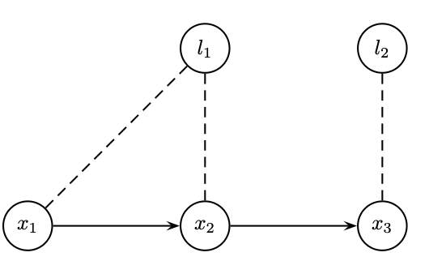
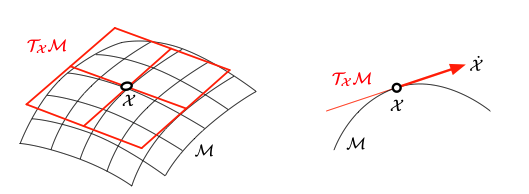

# Inférence Probabiliste et Estimation d'État

**INF8422 : Perception Robotique et Intelligence Spatiale**

Prof. Pierre-Yves Lajoie


<div class="cover-footer-bar mt-4">
  <span style="background:#CF1C24" />
  <span style="background:#F15A22" />
  <span style="background:#25B34B" />
  <span style="background:#00BDF2" />
</div>

---
hideInToc: true
---

# Agenda

<Toc />

---
hideInToc: true
---

# Ce cours

<div class="grid grid-cols-2 gap-6 mt-3">
<div>

Au dernier cours, vous avez vu le SLAM en action :

- **Feature extraction, RANSAC, PnP** → contraintes géométriques
- **Bundle Adjustment** → minimisation de l'erreur de reprojection
- **Graphe de facteurs VIO** → structure de l'optimisation

Des termes n'ont pas été bien définis :

> *"Minimiser l'erreur"* — pourquoi moindres carrés ? Quelle erreur au sens probabiliste ?
>
> *"Résoudre le graphe"* — comment ? Quel algorithme ?

</div>
<div>


<p class="text-xs text-center text-gray-500 mt-1">Le graphe de facteurs SLAM — ce que nous allons formaliser</p>

<AlertBlock title="Ce cours répond à ces questions">

**Probabilités → Bayes → MLE/MAP → Moindres Carrés → Graphes de Facteurs → Gauss-Newton → Lie Groups**

Les fondements du SLAM Back-end

</AlertBlock>

</div>
</div>

---
layout: section
---

# Robotique Probabiliste
---
hideInToc: true
---

# Le modèle de mesure


En robotique probabiliste, une mesure est une variable aléatoire.

$$z_t = h(x_t) + \epsilon_t$$

- $z_t$ : Le vecteur de mesure à l'instant $t$.
- $x_t$ : L'état du robot/monde (ex : position, carte).
- $h(\cdot)$ : La **fonction d'observation** (modèle physique du capteur).
- $\epsilon_t$ : Le bruit de mesure (souvent Gaussien $\epsilon_t \sim \mathcal{N}(0, \sigma^2)$).

<AlertBlock title="Perception">

Le but de la perception est d'inverser $h$ pour trouver $x$ sachant $z$.

</AlertBlock>

---
hideInToc: true
---

# L'Incertitude en Robotique

<div class="grid grid-cols-2 gap-6 mt-3">
<div>

Contrairement à une simulation parfaite, le monde réel est **incertain**.

**Sources d'incertitude :**

- **Capteurs** : Les mesures sont bruitées. $z \neq h(x)$, soit $\|z - h(x)\|^2 > 0$.
- **Actionneurs** : Les roues glissent, les moteurs ne sont pas parfaits. $u \neq \Delta x$.
- **Modèles** : Nos équations sont des simplifications de la physique réelle.
- **Environnement** : Des objets bougent, la luminosité change.


</div>
<div>


<p class="text-xs text-center text-gray-500 mt-1">Exemple SLAM : poses et landmarks inconnus</p>


<AlertBlock title="Conséquence fondamentale">

On ne peut jamais connaître l'état du robot avec une précision parfaite. Il faut **quantifier et propager** cette incertitude.

</AlertBlock>
</div>
</div>

---
hideInToc: true
---

# La Robotique Probabiliste

<div class="grid grid-cols-2 gap-6 mt-3">
<div>

> *"Probabilistic robotics is a new approach to robotics that pays tribute to the uncertainty inherent in robot perception and action."*
> — Sebastian Thrun, 2005

**Idée clé :**

Au lieu de dire *"Le robot est à la position $(x,y)$"*, on dit :

*"La position du robot suit une distribution de probabilité $\mathcal{N}(\mu, \Sigma)$"*

$$\Rightarrow \text{États} \longrightarrow \text{Distributions de probabilité}$$

</div>
<div>

<InfoBlock title="Ce que cela change">

- Un **état** est une **densité de probabilité** $p(x)$.
- Une **mesure** met à jour cette densité (règle de Bayes).
- Une **action** propage l'incertitude (propagation d'erreur).

</InfoBlock>

<ExampleBlock title="En SLAM">

On cherche à estimer la densité conditionnelle :

$$P(X, M \mid Z)$$

- $X$ : trajectoire du robot, $M$ : carte, $Z$ : mesures capteurs.

</ExampleBlock>

</div>
</div>

---
hideInToc: true
---

# Modélisation Probabiliste SLAM

<div class="grid grid-cols-2 gap-6 mt-2">
<div>

**Scénario :** Trajectoire à 3 poses $x_1, x_2, x_3$ et deux landmarks $l_1, l_2$.

**Densité jointe** (via réseau Bayésien) :

$$P(X, Z) = p(x_1)\,p(x_2|x_1)\,p(x_3|x_2)\,p(l_1)\,p(l_2)$$
$$\cdot\, p(z_1|x_1)\,p(z_2|x_1, l_1)\,p(z_3|x_2, l_1)\,p(z_4|x_3, l_2)$$

<InfoBlock title="Graphes de facteurs">

Mieux adaptés pour l'inférence $P(X|Z)$ que les réseaux Bayésiens. On remplace les densités conditionnelles par des **facteurs** :

$$P(X \mid Z) \propto \prod_i \phi_i(X_i)$$

</InfoBlock>

</div>
<div>


<p class="text-xs text-center text-gray-500 mt-1">Réseau Bayésien</p>


<p class="text-xs text-center text-gray-500 mt-1">Graphe de facteurs équivalent</p>

</div>
</div>

---
layout: section
---

# Rappels de Probabilités

---
hideInToc: true
---

# Variables Aléatoires

<div class="grid grid-cols-2 gap-6 mt-3">
<div>

### Cas discret — PMF

Une variable $X$ prend des valeurs dans $\{x_1, \ldots, x_n\}$.

$$P(X = x_i) = p_i, \quad \sum_{i=1}^n p_i = 1$$

<ExampleBlock title="Classification sémantique">

Une caméra voit un objet. Qu'est-ce que c'est ?

- $P(X = \text{Vélo}) = 0.1$
- $P(X = \text{Piéton}) = 0.8$
- $P(X = \text{Voiture}) = 0.1$

</ExampleBlock>

</div>
<div>

### Cas continu — PDF

La fonction de densité $p(x)$ satisfait :

$$\int_{-\infty}^{\infty} p(x)\, dx = 1$$

<AlertBlock title="Densité ≠ Probabilité">

- $P(X = x) = 0$.
- On calcule : $P(a \leq X \leq b) = \int_a^b p(x)\, dx$.

</AlertBlock>

<InfoBlock title="Indépendance">

Si $X$ et $Y$ sont indépendants :
$$p(x, y) = p(x) \cdot p(y)$$

</InfoBlock>

</div>
</div>

---
hideInToc: true
---

# Règles de Probabilités

<div class="grid grid-cols-2 gap-6 mt-3">
<div>

**Règle de la Somme (Marginalisation) :**

$$p(x) = \int p(x, y)\, dy$$

*Intuition : "écraser" la distribution 2D sur l'axe $x$.*

**Règle du Produit :**

$$p(x, y) = p(x \mid y)\, p(y) = p(y \mid x)\, p(x)$$

**Règle de la Chaîne (Chain Rule) :**

$$p(x_1, \ldots, x_n) = \prod_{i=1}^n p(x_i \mid x_1, \ldots, x_{i-1})$$

</div>
<div>

**Hypothèse de Markov :**

Si $x_{t+1}$ ne dépend que de $x_t$ (pas de l'historique) :

$$p(x_0, x_1, x_2) = p(x_0)\cdot p(x_1 \mid x_0)\cdot p(x_2 \mid x_1)$$

<InfoBlock title="Indépendance Conditionnelle">

$X$ et $Y$ sont indépendants sachant $Z$ :

$$p(x, y \mid z) = p(x \mid z)\,p(y \mid z)$$


</InfoBlock>

</div>
</div>

---
hideInToc: true
---

# Théorème de Bayes en Robotique

<div class="grid grid-cols-2 gap-6 mt-3">
<div>


$$\boxed{p(x \mid z) = \frac{p(z \mid x)\, p(x)}{p(z)}}$$

- $p(x)$ : **Prior** — croyance sur l'état avant la mesure.
- $p(z \mid x)$ : **Likelihood** — vraisemblance de la mesure sachant l'état.
- $p(x \mid z)$ : **Posterior** — croyance sur l'état sachant la mesure.
- $p(z)$ : **Evidence** — normalisation.

</div>
<div>

<ExampleBlock title="Capteur de porte">

État : porte Ouverte ($O$) ou Fermée ($F$). Prior : $P(O)=P(F)=0.5$.

Capteur bruité : $P(z_O \mid O) = 0.8$, $P(z_O \mid F) = 0.4$.

Si le capteur dit "Ouvert" :

$$P(z_O) = 0.8 \times 0.5 + 0.4 \times 0.5 = 0.6$$
$$P(O \mid z_O) = \frac{0.8 \times 0.5}{0.6} \approx \mathbf{0.67}$$

Même avec une mesure "Ouvert", il reste 33% de chances que la porte soit fermée !

</ExampleBlock>

</div>
</div>

---
layout: two-cols-header
hideInToc: true
---

# La Loi Normale (Gaussienne)

Le modèle de bruit standard en robotique — justifié par le **Théorème Central Limite**.

::left::

### Univariée

$$p(x) = \frac{1}{\sqrt{2\pi\sigma^2}} \exp\!\left(-\frac{(x-\mu)^2}{2\sigma^2}\right)$$

- $\mu$ : Moyenne (centre).
- $\sigma^2$ : Variance (incertitude).

**Règle 68–95–99.7 :**
- $\mu \pm 1\sigma$ → 68% de probabilité.
- $\mu \pm 2\sigma$ → 95%.
- $\mu \pm 3\sigma$ → 99.7%.

::right::

### Multivariée ($x \in \mathbb{R}^n$)

$$p(x) = \det(2\pi\Sigma)^{-\frac{1}{2}} \exp\!\left(-\frac{1}{2}(x-\mu)^T\Sigma^{-1}(x-\mu)\right)$$

- $\mu \in \mathbb{R}^n$ : Vecteur moyenne.
- $\Sigma \in \mathbb{R}^{n\times n}$ : Matrice de covariance.

<InfoBlock title="Distance de Mahalanobis">

$$D_M^2 = (x-\mu)^T\Sigma^{-1}(x-\mu)$$

Distance euclidienne pondérée par l'incertitude.

</InfoBlock>

---
hideInToc: true
---

# Propriétés des Gaussiennes

<div class="grid grid-cols-2 gap-6 mt-3">
<div>

### Propriété 1 — Transformation Linéaire

Soit $x \sim \mathcal{N}(\mu, \Sigma)$ et $y = Ax + b$.

$$\boxed{y \sim \mathcal{N}(A\mu + b,\; A\Sigma A^T)}$$

*Exemple : changement de repère caméra → monde. $A = R^W_{C}$.*

$$\Sigma^W = R^W_{C}\,\Sigma^C\,R^C_{W}$$

</div>
<div>

### Propriété 2 — Fusion (Produit)

Le produit de deux Gaussiennes est une Gaussienne :

$$\mathcal{N}(\mu_{new}, \Sigma_{new}) \propto \mathcal{N}(\mu_1, \Sigma_1)\cdot\mathcal{N}(\mu_2, \Sigma_2)$$

Les **matrices d'information** s'additionnent :

$$\boxed{\Sigma_{new}^{-1} = \Sigma_1^{-1} + \Sigma_2^{-1}}$$

<AlertBlock title="Intuition">

Plus on accumule de mesures, plus la covariance $\Sigma$ diminue. L'incertitude est déterminée par les données.

</AlertBlock>

</div>
</div>

---
layout: section
---

# Estimation d'État : MLE & MAP

---
hideInToc: true
zoom: 0.9
---

# Le Problème d'Estimation

<div class="grid grid-cols-2 gap-6 mt-3">
<div>

**Données :**
- $Z = \{z_1, \ldots, z_m\}$ : Mesures bruitées.
- $u = \{u_1, \ldots, u_k\}$ : Commandes de contrôle (optionnel).

**Inconnue :**
- $x$ : L'état réel du système (pose du robot, carte, calibration...).

**But :** Trouver la "meilleure" estimation $\hat{x}$ qui explique les données.


</div>
<div>

**Modèle de mesure :**

$$z_i = h_i(x) + \epsilon_i, \quad \epsilon_i \sim \mathcal{N}(0, \Sigma_i)$$

La vraisemblance d'une mesure gaussienne :

$$p(z_i \mid x) \propto \exp\!\left(-\frac{1}{2}\|h_i(x) - z_i\|^2_{\Sigma_i}\right)$$

**Indépendance conditionnelle :**

$$p(z_{1:m} \mid x) = \prod_{i=1}^m p(z_i \mid x)$$

</div>
</div>
<InfoBlock title="Deux approches">

- **MLE** (Maximum Likelihood Estimation). - **MAP** (Maximum A Posteriori) : incorpore un prior $p(x)$.

</InfoBlock>

---
hideInToc: true
---

# Mise à jour bayésienne : une mesure à la fois

<BayesUpdateAnimation class="mt-1" />

<!--
Modèle de cette démonstration : position scalaire fixe, z_k = x + epsilon_k,
bruits gaussiens indépendants conditionnellement à x. Aucun modèle de mouvement.
Observer : distinguer le prior initial p_0, le prior courant p_{k-1} et la vraisemblance.
Fusionner : le produit est normalisé ; la moyenne est pondérée par les précisions.
Retenir : intégrer exactement une observation. Le posterior devient le prior courant
uniquement au cycle suivant ; le prior initial et les axes restent fixes.
Changer z et sigma_z à l'étape Observer pour comparer un capteur précis et peu précis.
La lecture automatique suppose de nouvelles observations indépendantes de même valeur.
Rejouer la même donnée ne fournit pas une information indépendante.
-->

---
hideInToc: true
---

# MLE → Moindres Carrés

<div class="grid grid-cols-2 gap-6 mt-3">
<div>

**Maximum de Vraisemblance :**

$$\hat{x}_{MLE} = \arg\max_x\, p(z_{1:m} \mid x) = \arg\max_x \prod_i p(z_i \mid x)$$

**Astuce Log** (log est monotone croissant) :

$$= \arg\max_x \sum_i \ln p(z_i \mid x)$$

$$= \arg\max_x \sum_i \left(-\frac{1}{2}\|h_i(x) - z_i\|^2_{\Sigma_i}\right)$$

</div>
<div>

**Maximiser le négatif = Minimiser :**

$$\boxed{\hat{x}_{MLE} = \arg\min_x \sum_i \frac{1}{2}\|h_i(x) - z_i\|^2_{\Sigma_i}}$$

<AlertBlock title="Conclusion majeure">

Sous hypothèse de bruit Gaussien, **Maximum de Vraisemblance = Moindres Carrés Pondérés**.

$$\|e\|^2_\Sigma = e^T\Sigma^{-1}e$$

Capteur précis ($\sigma$ petit) → poids $1/\sigma^2$ **grand**.
Capteur imprécis ($\sigma$ grand) → poids **petit**.

</AlertBlock>

</div>
</div>

---
hideInToc: true
---

# MAP → Moindres Carrés avec Prior

**Maximum A Posteriori :**

$$\hat{x}_{MAP} = \arg\max_x\, p(x \mid Z) \propto p(Z \mid x)\,p(x)$$

Si le prior est Gaussien : $x \sim \mathcal{N}(x_0, \Sigma_0)$, le problème devient :

$$\boxed{\hat{x}_{MAP} = \arg\min_x \left[\sum_i\|h_i(x)-z_i\|^2_{\Sigma_i} + \|x - x_0\|^2_{\Sigma_0}\right]}$$

Le prior agit comme une **mesure additionnelle** qui tire $x$ vers $x_0$.

---
hideInToc: true
---

# Exemple 1D — Odométrie

<div></div>

Trajectoire de robot à 3 positions $x_0, x_1, x_2$. Mesures de déplacement : $d_1 = 2$ m, $d_2 = 1.5$ m ($\sigma_d = 0.5$).

Prior : $x_0 \approx 10$ m ($\sigma_0 = 0.1$).

$$E = \underbrace{\frac{(x_0-10)^2}{0.1^2}}_{\text{prior/ancrage}} + \underbrace{\frac{(x_1-x_0-2)^2}{0.5^2}}_{\text{Mouv. 1}} + \underbrace{\frac{(x_2-x_1-1.5)^2}{0.5^2}}_{\text{Mouv. 2}}$$

Solution : $\hat{x}_0 \approx 10$, $\hat{x}_1 \approx 12$, $\hat{x}_2 \approx 13.5$.

<AlertBlock title="Sans prior : système flottant">

Sans ancrage, si $(x_0, x_1, x_2)$ est une solution, $(x_0+c, x_1+c, x_2+c)$ l'est aussi. Le système est sous défini, il y a une infinité de solutions.

</AlertBlock>


---
hideInToc: true
disabled: true
---

# Exemple Numérique — de Bout en Bout

On reprend le SLAM 1D (prior $x_0\!\approx\!10$, odométries $d_1\!=\!2$, $d_2\!=\!1.5$, tous $\sigma=1$).

<div class="grid grid-cols-2 gap-6 mt-2">
<div>

**1. Résidus** $r = h(x) - z$ (linéaires) :

$$r_0 = x_0 - 10,\quad r_1 = (x_1-x_0) - 2,\quad r_2 = (x_2-x_1) - 1.5$$

**2. Empiler la Jacobienne $A$ et $b$** (1 ligne = 1 facteur) :

$$A = \begin{bmatrix} 1 & 0 & 0 \\ -1 & 1 & 0 \\ 0 & -1 & 1 \end{bmatrix},\quad
b = \begin{bmatrix} 10 \\ 2 \\ 1.5 \end{bmatrix}$$

Chaque ligne ne touche que **1 ou 2 variables** → $A$ **creuse**.

</div>
<div>

**3. Équations normales** $A^TA\,\hat{x} = A^Tb$ :

$$\underbrace{\begin{bmatrix} 2 & -1 & 0 \\ -1 & 2 & -1 \\ 0 & -1 & 1 \end{bmatrix}}_{\Lambda = A^TA\ \text{(tridiagonale !)}}\hat{x}
= \begin{bmatrix} 8 \\ 0.5 \\ 1.5 \end{bmatrix}$$

**4. Résolution (Cholesky)** :

$$\boxed{\hat{x} = (10,\; 12,\; 13.5)}$$

<InfoBlock title="À observer">

$\Lambda = A^TA$ est **symétrique, définie positive et creuse** (tridiagonale) — exactement la structure exploitée par les solveurs SLAM.

</InfoBlock>

</div>
</div>

---
hideInToc: true
disabled: true
---

# Observabilité et Liberté de Jauge

<div class="grid grid-cols-2 gap-6 mt-2">
<div>

Avec **seulement** des mesures **relatives** (odométrie), une translation globale $c$ est **inobservable** : $(x_0,x_1,x_2)$ et $(x_0{+}c,x_1{+}c,x_2{+}c)$ donnent les mêmes résidus.

$$A_{\text{odom}} = \begin{bmatrix} -1 & 1 & 0 \\ 0 & -1 & 1 \end{bmatrix}
\;\Rightarrow\; \Lambda = A^TA = \begin{bmatrix} 1 & -1 & 0 \\ -1 & 2 & -1 \\ 0 & -1 & 1 \end{bmatrix}$$

$\Lambda$ est **rang-déficient** : $\Lambda\,[1,1,1]^T = 0$ → valeur propre nulle → **pas d'inverse**, pas de solution unique.

<AlertBlock title="Liberté de jauge">

La direction nulle $[1,1,1]^T$ = le **mode de jauge** (décalage global non contraint).

</AlertBlock>

</div>
<div>

**Fixer la jauge** — deux options équivalentes :

1. **Ancrer** une variable (prior fort sur $x_0$) → ajoute $[1,0,0]$ à $A$.
2. **Prior** gaussien → $\Lambda \leftarrow \Lambda + \Sigma_0^{-1}$ redevient **définie positive**.

<div class="mt-2 flex justify-center">
<svg viewBox="0 0 240 96" width="230">
  <!-- sans ancre : glisse -->
  <text x="6" y="12" style="font-size:8px;fill:#CF1C24;font-weight:700;font-family:sans-serif">Sans ancre → glisse</text>
  <line x1="30" y1="28" x2="90" y2="28" stroke="#475569" stroke-width="2"/>
  <circle cx="30" cy="28" r="7" fill="#475569"/><circle cx="60" cy="28" r="7" fill="#475569"/><circle cx="90" cy="28" r="7" fill="#475569"/>
  <line x1="105" y1="28" x2="175" y2="28" stroke="#CF1C24" stroke-width="1.3" stroke-dasharray="4,2" marker-end="url(#obR)" marker-start="url(#obL)"/>
  <defs>
    <marker id="obR" markerWidth="6" markerHeight="6" refX="5" refY="3" orient="auto"><path d="M0,0 L6,3 L0,6 Z" fill="#CF1C24"/></marker>
    <marker id="obL" markerWidth="6" markerHeight="6" refX="1" refY="3" orient="auto"><path d="M6,0 L0,3 L6,6 Z" fill="#CF1C24"/></marker>
  </defs>
  <!-- avec ancre : figé -->
  <text x="6" y="62" style="font-size:8px;fill:#25B34B;font-weight:700;font-family:sans-serif">Avec ancre → figé</text>
  <rect x="20" y="72" width="10" height="14" fill="#CF1C24" rx="1"/>
  <line x1="30" y1="79" x2="90" y2="79" stroke="#475569" stroke-width="2"/>
  <circle cx="30" cy="79" r="7" fill="#25B34B"/><circle cx="60" cy="79" r="7" fill="#475569"/><circle cx="90" cy="79" r="7" fill="#475569"/>
  <text x="30" y="82" text-anchor="middle" style="font-size:6px;fill:white;font-weight:700;font-family:sans-serif">x0</text>
</svg>
</div>

</div>
</div>

---
hideInToc: true
disabled: true
---

# MLE vs MAP — Visualisation Interactive

<MleVsMapAnimation class="mt-1" />

---
hideInToc: true
---

# Intuition : Analogie des Ressorts

<div class="grid grid-cols-2 gap-6 mt-3">
<div>

Chaque terme de la fonction de coût agit comme un **ressort** qui tire l'état $x$ vers la valeur observée $z_i$.

$$E(x) = \sum_i \underbrace{\frac{1}{2}\|h_i(x) - z_i\|^2_{\Sigma_i}}_{\text{énergie du ressort } i}$$

- Énergie du ressort : $E = \frac{1}{2} k \Delta x^2$.
- Raideur : $k = \Sigma_i^{-1}$ (inverse de l'incertitude/covariance).
- Allongement : $\Delta x = h(x) - z$ (erreur de mesure).

$$\textbf{Minimiser } E \iff $$
$$\textbf{Trouver l'équilibre mécanique}$$

</div>
<div>

<InfoBlock title="Pourquoi les poids 1/σ² ?">

Toutes les mesures ne naissent pas égales :

$$E(x) = \frac{(h_1(x)-z_1)^2}{\sigma_1^2} + \frac{(h_2(x)-z_2)^2}{\sigma_2^2} + \cdots$$

- Capteur **précis** ($\sigma$ petit) → ressort **raide** → poids **grand**.
- Capteur **imprécis** ($\sigma$ grand) → ressort **mou** → poids **petit**.

L'algorithme écoute davantage les capteurs précis.

</InfoBlock>

</div>
</div>

---
hideInToc: true
---

# Ressorts : variance et fermeture de boucle

<SpringAnalogy class="mt-1" />

<!--
Les positions sont scalaires ; la hauteur du lien de boucle sert uniquement au dessin.
Commencer par la chaîne, perturber puis relaxer : tous les résidus peuvent être nuls.
Activer la boucle 0–2 : le chemin 0–1–2 mesure 4 m, mais la fermeture mesure 3 m.
La boucle ne concerne que x0, x1 et x2 ; x3 est sur une branche extérieure.
Faire varier la variance du lien de boucle, puis relaxer. Une faible variance donne
une grande raideur k=1/sigma² et impose davantage la distance de fermeture.
Augmenter ensuite la variance d'un seul lien de la chaîne : il absorbe davantage
le désaccord. À l'équilibre, les forces se compensent mais les résidus restent non nuls.
Le lien 2–3 conserve sa distance cible ; x3 suit le déplacement de x2.
Le prior contrôle la translation globale ; dans ce graphe sans autre mesure absolue,
sa variance ne modifie pas la position MAP, mais modifie l'incertitude.
L'animation utilise Newton amorti sur un coût quadratique, sans masse ni inertie.
-->

---
hideInToc: true
zoom: 0.9
---

# Robustesse aux Aberrants — Faiblesse des Moindres Carrés

<div class="grid grid-cols-2 gap-6 mt-3">
<div>

Les moindres carrés minimisent $\sum_i \frac{1}{2}\|r_i\|^2$ : le coût croît en **$r^2$**. Une seule mesure aberrante (erreur énorme) **domine** la somme et **tire** toute la solution.

<AlertBlock title="Mesures aberrantes">

L'**aliasing perceptuel** génère de **fausses fermetures de boucle**. Injectées telles quelles dans un back-end $L_2$, elles **effondrent** la carte. Il faut rendre l'optimisation robuste.

</AlertBlock>
</div>
<div>


**Noyaux robustes $\rho(r)$** — on remplace $\frac{1}{2}r^2$ par une fonction qui **plafonne** :

$$\hat{X} = \arg\min_X \sum_i \rho\!\left(\|r_i\|_{\Sigma_i}\right)$$

- **Huber** : quadratique près de 0, **linéaire** au-delà de $\delta$.
- **Cauchy / Geman-McClure** : redescendante — les gros résidus sont **quasi ignorés**.


<!-- <InfoBlock title="IRLS — Iteratively Reweighted Least Squares">

On résout une suite de moindres carrés **pondérés** : à chaque itération, poids

$$w(r) = \frac{\rho'(r)}{r}$$

Un grand résidu → petit poids → la mesure est **dépréciée**. On retrouve Gauss-Newton pondéré.

</InfoBlock> -->


</div>
</div>

<ExampleBlock title="Réthodes avancées pour la robustesse" font-size="sm">

Exemples de méthodes avancées: *GNC* (Yang et al. 2020)  varie progressivement la robustesse. *PCM* (Mangelson et al. 2018) filtre géométriquement les mesures incohérentes.

</ExampleBlock>
---
hideInToc: true
---

# Estimation Robuste — Visualisation Interactive

<RobustEstimationAnimation class="mt-1" />

---
layout: section
---

# Graphes de Facteurs

---
hideInToc: true
---

# Du SLAM au Graphe de Facteurs

<div class="grid grid-cols-2 gap-6 mt-3">
<div>

Nous avons vu le graphe de facteurs pour le VIO :

$$\text{Poses } T_i \xrightarrow{\text{[IMU]}} T_{i+1}, \quad L_j \text{ vu depuis plusieurs } T_i$$

Maintenant, posons la **définition formelle**.

Un graphe de facteurs représente la **factorisation de la probabilité jointe** :

$$P(X \mid Z) \propto \prod_k \phi_k(X_k)$$

où chaque **facteur** $\phi_k$ encode une mesure (ou un prior) comme une vraisemblance gaussienne :

$$\phi_k(X_k) \propto \exp\!\left(-\frac{1}{2}\|h_k(X_k) - z_k\|^2_{\Sigma_k}\right)$$

</div>
<div>


<p class="text-xs text-center text-gray-500 mt-1">Graphe de facteurs du SLAM</p>

<InfoBlock title="Connexion au cours précédent">

Le Bundle Adjustment minimise $\sum \|z_{ij} - h(T_j, P_i)\|^2$, c'est exactement la MAP sur ce graphe de facteurs, avec chaque reprojection comme un facteur.

</InfoBlock>

</div>
</div>

---
hideInToc: true
disabled: true
---

# Graphe de Facteurs

<div class="grid grid-cols-2 gap-2 mt-3">
<div>

Pour agir de manière sensée, les robots doivent **déduire la structure de leur environnement** à partir de leurs capteurs.

<InfoBlock title="Approche probabiliste bayésienne">

On cherche la densité conditionnelle $P(X \mid Z)$ — l'état le plus probable sachant les mesures

</InfoBlock>

</div>
<div>


<p class="text-xs text-center text-gray-500 mt-1">Graphe de facteurs à deux poses</p>


<p class="text-xs text-center text-gray-500 mt-1">Graphe de facteurs réaliste (~100 poses)</p>

</div>
</div>

---
hideInToc: true
---

# Graphes de Facteurs — Définition

<div class="grid grid-cols-2 gap-6 mt-3">
<div>

Un graphe de facteurs représente la **factorisation de la probabilité jointe** :

$$P(X \mid Z) \propto \prod_i \phi_i(X_i)$$

**Éléments :**
- **Nœuds (variables)** : États inconnus $X_i$ (poses $x_k$, landmarks $l_j$, calibration...).
- **Facteurs** $\phi_i$ : Fonctions de potentiel associées aux mesures $Z$ et aux priors.

Les mesures observées sont **incorporées comme paramètres** des facteurs, pas comme nœuds.

</div>
<div>

**Avantages par rapport aux réseaux Bayésiens :**

- Structure visuelle claire pour l'inférence.
- Directement lié à la structure creuse du problème d'optimisation.
- Facilement implémentable (GTSAM, g2o, Ceres).

<ExampleBlock title="Exemple: Facteur odométrique">

$$\phi(x_i, x_{i+1}) \propto \exp\!\left(-\frac{1}{2}\|x_{i+1} \ominus x_i - \Delta u_i\|^2_\Sigma\right)$$

Connecte deux poses consécutives avec la mesure d'odométrie $\Delta u_i$.

</ExampleBlock>

</div>
</div>

---
hideInToc: true
zoom: 0.95
---

# MAP sur les Graphes de Facteurs

<div class="grid grid-cols-2 gap-6 mt-3">
<div>

**Inférence MAP** = maximiser le produit de tous les facteurs :

$$X^{MAP} = \arg\max_X \prod_i \phi_i(X_i)$$

Avec un modèle de bruit gaussien pour chaque facteur :

$$\phi_i(X_i) \propto \exp\!\left(-\frac{1}{2}\|h_i(X_i) - z_i\|^2_{\Sigma_i}\right)$$

Le **negative log** transforme le problème en **moindres carrés non-linéaires** :

$$\boxed{X^{MAP} = \arg\min_X \sum_i \|h_i(X_i) - z_i\|^2_{\Sigma_i}}$$

</div>
<div>

<InfoBlock title="Fusion de capteurs naturelle">

Minimiser la fonction objectif $\sum_i \|h_i(X_i) - z_i\|^2_{\Sigma_i}$ **combine** automatiquement toutes les sources de mesure :
- Odométrie (roues, IMU)
- Observations visuelles (features, reprojection)
- LiDAR, GPS, loop closures...

Chaque facteur contribue proportionnellement à sa précision $\Sigma_i^{-1}$.

</InfoBlock>

<!--  -->

</div>
</div>

---
hideInToc: true
---

# Pourquoi Linéariser ? Le Problème est Non-Linéaire

<div class="grid grid-cols-2 gap-6 mt-3">
<div>

La MAP nous a donné un objectif de **moindres carrés** :

$$\hat X = \arg\min_X \sum_i \|h_i(X) - z_i\|^2_{\Sigma_i}$$

Les $h_i$ sont souvent **non-linéaires** (projection, IMU...). En SLAM, on ne dispose généralement pas d'une solution analytique directe. Gauss–Newton et LM résolvent une succession de **systèmes linéaires**.

<AlertBlock title="La stratégie">

Linéariser $h$ autour de $X^0$ (Taylor 1er ordre), résoudre les **moindres carrés linéarisés**, mettre à jour $X$, puis **itérer**.

</AlertBlock>

</div>
<div>

<div class="flex justify-center mt-0">
<svg viewBox="0 0 260 150" width="205">
  <line x1="28" y1="128" x2="248" y2="128" stroke="#CBD5E1" stroke-width="1"/>
  <line x1="34" y1="12" x2="34" y2="132" stroke="#CBD5E1" stroke-width="1"/>
  <path d="M40,118 Q95,18 165,58 T244,34" fill="none" stroke="#475569" stroke-width="2"/>
  <line x1="52" y1="70" x2="185" y2="20" stroke="#CF1C24" stroke-width="1.6" stroke-dasharray="5,3"/>
  <circle cx="107" cy="49" r="4" fill="#CF1C24"/>
  <text x="122" y="60" text-anchor="middle" style="font-size:9px;fill:#CF1C24;font-weight:700;font-family:sans-serif">X⁰</text>
  <text x="196" y="24" style="font-size:8px;fill:#CF1C24;font-family:sans-serif">tangente (linéaire)</text>
  <text x="150" y="50" style="font-size:8px;fill:#475569;font-family:sans-serif">h(X)</text>
</svg>
</div>

<InfoBlock title="Plan de la section (Lift–Solve–Retract)">

1. **Lift** : linéariser → Jacobien, whitening, forme matricielle.
2. **Solve** : équations normales + Cholesky (creux).
3. **Retract + itérer** : Gauss-Newton / LM (section suivante).

</InfoBlock>

</div>
</div>

---
hideInToc: true
---

# Rappel de Taylor : une approximation locale

<TaylorExpansionAnimation class="mt-1" />

<!--
Exemple volontairement simple : h(x)=x² admet des solutions explicites pour h(x)=z.
La non-linéarité ne suffit donc pas à exclure une solution fermée. L'objectif ici
est d'illustrer la mécanique de Taylor, pas la difficulté analytique du SLAM.
1. Partir de x0=3 : h(3)=9 et h'(3)=6.
2. La tangente est 9+6 Delta x : mêmes valeur et pente au point de développement.
3. Déplacer Delta x : le terme négligé est exactement (Delta x)² pour ce polynôme.
Pour une fonction générale suffisamment régulière, le reste du premier ordre est
O(||Delta x||²) localement ; il n'est pas nécessairement égal à (Delta x)².
4. Pour z=10, la tangente propose Delta x=1/6. Au nouveau point, la vraie fonction
vaut environ 10.0278 : on doit réévaluer la fonction et recalculer la tangente.
Le bouton Appliquer et relinéariser effectue cette mise à jour, sans arrondi interne.
Changer le point de développement à 2 rend l'écart après le premier pas plus visible.
La démonstration automatique présente les quatre étapes sans appliquer le pas.
-->

---
hideInToc: true
---

# Linéarisation : le Jacobien

<div class="grid grid-cols-2 gap-6 mt-3">
<div>

**Développement de Taylor au 1er ordre** de $h$ autour de $X^0$, pour une perturbation $\Delta$ :

$$\boxed{h(X^0 + \Delta) \approx h(X^0) + J\,\Delta}$$

<InfoBlock title="Le Jacobien J">

$$J = \frac{\partial h}{\partial X}\bigg|_{X^0}, \qquad J_{ij} = \frac{\partial h_i}{\partial X_j}$$

Matrice des **dérivées partielles** :
- **ligne $i$** = variation du résidu $i$,
- **colonne $j$** = par rapport à la variable $X_j$.

</InfoBlock>

</div>
<div>

<ExampleBlock title="SLAM 1D">

Facteur d'odométrie $r = (x_1 - x_0) - 2$. Ses dérivées :

$$\frac{\partial r}{\partial x_0} = -1, \quad \frac{\partial r}{\partial x_1} = +1$$

→ ligne du Jacobien $\;[\,-1,\;1]$.

Ici $h$ est **linéaire** ⇒ $J$ est **constant**.

</ExampleBlock>

</div>
</div>

---
hideInToc: true
zoom: 0.95
---

# On cherche la correction $\Delta$

À cette itération, $X^0\in\mathbb R^n$ est **fixé**. On cherche le déplacement $\Delta=X-X^0$.


<div class="grid grid-cols-2 gap-5 mt-3">
<div class="xdelta-panel bg-sky-50 rounded px-4 py-3">

**1. Changement de variable**

Le problème initial est :

$$\hat X=\arg\min_X\sum_i\|h_i(X)-z_i\|_{\Sigma_i}^2.$$

Remplacer $X$ par $X^0+\Delta$ donne :

$$
\Delta_{\mathrm{exact}}^*=\arg\min_\Delta\sum_i\|h_i(X^0+\Delta)-z_i\|_{\Sigma_i}^2.
$$


</div>
<div class="xdelta-panel bg-orange-50 rounded px-4 py-3">

**2. Linéariser (approximation locale)**

Au point fixé $X^0$, Taylor donne :

$$
\begin{aligned}
&h_i(X^0+\Delta)-z_i\\
&\quad\approx h_i(X^0)+J_i\Delta-z_i\\
&\quad=J_i\Delta-\big(z_i-h_i(X^0)\big).
\end{aligned}
$$

On minimise alors ce **modèle approché** :

$$
\boxed{\Delta^*=\arg\min_\Delta\sum_i\big\|J_i\Delta-\big(z_i-h_i(X^0)\big)\big\|_{\Sigma_i}^2}
$$

$J_i$ et $z_i-h_i(X^0)$ sont **constants** pendant cette résolution ; seule $\Delta$ varie.

</div>
</div>


<style>
.xdelta-panel p { margin: 0.45rem 0; line-height: 1.35; }
.xdelta-panel .katex-display { margin: 0.65rem 0; font-size: 0.91em; }
.xdelta-update .katex-display { margin: 0.25rem 0; white-space: nowrap; }
.xdelta-update p { margin: 0; line-height: 1.3; }
</style>

<!--
Insister sur deux opérations distinctes :
1. X=X0+Delta est une translation bijective dans R^n. À X0 fixé, optimiser sur
X ou sur Delta décrit exactement le même problème, avec Delta_exact*=Xhat-X0.
On n'a encore simplifié ni le modèle ni le coût.
2. Seule l'approximation de Taylor remplace le problème non linéaire par des
moindres carrés linéarisés. On distingue donc Delta* du déplacement exact.
Le signe z_i-h_i(X0) vient simplement de h_i(X0)-z_i=-(z_i-h_i(X0)).
La diapo suivante blanchira ces termes : A_i=Sigma_i^(-1/2)J_i et
b_i=Sigma_i^(-1/2)(z_i-h_i(X0)), donnant ||A Delta-b||².
Le facteur positif 1/2 éventuellement ajouté au coût ne change pas son argmin.
Pour les poses sur une variété, remplacer l'addition par une rétraction locale,
qui sera présentée plus loin. L'équivalence globale par translation concerne ici R^n.
-->

---
hideInToc: true
---

# Whitening (Blanchiment du bruit) ?

<div class="grid grid-cols-2 gap-6 mt-3">
<div>

Chaque mesure peut aussi avoir une *incertitude différente*. On ne peut pas les additionner naïvement dans une somme de carrés.

La **distance de Mahalanobis** pondère chaque erreur par son incertitude :

$$\|e\|^2_\Sigma = e^\top \Sigma^{-1} e$$

Un capteur précis ($\sigma$ petit) pèse **plus lourd**
(poids $\Sigma^{-1}$).

</div>
<div>

<InfoBlock title="Le blanchiment">

On factorise $\Sigma^{-1} = \Sigma^{-\top/2}\,\Sigma^{-1/2}$ et on **change de variable** :

$$e' = \Sigma^{-1/2}\, e \;\Rightarrow\; \|e'\|^2 = \|e\|^2_\Sigma$$

Après blanchiment, tous les résidus ont un bruit **unité** $\mathcal N(0, I)$, directement **comparables**.

$$A_i = \Sigma_i^{-1/2} J_i, \quad b_i = \Sigma_i^{-1/2}\big(z_i - h_i(X^0)\big)$$

</InfoBlock>


</div>
</div>

---
hideInToc: true
---

# Du Moindres Carrés à la Forme Matricielle

<div class="grid grid-cols-[55%_45%] gap-6 mt-3">
<div>

$$A_i = \Sigma_i^{-1/2} J_i, \quad b_i = \Sigma_i^{-1/2}\big(z_i - h_i(X^0)\big)$$

On **empile** tous les facteurs blanchis. 1 ligne par résidu :

$$A = \begin{bmatrix} A_1 \\ \vdots \\ A_m\end{bmatrix},\qquad b = \begin{bmatrix} b_1 \\ \vdots \\ b_m\end{bmatrix}$$

Le problème devient un **moindres carrés linéaire** :

$$\boxed{\Delta^* = \arg\min_\Delta \|A\Delta - b\|^2}$$

- **1 ligne** = 1 facteur · **1 colonne** = 1 degré de liberté.
- Chaque ligne ne touche que **quelques colonnes** ⇒ $A$ est dite **creuse** (sparse).

</div>
<div>

<ExampleBlock title="Notre SLAM 1D en boucle (4 poses)">

$$A = \begin{bmatrix} 1&0&0&0\\ -1&1&0&0\\ 0&-1&1&0\\ 0&0&-1&1\\ -1&0&0&1\end{bmatrix},\;\; b=\begin{bmatrix}0\\2\\2\\1\\5\end{bmatrix}$$

5 facteurs : ancre $x_0$, 3 odométries, 1 **fermeture de boucle** $x_3\!-\!x_0$ (dernière ligne).

</ExampleBlock>

</div>
</div>

---
hideInToc: true
---

# Graphe de Facteurs et Jacobien Creux

<FactorGraphSparsity class="mt-1" />

---
hideInToc: true
disabled: true
---

# Pourquoi la Sparsité est Bénéfique ?

<div class="grid grid-cols-2 gap-6 mt-3">
<div>

Résoudre un système $n\times n$ **dense** coûte cher :

| Opération | Temps | Rémoire |
|---|---|---|
| Cholesky **dense** | $O(n^3)$ | $O(n^2)$ |
| Cholesky **creuse** | $\sim O(n)$–$O(n^{1.5})$ | $\sim O(n)$ |

Avec des **milliers** de poses et d'amers, seul le cas creux est faisable en temps réel.

</div>
<div>

<InfoBlock title="D'où vient la sparsité ?">

Chaque facteur ne lie que **2–3 variables** (une odométrie relie 2 poses ; une observation relie 1 pose + 1 amer). Donc chaque ligne de $A$, et chaque ligne de $\Lambda = A^\top A$, n'a que **quelques** entrées non-nulles.

</InfoBlock>

<AlertBlock title="La matrice EST le graphe">

$\Lambda_{ij} \neq 0 \iff$ les variables $i$ et $j$ **partagent un facteur** (une arête du graphe).

</AlertBlock>

</div>
</div>

---
hideInToc: true
---

# Dérivation des Équations Normales

<div class="grid grid-cols-2 gap-6 mt-3">
<div>

On minimise $\;F(\Delta) = \tfrac12\|A\Delta - b\|^2 \\ = \tfrac12 (A\Delta - b)^\top (A\Delta - b)$.

**Gradient** (dérivation matricielle) :

$$\nabla_\Delta F = A^\top (A\Delta - b)$$

**Condition d'optimalité** $\nabla_\Delta F = 0$ :

$$\boxed{A^\top A\,\Delta^* = A^\top b}$$

<!-- *Géométriquement* : $A\Delta^*$ est la **projection** de $b$ sur l'espace colonne de $A$ ; le résidu est $\perp$ aux colonnes. -->

</div>
<div>

<InfoBlock title="Propriétés de Λ = AᵀA">

- **Symétrique** : $\Lambda^\top = \Lambda$.
- **Définie positive** (donc inversible) si $A$ est de **rang colonne plein**, problème bien contraint.

</InfoBlock>

<ExampleBlock title="Notre SLAM 1D">

$$\Lambda = \begin{bmatrix} 3&-1&0&-1\\ -1&2&-1&0\\ 0&-1&2&-1\\ -1&0&-1&2\end{bmatrix},\; A^\top b = \begin{bmatrix}-7\\0\\1\\6\end{bmatrix}$$


</ExampleBlock>

</div>
</div>

---
hideInToc: true
---

# Rappel : Résoudre un Système Linéaire

<div class="grid grid-cols-2 gap-6 mt-3">
<div>

Problèmes où on cherche $\Delta$ tel que $W\Delta \approx v$. Deux cas:

- **$W$ carrée inversible** : solution unique $\;\;\;\;\;\;\;\;\;$ $\Delta = W^{-1}v$, mais on **n'inverse jamais** explicitement (coûteux et instable).
- **$W$ rectangulaire**, plus de mesures que d'inconnues ($m > n$) : système **surdéterminé** ⇒ pas de solution unique ⇒ **moindres carrés**.

</div>
<div>

<InfoBlock title="Familles de méthodes">

- **Directes** : élimination de Gauss, **Cholesky**, QR — nombre fini d'opérations, solution exacte (aux arrondis près).
- **Itératives** : gradient conjugué (CG)... pour les très gros systèmes.

Ce cours : **Cholesky creuse** sur les équations normales.

</InfoBlock>

<AlertBlock title="Ne jamais inverser">

Calculer $\Lambda^{-1}$ est $O(n^3)$ **et détruit la sparsité**.

 À la place, on **factorise** puis on **substitue**.

</AlertBlock>

</div>
</div>

---
hideInToc: true
---

# Élimination, Ordering et Fill-in

<div class="grid grid-cols-2 gap-6 mt-3">
<div>
Équations normales:

$$\Lambda = A^\top A$$
$$\boxed{\Lambda\Delta^* = A^\top b}$$

Factoriser $\Lambda$ = **éliminer** les variables une à une (élimination de Gauss / Cholesky).

Éliminer une variable **connecte entre eux tous ses voisins** dans le graphe → de **nouvelles** arêtes = de **nouveaux non-zéros** dans $\Lambda$ : le **fill-in**.

Plus de fill-in ⇒ $\Lambda$ moins creuse ⇒ factorisation plus coûteuse.

</div>
<div>

<InfoBlock title="L'ordre compte énormément">

L'**ordre d'élimination** détermine le fill-in :
- amer vu par toutes les poses, éliminé **en dernier** → **0 fill-in**.
- le **même** éliminé **en premier** → relie toutes les poses → fill-in **massif**.

</InfoBlock>

<AlertBlock title="En pratique">

Des heuristiques (**COLAMD**, **AMD**) calculent un ordre **réduisant le fill-in** avant de factoriser — ingrédient clé des solveurs SLAM (GTSAM, Ceres, g2o).

</AlertBlock>

</div>
</div>

---
hideInToc: true
---

# Ordering et Fill-in — Visualisation

<div></div>

On **résout** $\Lambda x = \eta$ par élimination dans deux ordres : (ℓ en dernier) vs (ℓ en premier).

<EliminationFillIn class="mt-1" />


---
hideInToc: true
---

# Factorisation de Cholesky

<div class="grid grid-cols-2 gap-6 mt-3">
<div>

Puisque $\Lambda$ est **symétrique définie positive**, elle admet une **racine carrée triangulaire** :

$$\boxed{\Lambda = M^\top M}$$

$M$ **triangulaire supérieure** (unique). C'est l'analogue matriciel de $\lambda = (\sqrt{\lambda})^2$.

**Pourquoi triangulaire ?** Un système triangulaire se résout par **substitution** en $O(n^2)$ et bien moins si creux.

</div>
<div>

<InfoBlock title="Résolution en 2 étapes">

Pour résoudre $\Lambda\,\Delta = M^\top M\,\Delta = A^\top b$ :
1. **Substitution avant** : $M^\top y = A^\top b$ (de haut en bas)
2. **Substitution arrière** : $M\,\Delta = y$ (de bas en haut)
</InfoBlock>

<AlertBlock title="Sparsité préservée">

Avec un bon ordering, $M$ reste **creuse** → factorisation quasi-linéaire. C'est ce qui rend le SLAM temps-réel possible.

</AlertBlock>

</div>
</div>

---
hideInToc: true
---

# Factorisation Cholesky

On cherche $M$ **triangulaire supérieure**, avec une diagonale positive, telle que $\Lambda=M^\top M$.

<div style="font-size:0.88em">

$$
\underbrace{\begin{bmatrix}4&2\\2&5\end{bmatrix}}_{\Lambda}
=
\underbrace{\begin{bmatrix}a&0\\b&c\end{bmatrix}}_{M^\top}
\underbrace{\begin{bmatrix}a&b\\0&c\end{bmatrix}}_{M}
=
\begin{bmatrix}a^2&ab\\ab&b^2+c^2\end{bmatrix}
$$

<v-clicks>

- **Entrée (1,1)** : $a^2=4 \quad\Rightarrow\quad a=\sqrt{4}=2$.
- **Entrée (1,2)** : $ab=2 \quad\Rightarrow\quad b=2/a=1$.
- **Entrée (2,2)** : $b^2+c^2=5 \quad\Rightarrow\quad c=\sqrt{5-b^2}=2$.

</v-clicks>

<div v-click>

$$
\boxed{M=\begin{bmatrix}2&1\\0&2\end{bmatrix}}
\qquad\text{On identifie les coefficients, pas seulement une racine entrée par entrée.}
$$

</div>
</div>

<div class="text-sm mt-3 text-gray-500">

Existence et unicité avec cette convention si $\Lambda$ est symétrique définie positive.<br>
Pour $\Lambda=A^\top A$, cela exige que $A$ soit de rang colonne plein (en SLAM, ça implique avoir un prior).

</div>

<!--
Développer explicitement le produit avant de cliquer. Le zéro sous la diagonale
fait qu'il ne reste qu'une inconnue dans chaque équation successivement.
Le second membre Aᵀb n'intervient pas : on construit seulement le facteur.
-->

---
hideInToc: true
zoom: 0.88
---

# Cholesky

L’entrée $(j,i)$ de $M^\top M$ est le **produit scalaire des colonnes $j$ et $i$** de $M$.

$$
\Lambda_{ji}=\sum_{k=1}^{j}M_{kj}M_{ki}
=\underbrace{\sum_{k<j}M_{kj}M_{ki}}_{\text{lignes précédentes : connues}}
+M_{jj}M_{ji}\qquad(i\ge j)
$$

<div class="grid grid-cols-2 gap-6 mt-2" style="font-size:0.86em">
<div v-click>

### 1. Commencer par la diagonale

$$\Lambda_{jj}=\sum_{k<j}M_{kj}^2+M_{jj}^2$$

$$\boxed{M_{jj}=\sqrt{\Lambda_{jj}-\sum_{k<j}M_{kj}^2}}$$

On retire les carrés déjà connus, puis on choisit la **racine positive**.

</div>
<div v-click>

### 2. Compléter la ligne à droite

$$\Lambda_{ji}=\sum_{k<j}M_{kj}M_{ki}+M_{jj}M_{ji}$$

$$\boxed{M_{ji}=\frac{\Lambda_{ji}-\sum_{k<j}M_{kj}M_{ki}}{M_{jj}}}\quad(i>j)$$

On retire les produits déjà connus, puis on **divise par le pivot** $M_{jj}$.

</div>
</div>

<div v-click class="mt-3 text-base">

On répète pour $j=1,\ldots,n$. À la première ligne, les sommes sont vides, donc nulles.<br>
**Pourquoi cet ordre ?** Chaque calcul n’utilise que les lignes précédentes et le pivot déjà calculé.

</div>

---
hideInToc: true
zoom: 0.9
---

# Cholesky pas à pas : construire M

<div></div>

Sur notre exemple SLAM 1D : **écrire l’égalité → isoler l’inconnue → calculer**.

<CholeskyStepByStep class="mt-1" />

---
hideInToc: true
zoom: 0.9
---

# M est construit : résoudre devient simple


<InfoBlock title="Résolution en 2 étapes">

Pour résoudre $\Lambda\,\Delta = M^\top M\,\Delta = A^\top b$ :

1. **Substitution avant** : $M^\top y = A^\top b$ (de haut en bas)
2. **Substitution arrière** : $M\,\Delta = y$ (de bas en haut)
</InfoBlock>

<div class="grid grid-cols-2 gap-5 mt-3">
<div v-click>

<div class="text-base font-bold">

1. Substitution avant : $M^\top y=A^\top b$

</div>

<div style="font-size:0.72em">

$$
\begin{bmatrix}
 1.732 & 0 & 0 & 0\\
-0.577 & 1.291 & 0 & 0\\
 0 & -0.775 & 1.183 & 0\\
-0.577 & -0.258 & -1.014 & 0.756
\end{bmatrix}
\begin{bmatrix}y_1\\y_2\\y_3\\y_4\end{bmatrix}
\approx
\begin{bmatrix}-7\\0\\1\\6\end{bmatrix}
$$

$$y\approx(-4.041,\,-1.807,\,-0.338,\,3.780)^\top$$

</div>

<div class="text-sm">

On calcule $y_1$, puis $y_2$, $y_3$ et $y_4$.

</div>

</div>
<div v-click>

<div class="text-base font-bold">

2. Substitution arrière : $M\Delta=y$

</div>

<div style="font-size:0.72em">

$$
\begin{bmatrix}
1.732 & -0.577 & 0 & -0.577\\
0 & 1.291 & -0.775 & -0.258\\
0 & 0 & 1.183 & -1.014\\
0 & 0 & 0 & 0.756
\end{bmatrix}
\begin{bmatrix}\Delta_1\\\Delta_2\\\Delta_3\\\Delta_4\end{bmatrix}
\approx
\begin{bmatrix}-4.041\\-1.807\\-0.338\\3.780\end{bmatrix}
$$

$$\boxed{\Delta=(0,\,2,\,4,\,5)^\top}$$

</div>

<div class="text-sm">

On calcule $\Delta_4$, puis $\Delta_3$, $\Delta_2$ et $\Delta_1$.

</div>

</div>
</div>

<div v-click class="mt-3 text-sm">

**Aucune matrice à inverser.**

</div>

---
hideInToc: true
disabled: true
---

# De l'Estimé à son Incertitude — Récupérer la Covariance

<div class="grid grid-cols-2 gap-6 mt-2">
<div>

Le point MAP $\hat{x}$ ne suffit pas : un robot doit connaître **l'incertitude** de son estimation. Elle est donnée par la **covariance** :

$$\boxed{\Sigma = (A^TA)^{-1} = \Lambda^{-1} = M^{-1}M^{-T}}$$

- **Bloc diagonal** $\Sigma_{ii}$ : covariance **marginale** de la variable $i$ (→ ellipse d'incertitude).
- **Bloc** $\Sigma_{ij}$ : corrélation entre variables $i$ et $j$.

<AlertBlock title="Piège">

Inverser $\Lambda$ en entier coûte $O(n^3)$ et **détruit la sparsité** ($\Sigma$ est **dense** même si $\Lambda$ est creuse !).

</AlertBlock>

</div>
<div>

<InfoBlock title="Récupération sélective">

On n'a besoin que de **quelques** entrées (les blocs diagonaux). La **récursion de Golub-Plemmons / Kaess** les calcule directement depuis $M$, **sans** inverser tout $\Lambda$ :

$$\Sigma_{ii} = \frac{1}{M_{ii}^2} - \frac{1}{M_{ii}}\sum_{j>i} M_{ij}\,\Sigma_{ji}$$

(de bas en haut). Coût $\approx$ celui de la sparsité de $M$.

</InfoBlock>

<div class="mt-2 flex justify-center">
<svg viewBox="0 0 200 84" width="200">
  <line x1="10" y1="70" x2="190" y2="70" stroke="#CBD5E1" stroke-width="1"/>
  <ellipse cx="70" cy="45" rx="34" ry="16" fill="#00BDF2" opacity="0.18" stroke="#00BDF2" stroke-width="1.3"/>
  <ellipse cx="70" cy="45" rx="17" ry="8" fill="#00BDF2" opacity="0.28" stroke="#00BDF2" stroke-width="1"/>
  <circle cx="70" cy="45" r="3" fill="#CF1C24"/>
  <text x="76" y="43" style="font-size:8px;fill:#CF1C24;font-weight:700;font-family:sans-serif">x̂</text>
  <text x="70" y="30" text-anchor="middle" style="font-size:7px;fill:#0284c7;font-family:sans-serif">ellipse Σ (1σ,2σ)</text>
</svg>
</div>

</div>
</div>

---
layout: section
---

# Optimisation Non-Linéaire

---
hideInToc: true
---

# Rappel : Optimiser, c'est Descendre vers le Minimum

<div class="grid grid-cols-2 gap-6 mt-3">
<div>

Minimiser $F(X)$ de façon **itérative** : partir de $X_k$, choisir une **direction de descente** $d$ (qui fait baisser $F$), avancer d'un pas $\alpha$ :

$$X_{k+1} = X_k + \alpha\, \Delta$$

- **Descente de gradient** : $\Delta = -\nabla F$ (plus grande pente). Simple mais **lente**.
- **Newton** : utilise la **courbure** (Hessienne $H$), $\;\;\;\;$ $\Delta = -H^{-1}\nabla F$. **Rapide** près du minimum.

</div>
<div>

<div class="flex justify-center mt-1">
<svg viewBox="0 0 240 168" width="230">
  <ellipse cx="150" cy="86" rx="80" ry="52" fill="none" stroke="#CBD5E1" stroke-width="1"/>
  <ellipse cx="150" cy="86" rx="56" ry="36" fill="none" stroke="#CBD5E1" stroke-width="1"/>
  <ellipse cx="150" cy="86" rx="34" ry="22" fill="none" stroke="#CBD5E1" stroke-width="1"/>
  <ellipse cx="150" cy="86" rx="14" ry="9" fill="none" stroke="#CBD5E1" stroke-width="1"/>
  <circle cx="150" cy="86" r="3" fill="#25B34B"/>
  <text x="150" y="78" text-anchor="middle" style="font-size:8px;fill:#25B34B;font-weight:700;font-family:sans-serif">min</text>
  <polyline points="30,28 74,68 56,90 98,106 90,118 124,98 118,104 150,86" fill="none" stroke="#CF1C24" stroke-width="1.6"/>
  <circle cx="30" cy="28" r="3" fill="#CF1C24"/>
  <text x="18" y="24" style="font-size:8px;fill:#CF1C24;font-weight:700;font-family:sans-serif">X₀</text>
  <text x="18" y="158" style="font-size:7.5px;fill:#CF1C24;font-family:sans-serif">— gradient (zig-zag)</text>
</svg>
</div>

</div>
</div>

---
hideInToc: true
disabled: true
---

# Convexe vs Non-Convexe

<div class="grid grid-cols-2 gap-6 mt-3">
<div>

**Fonctions convexes** :
- Un seul minimum global. Facile à optimiser.
- Ex : moindres carrés linéaires.

**Fonctions non-convexes** :
- Multiples minima locaux.
- Le résultat dépend de **l'initialisation**.
- Cas typique en SLAM : $h_i$ est non-linéaire.

<InfoBlock title="Dans ce cours">

On s'intéresse aux **moindres carrés non-linéaires** : les $h_i(X_i)$ sont non-linéaires (projection pinhole, modèle IMU, etc.). On doit donc procéder de façon **itérative**.

</InfoBlock>

</div>
<div>

**Paradigme itératif :**

$$X_{k+1} = X_k \oplus \Delta_k^*$$

1. **Linéariser** $h_i$ autour de $X_k$ (Taylor au 1er ordre).
2. **Résoudre** le système linéaire pour $\Delta_k^*$.
3. **Mettre à jour** $X_{k+1} = X_k \oplus \Delta_k^*$.
4. Recommencer jusqu'à convergence $\|\Delta_k^*\| < \epsilon$.

<AlertBlock title="Initialisation critique">

À chaque itération, on résoud un système linéaire qui est correct localement, mais pas globalement.
La qualité de la solution dépend donc de l'initialisation $X_0$. Un mauvais point de départ peut converger vers un minimum local sous-optimal.

</AlertBlock>

</div>
</div>

---
hideInToc: true
---

# Gradient, Jacobien et Hessienne — Moindres Carrés

<div class="grid grid-cols-[55%_45%] gap-6 mt-3">
<div>

Coût : $F(X) = \tfrac12\|r(X)\|^2$, résidu $r(X) = h(X) - z$.

**Jacobien** du résidu : $J = \dfrac{\partial r}{\partial X}$.

**Gradient** (règle de la chaîne) :

$$\nabla F = J^\top r$$

**Hessienne** exacte $= J^\top J + \sum_i r_i\,\nabla^2 r_i$.

L'algorithme Gauss-Newton, que nous verrons, **néglige** le 2ᵉ terme et approxime:

$$H \approx J^\top J$$

</div>
<div>

<InfoBlock title="Le pont avec la section précédente">

L'étape de Newton $H\,\Delta = -\nabla F$ devient :

$$\boxed{J^\top J\,\Delta = -J^\top r}$$

Ce sont **exactement** les équations normales $A^\top A\,\Delta = A^\top b$ avec

$$A = J\;(\text{Jacobien blanchi}), \quad b = -r$$

</InfoBlock>

<AlertBlock title="">

$H \approx J^\top J$ ne demande **que le Jacobien** (dérivées 1ères) — aucune dérivée seconde.

</AlertBlock>

</div>
</div>

---
hideInToc: true
---

# Algorithme Gauss-Newton

<div class="grid grid-cols-[45%_55%] gap-2 mt-3">
<div>

On enchaîne **linéariser → résoudre → mettre à jour**, en boucle :

1. **Linéariser** : $r(X_k + \Delta) \approx r(X_k) + J_k\,\Delta$.
2. **Résoudre** les équations normales (Cholesky) :
$$(J_k^\top J_k)\,\Delta^* = -J_k^\top\,r(X_k)$$
3. **Mettre à jour** : $X_{k+1} = X_k \oplus \Delta^*$.

Répéter jusqu'à $\|\Delta^*\| < \epsilon$.

</div>
<div>

**Pseudocode :**
```
X ← X₀                        # point de linéarisation initial
Répéter :
  r ← h(X) − z                # résidu brut
  J ← ∂h/∂X │_X               # Jacobien
  r, J ← W·r, W·J             # blanchiment : W = Σ^(−1/2)
  g ← Jᵀ·r                    # gradient ∇F   (-Jᵀr)
  H ← Jᵀ·J                    # Hessienne approx.
  Δ ← résoudre H·Δ = −g       # Cholesky : H = MᵀM
  X ← X ⊕ Δ                   # composition (≠ addition)
Jusqu'à ‖Δ‖ < ε   (ou ‖g‖ < ε,  i > iₘₐₓ)
```

<AlertBlock title="Convergence">

**Quadratique** près du minimum (très rapide), mais peut **diverger** loin si le pas est trop grand.

</AlertBlock>

</div>
</div>

---
hideInToc: true
---

# Convergence Gauss-Newton — Visualisation

<GaussNewtonConvergence class="mt-1" />

---
hideInToc: true
zoom: 0.9
---

# Levenberg-Marquardt : Robustesse

<div class="grid grid-cols-2 gap-6 mt-3">
<div>

**Problème de Gauss-Newton :** loin du minimum, le pas $\Delta$ peut être trop grand et diverger.

**Solution : amortissement $\lambda$** sur la diagonale de $H$ :

$$\boxed{(J^T J + \lambda\,\text{diag}(J^T J))\,\Delta = -J^T r}$$

- **$\lambda \to 0$ :** retrouve le pas de Gauss-Newton.
- **$\lambda$ grand :** petit pas de gradient préconditionné (voir diapo suivante).

$\lambda$ est ajusté **dynamiquement** à chaque itération selon un ratio de gain $\rho$.

</div>
<div>

**Stratégie Trust Region :**

Calculer $\rho = \frac{\text{Gain réel}}{\text{Gain prédit}}$.

- $\rho > 0$ accepter (coût baisse) , diminuer $\lambda$ (→ GN).
- $\rho \leq 0$ rejeter (coût monte) , augmenter $\lambda$ (→ gradient préconditionné).

| Algorithme | Vitesse | Robustesse |
|---|---|---|
| Gradient Descent | Lent | Haute |
| Gauss-Newton | Très rapide | Faible |
| **Levenberg-Marquardt** | **Rapide** | **Haute** |


</div>
</div>

<ExampleBlock title="">

LM est l'algorithme par défaut dans **Ceres Solver**, **g2o**, **GTSAM**.

</ExampleBlock>

---
hideInToc: true
zoom: 0.95
---

# LM : Gauss–Newton, gradient… ou entre les deux ?

À une itération : $H=J^\top J$, $g=J^\top r=\nabla F$ et $D=\mathrm{diag}(H)$.

$$
\boxed{(H+\lambda D)\,\Delta=-g}
\qquad\Longleftrightarrow\qquad
\boxed{\Delta_{\mathrm{LM}}=-(H+\lambda D)^{-1}g}
$$

<div class="grid grid-cols-3 gap-5 mt-4" style="font-size:0.86em">
<div v-click class="rounded-lg p-3 bg-blue-50">

**1. Sans amortissement : $\lambda=0$**

$$H\Delta=-g$$

$$\boxed{\Delta=-H^{-1}g}$$

On retrouve **exactement Gauss–Newton**.

Pour $\lambda$ petit, le pas est proche du pas GN.

</div>
<div v-click class="rounded-lg p-3 bg-orange-50">

**2. Fort amortissement : $\lambda D$ domine $H$**

$$\lambda D\Delta\approx-g$$

$$\boxed{\Delta\approx-\frac{1}{\lambda}D^{-1}g}$$

Petit pas de **gradient préconditionné** : $D^{-1}$ ajuste l’échelle des coordonnées.

Avec $D=I$ : $\Delta\approx-\alpha\nabla F$, où $\alpha=1/\lambda$.

</div>
<div v-click class="rounded-lg p-3 bg-green-50">

**3. Amortissement intermédiaire**

$$H\Delta+\lambda D\Delta=-g$$

$$\boxed{\Delta=-(H+\lambda D)^{-1}g}$$

Les **deux termes comptent** : on conserve l’information de courbure de GN tout en amortissant le pas.

Un compromis, **pas une moyenne pondérée des deux pas**.

</div>
</div>


<!--
On garde la convention de la diapo précédente : amortissement lambda diag(H).
Avec D positive, « lambda D domine H » signifie que lambda est grand devant
les valeurs propres de D^(-1/2) H D^(-1/2). Alors
(H + lambda D)^(-1) = (1/lambda) D^(-1) + O(1/lambda^2).
Le pas tend vers zéro, avec la direction du gradient préconditionné -D^(-1)g.
Avec D=I, c'est la direction du gradient euclidien -g.
L'intermédiaire n'est pas, en général, une combinaison convexe des pas GN et GD.
-->

---
hideInToc: true
---

# LM vs GD vs GN — Trajectoires sur le Paysage

<LMTrustRegion class="mt-1" />

---
hideInToc: true
---

# Batch vs Incrémental

<div class="grid grid-cols-2 gap-6 mt-3">
<div>

**Optimisation Batch (Globale) :**

À chaque itération, on résout $\Delta^*$ pour **toutes** les variables $X_{0:t}$.

- Précis mais coût croissant.
- En SLAM temps réel : le robot opère et accumule des mesures en continue et le coût de calcul croît significativement.

</div>
<div>

**Solution : Inférence Incrémentale**

Deux stratégies :

1. **Filtrage (EKF)** : garder seulement la dernière pose, marginaliser l'historique.
2. **Smoothing à fenêtre** : conserver une fenêtre glissante de $k$ dernières poses.


</div>
</div>


---
hideInToc: true
---

# Batch vs Incrémental

<div class="grid grid-cols-2 gap-6 mt-3">
<div>


<AlertBlock title="Marginalisation ≠ Suppression">

**Supprimer** un nœud = perdre l'information qu'il contient.

**Marginaliser** un nœud = le retirer du graphe tout en **conservant l'information** via de nouveaux facteurs entre ses voisins.

$$p(y) = \int p(x, y)\, dx$$

En pratique : marginaliser crée de nouveaux facteurs **denses** entre les variables restantes → la matrice $\mathbf{A}$ devient moins creuse (fill-in).

</AlertBlock>

</div>
<div>

<InfoBlock title="EKF">

Le filtre de Kalman Étendu (EKF) marginalise **toute** l'historique sauf la pose courante $x_t$ (fenêtre=0). Il ajoute aussi une étape de prédiction.

Permet de bien estimé la position du robot, mais ne préserve pas la carte.
</InfoBlock>

</div>
</div>
---
hideInToc: true
---

# Marginalisation — Avant et Après

<MarginalizationDemo class="mt-1" />

---
hideInToc: true
---

# Inférence Incrémentale

<div class="grid grid-cols-2 gap-6 mt-3">
<div>

En SLAM temps réel, l'information arrive **progressivement** : chaque nouveau pas du robot ajoute une pose et de nouvelles mesures.

**Observation clé :** la solution précédente $\Delta^*_{k-1}$ est un excellent point de départ. On doit **mettre à jour** la factorisation existante plutôt que tout recalculer.

<InfoBlock title="Principe">

Ajouter une mesure = ajouter une ligne à la Jacobienne $\mathbf{A}$. Comment mettre à jour $\mathbf{M}$ (facteur de Cholesky) efficacement ?

</InfoBlock>

</div>
<div>


*Carte produite sur le long terme : le problème batch est difficile à maintenir à grande échelle.*

</div>
</div>

---
hideInToc: true
disabled: true
---

# Rotation de Givens — Mise à Jour de M

<div class="grid grid-cols-2 gap-6 mt-3">
<div>

Ajouter une nouvelle mesure linéaire $\mathbf{a}^T$ au système revient à ajouter une ligne en bas de $\mathbf{M}$ :

$$\mathbf{M}_a = \begin{bmatrix} \mathbf{M} \\ \mathbf{a}^T \end{bmatrix}$$

Cette matrice n'est plus triangulaire supérieure !

**Solution — Rotations de Givens :**

Des matrices de rotation $G_{ij}$ annulent les éléments sous la diagonale **un par un**, de gauche à droite :

$$\mathbf{M}' = G_n \cdots G_1 \begin{bmatrix} \mathbf{M} \\ \mathbf{a}^T \end{bmatrix}$$

Chaque $G_{ij}$ agit sur 2 lignes et 2 colonnes → $O(n)$ par élément à annuler.

</div>
<div>

**Propriété clé :**

La structure creuse de $\mathbf{A}$ se propage : la nouvelle ligne $\mathbf{a}^T$ n'est non-nulle que pour les variables impliquées dans la mesure.

$$\begin{bmatrix} \mathbf{M} \\ \mathbf{a}^T \end{bmatrix} \xrightarrow{G_1 \cdots G_n} \mathbf{M}'$$

On ne touche que les colonnes non-nulles de $\mathbf{a}^T$ → mise à jour **locale**.

<AlertBlock>

Le vecteur $\mathbf{d}$ (tel que $\mathbf{M}^T\mathbf{d} = \mathbf{b}$) est mis à jour en parallèle avec les mêmes rotations.

</AlertBlock>

</div>
</div>

---
hideInToc: true
disabled: true
---

# Mise à Jour Visuelle du Facteur M

<div class="grid grid-cols-2 gap-6 mt-3">
<div>

Quand une nouvelle mesure introduit une **nouvelle variable** :

**Étape 1 :** Étendre $\mathbf{M}$ avec une ligne et colonne vide

**Étape 2 :** Ajouter la nouvelle ligne non-nulle en bas

**Étape 3 :** Appliquer les rotations de Givens ($\oplus$) pour restaurer la forme triangulaire supérieure

$$\mathbf{M} \xrightarrow{+\text{variable}} \begin{bmatrix} \mathbf{M} & \mathbf{0} \\ \mathbf{a}^T & a_{nn} \end{bmatrix} \xrightarrow{\oplus} \mathbf{M}'$$

Le vecteur $\mathbf{d}$ est transformé par les mêmes rotations.

</div>
<div>

**Résultat :**
- $\mathbf{M}'$ reste triangulaire supérieure et creuse
- Seules les colonnes affectées par la nouvelle mesure changent
- Coût : proportionnel à la **largeur de bande** de $\mathbf{M}$, pas à sa taille totale

```
Avant :          Après Givens :
M  0             M'
a^T a_nn    →
                 (triangulaire)
```

</div>
</div>

---
hideInToc: true
---

# Mise à Jour Incrémentale

<IncrementalUpdateAnimation class="mt-1" />

---
hideInToc: true
disabled: true
---

# Filtrage et Marginalisation

<div class="grid grid-cols-2 gap-6 mt-3">
<div>

**Marginaliser** une variable $x$ = l'intégrer hors de la densité jointe pour obtenir la marginale sur les variables restantes $y$ :

$$p(y) = \int p(x, y)\, dx$$

**Sur la matrice de covariance $\boldsymbol{\Sigma}$** : facile — extraire le bloc correspondant à $y$.

**Sur la matrice d'information $\boldsymbol{\Lambda} = \boldsymbol{\Sigma}^{-1}$** : compliqué — nécessite le **complément de Schur** et des inversions.

</div>
<div>

**Sur le facteur $\mathbf{M}$** (Square Root Information) :

Si $x$ est placée **en tête** dans l'ordre d'élimination, marginaliser revient à **supprimer les premières lignes et colonnes** de $\mathbf{M}$.

$$\mathbf{M} = \begin{bmatrix} M_{xx} & M_{xy} \\ 0 & M_{yy} \end{bmatrix} \xrightarrow{\text{marg. } x} M_{yy}$$

C'est la représentation la plus efficace pour la marginalisation incrémentale.

<InfoBlock title="Lien avec le filtrage">

Le filtre de Kalman Étendu (EKF) marginalise toute l'historique sauf $x_t$ : il maintient exactement $M_{yy}$ à chaque pas.

</InfoBlock>

</div>
</div>

---
hideInToc: true
---

# Fixed-Lag Smoothing et Filtrage de Kalman

<div class="grid grid-cols-2 gap-6 mt-3">
<div>

**Désavantage de marginaliser :** Ne permet pas de corriger toute la trajectoire.

**Compromis :** conserver une fenêtre de $L$ poses récentes (lag $L$) plutôt que toute la trajectoire ou seulement la dernière pose.

<!-- **Cycle à 4 étapes (lag = 3) :**

1. **Ajout** : nouvelle pose $x_5$ et ses mesures
2. **Dé-facturation** : transformer le bout de $\mathbf{M}$ en facteurs locaux $p(x_4)$
3. **Marginalisation** : oublier $x_2$ (la plus ancienne de la fenêtre)
4. **Élimination** : reconstruire $p(x_3, x_4, x_5)$ -->

</div>
<div>

| Réthode | Avantages | Inconvénients |
|---|---|---|
| **Batch** |  Précis et corrige toute la carte | coûteux en calcul et en mémoire |
| **Fixed-Lag** |  Rapide | Trajectoire (et carte) non corrigée |
| **EKF** | Rapide | Ne maintient pas de carte corrigée, nécéssite de modéliser la dynamique du robot, peut diverger. |


</div>
</div>

---
hideInToc: true
disabled: true
---

# L'Arbre de Bayes (Bayes Tree)

<div class="grid grid-cols-2 gap-6 mt-3">
<div>

**Problème des rotations de Givens :** elles ne gèrent que la mise à jour **linéaire**. Après plusieurs pas, les Jacobiennes deviennent inexactes → il faut **relinéariser** certaines variables.

**Approche naïve :** recalculer tout $\mathbf{M}$ → trop coûteux.

**Solution iSAM2 — L'Arbre de Bayes :**

Le réseau bayésien orienté issu de l'élimination est **chordal** (triangulé). On regroupe les variables en cliques $C_k$ :

$$C_k = \underbrace{F_k}_{\text{frontales}} : \underbrace{S_k}_{\text{séparatrices}}$$

Ces cliques forment un **arbre orienté** : structure hiérarchique qui localise précisément les dépendances de mise à jour.

</div>
<div>

**Propriété clé :**

L'information ne se propage que **vers les parents** (vers la racine). Un changement local n'affecte que le chemin vers la racine.

```
      [x4:x3]           ← racine (stable)
         |
      [x3:x2]
      /      \
  [x1:x2]  [x2:x3]    ← feuilles (récentes)
```

Chaque nœud = clique = bloc de $\mathbf{M}$.

</div>
</div>

---
hideInToc: true
disabled: true
---

# Arbre de Bayes — Exemple

<div class="grid grid-cols-2 gap-6 mt-3">
<div>

**Construction à partir du graphe SLAM :**

1. Éliminer les variables dans l'ordre (COLAMD)
2. Le graphe d'élimination est chordal → regrouper en cliques $C_k = F_k : S_k$
3. Les cliques forment l'arbre de Bayes

**Structure matricielle :**
- Chaque nœud correspond à un **bloc de M**
- Les feuilles = mesures récentes / nouvelles poses
- La racine = variables les plus stables / anciennes bien contraintes

</div>
<div>

**Correspondance Graphe → Arbre → M :**

$$\text{Graphe dirigé (DAG)} \to \text{Cliques} \to \mathbf{M}$$

La matrice $\mathbf{M}$ complète est la concaténation des blocs de chaque clique.

<InfoBlock title="Avantage">

L'Arbre de Bayes permet de savoir **exactement quels blocs** de $\mathbf{M}$ sont invalidés par une nouvelle mesure ou une relinéarisation, sans toucher au reste.

</InfoBlock>

</div>
</div>

---
hideInToc: true
disabled: true
---

# iSAM2 — Mise à Jour Incrémentale

<div class="grid grid-cols-2 gap-6 mt-3">
<div>

**iSAM2** (Kaess et al., 2012) exploite l'Arbre de Bayes pour la mise à jour **minimale** :

1. Nouvelle contrainte entre $x_1$ et $x_3$ → trouver le chemin vers la racine
2. **Zone rouge** (parents affectés) : invalider et recalculer localement
3. **Zone verte** (sous-arbre non affecté) : **jamais** recalculée
4. Convertir la zone rouge en mini-graphe de facteurs, résoudre avec la nouvelle mesure, rebrancher

</div>
<div>

**Comparaison :**

| Réthode | Coût / mesure | Temps réel |
|---|---|---|
| Batch Cholesky | $O(n^3)$ | ✗ |
| iSAM (Givens) | $O(\text{bw})$ | ✓ partiel |
| **iSAM2 (Bayes Tree)** | $O(\log n)$ amorti | **✓** |

<AlertBlock>

**Implémentation :** iSAM2 est le moteur par défaut de **GTSAM**. Le `NonlinearFactorGraph::optimize()` avec `ISAM2` utilise exactement cet arbre sous le capot.

</AlertBlock>

</div>
</div>

---
layout: section
---

# Groupes de Lie

---
hideInToc: true
---

# Problématique — SO(3) n'est pas un espace euclidien

<div class="grid grid-cols-2 gap-6 mt-3">
<div>

**En optimisation**, la mise à jour classique est :

$$X_{k+1} = X_k + \Delta$$

**Problème :** Pour les rotations $R \in SO(3)$, cette addition détruit les propriétés.

$$R_{\text{new}} = R + \Delta \notin SO(3)$$

car $R_{\text{new}}$ ne vérifie plus :
- **Orthogonalité :** $R^T R = I_3$
- **Dextrogyre :** $\det(R) = +1$

</div>
<div>

<AlertBlock title="Conséquence">

On ne peut pas utiliser un solveur linéaire directement sur les rotations. Il faut un outil mathématique adapté à la **géométrie** de l'espace des rotations.

</AlertBlock>

<InfoBlock title="L'espace SO(3) est une variété courbe">

$SO(3)$ est une **variété (manifold)** de dimension 3 plongée dans $\mathbb{R}^{3\times 3}$.

Il ressemble localement à $\mathbb{R}^3$ (on peut définir un espace tangent), mais globalement c'est une sphère courbe, pas un espace vectoriel plat.

</InfoBlock>

</div>
</div>

---
hideInToc: true
zoom: 0.9
---

# Groupes et Groupes de Lie

<div class="grid grid-cols-2 gap-6 mt-3">
<div>

Un **groupe** $G$ est un ensemble avec une opération binaire $\otimes$ satisfaisant :

- **Fermeture :** $\forall A, B \in G,\; A \otimes B \in G$
- **Associativité :** $(A \otimes B) \otimes C = A \otimes (B \otimes C)$
- **Élément Identité :** $\exists I$ tel que $A \otimes I = I \otimes A = A$
- **Inverse :** $\forall A,\; \exists A^{-1}$ tel que $A \otimes A^{-1} = I$

Un **groupe de Lie** est un groupe dont les opérations de groupe sont différentiables.

</div>
<div>

**Groupes importants en robotique :**

| Groupe | Description | Dim. |
|---|---|---|
| $SO(2)$ | Rotations 2D | 1 |
| $SO(3)$ | Rotations 3D | 3 |
| $SE(2)$ | Poses 2D $(R, t)$ | 3 |
| $SE(3)$ | Poses 3D $(R, t)$ | 6 |


</div>
</div>

<ExampleBlock title="Pourquoi les groupes de Lie ?">

Ils permettent un **traitement unifié** des rotations et poses, définissent formellement la notion de **distance** entre poses, et permettent l'**optimisation rigoureuse** sur la variété (on-manifold optimization).

</ExampleBlock>

---
hideInToc: true
---

# Distances sur SO(3)

<div class="grid grid-cols-2 gap-6 mt-3">
<div>

Soit $R_A, R_B \in SO(3)$.

**1. Distance Géodésique (angulaire)**

L'angle minimal pour aligner les deux repères :

$$d_\theta(R_A, R_B) = \arccos\!\left(\frac{\text{tr}(R_A^T R_B) - 1}{2}\right)$$

**2. Distance Chordale (Frobenius)**

Distance euclidienne dans l'espace des matrices :

$$d_c(R_A, R_B) = \|R_A - R_B\|_F$$

</div>
<div>

**Analogie sur SO(2) — le cercle unitaire :**

<!-- <div class="mt-2 p-3 bg-slate-50 rounded border border-slate-200 text-center">

```
        A
       ╱ arc = d_θ
──────●═════════════●──── cercle SO(2)
      │  corde = d_c  B
```

</div> -->

- L'**arc** (chemin sur le cercle) = distance géodésique.
- La **corde** (ligne droite) = distance chordale.

</div>
</div>

---
hideInToc: true
---

# Distances sur SE(3)

<div class="grid grid-cols-2 gap-6 mt-3">
<div>

Soit $T_A = (R_A, t_A)$, $T_B = (R_B, t_B) \in SE(3)$.

**1. Double Distance Géodésique**

Découple rotation et translation :

$$d_{dg}(T_A, T_B) = \sqrt{d_\theta(R_A, R_B)^2 + \|t_B - t_A\|^2}$$

Problème : unités incompatibles (radians vs mètres).

**2. Distance Chordale SE(3)**

$$d_c(T_A, T_B) = \|T_A - T_B\|_F$$

$$= \sqrt{d_c(R_A, R_B)^2 + \|t_B - t_A\|^2}$$

</div>
<div>

<AlertBlock title="Non bi-invariance de SE(3)">

Contrairement à $SO(3)$, les distances sur $SE(3)$ ne sont pas **bi-invariantes** :

$$d(T_A, T_B) = d(T_C T_A,\, T_C T_B) \neq d(T_A T_C,\, T_B T_C)$$

Cela signifie que la distance entre deux poses dépend du repère de référence choisi. Il n'existe pas de métrique bi-invariante "naturelle" sur $SE(3)$.

</AlertBlock>
<!--
<InfoBlock title="En pratique SLAM">

La **Distance de Mahalanobis** $r^T\Sigma^{-1}r$ est utilisée dans les graphes de facteurs car elle est adaptée au bruit Gaussien sur la variété.

</InfoBlock> -->

</div>
</div>

---
hideInToc: true
---

# Algèbres de Lie : so(3) et se(3)

<div class="grid grid-cols-2 gap-6 mt-3">
<div>

**L'algèbre de Lie** est l'**espace tangent à l'identité** du groupe de Lie.

### $\mathfrak{so}(3)$ — Algèbre de SO(3)

Ensemble des matrices skew-symmetric $3 \times 3$ :

$$\phi^\wedge = [\phi]_\times = \begin{bmatrix} 0 & -\phi_3 & \phi_2 \\ \phi_3 & 0 & -\phi_1 \\ -\phi_2 & \phi_1 & 0 \end{bmatrix}$$

Opérateurs **hat** $(\cdot)^\wedge$ (vecteur → matrice) et **vee** $(\cdot)^\vee$ (matrice → vecteur).

</div>
<div>

### $\mathfrak{se}(3)$ — Algèbre de SE(3)

Vecteur de perturbation $\xi = [\rho^T, \phi^T]^T \in \mathbb{R}^6$ :

$$\xi^\wedge = \begin{bmatrix} \phi^\wedge & \rho \\ 0^T & 0 \end{bmatrix} \in \mathbb{R}^{4 \times 4}$$

- $\rho \in \mathbb{R}^3$ : vitesse linéaire (perturbation de $t$).
- $\phi \in \mathbb{R}^3$ : vitesse angulaire (perturbation de $R$).

<InfoBlock title="Pourquoi l'algèbre de Lie ?">

L'algèbre de Lie est un **espace vectoriel** (plat, linéaire). C'est là qu'on peut faire des additions et calculer des gradients, puis on remonte sur la variété via la carte exponentielle.

</InfoBlock>

</div>
</div>

---
layout: section
hideInToc: true
---

# Calcul sur les Groupes de Lie

---
hideInToc: true
---

# Variétés et Espace Tangent

<div class="grid grid-cols-2 gap-6 mt-3">
<div>

**Définition :** Une variété de dimension $d$ est un espace topologique qui ressemble **localement** à $\mathbb{R}^d$.

**Espace tangent $T_X\mathcal{M}$** : espace vectoriel linéaire tangent à la variété au point $X$.

- Permet de définir des **directions de déplacement** locales.
- C'est l'espace dans lequel on calcule les gradients et Jacobiens.

Un **groupe de Lie** est une variété lisse dont les opérations de groupe sont différentiables.

</div>
<div>


<p class="text-xs text-center text-gray-500 mt-1">L'espace tangent en un point de la variété</p>

<InfoBlock title="Intuition">

Imaginez la surface d'une sphère. En chaque point, un plan tangent "colle" localement à la sphère. On optimise dans ce plan, puis on revient sur la sphère.

</InfoBlock>

</div>
</div>

---
hideInToc: true
---

# Cartes Exponentielles et Logarithmiques

<div class="grid grid-cols-2 gap-6 mt-3">
<div>

Ces applications relient l'**algèbre de Lie** (espace tangent, **linéaire**) au **groupe de Lie** (variété, **non-linéaire**) :

<InfoBlock title="Carte Exponentielle : Algèbre → Groupe">

<div font-size="8pt">

$$G = \text{Exp}(\phi) = \exp(\phi^\wedge)$$


Pour $SO(3)$ — formule de Rodrigues :
$$R = I + \sin\theta\, u^\wedge + (1-\cos\theta)\,(u^\wedge)^2$$

avec $\phi = \theta u$ (angle $\theta = \|\phi\|$, axe $u = \phi/\|\phi\|$).

</div>


</InfoBlock>

<InfoBlock title="Carte Logarithmique : Groupe → Algèbre">

<div font-size="8pt">

$$\phi = \text{Log}(G) = \log(G)^\vee$$

Pour $SO(3)$ : $\theta = \arccos\!\left(\frac{\text{tr}(R)-1}{2}\right)$

</div>

</InfoBlock>

</div>
<div>

<!-- **Pour SE(3)**, avec $\xi = [\rho^T, \phi^T]^T$ :

$$T = \text{Exp}(\xi) = \begin{bmatrix} \text{Exp}(\phi) & J_l(\phi)\rho \\ 0^T & 1 \end{bmatrix}$$

où $J_l(\phi)$ est le Left Jacobian de $SO(3)$. -->


<p class="text-xs text-center text-gray-500 mt-1">Résumé des mappings Exp et Log</p>

</div>
</div>

---
hideInToc: true
---

# SO(2) — Variété, Tangente et Carte Exponentielle

<SO2ManifoldAnimation class="mt-1" />

---
hideInToc: true
---

# SO(3) — Addition Géodésique vs Naïf

<So3InterpAnimation class="mt-1" />

---
hideInToc: true
---

# Opérateurs ⊕ et ⊖ — Calcul sur la Variété

<div class="grid grid-cols-2 gap-6 mt-3">
<div>

**Opérateur Plus $\oplus$** : perturber un élément du groupe :

$$\boxed{X \oplus \omega \doteq X \cdot \text{Exp}(\omega)}$$

- $X \in G$ : état courant (sur la variété).
- $\omega \in \mathbb{R}^n$ : perturbation dans l'espace tangent (vecteur).
- $X \oplus \omega \in G$ : nouvel état (sur la variété).

</div>
<div>

**Opérateur Moins $\ominus$** : différence entre  éléments :

$$\boxed{X \ominus Y \doteq \text{Log}(Y^{-1} \cdot X)}$$

Donne la perturbation dans l'espace tangent qui transforme $Y$ en $X$.


<p class="text-xs text-center text-gray-500 mt-1">Opérateurs ⊕ et ⊖ sur la variété</p>

<!-- <InfoBlock title="Matrice Adjointe">

Deux incréments exprimés dans des repères différents sont reliés par la matrice adjointe $Ad_X$ :

$${}^E\tau = Ad_X \cdot {}^X\tau$$

Utile pour la propagation d'incertitude et le changement de repère dans les Jacobiens.

</InfoBlock> -->

</div>
</div>

---
hideInToc: true
zoom: 0.95
---

# Lift — Solve — Retract

Le paradigme d'optimisation sur les variétés, utilisé avec un solveur comme Gauss-Newton et L-M.

<div class="grid grid-cols-3 gap-4 mt-3">
<div>

<InfoBlock title="① Lift (Soulever)">

On **transfère** le problème depuis la variété courbe vers l'**espace tangent linéaire** local en $X_k$.

On calcule les résidus $r_i = h_i(X_k) - z_i$ et les Jacobiens $J_i = \frac{\partial h_i}{\partial X}\big|_{X_k}$.

</InfoBlock>

</div>
<div>

<InfoBlock title="② Solve (Résoudre)">

Dans l'espace tangent (**vectoriel, plat**), on calcule le pas optimal par les équations normales :

$$(J^T J)\,\Delta^* = -J^T r$$

Résolution par Cholesky, exploite la **sparsité** du graphe de facteurs.

</InfoBlock>

</div>
<div>

<InfoBlock title="③ Retract (Rétracter)">

On **ramène** l'incrément $\Delta^*$ sur la variété via l'opérateur $\oplus$ :

$$X_{k+1} = X_k \oplus \Delta^*$$

Le $X_{k+1}$ résultant est un élément valide du groupe (rotation, pose...).

</InfoBlock>

</div>
</div>

<AlertBlock title="Itérations jusqu'à convergence">


</AlertBlock>

---
hideInToc: true
zoom: 0.9
---

# Lift — Solve — Retract sur une courbe 3D

<LiftSolveRetractAnimation class="mt-1" />

<!--
Analogie géométrique sur une hélice 1D plongée dans R³, pas sur SO(3).
q(t) = (cos(t), sin(t), 0.35t), cible z = q(1.35).
La droite affichée est l'espace tangent translaté au point courant.
La rétraction choisie est R_{q(t)}(q'(t) delta) = q(t + delta) :
elle fixe delta=0 et sa dérivée en zéro vaut q'(t).
L'arc vert anime R_{x_k}(s J_k delta*) pour s de 0 à 1.
La liaison pointillée entre les extrémités compare le pas affine et la
rétraction ; elle ne représente pas une projection orthogonale.
La lecture automatique s'arrête avant l'adoption du nouvel état :
cliquer « Appliquer → nouvelle tangente » pour lancer l'itération suivante.
-->

---
layout: section
---

# Résumé — Le Flow d'Estimation d'État Complet

---
hideInToc: true
---

# Pipeline d'Estimation d'État : de Bout en Bout

<div class="mt-4">

<div style="display:flex; align-items:center; justify-content:center; gap:0; flex-wrap:wrap;">
  <div style="background:#e0f2fe; border:2px solid #00BDF2; border-radius:8px; padding:10px 14px; text-align:center; min-width:110px;">
    <div style="font-size:0.7rem; color:#64748b;">Données</div>
    <div style="font-weight:700; color:#0284c7; font-size:0.85rem;">Capteurs<br/><small>z, u</small></div>
  </div>
  <div style="color:#64748b; padding:0 6px; font-size:1.2rem;">→</div>
  <div style="background:#fef9e7; border:2px solid #F15A22; border-radius:8px; padding:10px 14px; text-align:center; min-width:110px;">
    <div style="font-size:0.7rem; color:#64748b;">Modélisation</div>
    <div style="font-weight:700; color:#F15A22; font-size:0.85rem;">Inférence MAP<br/><small>P(X|Z)</small></div>
  </div>
  <div style="color:#64748b; padding:0 6px; font-size:1.2rem;">→</div>
  <div style="background:#f0fdf4; border:2px solid #25B34B; border-radius:8px; padding:10px 14px; text-align:center; min-width:110px;">
    <div style="font-size:0.7rem; color:#64748b;">-log(.)</div>
    <div style="font-weight:700; color:#25B34B; font-size:0.85rem;">Moindres Carrés<br/><small>Gaussiens</small></div>
  </div>
</div>


Résolution du problème de moindres carrés :


<div style="display:flex; align-items:center; justify-content:center; gap:0; flex-wrap:wrap; margin-top:4px;">
  <div style="background:#fdf2f8; border:2px solid #7C3AED; border-radius:8px; padding:10px 14px; text-align:center; min-width:110px;">
    <div style="font-size:0.7rem; color:#64748b;">Itérations LM/GN</div>
    <div style="font-weight:700; color:#7C3AED; font-size:0.85rem;">Groupes<br/><small>de Lie SE(3)</small></div>
  </div>

  <div style="color:#64748b; padding:0 6px; font-size:1.2rem;">→</div>
  <div style="background:#fdf2f8; border:2px solid #CF1C24; border-radius:8px; padding:10px 14px; text-align:center; min-width:110px;">
    <div style="font-size:0.7rem; color:#64748b;">① Lift</div>
    <div style="font-weight:700; color:#CF1C24; font-size:0.85rem;">Linéarisation<br/><small>Espace tangent</small></div>
  </div>
  <div style="color:#64748b; padding:0 6px; font-size:1.2rem;">→</div>


  <div style="background:#fdf2f8; border:2px solid #CF1C24; border-radius:8px; padding:10px 14px; text-align:center; min-width:110px;">
    <div style="font-size:0.7rem; color:#64748b;">② Solve</div>
    <div style="font-weight:700; color:#CF1C24; font-size:0.85rem;">JᵀJΔ = Jᵀb<br/><small>Cholesky</small></div>

  </div>
  <div style="color:#64748b; padding:0 6px; font-size:1.2rem;">→</div>

  <div style="background:#fdf2f8; border:2px solid #CF1C24; border-radius:8px; padding:10px 14px; text-align:center; min-width:110px;">
    <div style="font-size:0.7rem; color:#64748b;">③ Retract</div>
    <div style="font-weight:700; color:#CF1C24; font-size:0.85rem;">X ⊕ Δ*<br/><small>sur la variété</small></div>
  </div>

</div>

</div>


Les étapes en rouges bouclent : Lift → Solve → Retract... jusqu'à convergence $\|\Delta^*\| < \epsilon$


---
hideInToc: true
---

# À Retenir

<div class="grid grid-cols-2 gap-6 mt-2">
<div>

**Les concepts fondamentaux :**

<div font-size="10pt">


| Concept | Rôle |
|---|---|
| MLE / MAP | Objectif d'optimisation |
| Moindres Carrés | Formulation sous bruit Gaussien |
| Graphe de Facteurs | Structure du problème SLAM |
| Cholesky | Résolution du système linéaire |
| Gauss-Newton / LM | Algorithmes d'optimisation |
| SO(3) / SE(3) | Espace des rotations et poses |
| Lift-Solve-Retract | Paradigme d'optimisation sur variété |


</div>
</div>
<div>

<div font-size="11pt">
<InfoBlock title="Prochains cours">

- **Représentations 3D** : nuages de points, grilles d'occupation, TSDF/ESDF, etc.
- **Deep Learning pour le SLAM** : Odométrie apprise, descripteurs appris, place recognition.
- **Représentations Photoréalistes** : Rendu différentiable, 3D-GS, reconstruction dense.

</InfoBlock>

</div>

<div font-size="10pt">
<ExampleBlock title="Pour approfondir">

- Thrun, Burgard, Fox (2005). *Probabilistic Robotics*. MIT Press.
- Dellaert & Kaess (2017). *Factor Graphs for Robot Perception*. Foundations and Trends in Robotics.
- Sola, Deray, Atchuthan (2018). *A micro Lie theory for state estimation in robotics*. arXiv.

</ExampleBlock>

</div>
</div>
</div>
