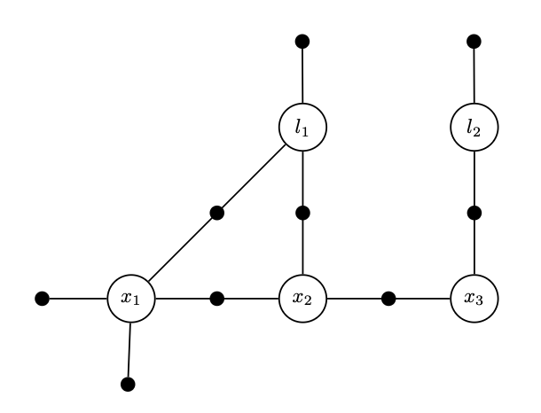
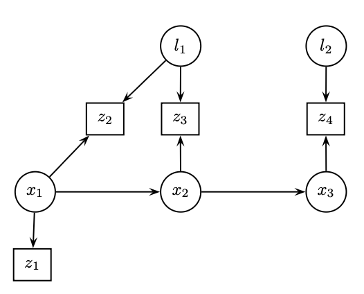
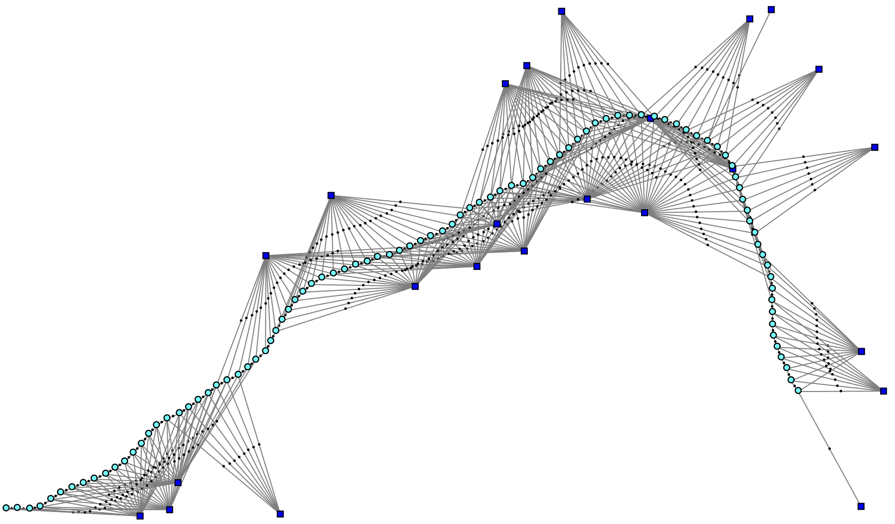
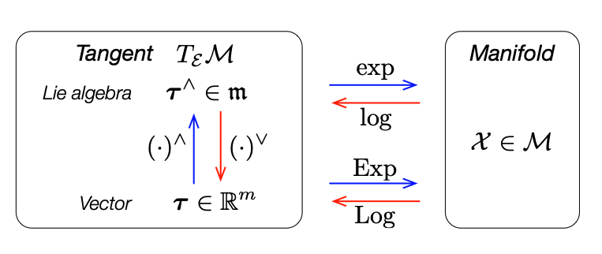
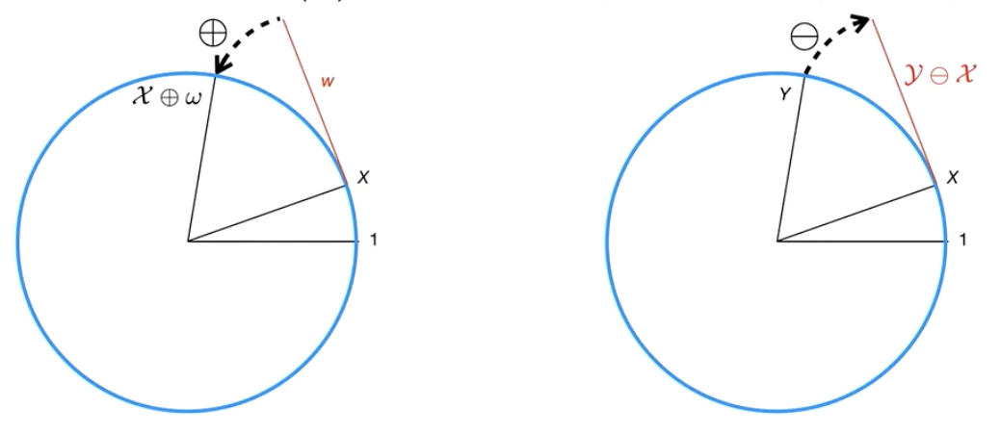

# Probabilistic Inference and State Estimation

**INF8422: Robotic Perception and Spatial Intelligence**

Prof. Pierre-Yves Lajoie


<div class="cover-footer-bar mt-4">
  <span style="background:#CF1C24" />
  <span style="background:#F15A22" />
  <span style="background:#25B34B" />
  <span style="background:#00BDF2" />
</div>

---
hideInToc: true
---

# Agenda

<Toc />

---
hideInToc: true
---

# This Course

<div class="grid grid-cols-2 gap-6 mt-3">
<div>

Last class, you saw SLAM in action:

- **Feature extraction, RANSAC, PnP** → geometric constraints
- **Bundle Adjustment** → reprojection error minimization
- **VIO factor graph** → optimization structure

Some terms were not well defined:

> *"Minimize the error"* — why least squares? What error in the probabilistic sense?
>
> *"Solve the graph"* — how? Which algorithm?

</div>
<div>


<p class="text-xs text-center text-gray-500 mt-1">The SLAM factor graph — what we are going to formalize</p>

<AlertBlock title="This course answers these questions">

**Probability → Bayes → MLE/MAP → Least Squares → Factor Graphs → Gauss-Newton → Lie Groups**

The foundations of SLAM back-end

</AlertBlock>

</div>
</div>

---
layout: section
---

# Probabilistic Robotics
---
hideInToc: true
---

# The measurement model


In probabilistic robotics, a measurement is a random variable.

$$z_t = h(x_t) + \epsilon_t$$

- $z_t$ : The measurement vector at time $t$.
- $x_t$ : The state of the robot/world (e.g., position, map).
- $h(\cdot)$ : The **observation function** (physical model of the sensor).
- $\epsilon_t$ : The measurement noise (often Gaussian $\epsilon_t \sim \mathcal{N}(0, \sigma^2)$).

<AlertBlock title="Perception">

The goal of perception is to invert $h$ to find $x$ given $z$.

</AlertBlock>

---
hideInToc: true
---

# Uncertainty in Robotics

<div class="grid grid-cols-2 gap-6 mt-3">
<div>

Unlike a perfect simulation, the real world is **uncertain**.

**Sources of uncertainty:**

- **Sensors**: Measurements are noisy. $z \neq h(x)$, i.e. $\|z - h(x)\|^2 > 0$.
- **Actuators**: Wheels slip, motors are not perfect. $u \neq \Delta x$.
- **Models**: Our equations are simplifications of the real physics.
- **Environment**: Objects move, lighting changes.


</div>
<div>


<p class="text-xs text-center text-gray-500 mt-1">SLAM example: unknown poses and landmarks</p>


<AlertBlock title="Fundamental consequence">

We can never know the robot's state with perfect precision. We must **quantify and propagate** this uncertainty.

</AlertBlock>
</div>
</div>

---
hideInToc: true
---

# Probabilistic Robotics

<div class="grid grid-cols-2 gap-6 mt-3">
<div>

> *"Probabilistic robotics is a new approach to robotics that pays tribute to the uncertainty inherent in robot perception and action."*
> — Sebastian Thrun, 2005

**Key idea:**

Instead of saying *"The robot is at position $(x,y)$"*, we say:

*"The robot's position follows a probability distribution $\mathcal{N}(\mu, \Sigma)$"*

$$\Rightarrow \text{States} \longrightarrow \text{Probability distributions}$$

</div>
<div>

<InfoBlock title="What this changes">

- A **state** is a **probability density** $p(x)$.
- A **measurement** updates this density (Bayes' rule).
- An **action** propagates the uncertainty (error propagation).

</InfoBlock>

<ExampleBlock title="In SLAM">

We seek to estimate the conditional density:

$$P(X, M \mid Z)$$

- $X$: robot trajectory, $M$: map, $Z$: sensor measurements.

</ExampleBlock>

</div>
</div>

---
hideInToc: true
---

# Probabilistic SLAM Modeling

<div class="grid grid-cols-2 gap-6 mt-2">
<div>

**Scenario:** Trajectory with 3 poses $x_1, x_2, x_3$ and two landmarks $l_1, l_2$.

**Joint density** (via Bayesian network):

$$P(X, Z) = p(x_1)\,p(x_2|x_1)\,p(x_3|x_2)\,p(l_1)\,p(l_2)$$
$$\cdot\, p(z_1|x_1)\,p(z_2|x_1, l_1)\,p(z_3|x_2, l_1)\,p(z_4|x_3, l_2)$$

<InfoBlock title="Factor graphs">

Better suited for inference $P(X|Z)$ than Bayesian networks. The conditional densities are replaced by **factors**:

$$P(X \mid Z) \propto \prod_i \phi_i(X_i)$$

</InfoBlock>

</div>
<div>


<p class="text-xs text-center text-gray-500 mt-1">Bayesian network</p>


<p class="text-xs text-center text-gray-500 mt-1">Equivalent factor graph</p>

</div>
</div>

---
layout: section
---

# Probability Review

---
hideInToc: true
---

# Random Variables

<div class="grid grid-cols-2 gap-6 mt-3">
<div>

### Discrete case — PMF

A variable $X$ takes values in $\{x_1, \ldots, x_n\}$.

$$P(X = x_i) = p_i, \quad \sum_{i=1}^n p_i = 1$$

<ExampleBlock title="Semantic classification">

A camera sees an object. What is it?

- $P(X = \text{Bike}) = 0.1$
- $P(X = \text{Pedestrian}) = 0.8$
- $P(X = \text{Car}) = 0.1$

</ExampleBlock>

</div>
<div>

### Continuous case — PDF

The density function $p(x)$ satisfies:

$$\int_{-\infty}^{\infty} p(x)\, dx = 1$$

<AlertBlock title="Density ≠ Probability">

- $P(X = x) = 0$.
- We compute: $P(a \leq X \leq b) = \int_a^b p(x)\, dx$.

</AlertBlock>

<InfoBlock title="Independence">

If $X$ and $Y$ are independent:
$$p(x, y) = p(x) \cdot p(y)$$

</InfoBlock>

</div>
</div>

---
hideInToc: true
---

# Rules of Probability

<div class="grid grid-cols-2 gap-6 mt-3">
<div>

**Sum Rule (Marginalization):**

$$p(x) = \int p(x, y)\, dy$$

*Intuition: "flatten" the 2D distribution onto the $x$ axis.*

**Product Rule:**

$$p(x, y) = p(x \mid y)\, p(y) = p(y \mid x)\, p(x)$$

**Chain Rule:**

$$p(x_1, \ldots, x_n) = \prod_{i=1}^n p(x_i \mid x_1, \ldots, x_{i-1})$$

</div>
<div>

**Markov Assumption:**

If $x_{t+1}$ depends only on $x_t$ (not on the history):

$$p(x_0, x_1, x_2) = p(x_0)\cdot p(x_1 \mid x_0)\cdot p(x_2 \mid x_1)$$

<InfoBlock title="Conditional Independence">

$X$ and $Y$ are independent given $Z$:

$$p(x, y \mid z) = p(x \mid z)\,p(y \mid z)$$


</InfoBlock>

</div>
</div>

---
hideInToc: true
---

# Bayes' Theorem in Robotics

<div class="grid grid-cols-2 gap-6 mt-3">
<div>


$$\boxed{p(x \mid z) = \frac{p(z \mid x)\, p(x)}{p(z)}}$$

- $p(x)$ : **Prior** — belief about the state before the measurement.
- $p(z \mid x)$ : **Likelihood** — likelihood of the measurement given the state.
- $p(x \mid z)$ : **Posterior** — belief about the state given the measurement.
- $p(z)$ : **Evidence** — normalization.

</div>
<div>

<ExampleBlock title="Door sensor">

State: door Open ($O$) or Closed ($F$). Prior: $P(O)=P(F)=0.5$.

Noisy sensor: $P(z_O \mid O) = 0.8$, $P(z_O \mid F) = 0.4$.

If the sensor reports "Open":

$$P(z_O) = 0.8 \times 0.5 + 0.4 \times 0.5 = 0.6$$
$$P(O \mid z_O) = \frac{0.8 \times 0.5}{0.6} \approx \mathbf{0.67}$$

Even with an "Open" measurement, there is still a 33% chance that the door is closed!

</ExampleBlock>

</div>
</div>

---
layout: two-cols-header
hideInToc: true
---

# The Normal (Gaussian) Distribution

The standard noise model in robotics — justified by the **Central Limit Theorem**.

::left::

### Univariate

$$p(x) = \frac{1}{\sqrt{2\pi\sigma^2}} \exp\!\left(-\frac{(x-\mu)^2}{2\sigma^2}\right)$$

- $\mu$: Mean (center).
- $\sigma^2$: Variance (uncertainty).

**68–95–99.7 rule:**
- $\mu \pm 1\sigma$ → 68% probability.
- $\mu \pm 2\sigma$ → 95%.
- $\mu \pm 3\sigma$ → 99.7%.

::right::

### Multivariate ($x \in \mathbb{R}^n$)

$$p(x) = \det(2\pi\Sigma)^{-\frac{1}{2}} \exp\!\left(-\frac{1}{2}(x-\mu)^T\Sigma^{-1}(x-\mu)\right)$$

- $\mu \in \mathbb{R}^n$: Mean vector.
- $\Sigma \in \mathbb{R}^{n\times n}$: Covariance matrix.

<InfoBlock title="Mahalanobis Distance">

$$D_M^2 = (x-\mu)^T\Sigma^{-1}(x-\mu)$$

Euclidean distance weighted by uncertainty.

</InfoBlock>

---
hideInToc: true
---

# Properties of Gaussians

<div class="grid grid-cols-2 gap-6 mt-3">
<div>

### Property 1 — Linear Transformation

Let $x \sim \mathcal{N}(\mu, \Sigma)$ and $y = Ax + b$.

$$\boxed{y \sim \mathcal{N}(A\mu + b,\; A\Sigma A^T)}$$

*Example: change of frame camera → world. $A = R^W_{C}$.*

$$\Sigma^W = R^W_{C}\,\Sigma^C\,R^C_{W}$$

</div>
<div>

### Property 2 — Fusion (Product)

The product of two Gaussians is a Gaussian:

$$\mathcal{N}(\mu_{new}, \Sigma_{new}) \propto \mathcal{N}(\mu_1, \Sigma_1)\cdot\mathcal{N}(\mu_2, \Sigma_2)$$

The **information matrices** add up:

$$\boxed{\Sigma_{new}^{-1} = \Sigma_1^{-1} + \Sigma_2^{-1}}$$

<AlertBlock title="Intuition">

The more measurements we accumulate, the more the covariance $\Sigma$ decreases. The uncertainty is determined by the data.

</AlertBlock>

</div>
</div>

---
layout: section
---

# State Estimation: MLE & MAP

---
hideInToc: true
zoom: 0.9
---

# The Estimation Problem

<div class="grid grid-cols-2 gap-6 mt-3">
<div>

**Data:**
- $Z = \{z_1, \ldots, z_m\}$: Noisy measurements.
- $u = \{u_1, \ldots, u_k\}$: Control commands (optional).

**Unknown:**
- $x$: The true state of the system (robot pose, map, calibration...).

**Goal:** Find the "best" estimate $\hat{x}$ that explains the data.


</div>
<div>

**Measurement model:**

$$z_i = h_i(x) + \epsilon_i, \quad \epsilon_i \sim \mathcal{N}(0, \Sigma_i)$$

The likelihood of a Gaussian measurement:

$$p(z_i \mid x) \propto \exp\!\left(-\frac{1}{2}\|h_i(x) - z_i\|^2_{\Sigma_i}\right)$$

**Conditional independence:**

$$p(z_{1:m} \mid x) = \prod_{i=1}^m p(z_i \mid x)$$

</div>
</div>
<InfoBlock title="Two approaches">

- **MLE** (Maximum Likelihood Estimation). - **MAP** (Maximum A Posteriori): incorporates a prior $p(x)$.

</InfoBlock>

---
hideInToc: true
---

# Bayesian update: one measurement at a time

<BayesUpdateAnimation class="mt-1" />

<!--
Model for this demonstration: fixed scalar position, z_k = x + epsilon_k,
Gaussian noises conditionally independent given x. No motion model.
Observe: distinguish the initial prior p_0, the current prior p_{k-1} and the likelihood.
Fuse: the product is normalized; the mean is weighted by the precisions.
Remember: integrate exactly one observation. The posterior becomes the current prior
only at the next cycle; the initial prior and the axes stay fixed.
Change z and sigma_z at the Observe step to compare a precise sensor and an imprecise one.
Autoplay assumes new independent observations with the same value.
Replaying the same data does not provide independent information.
-->

---
hideInToc: true
---

# MLE → Least Squares

<div class="grid grid-cols-2 gap-6 mt-3">
<div>

**Maximum Likelihood:**

$$\hat{x}_{MLE} = \arg\max_x\, p(z_{1:m} \mid x) = \arg\max_x \prod_i p(z_i \mid x)$$

**Log Trick** (log is monotonically increasing):

$$= \arg\max_x \sum_i \ln p(z_i \mid x)$$

$$= \arg\max_x \sum_i \left(-\frac{1}{2}\|h_i(x) - z_i\|^2_{\Sigma_i}\right)$$

</div>
<div>

**Maximizing the negative = Minimizing:**

$$\boxed{\hat{x}_{MLE} = \arg\min_x \sum_i \frac{1}{2}\|h_i(x) - z_i\|^2_{\Sigma_i}}$$

<AlertBlock title="Key takeaway">

Under the Gaussian noise assumption, **Maximum Likelihood = Weighted Least Squares**.

$$\|e\|^2_\Sigma = e^T\Sigma^{-1}e$$

Precise sensor ($\sigma$ small) → **large** weight $1/\sigma^2$.
Imprecise sensor ($\sigma$ large) → **small** weight.

</AlertBlock>

</div>
</div>

---
hideInToc: true
---

# MAP → Least Squares with a Prior

**Maximum A Posteriori:**

$$\hat{x}_{MAP} = \arg\max_x\, p(x \mid Z) \propto p(Z \mid x)\,p(x)$$

If the prior is Gaussian: $x \sim \mathcal{N}(x_0, \Sigma_0)$, the problem becomes:

$$\boxed{\hat{x}_{MAP} = \arg\min_x \left[\sum_i\|h_i(x)-z_i\|^2_{\Sigma_i} + \|x - x_0\|^2_{\Sigma_0}\right]}$$

The prior acts as an **additional measurement** that pulls $x$ toward $x_0$.

---
hideInToc: true
---

# Example 1D — Odometry

<div></div>

Robot trajectory with 3 positions $x_0, x_1, x_2$. Displacement measurements: $d_1 = 2$ m, $d_2 = 1.5$ m ($\sigma_d = 0.5$).

Prior: $x_0 \approx 10$ m ($\sigma_0 = 0.1$).

$$E = \underbrace{\frac{(x_0-10)^2}{0.1^2}}_{\text{prior/anchoring}} + \underbrace{\frac{(x_1-x_0-2)^2}{0.5^2}}_{\text{Motion 1}} + \underbrace{\frac{(x_2-x_1-1.5)^2}{0.5^2}}_{\text{Motion 2}}$$

Solution: $\hat{x}_0 \approx 10$, $\hat{x}_1 \approx 12$, $\hat{x}_2 \approx 13.5$.

<AlertBlock title="Without a prior: floating system">

Without anchoring, if $(x_0, x_1, x_2)$ is a solution, then $(x_0+c, x_1+c, x_2+c)$ is one too. The system is underdetermined, and there are infinitely many solutions.

</AlertBlock>


---
hideInToc: true
disabled: true
---

# Numerical Example — End to End

We reuse the 1D SLAM (prior $x_0\!\approx\!10$, odometries $d_1\!=\!2$, $d_2\!=\!1.5$, all $\sigma=1$).

<div class="grid grid-cols-2 gap-6 mt-2">
<div>

**1. Residuals** $r = h(x) - z$ (linear):

$$r_0 = x_0 - 10,\quad r_1 = (x_1-x_0) - 2,\quad r_2 = (x_2-x_1) - 1.5$$

**2. Stack the Jacobian $A$ and $b$** (1 row = 1 factor):

$$A = \begin{bmatrix} 1 & 0 & 0 \\ -1 & 1 & 0 \\ 0 & -1 & 1 \end{bmatrix},\quad
b = \begin{bmatrix} 10 \\ 2 \\ 1.5 \end{bmatrix}$$

Each row touches only **1 or 2 variables** → $A$ is **sparse**.

</div>
<div>

**3. Normal equations** $A^TA\,\hat{x} = A^Tb$:

$$\underbrace{\begin{bmatrix} 2 & -1 & 0 \\ -1 & 2 & -1 \\ 0 & -1 & 1 \end{bmatrix}}_{\Lambda = A^TA\ \text{(tridiagonal!)}}\hat{x}
= \begin{bmatrix} 8 \\ 0.5 \\ 1.5 \end{bmatrix}$$

**4. Solve (Cholesky)**:

$$\boxed{\hat{x} = (10,\; 12,\; 13.5)}$$

<InfoBlock title="What to observe">

$\Lambda = A^TA$ is **symmetric, positive definite and sparse** (tridiagonal) — exactly the structure exploited by SLAM solvers.

</InfoBlock>

</div>
</div>

---
hideInToc: true
disabled: true
---

# Observability and Gauge Freedom

<div class="grid grid-cols-2 gap-6 mt-2">
<div>

With **only** **relative** measurements (odometry), a global translation $c$ is **unobservable**: $(x_0,x_1,x_2)$ and $(x_0{+}c,x_1{+}c,x_2{+}c)$ give the same residuals.

$$A_{\text{odom}} = \begin{bmatrix} -1 & 1 & 0 \\ 0 & -1 & 1 \end{bmatrix}
\;\Rightarrow\; \Lambda = A^TA = \begin{bmatrix} 1 & -1 & 0 \\ -1 & 2 & -1 \\ 0 & -1 & 1 \end{bmatrix}$$

$\Lambda$ is **rank-deficient**: $\Lambda\,[1,1,1]^T = 0$ → zero eigenvalue → **no inverse**, no unique solution.

<AlertBlock title="Gauge freedom">

The null direction $[1,1,1]^T$ = the **gauge mode** (unconstrained global shift).

</AlertBlock>

</div>
<div>

**Fixing the gauge** — two equivalent options:

1. **Anchor** one variable (strong prior on $x_0$) → adds $[1,0,0]$ to $A$.
2. **Gaussian** prior → $\Lambda \leftarrow \Lambda + \Sigma_0^{-1}$ becomes **positive definite** again.

<div class="mt-2 flex justify-center">
<svg viewBox="0 0 240 96" width="230">
  <!-- without anchor: drifts -->
  <text x="6" y="12" style="font-size:8px;fill:#CF1C24;font-weight:700;font-family:sans-serif">Without anchor → drifts</text>
  <line x1="30" y1="28" x2="90" y2="28" stroke="#475569" stroke-width="2"/>
  <circle cx="30" cy="28" r="7" fill="#475569"/><circle cx="60" cy="28" r="7" fill="#475569"/><circle cx="90" cy="28" r="7" fill="#475569"/>
  <line x1="105" y1="28" x2="175" y2="28" stroke="#CF1C24" stroke-width="1.3" stroke-dasharray="4,2" marker-end="url(#obR)" marker-start="url(#obL)"/>
  <defs>
    <marker id="obR" markerWidth="6" markerHeight="6" refX="5" refY="3" orient="auto"><path d="M0,0 L6,3 L0,6 Z" fill="#CF1C24"/></marker>
    <marker id="obL" markerWidth="6" markerHeight="6" refX="1" refY="3" orient="auto"><path d="M6,0 L0,3 L6,6 Z" fill="#CF1C24"/></marker>
  </defs>
  <!-- with anchor: fixed -->
  <text x="6" y="62" style="font-size:8px;fill:#25B34B;font-weight:700;font-family:sans-serif">With anchor → fixed</text>
  <rect x="20" y="72" width="10" height="14" fill="#CF1C24" rx="1"/>
  <line x1="30" y1="79" x2="90" y2="79" stroke="#475569" stroke-width="2"/>
  <circle cx="30" cy="79" r="7" fill="#25B34B"/><circle cx="60" cy="79" r="7" fill="#475569"/><circle cx="90" cy="79" r="7" fill="#475569"/>
  <text x="30" y="82" text-anchor="middle" style="font-size:6px;fill:white;font-weight:700;font-family:sans-serif">x0</text>
</svg>
</div>

</div>
</div>

---
hideInToc: true
disabled: true
---

# MLE vs MAP — Interactive Visualization

<MleVsMapAnimation class="mt-1" />

---
hideInToc: true
---

# Intuition: The Spring Analogy

<div class="grid grid-cols-2 gap-6 mt-3">
<div>

Each term of the cost function acts like a **spring** that pulls the state $x$ toward the observed value $z_i$.

$$E(x) = \sum_i \underbrace{\frac{1}{2}\|h_i(x) - z_i\|^2_{\Sigma_i}}_{\text{energy of spring } i}$$

- Spring energy: $E = \frac{1}{2} k \Delta x^2$.
- Stiffness: $k = \Sigma_i^{-1}$ (inverse of the uncertainty/covariance).
- Elongation: $\Delta x = h(x) - z$ (measurement error).

$$\textbf{Minimize } E \iff $$
$$\textbf{Find the mechanical equilibrium}$$

</div>
<div>

<InfoBlock title="Why the 1/σ² weights?">

Not all measurements are born equal:

$$E(x) = \frac{(h_1(x)-z_1)^2}{\sigma_1^2} + \frac{(h_2(x)-z_2)^2}{\sigma_2^2} + \cdots$$

- **Precise** sensor ($\sigma$ small) → **stiff** spring → **large** weight.
- **Imprecise** sensor ($\sigma$ large) → **soft** spring → **small** weight.

The algorithm listens more to the precise sensors.

</InfoBlock>

</div>
</div>

---
hideInToc: true
---

# Springs: variance and loop closure

<SpringAnalogy class="mt-1" />

<!--
Positions are scalars; the height of the loop link is only for drawing.
Start with the chain, perturb then relax: all residuals can be zero.
Enable the 0–2 loop: path 0–1–2 measures 4 m, but the closure measures 3 m.
The loop only involves x0, x1 and x2; x3 is on an outer branch.
Vary the variance of the loop link, then relax. A low variance gives
a high stiffness k=1/sigma² and enforces the closure distance more strongly.
Then increase the variance of a single chain link: it absorbs more
of the disagreement. At equilibrium, the forces balance but the residuals stay nonzero.
The 2–3 link keeps its target distance; x3 follows the displacement of x2.
The prior controls the global translation; in this graph with no other absolute measurement,
its variance does not change the MAP position, but does change the uncertainty.
The animation uses damped Newton on a quadratic cost, without mass or inertia.
-->

---
hideInToc: true
zoom: 0.9
---

# Robustness to Outliers — Weakness of Least Squares

<div class="grid grid-cols-2 gap-6 mt-3">
<div>

Least squares minimizes $\sum_i \frac{1}{2}\|r_i\|^2$: the cost grows as **$r^2$**. A single outlier measurement (huge error) **dominates** the sum and **pulls** the whole solution.

<AlertBlock title="Outlier measurements">

**Perceptual aliasing** generates **false loop closures**. Fed as-is into an $L_2$ back-end, they **collapse** the map. The optimization must be made robust.

</AlertBlock>
</div>
<div>


**Robust kernels $\rho(r)$** — we replace $\frac{1}{2}r^2$ with a function that **caps**:

$$\hat{X} = \arg\min_X \sum_i \rho\!\left(\|r_i\|_{\Sigma_i}\right)$$

- **Huber**: quadratic near 0, **linear** beyond $\delta$.
- **Cauchy / Geman-McClure**: redescending — large residuals are **almost ignored**.


<!-- <InfoBlock title="IRLS — Iteratively Reweighted Least Squares">

We solve a sequence of **weighted** least squares: at each iteration, weight

$$w(r) = \frac{\rho'(r)}{r}$$

A large residual → small weight → the measurement is **downweighted**. This recovers weighted Gauss-Newton.

</InfoBlock> -->


</div>
</div>

<ExampleBlock title="Advanced methods for robustness" font-size="sm">

Examples of advanced methods: *GNC* (Yang et al. 2020) gradually varies the robustness. *PCM* (Mangelson et al. 2018) geometrically filters inconsistent measurements.

</ExampleBlock>
---
hideInToc: true
---

# Robust Estimation — Interactive Visualization

<RobustEstimationAnimation class="mt-1" />

---
layout: section
---

# Factor Graphs

---
hideInToc: true
---

# From SLAM to Factor Graph

<div class="grid grid-cols-2 gap-6 mt-3">
<div>

We have seen the factor graph for VIO:

$$\text{Poses } T_i \xrightarrow{\text{[IMU]}} T_{i+1}, \quad L_j \text{ seen from several } T_i$$

Now, let us state the **formal definition**.

A factor graph represents the **factorization of the joint probability** :

$$P(X \mid Z) \propto \prod_k \phi_k(X_k)$$

where each **factor** $\phi_k$ encodes a measurement (or a prior) as a Gaussian likelihood:

$$\phi_k(X_k) \propto \exp\!\left(-\frac{1}{2}\|h_k(X_k) - z_k\|^2_{\Sigma_k}\right)$$

</div>
<div>


<p class="text-xs text-center text-gray-500 mt-1">SLAM factor graph</p>

<InfoBlock title="Connection to the previous course">

Bundle Adjustment minimizes $\sum \|z_{ij} - h(T_j, P_i)\|^2$, which is exactly the MAP on this factor graph, with each reprojection as a factor.

</InfoBlock>

</div>
</div>

---
hideInToc: true
disabled: true
---

# Factor Graphs

<div class="grid grid-cols-2 gap-2 mt-3">
<div>

To act sensibly, robots must **infer the structure of their environment** from their sensors.

<InfoBlock title="Bayesian probabilistic approach">

We seek the conditional density $P(X \mid Z)$ — the most probable state given the measurements

</InfoBlock>

</div>
<div>


<p class="text-xs text-center text-gray-500 mt-1">Two-pose factor graph</p>


<p class="text-xs text-center text-gray-500 mt-1">Realistic factor graph (~100 poses)</p>

</div>
</div>

---
hideInToc: true
---

# Factor Graphs — Definition

<div class="grid grid-cols-2 gap-6 mt-3">
<div>

A factor graph represents the **factorization of the joint probability** :

$$P(X \mid Z) \propto \prod_i \phi_i(X_i)$$

**Elements :**
- **Nodes (variables)** : Unknown states $X_i$ (poses $x_k$, landmarks $l_j$, calibration...).
- **Factors** $\phi_i$ : Potential functions associated with the measurements $Z$ and the priors.

The observed measurements are **incorporated as parameters** of the factors, not as nodes.

</div>
<div>

**Advantages over Bayesian networks :**

- Clear visual structure for inference.
- Directly linked to the sparse structure of the optimization problem.
- Easily implementable (GTSAM, g2o, Ceres).

<ExampleBlock title="Example: Odometry factor">

$$\phi(x_i, x_{i+1}) \propto \exp\!\left(-\frac{1}{2}\|x_{i+1} \ominus x_i - \Delta u_i\|^2_\Sigma\right)$$

Connects two consecutive poses with the odometry measurement $\Delta u_i$.

</ExampleBlock>

</div>
</div>

---
hideInToc: true
zoom: 0.95
---

# MAP on Factor Graphs

<div class="grid grid-cols-2 gap-6 mt-3">
<div>

**MAP inference** = maximize the product of all factors:

$$X^{MAP} = \arg\max_X \prod_i \phi_i(X_i)$$

With a Gaussian noise model for each factor:

$$\phi_i(X_i) \propto \exp\!\left(-\frac{1}{2}\|h_i(X_i) - z_i\|^2_{\Sigma_i}\right)$$

The **negative log** turns the problem into **non-linear least squares**:

$$\boxed{X^{MAP} = \arg\min_X \sum_i \|h_i(X_i) - z_i\|^2_{\Sigma_i}}$$

</div>
<div>

<InfoBlock title="Natural sensor fusion">

Minimizing the objective function $\sum_i \|h_i(X_i) - z_i\|^2_{\Sigma_i}$ automatically **combines** all measurement sources:
- Odometry (wheels, IMU)
- Visual observations (features, reprojection)
- LiDAR, GPS, loop closures...

Each factor contributes proportionally to its precision $\Sigma_i^{-1}$.

</InfoBlock>

<!--  -->

</div>
</div>

---
hideInToc: true
---

# Why Linearize? The Problem is Non-Linear

<div class="grid grid-cols-2 gap-6 mt-3">
<div>

MAP gave us a **least-squares** objective:

$$\hat X = \arg\min_X \sum_i \|h_i(X) - z_i\|^2_{\Sigma_i}$$

The $h_i$ are often **non-linear** (projection, IMU...). In SLAM, we generally do not have a direct analytical solution. Gauss–Newton and LM solve a sequence of **linear systems**.

<AlertBlock title="The strategy">

Linearize $h$ around $X^0$ (1st-order Taylor), solve the **linearized least squares**, update $X$, then **iterate**.

</AlertBlock>

</div>
<div>

<div class="flex justify-center mt-0">
<svg viewBox="0 0 260 150" width="205">
  <line x1="28" y1="128" x2="248" y2="128" stroke="#CBD5E1" stroke-width="1"/>
  <line x1="34" y1="12" x2="34" y2="132" stroke="#CBD5E1" stroke-width="1"/>
  <path d="M40,118 Q95,18 165,58 T244,34" fill="none" stroke="#475569" stroke-width="2"/>
  <line x1="52" y1="70" x2="185" y2="20" stroke="#CF1C24" stroke-width="1.6" stroke-dasharray="5,3"/>
  <circle cx="107" cy="49" r="4" fill="#CF1C24"/>
  <text x="122" y="60" text-anchor="middle" style="font-size:9px;fill:#CF1C24;font-weight:700;font-family:sans-serif">X⁰</text>
  <text x="196" y="24" style="font-size:8px;fill:#CF1C24;font-family:sans-serif">tangent (linear)</text>
  <text x="150" y="50" style="font-size:8px;fill:#475569;font-family:sans-serif">h(X)</text>
</svg>
</div>

<InfoBlock title="Section outline (Lift–Solve–Retract)">

1. **Lift**: linearize → Jacobian, whitening, matrix form.
2. **Solve**: normal equations + Cholesky (sparse).
3. **Retract + iterate**: Gauss-Newton / LM (next section).

</InfoBlock>

</div>
</div>

---
hideInToc: true
---

# Taylor Reminder: a local approximation

<TaylorExpansionAnimation class="mt-1" />

<!--
A deliberately simple example: h(x)=x² has explicit solutions for h(x)=z.
Nonlinearity alone is therefore not enough to rule out a closed-form solution. The goal here
is to illustrate the mechanics of Taylor, not the analytical difficulty of SLAM.
1. Start from x0=3: h(3)=9 and h'(3)=6.
2. The tangent is 9+6 Delta x: same value and slope at the expansion point.
3. Move Delta x: the neglected term is exactly (Delta x)² for this polynomial.
For a general, sufficiently smooth function, the first-order remainder is
O(||Delta x||²) locally; it is not necessarily equal to (Delta x)².
4. For z=10, the tangent proposes Delta x=1/6. At the new point, the true function
is about 10.0278: the function must be re-evaluated and the tangent recomputed.
The Apply and relinearize button performs this update, with no internal rounding.
Changing the expansion point to 2 makes the gap after the first step more visible.
The automatic demonstration presents the four steps without applying the step.
-->

---
hideInToc: true
---

# Linearization: the Jacobian

<div class="grid grid-cols-2 gap-6 mt-3">
<div>

**First-order Taylor expansion** of $h$ about $X^0$, for a perturbation $\Delta$ :

$$\boxed{h(X^0 + \Delta) \approx h(X^0) + J\,\Delta}$$

<InfoBlock title="The Jacobian J">

$$J = \frac{\partial h}{\partial X}\bigg|_{X^0}, \qquad J_{ij} = \frac{\partial h_i}{\partial X_j}$$

Matrix of **partial derivatives** :
- **row $i$** = variation of residual $i$,
- **column $j$** = with respect to variable $X_j$.

</InfoBlock>

</div>
<div>

<ExampleBlock title="1D SLAM">

Odometry factor $r = (x_1 - x_0) - 2$. Its derivatives :

$$\frac{\partial r}{\partial x_0} = -1, \quad \frac{\partial r}{\partial x_1} = +1$$

→ Jacobian row $\;[\,-1,\;1]$.

Here $h$ is **linear** ⇒ $J$ is **constant**.

</ExampleBlock>

</div>
</div>

---
hideInToc: true
zoom: 0.95
---

# We seek the correction $\Delta$

At this iteration, $X^0\in\mathbb R^n$ is **fixed**. We seek the displacement $\Delta=X-X^0$.


<div class="grid grid-cols-2 gap-5 mt-3">
<div class="xdelta-panel bg-sky-50 rounded px-4 py-3">

**1. Change of variable**

The initial problem is:

$$\hat X=\arg\min_X\sum_i\|h_i(X)-z_i\|_{\Sigma_i}^2.$$

Replacing $X$ with $X^0+\Delta$ gives:

$$
\Delta_{\mathrm{exact}}^*=\arg\min_\Delta\sum_i\|h_i(X^0+\Delta)-z_i\|_{\Sigma_i}^2.
$$


</div>
<div class="xdelta-panel bg-orange-50 rounded px-4 py-3">

**2. Linearize (local approximation)**

At the fixed point $X^0$, Taylor gives:

$$
\begin{aligned}
&h_i(X^0+\Delta)-z_i\\
&\quad\approx h_i(X^0)+J_i\Delta-z_i\\
&\quad=J_i\Delta-\big(z_i-h_i(X^0)\big).
\end{aligned}
$$

We then minimize this **approximate model**:

$$
\boxed{\Delta^*=\arg\min_\Delta\sum_i\big\|J_i\Delta-\big(z_i-h_i(X^0)\big)\big\|_{\Sigma_i}^2}
$$

$J_i$ and $z_i-h_i(X^0)$ are **constant** during this solve; only $\Delta$ varies.

</div>
</div>


<style>
.xdelta-panel p { margin: 0.45rem 0; line-height: 1.35; }
.xdelta-panel .katex-display { margin: 0.65rem 0; font-size: 0.91em; }
.xdelta-update .katex-display { margin: 0.25rem 0; white-space: nowrap; }
.xdelta-update p { margin: 0; line-height: 1.3; }
</style>

<!--
Stress two distinct operations:
1. X=X0+Delta is a bijective translation in R^n. With X0 fixed, optimizing over
X or over Delta describes exactly the same problem, with Delta_exact*=Xhat-X0.
Neither the model nor the cost has been simplified yet.
2. Only the Taylor approximation replaces the nonlinear problem with linearized
least squares. We therefore distinguish Delta* from the exact displacement.
The sign z_i-h_i(X0) simply comes from h_i(X0)-z_i=-(z_i-h_i(X0)).
The next slide will whiten these terms: A_i=Sigma_i^(-1/2)J_i and
b_i=Sigma_i^(-1/2)(z_i-h_i(X0)), giving ||A Delta-b||².
The positive factor 1/2 optionally added to the cost does not change its argmin.
For poses on a manifold, replace the addition with a local retraction,
which will be presented later. The global equivalence by translation applies here to R^n.
-->

---
hideInToc: true
---

# Whitening (Noise whitening) ?

<div class="grid grid-cols-2 gap-6 mt-3">
<div>

Each measurement can also have a *different uncertainty*. We cannot naively add them in a sum of squares.

The **Mahalanobis distance** weights each error by its uncertainty:

$$\|e\|^2_\Sigma = e^\top \Sigma^{-1} e$$

A precise sensor ($\sigma$ small) carries **more weight**
(weight $\Sigma^{-1}$).

</div>
<div>

<InfoBlock title="Whitening">

We factor $\Sigma^{-1} = \Sigma^{-\top/2}\,\Sigma^{-1/2}$ and **change variables**:

$$e' = \Sigma^{-1/2}\, e \;\Rightarrow\; \|e'\|^2 = \|e\|^2_\Sigma$$

After whitening, all residuals have **unit** noise $\mathcal N(0, I)$, directly **comparable**.

$$A_i = \Sigma_i^{-1/2} J_i, \quad b_i = \Sigma_i^{-1/2}\big(z_i - h_i(X^0)\big)$$

</InfoBlock>


</div>
</div>

---
hideInToc: true
---

# From Least Squares to Matrix Form

<div class="grid grid-cols-[55%_45%] gap-6 mt-3">
<div>

$$A_i = \Sigma_i^{-1/2} J_i, \quad b_i = \Sigma_i^{-1/2}\big(z_i - h_i(X^0)\big)$$

We **stack** all the whitened factors. 1 row per residual:

$$A = \begin{bmatrix} A_1 \\ \vdots \\ A_m\end{bmatrix},\qquad b = \begin{bmatrix} b_1 \\ \vdots \\ b_m\end{bmatrix}$$

The problem becomes a **linear least squares**:

$$\boxed{\Delta^* = \arg\min_\Delta \|A\Delta - b\|^2}$$

- **1 row** = 1 factor · **1 column** = 1 degree of freedom.
- Each row touches only **a few columns** ⇒ $A$ is said to be **sparse**.

</div>
<div>

<ExampleBlock title="Our 1D SLAM with a loop (4 poses)">

$$A = \begin{bmatrix} 1&0&0&0\\ -1&1&0&0\\ 0&-1&1&0\\ 0&0&-1&1\\ -1&0&0&1\end{bmatrix},\;\; b=\begin{bmatrix}0\\2\\2\\1\\5\end{bmatrix}$$

5 factors: anchor $x_0$, 3 odometry measurements, 1 **loop closure** $x_3\!-\!x_0$ (last row).

</ExampleBlock>

</div>
</div>

---
hideInToc: true
---

# Factor Graph and Sparse Jacobian

<FactorGraphSparsity class="mt-1" />

---
hideInToc: true
disabled: true
---

# Why is Sparsity Beneficial?

<div class="grid grid-cols-2 gap-6 mt-3">
<div>

Solving a **dense** $n\times n$ system is expensive:

| Operation | Time | Memory |
|---|---|---|
| **Dense** Cholesky | $O(n^3)$ | $O(n^2)$ |
| **Sparse** Cholesky | $\sim O(n)$–$O(n^{1.5})$ | $\sim O(n)$ |

With **thousands** of poses and landmarks, only the sparse case is feasible in real time.

</div>
<div>

<InfoBlock title="Where does the sparsity come from?">

Each factor links only **2–3 variables** (an odometry link connects 2 poses; an observation connects 1 pose + 1 landmark). So each row of $A$, and each row of $\Lambda = A^\top A$, has only **a few** non-zero entries.

</InfoBlock>

<AlertBlock title="The matrix IS the graph">

$\Lambda_{ij} \neq 0 \iff$ variables $i$ and $j$ **share a factor** (an edge of the graph).

</AlertBlock>

</div>
</div>

---
hideInToc: true
---

# Derivation of the Normal Equations

<div class="grid grid-cols-2 gap-6 mt-3">
<div>

We minimize $\;F(\Delta) = \tfrac12\|A\Delta - b\|^2 \\ = \tfrac12 (A\Delta - b)^\top (A\Delta - b)$.

**Gradient** (matrix differentiation):

$$\nabla_\Delta F = A^\top (A\Delta - b)$$

**Optimality condition** $\nabla_\Delta F = 0$:

$$\boxed{A^\top A\,\Delta^* = A^\top b}$$

<!-- *Geometrically*: $A\Delta^*$ is the **projection** of $b$ onto the column space of $A$; the residual is $\perp$ to the columns. -->

</div>
<div>

<InfoBlock title="Properties of Λ = AᵀA">

- **Symmetric**: $\Lambda^\top = \Lambda$.
- **Positive definite** (hence invertible) if $A$ has **full column rank**, a well-constrained problem.

</InfoBlock>

<ExampleBlock title="Our 1D SLAM">

$$\Lambda = \begin{bmatrix} 3&-1&0&-1\\ -1&2&-1&0\\ 0&-1&2&-1\\ -1&0&-1&2\end{bmatrix},\; A^\top b = \begin{bmatrix}-7\\0\\1\\6\end{bmatrix}$$


</ExampleBlock>

</div>
</div>

---
hideInToc: true
---

# Reminder: Solving a Linear System

<div class="grid grid-cols-2 gap-6 mt-3">
<div>

Problems where we seek $\Delta$ such that $W\Delta \approx v$. Two cases:

- **$W$ square and invertible**: unique solution $\;\;\;\;\;\;\;\;\;$ $\Delta = W^{-1}v$, but we **never invert** explicitly (costly and unstable).
- **$W$ rectangular**, more measurements than unknowns ($m > n$): **overdetermined** system ⇒ no unique solution ⇒ **least squares**.

</div>
<div>

<InfoBlock title="Families of methods">

- **Direct**: Gaussian elimination, **Cholesky**, QR — finite number of operations, exact solution (up to rounding).
- **Iterative**: conjugate gradient (CG)... for very large systems.

This course: **sparse Cholesky** on the normal equations.

</InfoBlock>

<AlertBlock title="Never invert">

Computing $\Lambda^{-1}$ is $O(n^3)$ **and destroys sparsity**.

 Instead, we **factorize** then **substitute**.

</AlertBlock>

</div>
</div>

---
hideInToc: true
---

# Elimination, Ordering and Fill-in

<div class="grid grid-cols-2 gap-6 mt-3">
<div>
Normal equations:

$$\Lambda = A^\top A$$
$$\boxed{\Lambda\Delta^* = A^\top b}$$

Factoring $\Lambda$ = **eliminating** the variables one by one (Gaussian elimination / Cholesky).

Eliminating a variable **connects all of its neighbors to one another** in the graph → **new** edges = **new** non-zeros in $\Lambda$: the **fill-in**.

More fill-in ⇒ $\Lambda$ less sparse ⇒ more costly factorization.

</div>
<div>

<InfoBlock title="Ordering matters enormously">

The **elimination ordering** determines the fill-in:
- landmark seen by all poses, eliminated **last** → **0 fill-in**.
- the **same** one eliminated **first** → links all poses → **massive** fill-in.

</InfoBlock>

<AlertBlock title="In practice">

Heuristics (**COLAMD**, **AMD**) compute an ordering that **reduces the fill-in** before factoring — a key ingredient of SLAM solvers (GTSAM, Ceres, g2o).

</AlertBlock>

</div>
</div>

---
hideInToc: true
---

# Ordering and Fill-in — Visualization

<div></div>

We **solve** $\Lambda x = \eta$ by elimination in two orders: (ℓ last) vs (ℓ first).

<EliminationFillIn class="mt-1" />


---
hideInToc: true
---

# Cholesky Factorization

<div class="grid grid-cols-2 gap-6 mt-3">
<div>

Since $\Lambda$ is **symmetric positive definite**, it admits a **triangular square root** :

$$\boxed{\Lambda = M^\top M}$$

$M$ **upper triangular** (unique). It is the matrix analogue of $\lambda = (\sqrt{\lambda})^2$.

**Why triangular?** A triangular system is solved by **substitution** in $O(n^2)$ and much less if sparse.

</div>
<div>

<InfoBlock title="Solving in 2 steps">

To solve $\Lambda\,\Delta = M^\top M\,\Delta = A^\top b$ :
1. **Forward substitution** : $M^\top y = A^\top b$ (top to bottom)
2. **Back substitution** : $M\,\Delta = y$ (bottom to top)
</InfoBlock>

<AlertBlock title="Sparsity preserved">

With a good ordering, $M$ stays **sparse** → near-linear factorization. This is what makes real-time SLAM possible.

</AlertBlock>

</div>
</div>

---
hideInToc: true
---

# Cholesky Factorization

We seek $M$ **upper triangular**, with a positive diagonal, such that $\Lambda=M^\top M$.

<div style="font-size:0.88em">

$$
\underbrace{\begin{bmatrix}4&2\\2&5\end{bmatrix}}_{\Lambda}
=
\underbrace{\begin{bmatrix}a&0\\b&c\end{bmatrix}}_{M^\top}
\underbrace{\begin{bmatrix}a&b\\0&c\end{bmatrix}}_{M}
=
\begin{bmatrix}a^2&ab\\ab&b^2+c^2\end{bmatrix}
$$

<v-clicks>

- **Entry (1,1)** : $a^2=4 \quad\Rightarrow\quad a=\sqrt{4}=2$.
- **Entry (1,2)** : $ab=2 \quad\Rightarrow\quad b=2/a=1$.
- **Entry (2,2)** : $b^2+c^2=5 \quad\Rightarrow\quad c=\sqrt{5-b^2}=2$.

</v-clicks>

<div v-click>

$$
\boxed{M=\begin{bmatrix}2&1\\0&2\end{bmatrix}}
\qquad\text{We identify the coefficients, not just an entry-by-entry square root.}
$$

</div>
</div>

<div class="text-sm mt-3 text-gray-500">

Existence and uniqueness with this convention if $\Lambda$ is symmetric positive definite.<br>
For $\Lambda=A^\top A$, this requires $A$ to have full column rank (in SLAM, this implies having a prior).

</div>

<!--
Expand the product explicitly before clicking. The zero below the diagonal
means that only one unknown remains in each successive equation.
The right-hand side Aᵀb does not appear: we are only building the factor.
-->

---
hideInToc: true
zoom: 0.88
---

# Cholesky

Entry $(j,i)$ of $M^\top M$ is the **dot product of columns $j$ and $i$** of $M$.

$$
\Lambda_{ji}=\sum_{k=1}^{j}M_{kj}M_{ki}
=\underbrace{\sum_{k<j}M_{kj}M_{ki}}_{\text{previous rows: known}}
+M_{jj}M_{ji}\qquad(i\ge j)
$$

<div class="grid grid-cols-2 gap-6 mt-2" style="font-size:0.86em">
<div v-click>

### 1. Start with the diagonal

$$\Lambda_{jj}=\sum_{k<j}M_{kj}^2+M_{jj}^2$$

$$\boxed{M_{jj}=\sqrt{\Lambda_{jj}-\sum_{k<j}M_{kj}^2}}$$

We subtract the squares already known, then choose the **positive root**.

</div>
<div v-click>

### 2. Fill in the row to the right

$$\Lambda_{ji}=\sum_{k<j}M_{kj}M_{ki}+M_{jj}M_{ji}$$

$$\boxed{M_{ji}=\frac{\Lambda_{ji}-\sum_{k<j}M_{kj}M_{ki}}{M_{jj}}}\quad(i>j)$$

We subtract the products already known, then **divide by the pivot** $M_{jj}$.

</div>
</div>

<div v-click class="mt-3 text-base">

We repeat for $j=1,\ldots,n$. On the first row, the sums are empty, hence zero.<br>
**Why this order?** Each computation uses only the previous rows and the pivot already computed.

</div>

---
hideInToc: true
zoom: 0.9
---

# Cholesky step by step: building M

<div></div>

On our 1D SLAM example: **write the equality → isolate the unknown → compute**.

<CholeskyStepByStep class="mt-1" />

---
hideInToc: true
zoom: 0.9
---

# M is built: solving becomes simple


<InfoBlock title="Solving in 2 steps">

To solve $\Lambda\,\Delta = M^\top M\,\Delta = A^\top b$ :

1. **Forward substitution** : $M^\top y = A^\top b$ (top to bottom)
2. **Backward substitution** : $M\,\Delta = y$ (bottom to top)
</InfoBlock>

<div class="grid grid-cols-2 gap-5 mt-3">
<div v-click>

<div class="text-base font-bold">

1. Forward substitution : $M^\top y=A^\top b$

</div>

<div style="font-size:0.72em">

$$
\begin{bmatrix}
 1.732 & 0 & 0 & 0\\
-0.577 & 1.291 & 0 & 0\\
 0 & -0.775 & 1.183 & 0\\
-0.577 & -0.258 & -1.014 & 0.756
\end{bmatrix}
\begin{bmatrix}y_1\\y_2\\y_3\\y_4\end{bmatrix}
\approx
\begin{bmatrix}-7\\0\\1\\6\end{bmatrix}
$$

$$y\approx(-4.041,\,-1.807,\,-0.338,\,3.780)^\top$$

</div>

<div class="text-sm">

We compute $y_1$, then $y_2$, $y_3$ and $y_4$.

</div>

</div>
<div v-click>

<div class="text-base font-bold">

2. Backward substitution : $M\Delta=y$

</div>

<div style="font-size:0.72em">

$$
\begin{bmatrix}
1.732 & -0.577 & 0 & -0.577\\
0 & 1.291 & -0.775 & -0.258\\
0 & 0 & 1.183 & -1.014\\
0 & 0 & 0 & 0.756
\end{bmatrix}
\begin{bmatrix}\Delta_1\\\Delta_2\\\Delta_3\\\Delta_4\end{bmatrix}
\approx
\begin{bmatrix}-4.041\\-1.807\\-0.338\\3.780\end{bmatrix}
$$

$$\boxed{\Delta=(0,\,2,\,4,\,5)^\top}$$

</div>

<div class="text-sm">

We compute $\Delta_4$, then $\Delta_3$, $\Delta_2$ and $\Delta_1$.

</div>

</div>
</div>

<div v-click class="mt-3 text-sm">

**No matrix to invert.**

</div>

---
hideInToc: true
disabled: true
---

# From Estimate to Uncertainty — Recovering the Covariance

<div class="grid grid-cols-2 gap-6 mt-2">
<div>

The MAP point $\hat{x}$ is not enough: a robot needs to know the **uncertainty** of its estimate. It is given by the **covariance**:

$$\boxed{\Sigma = (A^TA)^{-1} = \Lambda^{-1} = M^{-1}M^{-T}}$$

- **Diagonal block** $\Sigma_{ii}$: **marginal** covariance of variable $i$ (→ uncertainty ellipse).
- **Block** $\Sigma_{ij}$: correlation between variables $i$ and $j$.

<AlertBlock title="Pitfall">

Inverting the full $\Lambda$ costs $O(n^3)$ and **destroys sparsity** ($\Sigma$ is **dense** even if $\Lambda$ is sparse!).

</AlertBlock>

</div>
<div>

<InfoBlock title="Selective recovery">

We only need **a few** entries (the diagonal blocks). The **Golub-Plemmons / Kaess recursion** computes them directly from $M$, **without** inverting the whole $\Lambda$:

$$\Sigma_{ii} = \frac{1}{M_{ii}^2} - \frac{1}{M_{ii}}\sum_{j>i} M_{ij}\,\Sigma_{ji}$$

(bottom-up). Cost $\approx$ that of the sparsity of $M$.

</InfoBlock>

<div class="mt-2 flex justify-center">
<svg viewBox="0 0 200 84" width="200">
  <line x1="10" y1="70" x2="190" y2="70" stroke="#CBD5E1" stroke-width="1"/>
  <ellipse cx="70" cy="45" rx="34" ry="16" fill="#00BDF2" opacity="0.18" stroke="#00BDF2" stroke-width="1.3"/>
  <ellipse cx="70" cy="45" rx="17" ry="8" fill="#00BDF2" opacity="0.28" stroke="#00BDF2" stroke-width="1"/>
  <circle cx="70" cy="45" r="3" fill="#CF1C24"/>
  <text x="76" y="43" style="font-size:8px;fill:#CF1C24;font-weight:700;font-family:sans-serif">x̂</text>
  <text x="70" y="30" text-anchor="middle" style="font-size:7px;fill:#0284c7;font-family:sans-serif">Σ ellipse (1σ,2σ)</text>
</svg>
</div>

</div>
</div>

---
layout: section
---

# Nonlinear Optimization

---
hideInToc: true
---

# Recap: Optimizing Means Descending Toward the Minimum

<div class="grid grid-cols-2 gap-6 mt-3">
<div>

Minimize $F(X)$ **iteratively**: start from $X_k$, choose a **descent direction** $d$ (one that decreases $F$), take a step $\alpha$:

$$X_{k+1} = X_k + \alpha\, \Delta$$

- **Gradient descent**: $\Delta = -\nabla F$ (steepest slope). Simple but **slow**.
- **Newton**: uses the **curvature** (Hessian $H$), $\;\;\;\;$ $\Delta = -H^{-1}\nabla F$. **Fast** near the minimum.

</div>
<div>

<div class="flex justify-center mt-1">
<svg viewBox="0 0 240 168" width="230">
  <ellipse cx="150" cy="86" rx="80" ry="52" fill="none" stroke="#CBD5E1" stroke-width="1"/>
  <ellipse cx="150" cy="86" rx="56" ry="36" fill="none" stroke="#CBD5E1" stroke-width="1"/>
  <ellipse cx="150" cy="86" rx="34" ry="22" fill="none" stroke="#CBD5E1" stroke-width="1"/>
  <ellipse cx="150" cy="86" rx="14" ry="9" fill="none" stroke="#CBD5E1" stroke-width="1"/>
  <circle cx="150" cy="86" r="3" fill="#25B34B"/>
  <text x="150" y="78" text-anchor="middle" style="font-size:8px;fill:#25B34B;font-weight:700;font-family:sans-serif">min</text>
  <polyline points="30,28 74,68 56,90 98,106 90,118 124,98 118,104 150,86" fill="none" stroke="#CF1C24" stroke-width="1.6"/>
  <circle cx="30" cy="28" r="3" fill="#CF1C24"/>
  <text x="18" y="24" style="font-size:8px;fill:#CF1C24;font-weight:700;font-family:sans-serif">X₀</text>
  <text x="18" y="158" style="font-size:7.5px;fill:#CF1C24;font-family:sans-serif">— gradient (zig-zag)</text>
</svg>
</div>

</div>
</div>

---
hideInToc: true
disabled: true
---

# Convex vs Non-Convex

<div class="grid grid-cols-2 gap-6 mt-3">
<div>

**Convex functions**:
- A single global minimum. Easy to optimize.
- E.g.: linear least squares.

**Non-convex functions**:
- Multiple local minima.
- The result depends on **initialization**.
- Typical case in SLAM: $h_i$ is nonlinear.

<InfoBlock title="In this course">

We focus on **nonlinear least squares**: the $h_i(X_i)$ are nonlinear (pinhole projection, IMU model, etc.). We must therefore proceed **iteratively**.

</InfoBlock>

</div>
<div>

**Iterative paradigm:**

$$X_{k+1} = X_k \oplus \Delta_k^*$$

1. **Linearize** $h_i$ around $X_k$ (first-order Taylor).
2. **Solve** the linear system for $\Delta_k^*$.
3. **Update** $X_{k+1} = X_k \oplus \Delta_k^*$.
4. Repeat until convergence $\|\Delta_k^*\| < \epsilon$.

<AlertBlock title="Critical initialization">

At each iteration, we solve a linear system that is correct locally, but not globally.
The quality of the solution therefore depends on the initialization $X_0$. A poor starting point can converge to a suboptimal local minimum.

</AlertBlock>

</div>
</div>

---
hideInToc: true
---

# Gradient, Jacobian and Hessian — Least Squares

<div class="grid grid-cols-[55%_45%] gap-6 mt-3">
<div>

Cost: $F(X) = \tfrac12\|r(X)\|^2$, residual $r(X) = h(X) - z$.

**Jacobian** of the residual: $J = \dfrac{\partial r}{\partial X}$.

**Gradient** (chain rule):

$$\nabla F = J^\top r$$

Exact **Hessian** $= J^\top J + \sum_i r_i\,\nabla^2 r_i$.

The Gauss-Newton algorithm, which we will see, **neglects** the 2nd term and approximates:

$$H \approx J^\top J$$

</div>
<div>

<InfoBlock title="The bridge with the previous section">

The Newton step $H\,\Delta = -\nabla F$ becomes:

$$\boxed{J^\top J\,\Delta = -J^\top r}$$

These are **exactly** the normal equations $A^\top A\,\Delta = A^\top b$ with

$$A = J\;(\text{whitened Jacobian}), \quad b = -r$$

</InfoBlock>

<AlertBlock title="">

$H \approx J^\top J$ requires **only the Jacobian** (1st derivatives) — no second derivatives.

</AlertBlock>

</div>
</div>

---
hideInToc: true
---

# Gauss-Newton Algorithm

<div class="grid grid-cols-[45%_55%] gap-2 mt-3">
<div>

We chain **linearize → solve → update**, in a loop:

1. **Linearize**: $r(X_k + \Delta) \approx r(X_k) + J_k\,\Delta$.
2. **Solve** the normal equations (Cholesky):
$$(J_k^\top J_k)\,\Delta^* = -J_k^\top\,r(X_k)$$
3. **Update**: $X_{k+1} = X_k \oplus \Delta^*$.

Repeat until $\|\Delta^*\| < \epsilon$.

</div>
<div>

**Pseudocode:**
```
X ← X₀                        # initial linearization point
Repeat:
  r ← h(X) − z                # raw residual
  J ← ∂h/∂X │_X               # Jacobian
  r, J ← W·r, W·J             # whitening: W = Σ^(−1/2)
  g ← Jᵀ·r                    # gradient ∇F   (-Jᵀr)
  H ← Jᵀ·J                    # approx. Hessian
  Δ ← solve H·Δ = −g          # Cholesky: H = MᵀM
  X ← X ⊕ Δ                   # composition (≠ addition)
Until ‖Δ‖ < ε   (or ‖g‖ < ε,  i > iₘₐₓ)
```

<AlertBlock title="Convergence">

**Quadratic** near the minimum (very fast), but may **diverge** far away if the step is too large.

</AlertBlock>

</div>
</div>

---
hideInToc: true
---

# Gauss-Newton Convergence — Visualization

<GaussNewtonConvergence class="mt-1" />

---
hideInToc: true
zoom: 0.9
---

# Levenberg-Marquardt: Robustness

<div class="grid grid-cols-2 gap-6 mt-3">
<div>

**The Gauss-Newton problem:** far from the minimum, the step $\Delta$ can be too large and diverge.

**Solution: damping $\lambda$** on the diagonal of $H$:

$$\boxed{(J^T J + \lambda\,\text{diag}(J^T J))\,\Delta = -J^T r}$$

- **$\lambda \to 0$:** recovers the Gauss-Newton step.
- **large $\lambda$:** small preconditioned gradient step (see next slide).

$\lambda$ is adjusted **dynamically** at each iteration according to a gain ratio $\rho$.

</div>
<div>

**Trust Region strategy:**

Compute $\rho = \frac{\text{Actual gain}}{\text{Predicted gain}}$.

- $\rho > 0$ accept (cost decreases), decrease $\lambda$ (→ GN).
- $\rho \leq 0$ reject (cost increases), increase $\lambda$ (→ preconditioned gradient).

| Algorithm | Speed | Robustness |
|---|---|---|
| Gradient Descent | Slow | High |
| Gauss-Newton | Very fast | Low |
| **Levenberg-Marquardt** | **Fast** | **High** |


</div>
</div>

<ExampleBlock title="">

LM is the default algorithm in **Ceres Solver**, **g2o**, **GTSAM**.

</ExampleBlock>

---
hideInToc: true
zoom: 0.95
---

# LM: Gauss–Newton, gradient… or in between?

At one iteration: $H=J^\top J$, $g=J^\top r=\nabla F$ and $D=\mathrm{diag}(H)$.

$$
\boxed{(H+\lambda D)\,\Delta=-g}
\qquad\Longleftrightarrow\qquad
\boxed{\Delta_{\mathrm{LM}}=-(H+\lambda D)^{-1}g}
$$

<div class="grid grid-cols-3 gap-5 mt-4" style="font-size:0.86em">
<div v-click class="rounded-lg p-3 bg-blue-50">

**1. No damping: $\lambda=0$**

$$H\Delta=-g$$

$$\boxed{\Delta=-H^{-1}g}$$

We recover **exactly Gauss–Newton**.

For small $\lambda$, the step is close to the GN step.

</div>
<div v-click class="rounded-lg p-3 bg-orange-50">

**2. Strong damping: $\lambda D$ dominates $H$**

$$\lambda D\Delta\approx-g$$

$$\boxed{\Delta\approx-\frac{1}{\lambda}D^{-1}g}$$

Small **preconditioned gradient** step: $D^{-1}$ adjusts the scale of the coordinates.

With $D=I$: $\Delta\approx-\alpha\nabla F$, where $\alpha=1/\lambda$.

</div>
<div v-click class="rounded-lg p-3 bg-green-50">

**3. Intermediate damping**

$$H\Delta+\lambda D\Delta=-g$$

$$\boxed{\Delta=-(H+\lambda D)^{-1}g}$$

**Both terms matter**: we keep the curvature information from GN while damping the step.

A trade-off, **not a weighted average of the two steps**.

</div>
</div>


<!--
We keep the convention from the previous slide: damping lambda diag(H).
With D positive, "lambda D dominates H" means that lambda is large compared to
the eigenvalues of D^(-1/2) H D^(-1/2). Then
(H + lambda D)^(-1) = (1/lambda) D^(-1) + O(1/lambda^2).
The step tends to zero, with the direction of the preconditioned gradient -D^(-1)g.
With D=I, this is the direction of the Euclidean gradient -g.
The intermediate case is not, in general, a convex combination of the GN and GD steps.
-->

---
hideInToc: true
---

# LM vs GD vs GN — Trajectories on the Landscape

<LMTrustRegion class="mt-1" />

---
hideInToc: true
---

# Batch vs Incremental

<div class="grid grid-cols-2 gap-6 mt-3">
<div>

**Batch (Global) Optimization:**

At each iteration, we solve for $\Delta^*$ over **all** variables $X_{0:t}$.

- Accurate but with growing cost.
- In real-time SLAM: the robot operates and accumulates measurements continuously, and the computational cost grows significantly.

</div>
<div>

**Solution: Incremental Inference**

Two strategies:

1. **Filtering (EKF)**: keep only the latest pose, marginalize the history.
2. **Windowed smoothing**: keep a sliding window of the last $k$ poses.


</div>
</div>


---
hideInToc: true
---

# Batch vs Incremental

<div class="grid grid-cols-2 gap-6 mt-3">
<div>


<AlertBlock title="Marginalization ≠ Deletion">

**Deleting** a node = losing the information it contains.

**Marginalizing** a node = removing it from the graph while **preserving the information** through new factors between its neighbors.

$$p(y) = \int p(x, y)\, dx$$

In practice: marginalizing creates new **dense** factors between the remaining variables → the matrix $\mathbf{A}$ becomes less sparse (fill-in).

</AlertBlock>

</div>
<div>

<InfoBlock title="EKF">

The Extended Kalman Filter (EKF) marginalizes **all** of the history except the current pose $x_t$ (window=0). It also adds a prediction step.

Allows the robot's position to be estimated well, but does not preserve the map.
</InfoBlock>

</div>
</div>
---
hideInToc: true
---

# Marginalization — Before and After

<MarginalizationDemo class="mt-1" />

---
hideInToc: true
---

# Incremental Inference

<div class="grid grid-cols-2 gap-6 mt-3">
<div>

In real-time SLAM, information arrives **progressively**: each new step of the robot adds a pose and new measurements.

**Key observation:** the previous solution $\Delta^*_{k-1}$ is an excellent starting point. We must **update** the existing factorization rather than recompute everything.

<InfoBlock title="Principle">

Adding a measurement = adding a row to the Jacobian $\mathbf{A}$. How can we update $\mathbf{M}$ (the Cholesky factor) efficiently?

</InfoBlock>

</div>
<div>


*Map produced over the long term: the batch problem is hard to maintain at large scale.*

</div>
</div>

---
hideInToc: true
disabled: true
---

# Givens Rotation — Updating M

<div class="grid grid-cols-2 gap-6 mt-3">
<div>

Adding a new linear measurement $\mathbf{a}^T$ to the system amounts to adding a row at the bottom of $\mathbf{M}$ :

$$\mathbf{M}_a = \begin{bmatrix} \mathbf{M} \\ \mathbf{a}^T \end{bmatrix}$$

This matrix is no longer upper triangular!

**Solution — Givens rotations:**

Rotation matrices $G_{ij}$ zero out the elements below the diagonal **one by one**, from left to right :

$$\mathbf{M}' = G_n \cdots G_1 \begin{bmatrix} \mathbf{M} \\ \mathbf{a}^T \end{bmatrix}$$

Each $G_{ij}$ acts on 2 rows and 2 columns → $O(n)$ per element to zero out.

</div>
<div>

**Key property:**

The sparse structure of $\mathbf{A}$ propagates: the new row $\mathbf{a}^T$ is non-zero only for the variables involved in the measurement.

$$\begin{bmatrix} \mathbf{M} \\ \mathbf{a}^T \end{bmatrix} \xrightarrow{G_1 \cdots G_n} \mathbf{M}'$$

We only touch the non-zero columns of $\mathbf{a}^T$ → **local** update.

<AlertBlock>

The vector $\mathbf{d}$ (such that $\mathbf{M}^T\mathbf{d} = \mathbf{b}$) is updated in parallel with the same rotations.

</AlertBlock>

</div>
</div>

---
hideInToc: true
disabled: true
---

# Visual Update of the M Factor

<div class="grid grid-cols-2 gap-6 mt-3">
<div>

When a new measurement introduces a **new variable**:

**Step 1:** Extend $\mathbf{M}$ with an empty row and column

**Step 2:** Add the new non-zero row at the bottom

**Step 3:** Apply Givens rotations ($\oplus$) to restore the upper triangular form

$$\mathbf{M} \xrightarrow{+\text{variable}} \begin{bmatrix} \mathbf{M} & \mathbf{0} \\ \mathbf{a}^T & a_{nn} \end{bmatrix} \xrightarrow{\oplus} \mathbf{M}'$$

The vector $\mathbf{d}$ is transformed by the same rotations.

</div>
<div>

**Result:**
- $\mathbf{M}'$ remains upper triangular and sparse
- Only the columns affected by the new measurement change
- Cost: proportional to the **bandwidth** of $\mathbf{M}$, not to its total size

```
Before:          After Givens:
M  0             M'
a^T a_nn    →
                 (triangular)
```

</div>
</div>

---
hideInToc: true
---

# Incremental Update

<IncrementalUpdateAnimation class="mt-1" />

---
hideInToc: true
disabled: true
---

# Filtering and Marginalization

<div class="grid grid-cols-2 gap-6 mt-3">
<div>

**Marginalizing** a variable $x$ = integrating it out of the joint density to obtain the marginal over the remaining variables $y$ :

$$p(y) = \int p(x, y)\, dx$$

**On the covariance matrix $\boldsymbol{\Sigma}$** : easy — extract the block corresponding to $y$.

**On the information matrix $\boldsymbol{\Lambda} = \boldsymbol{\Sigma}^{-1}$** : hard — requires the **Schur complement** and inversions.

</div>
<div>

**On the factor $\mathbf{M}$** (Square Root Information) :

If $x$ is placed **first** in the elimination ordering, marginalizing amounts to **removing the first rows and columns** of $\mathbf{M}$.

$$\mathbf{M} = \begin{bmatrix} M_{xx} & M_{xy} \\ 0 & M_{yy} \end{bmatrix} \xrightarrow{\text{marg. } x} M_{yy}$$

This is the most efficient representation for incremental marginalization.

<InfoBlock title="Connection with filtering">

The Extended Kalman Filter (EKF) marginalizes the entire history except $x_t$ : it maintains exactly $M_{yy}$ at each step.

</InfoBlock>

</div>
</div>

---
hideInToc: true
---

# Fixed-Lag Smoothing and Kalman Filtering

<div class="grid grid-cols-2 gap-6 mt-3">
<div>

**Drawback of marginalizing:** Does not allow correcting the whole trajectory.

**Trade-off:** keep a window of $L$ recent poses (lag $L$) rather than the whole trajectory or only the last pose.

<!-- **4-step cycle (lag = 3):**

1. **Add**: new pose $x_5$ and its measurements
2. **De-factorization**: turn the end of $\mathbf{M}$ into local factors $p(x_4)$
3. **Marginalization**: forget $x_2$ (the oldest in the window)
4. **Elimination**: rebuild $p(x_3, x_4, x_5)$ -->

</div>
<div>

| Method | Advantages | Drawbacks |
|---|---|---|
| **Batch** |  Accurate and corrects the whole map | costly in computation and memory |
| **Fixed-Lag** |  Fast | Trajectory (and map) not corrected |
| **EKF** | Fast | Does not maintain a corrected map, requires modeling the robot dynamics, may diverge. |


</div>
</div>

---
hideInToc: true
disabled: true
---

# The Bayes Tree

<div class="grid grid-cols-2 gap-6 mt-3">
<div>

**The problem with Givens rotations:** they only handle the **linear** update. After several steps, the Jacobians become inaccurate → some variables must be **relinearized**.

**Naive approach:** recompute the whole $\mathbf{M}$ → too expensive.

**iSAM2 solution — The Bayes Tree:**

The directed Bayesian network produced by elimination is **chordal** (triangulated). Variables are grouped into cliques $C_k$:

$$C_k = \underbrace{F_k}_{\text{frontal}} : \underbrace{S_k}_{\text{separator}}$$

These cliques form a **directed tree**: a hierarchical structure that precisely localizes the update dependencies.

</div>
<div>

**Key property:**

Information only propagates **towards the parents** (towards the root). A local change only affects the path to the root.

```
      [x4:x3]           ← root (stable)
         |
      [x3:x2]
      /      \
  [x1:x2]  [x2:x3]    ← leaves (recent)
```

Each node = clique = block of $\mathbf{M}$.

</div>
</div>

---
hideInToc: true
disabled: true
---

# Bayes Tree — Example

<div class="grid grid-cols-2 gap-6 mt-3">
<div>

**Construction from the SLAM graph:**

1. Eliminate the variables in order (COLAMD)
2. The elimination graph is chordal → group into cliques $C_k = F_k : S_k$
3. The cliques form the Bayes tree

**Matrix structure:**
- Each node corresponds to a **block of M**
- The leaves = recent measurements / new poses
- The root = most stable variables / old, well-constrained ones

</div>
<div>

**Graph → Tree → M correspondence:**

$$\text{Directed graph (DAG)} \to \text{Cliques} \to \mathbf{M}$$

The full matrix $\mathbf{M}$ is the concatenation of the blocks of each clique.

<InfoBlock title="Advantage">

The Bayes tree tells you **exactly which blocks** of $\mathbf{M}$ are invalidated by a new measurement or a relinearization, without touching the rest.

</InfoBlock>

</div>
</div>

---
hideInToc: true
disabled: true
---

# iSAM2 — Incremental Update

<div class="grid grid-cols-2 gap-6 mt-3">
<div>

**iSAM2** (Kaess et al., 2012) leverages the Bayes Tree for a **minimal** update:

1. New constraint between $x_1$ and $x_3$ → find the path to the root
2. **Red zone** (affected parents): invalidate and recompute locally
3. **Green zone** (unaffected subtree): **never** recomputed
4. Convert the red zone into a mini factor graph, solve with the new measurement, reconnect

</div>
<div>

**Comparison:**

| Method | Cost / measurement | Real time |
|---|---|---|
| Batch Cholesky | $O(n^3)$ | ✗ |
| iSAM (Givens) | $O(\text{bw})$ | ✓ partial |
| **iSAM2 (Bayes Tree)** | $O(\log n)$ amortized | **✓** |

<AlertBlock>

**Implementation:** iSAM2 is the default engine of **GTSAM**. `NonlinearFactorGraph::optimize()` with `ISAM2` uses exactly this tree under the hood.

</AlertBlock>

</div>
</div>

---
layout: section
---

# Lie Groups

---
hideInToc: true
---

# Problem statement — SO(3) is not a Euclidean space

<div class="grid grid-cols-2 gap-6 mt-3">
<div>

**In optimization**, the classic update is:

$$X_{k+1} = X_k + \Delta$$

**Problem:** For rotations $R \in SO(3)$, this addition destroys the properties.

$$R_{\text{new}} = R + \Delta \notin SO(3)$$

because $R_{\text{new}}$ no longer satisfies:
- **Orthogonality:** $R^T R = I_3$
- **Right-handedness:** $\det(R) = +1$

</div>
<div>

<AlertBlock title="Consequence">

We cannot use a linear solver directly on rotations. We need a mathematical tool suited to the **geometry** of the space of rotations.

</AlertBlock>

<InfoBlock title="The space SO(3) is a curved manifold">

$SO(3)$ is a 3-dimensional **manifold** embedded in $\mathbb{R}^{3\times 3}$.

It locally resembles $\mathbb{R}^3$ (we can define a tangent space), but globally it is a curved sphere, not a flat vector space.

</InfoBlock>

</div>
</div>

---
hideInToc: true
zoom: 0.9
---

# Groups and Lie Groups

<div class="grid grid-cols-2 gap-6 mt-3">
<div>

A **group** $G$ is a set equipped with a binary operation $\otimes$ satisfying:

- **Closure:** $\forall A, B \in G,\; A \otimes B \in G$
- **Associativity:** $(A \otimes B) \otimes C = A \otimes (B \otimes C)$
- **Identity Element:** $\exists I$ such that $A \otimes I = I \otimes A = A$
- **Inverse:** $\forall A,\; \exists A^{-1}$ such that $A \otimes A^{-1} = I$

A **Lie group** is a group whose group operations are differentiable.

</div>
<div>

**Important groups in robotics:**

| Group | Description | Dim. |
|---|---|---|
| $SO(2)$ | 2D rotations | 1 |
| $SO(3)$ | 3D rotations | 3 |
| $SE(2)$ | 2D poses $(R, t)$ | 3 |
| $SE(3)$ | 3D poses $(R, t)$ | 6 |


</div>
</div>

<ExampleBlock title="Why Lie groups?">

They enable a **unified treatment** of rotations and poses, formally define the notion of **distance** between poses, and allow **rigorous optimization** on the manifold (on-manifold optimization).

</ExampleBlock>

---
hideInToc: true
---

# Distances on SO(3)

<div class="grid grid-cols-2 gap-6 mt-3">
<div>

Let $R_A, R_B \in SO(3)$.

**1. Geodesic Distance (angular)**

The minimal angle to align the two frames:

$$d_\theta(R_A, R_B) = \arccos\!\left(\frac{\text{tr}(R_A^T R_B) - 1}{2}\right)$$

**2. Chordal Distance (Frobenius)**

Euclidean distance in the space of matrices:

$$d_c(R_A, R_B) = \|R_A - R_B\|_F$$

</div>
<div>

**Analogy on SO(2) — the unit circle:**

<!-- <div class="mt-2 p-3 bg-slate-50 rounded border border-slate-200 text-center">

```
        A
       ╱ arc = d_θ
──────●═════════════●──── circle SO(2)
      │  chord = d_c  B
```

</div> -->

- The **arc** (path on the circle) = geodesic distance.
- The **chord** (straight line) = chordal distance.

</div>
</div>

---
hideInToc: true
---

# Distances on SE(3)

<div class="grid grid-cols-2 gap-6 mt-3">
<div>

Let $T_A = (R_A, t_A)$, $T_B = (R_B, t_B) \in SE(3)$.

**1. Double Geodesic Distance**

Decouples rotation and translation:

$$d_{dg}(T_A, T_B) = \sqrt{d_\theta(R_A, R_B)^2 + \|t_B - t_A\|^2}$$

Problem: incompatible units (radians vs meters).

**2. SE(3) Chordal Distance**

$$d_c(T_A, T_B) = \|T_A - T_B\|_F$$

$$= \sqrt{d_c(R_A, R_B)^2 + \|t_B - t_A\|^2}$$

</div>
<div>

<AlertBlock title="Non bi-invariance of SE(3)">

Unlike $SO(3)$, distances on $SE(3)$ are not **bi-invariant**:

$$d(T_A, T_B) = d(T_C T_A,\, T_C T_B) \neq d(T_A T_C,\, T_B T_C)$$

This means that the distance between two poses depends on the chosen reference frame. There is no "natural" bi-invariant metric on $SE(3)$.

</AlertBlock>
<!--
<InfoBlock title="In SLAM practice">

The **Mahalanobis Distance** $r^T\Sigma^{-1}r$ is used in factor graphs because it is suited to Gaussian noise on the manifold.

</InfoBlock> -->

</div>
</div>

---
hideInToc: true
---

# Lie Algebras: so(3) and se(3)

<div class="grid grid-cols-2 gap-6 mt-3">
<div>

**The Lie algebra** is the **tangent space at the identity** of the Lie group.

### $\mathfrak{so}(3)$ — Algebra of SO(3)

Set of $3 \times 3$ skew-symmetric matrices:

$$\phi^\wedge = [\phi]_\times = \begin{bmatrix} 0 & -\phi_3 & \phi_2 \\ \phi_3 & 0 & -\phi_1 \\ -\phi_2 & \phi_1 & 0 \end{bmatrix}$$

**hat** $(\cdot)^\wedge$ (vector → matrix) and **vee** $(\cdot)^\vee$ (matrix → vector) operators.

</div>
<div>

### $\mathfrak{se}(3)$ — Algebra of SE(3)

Perturbation vector $\xi = [\rho^T, \phi^T]^T \in \mathbb{R}^6$:

$$\xi^\wedge = \begin{bmatrix} \phi^\wedge & \rho \\ 0^T & 0 \end{bmatrix} \in \mathbb{R}^{4 \times 4}$$

- $\rho \in \mathbb{R}^3$: linear velocity (perturbation of $t$).
- $\phi \in \mathbb{R}^3$: angular velocity (perturbation of $R$).

<InfoBlock title="Why the Lie algebra?">

The Lie algebra is a **vector space** (flat, linear). This is where we can perform additions and compute gradients, then map back onto the manifold via the exponential map.

</InfoBlock>

</div>
</div>

---
layout: section
hideInToc: true
---

# Computation on Lie Groups

---
hideInToc: true
---

# Manifolds and Tangent Space

<div class="grid grid-cols-2 gap-6 mt-3">
<div>

**Definition:** A manifold of dimension $d$ is a topological space that **locally** resembles $\mathbb{R}^d$.

**Tangent space $T_X\mathcal{M}$**: linear vector space tangent to the manifold at the point $X$.

- Lets us define local **directions of motion**.
- It is the space in which we compute gradients and Jacobians.

A **Lie group** is a smooth manifold whose group operations are differentiable.

</div>
<div>


<p class="text-xs text-center text-gray-500 mt-1">The tangent space at a point of the manifold</p>

<InfoBlock title="Intuition">

Picture the surface of a sphere. At each point, a tangent plane "sticks" locally to the sphere. We optimize in this plane, then return to the sphere.

</InfoBlock>

</div>
</div>

---
hideInToc: true
---

# Exponential and Logarithmic Maps

<div class="grid grid-cols-2 gap-6 mt-3">
<div>

These maps connect the **Lie algebra** (tangent space, **linear**) to the **Lie group** (manifold, **nonlinear**) :

<InfoBlock title="Exponential Map : Algebra → Group">

<div font-size="8pt">

$$G = \text{Exp}(\phi) = \exp(\phi^\wedge)$$


For $SO(3)$ — Rodrigues' formula :
$$R = I + \sin\theta\, u^\wedge + (1-\cos\theta)\,(u^\wedge)^2$$

with $\phi = \theta u$ (angle $\theta = \|\phi\|$, axis $u = \phi/\|\phi\|$).

</div>


</InfoBlock>

<InfoBlock title="Logarithmic Map : Group → Algebra">

<div font-size="8pt">

$$\phi = \text{Log}(G) = \log(G)^\vee$$

For $SO(3)$ : $\theta = \arccos\!\left(\frac{\text{tr}(R)-1}{2}\right)$

</div>

</InfoBlock>

</div>
<div>

<!-- **For SE(3)**, with $\xi = [\rho^T, \phi^T]^T$ :

$$T = \text{Exp}(\xi) = \begin{bmatrix} \text{Exp}(\phi) & J_l(\phi)\rho \\ 0^T & 1 \end{bmatrix}$$

where $J_l(\phi)$ is the Left Jacobian of $SO(3)$. -->


<p class="text-xs text-center text-gray-500 mt-1">Summary of the Exp and Log mappings</p>

</div>
</div>

---
hideInToc: true
---

# SO(2) — Manifold, Tangent Space and Exponential Map

<SO2ManifoldAnimation class="mt-1" />

---
hideInToc: true
---

# SO(3) — Geodesic vs Naive Addition

<So3InterpAnimation class="mt-1" />

---
hideInToc: true
---

# Operators ⊕ and ⊖ — Computing on the Manifold

<div class="grid grid-cols-2 gap-6 mt-3">
<div>

**Plus operator $\oplus$** : perturb an element of the group :

$$\boxed{X \oplus \omega \doteq X \cdot \text{Exp}(\omega)}$$

- $X \in G$ : current state (on the manifold).
- $\omega \in \mathbb{R}^n$ : perturbation in the tangent space (vector).
- $X \oplus \omega \in G$ : new state (on the manifold).

</div>
<div>

**Minus operator $\ominus$** : difference between elements :

$$\boxed{X \ominus Y \doteq \text{Log}(Y^{-1} \cdot X)}$$

Gives the perturbation in the tangent space that transforms $Y$ into $X$.



<p class="text-xs text-center text-gray-500 mt-1">Operators ⊕ and ⊖ on the manifold</p>

<!-- <InfoBlock title="Adjoint Matrix">

Two increments expressed in different frames are related by the adjoint matrix $Ad_X$ :

$${}^E\tau = Ad_X \cdot {}^X\tau$$

Useful for uncertainty propagation and frame changes in the Jacobians.

</InfoBlock> -->

</div>
</div>

---
hideInToc: true
zoom: 0.95
---

# Lift — Solve — Retract

The optimization paradigm on manifolds, used with a solver such as Gauss-Newton and L-M.

<div class="grid grid-cols-3 gap-4 mt-3">
<div>

<InfoBlock title="① Lift">

We **transfer** the problem from the curved manifold to the local **linear tangent space** at $X_k$.

We compute the residuals $r_i = h_i(X_k) - z_i$ and the Jacobians $J_i = \frac{\partial h_i}{\partial X}\big|_{X_k}$.

</InfoBlock>

</div>
<div>

<InfoBlock title="② Solve">

In the tangent space (**vector, flat**), we compute the optimal step via the normal equations:

$$(J^T J)\,\Delta^* = -J^T r$$

Solved by Cholesky, exploits the **sparsity** of the factor graph.

</InfoBlock>

</div>
<div>

<InfoBlock title="③ Retract">

We **bring** the increment $\Delta^*$ back onto the manifold via the $\oplus$ operator:

$$X_{k+1} = X_k \oplus \Delta^*$$

The resulting $X_{k+1}$ is a valid element of the group (rotation, pose...).

</InfoBlock>

</div>
</div>

<AlertBlock title="Iterations until convergence">


</AlertBlock>

---
hideInToc: true
zoom: 0.9
---

# Lift — Solve — Retract on a 3D Curve

<LiftSolveRetractAnimation class="mt-1" />

<!--
Geometric analogy on a 1D helix embedded in R^3, not on SO(3).
q(t) = (cos(t), sin(t), 0.35t), target z = q(1.35).
The line shown is the tangent space translated to the current point.
The chosen retraction is R_{q(t)}(q'(t) delta) = q(t + delta):
it fixes delta=0 and its derivative at zero equals q'(t).
The green arc animates R_{x_k}(s J_k delta*) for s from 0 to 1.
The dashed link between the endpoints compares the affine step with the
retraction; it does not represent an orthogonal projection.
Automatic playback stops before the new state is adopted:
click "Apply → new tangent" to start the next iteration.
-->

---
layout: section
---

# Summary — The Complete State Estimation Flow

---
hideInToc: true
---

# State Estimation Pipeline: End to End

<div class="mt-4">

<div style="display:flex; align-items:center; justify-content:center; gap:0; flex-wrap:wrap;">
  <div style="background:#e0f2fe; border:2px solid #00BDF2; border-radius:8px; padding:10px 14px; text-align:center; min-width:110px;">
    <div style="font-size:0.7rem; color:#64748b;">Data</div>
    <div style="font-weight:700; color:#0284c7; font-size:0.85rem;">Sensors<br/><small>z, u</small></div>
  </div>
  <div style="color:#64748b; padding:0 6px; font-size:1.2rem;">→</div>
  <div style="background:#fef9e7; border:2px solid #F15A22; border-radius:8px; padding:10px 14px; text-align:center; min-width:110px;">
    <div style="font-size:0.7rem; color:#64748b;">Modeling</div>
    <div style="font-weight:700; color:#F15A22; font-size:0.85rem;">MAP Inference<br/><small>P(X|Z)</small></div>
  </div>
  <div style="color:#64748b; padding:0 6px; font-size:1.2rem;">→</div>
  <div style="background:#f0fdf4; border:2px solid #25B34B; border-radius:8px; padding:10px 14px; text-align:center; min-width:110px;">
    <div style="font-size:0.7rem; color:#64748b;">-log(.)</div>
    <div style="font-weight:700; color:#25B34B; font-size:0.85rem;">Least Squares<br/><small>Gaussian</small></div>
  </div>
</div>


Solving the least-squares problem:


<div style="display:flex; align-items:center; justify-content:center; gap:0; flex-wrap:wrap; margin-top:4px;">
  <div style="background:#fdf2f8; border:2px solid #7C3AED; border-radius:8px; padding:10px 14px; text-align:center; min-width:110px;">
    <div style="font-size:0.7rem; color:#64748b;">LM/GN iterations</div>
    <div style="font-weight:700; color:#7C3AED; font-size:0.85rem;">Lie Groups<br/><small>SE(3)</small></div>
  </div>

  <div style="color:#64748b; padding:0 6px; font-size:1.2rem;">→</div>
  <div style="background:#fdf2f8; border:2px solid #CF1C24; border-radius:8px; padding:10px 14px; text-align:center; min-width:110px;">
    <div style="font-size:0.7rem; color:#64748b;">① Lift</div>
    <div style="font-weight:700; color:#CF1C24; font-size:0.85rem;">Linearization<br/><small>Tangent space</small></div>
  </div>
  <div style="color:#64748b; padding:0 6px; font-size:1.2rem;">→</div>


  <div style="background:#fdf2f8; border:2px solid #CF1C24; border-radius:8px; padding:10px 14px; text-align:center; min-width:110px;">
    <div style="font-size:0.7rem; color:#64748b;">② Solve</div>
    <div style="font-weight:700; color:#CF1C24; font-size:0.85rem;">JᵀJΔ = Jᵀb<br/><small>Cholesky</small></div>

  </div>
  <div style="color:#64748b; padding:0 6px; font-size:1.2rem;">→</div>

  <div style="background:#fdf2f8; border:2px solid #CF1C24; border-radius:8px; padding:10px 14px; text-align:center; min-width:110px;">
    <div style="font-size:0.7rem; color:#64748b;">③ Retract</div>
    <div style="font-weight:700; color:#CF1C24; font-size:0.85rem;">X ⊕ Δ*<br/><small>on the manifold</small></div>
  </div>

</div>

</div>


The red steps loop: Lift → Solve → Retract... until convergence $\|\Delta^*\| < \epsilon$


---
hideInToc: true
---

# Key Takeaways

<div class="grid grid-cols-2 gap-6 mt-2">
<div>

**The fundamental concepts:**

<div font-size="10pt">


| Concept | Role |
|---|---|
| MLE / MAP | Optimization objective |
| Least Squares | Formulation under Gaussian noise |
| Factor Graph | Structure of the SLAM problem |
| Cholesky | Solving the linear system |
| Gauss-Newton / LM | Optimization algorithms |
| SO(3) / SE(3) | Space of rotations and poses |
| Lift-Solve-Retract | Paradigm for optimization on a manifold |


</div>
</div>
<div>

<div font-size="11pt">
<InfoBlock title="Upcoming courses">

- **3D Representations**: point clouds, occupancy grids, TSDF/ESDF, etc.
- **Deep Learning for SLAM**: learned odometry, learned descriptors, place recognition.
- **Photorealistic Representations**: differentiable rendering, 3D-GS, dense reconstruction.

</InfoBlock>

</div>

<div font-size="10pt">
<ExampleBlock title="Further reading">

- Thrun, Burgard, Fox (2005). *Probabilistic Robotics*. MIT Press.
- Dellaert & Kaess (2017). *Factor Graphs for Robot Perception*. Foundations and Trends in Robotics.
- Sola, Deray, Atchuthan (2018). *A micro Lie theory for state estimation in robotics*. arXiv.

</ExampleBlock>

</div>
</div>
</div>
