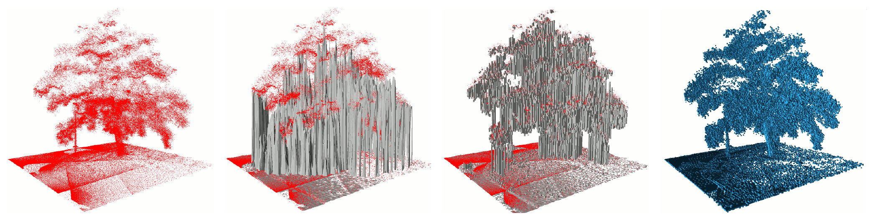
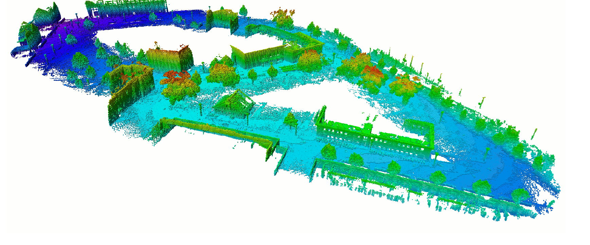
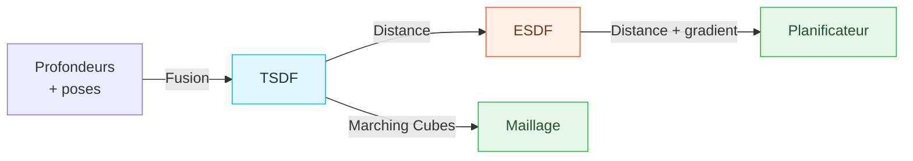
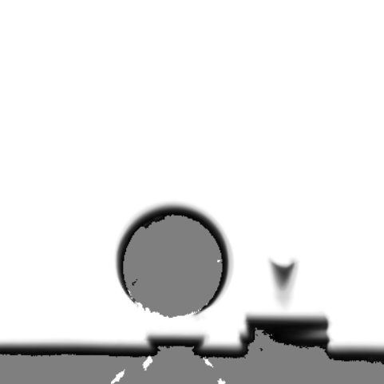
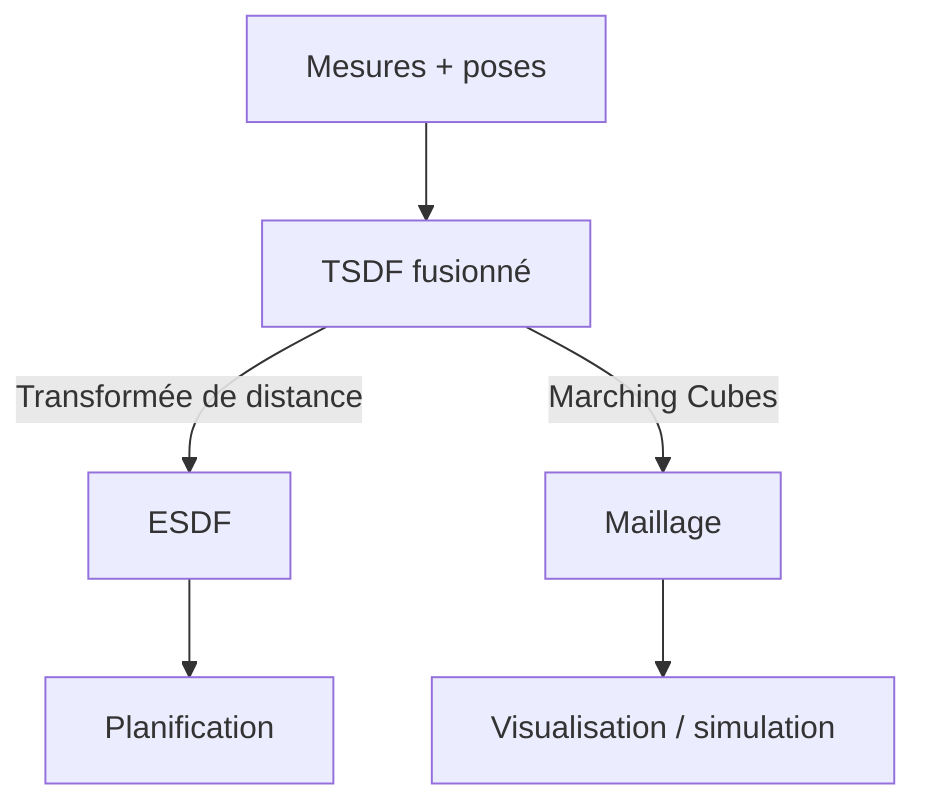
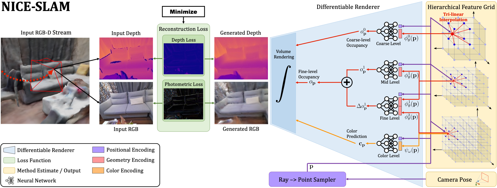

# Représentations 3D de Cartes

**INF8422 : Perception Robotique et Intelligence Spatiale**

<span class="text-sm opacity-70">Représentations 3D sparse et denses</span>

Prof. Pierre-Yves Lajoie


<div class="cover-footer-bar mt-4">
  <span style="background:#CF1C24" />
  <span style="background:#F15A22" />
  <span style="background:#25B34B" />
  <span style="background:#00BDF2" />
</div>

---
hideInToc: true
---

# Agenda

<div class="grid grid-cols-2 gap-8 mt-8">
<div>

### 1. Décrire la carte

Occupation, élévation, primitives, sémantique.

### 2. Stocker les données

Voxels, tables de hachage et octrees.

### 3. Représenter les surfaces

ESDF, TSDF et maillages.

</div>
<div>

### 4. Choisir selon le contexte

Environnement, dynamique et tâche.

### 5. Passer à l'action

Recherche de chemin, marges, optimisation et exploration.

</div>
</div>

---
layout: section
---

# Représentations de Surfaces et Volumes

---
hideInToc: true
---

# Qu'est-ce qu'une Carte ?

<div class="grid grid-cols-2 gap-6 mt-3">
<div>

La **même scène** peut être représentée de multiples façons selon la tâche :


<p class="text-xs text-center text-gray-500 mt-1">Un même arbre scanné : nuage de points · carte d'élévation · multi-level surface · voxels <em>(Hornung et al., OctoMap 2013)</em></p>

</div>
<div>

**Choix de représentation selon la tâche :**

| **Tâche** | **Représentation idéale** |
|---|---|
| Localisation | Points sparse, landmarks |
| Navigation autonome | Grille d'occupation / ESDF |
| Inspection de surface | Maillage (mesh) dense |
| Planification de trajectoire | ESDF (gradients de distance) |
| Simulation / AR | Maillage texturé |
| Compréhension sémantique | Carte sémantique + objets |

<InfoBlock title="Pas de représentation universelle">

Chaque représentation est un compromis entre mémoire, vitesse de construction, vitesse d'accès, et précision.
Les systèmes modernes combinent souvent plusieurs représentations en parallèle.

</InfoBlock>

</div>
</div>

---
hideInToc: true
---

# Les 3 Questions Fondamentales

<div class="grid grid-cols-3 gap-4 mt-4">
<div class="border rounded-lg p-4" style="border-color:#CF1C24">

### Q1 — Quoi estimer ?

**Occupation** ou **Distance** ?

- P(occupé) → navigation, exploration
- SDF/TSDF → reconstruction surface, fusion
- ESDF → planification (gradients de distance)

</div>
<div class="border rounded-lg p-4" style="border-color:#F15A22">

### Q2 — Comment représenter ?

**Explicite** ou **Implicite** ?

- **Explicite :** géométrie directe (triangles, points)
- **Implicite :** fonction $f(\mathbf{x})$ dont le niveau zéro est la surface

</div>
<div class="border rounded-lg p-4" style="border-color:#25B34B">

### Q3 — Quelle structure de données ?

**Grille**, **Arbre** ou **Table de hachage** ?

- Grille uniforme : simple, $O(1)$ accès, $O(N^3)$ mémoire
- Octree : hiérarchique, multi-résolution, $O(\log N)$
- Hash map spatiale : $O(1)$ amorti, domaine extensible. Collisions de hachage et surcoût de stockage.

</div>
</div>

<!--div class="mt-4">
<AlertBlock title="Fil conducteur du cours">

Ces 3 questions structurent toutes les représentations que nous allons voir.
Chaque système (Voxblox, OctoMap, KinectFusion…) est un choix particulier à ces 3 questions.

</AlertBlock>
</div-->

---
hideInToc: true
---

# Explicite vs Implicite — Comment Décrire la Géométrie ?

<div class="grid grid-cols-2 gap-6 mt-3">
<div>

## Représentation Explicite
La géométrie est **directement encodée** :
- Triangles, polygones et points
- On peut itérer sur la surface
- Accès direct aux éléments géométriques

**Avantages :** rendu rapide, modification directe
**Inconvénients :** connectivité à maintenir ; requêtes spatiales nécessitant une structure adaptée


</div>
<div>

## Représentation Implicite
La surface est le **zéro-niveau d'une fonction** $f(\mathbf{x})$ :
$$\mathcal{S} = \{ \mathbf{x} \mid f(\mathbf{x}) = 0 \}$$

**Avantages :** topologie flexible, interpolation naturelle, gradients disponibles
**Inconvénients :** extraction de surface nécessaire (e.g. Marching Cubes)
</div>
</div>

**Deux façons de décrire une même surface :**

| | **Explicite** | **Implicite** |
|---|---|---|
| **Surface stockée** | Points, triangles | Ensemble des zéros de $f$ |
| **Requête typique** | Parcourir les éléments géométriques | Évaluer $f(\mathbf{x})$ |

---
hideInToc: true
---

# Explicite vs Implicite — Visualisation Interactive

Déplacez et déformez les objets sur la carte 2D, puis « extrayez » le maillage explicite.

<ImplicitExplicitAnimation class="mt-1" />

---
layout: section
disabled: true
---

# Quantités Estimées : Occupation vs Distance

---
hideInToc: true
---

# Grille d'Occupation 2D — la Carte Classique

<div class="grid grid-cols-2 gap-6 mt-3">
<div>

La **grille d'occupation 2D** est la représentation historique et la plus répandue en robotique mobile (Elfes & Moravec, 1985).

- L'espace au sol est divisé en cellules carrées $m_k$
- Chaque cellule stocke $P(m_k = \text{occupé}) \in [0,1]$
- Trois états utiles : **libre** / **occupé** / **inconnu**

**Omniprésente en pratique :**
- **Costmaps** de ROS (`nav2`, `move_base`)
- Planification 2D (A\*, Dijkstra)
- Aspirateurs, AGV d'entrepôt, robots de service

</div>
<div>

<InfoBlock title="Du 2D au 3D">

Le même formalisme probabiliste (log-odds, modèle de capteur) se **généralise directement** en 3D :

$$\text{grille 2D } (i,j) \;\longrightarrow\; \text{grille 3D } (i,j,k)$$

Seule la dimension change ; les mises à jour restent identiques. Les prochaines slides traitent le cas **3D** (plus général), mais tout s'applique au cas 2D.

</InfoBlock>

<AlertBlock>

En 2D la mémoire est en ($O(N^2)$) ; en 3D elle explose ($O(N^3)$) → d'où les structures creuses (octree, hashing) vues plus loin.

</AlertBlock>

</div>
</div>

---
hideInToc: true
---

# Cartes d'Occupation (*Occupancy Maps*)

<div class="grid grid-cols-2 gap-6 mt-3">
<div>

**Principe :** diviser l'espace en cellules $m_k$ et estimer :
$$P(m_k \mid z_{1:t},\, x_{1:t})$$

**Hypothèse d'indépendance** (entre cellules) :
$$P(m \mid z_{1:t}) = \prod_k P(m_k \mid z_{1:t})$$

Chaque cellule est classifiée : **Libre** / **Occupé** / **Inconnu**

**Modèle de capteur :**
- Le rayon traverse → cellule libre
- Le rayon s'arrête → cellule occupée

</div>
<div>

<div class="flex justify-center">
<svg viewBox="0 0 220 150" width="215">
  <!-- grille 6x6 -->
  <g stroke="#e2e8f0" stroke-width="1" fill="none">
    <rect v-for="n in 36" :key="n" :x="10 + ((n-1)%6)*32" :y="6 + Math.floor((n-1)/6)*22" width="32" height="22"/>
  </g>
  <!-- cellules libres traversées (bleu) -->
  <g fill="#00BDF2" style="opacity:0.35">
    <rect x="10" y="116" width="32" height="22"/><rect x="42" y="94" width="32" height="22"/>
    <rect x="74" y="72" width="32" height="22"/><rect x="106" y="50" width="32" height="22"/>
  </g>
  <!-- cellule occupée (impact, rouge) -->
  <rect x="138" y="28" width="32" height="22" fill="#CF1C24" style="opacity:0.75"/>
  <!-- rayon -->
  <line x1="16" y1="135" x2="150" y2="42" stroke="#F15A22" stroke-width="2" stroke-dasharray="4,2"/>
  <circle cx="16" cy="135" r="4" fill="#334155"/>
  <text x="16" y="148" style="font-size:7px;fill:#334155;font-family:sans-serif">capteur</text>
  <text x="150" y="24" style="font-size:7px;fill:#CF1C24;font-weight:700;font-family:sans-serif">occupé</text>
  <text x="60" y="90" style="font-size:7px;fill:#0284c7;font-weight:700;font-family:sans-serif">libre</text>
</svg>
</div>
<p class="text-xs text-center text-gray-500">Modèle inverse : cellules traversées = libres, impact = occupé</p>

**Avantages :**
- Simple et efficace
- Distingue explicitement libre / occupé / inconnu
- Essentiel pour l'exploration (trouver les zones inconnues)
- Correction si l'espace devient libre (objet bougé)

**Inconvénients :**
- Discrétisation fixe (pas de multi-résolution)
- Ne capture pas la corrélation spatiale
- $O(N^3)$ mémoire pour une grille 3D uniforme

</div>
</div>

---
hideInToc: true
---

# Mise à jour Log-Odds

<div class="grid grid-cols-2 gap-6 mt-3">
<div>

**Log-odds ratio :**
$$l(x) = \log \frac{p(x)}{1 - p(x)}$$

Propriété clé : la mise à jour devient **additive**, ce qui est beaucoup plus stable.

**Mise à jour log-odds :**

$$l(m_k \mid z_{1:t}) = l(m_k \mid z_{1:t-1}) + l(m_k \mid z_t) - l_0$$

où $l_0 = \log \frac{P(m_k)}{1-P(m_k)}$ est le log-odds prior.

**Modèle de capteur :**
$$l_{free} < 0 \quad \text{(rayon passe)}$$
$$l_{occ} > 0 \quad \text{(rayon s'arrête)}$$

</div>
<div>

**Conversion inverse** pour retrouver la probabilité d'occupation :
$$p(m_k) = 1 - \frac{1}{1 + \exp(l(m_k))}$$

**Clamping :** $l \in [l_{min}, l_{max}]$ pour éviter la saturation.

<!--ExampleBlock title="Valeurs typiques">

Velodyne/Octomap : $l_{free} = -0.85$, $l_{occ} = +2.19$, $l_0 = 0$

Après 5 observations "libre" : $l = -4.25 \to P = 0.014$

Après 5 observations "occupé" : $l = +10.95 \to P = 0.9999$

</ExampleBlock-->

</div>
</div>

---
hideInToc: true
---

# Mise à jour Log-Odds — Visualisation Interactive

Chaque rayon ajoute $l_{free}$ aux cellules traversées et $l_{occ}$ à l'impact. Suivez une cellule le long de la sigmoïde $P = 1- 1/(1+e^{-l})$ et l'effet du *clamping*.

<LogOddsUpdateAnimation class="mt-1" />


---
hideInToc: true
---

# Cartes d'Élévation (2.5D)

<div class="grid grid-cols-2 gap-6 mt-3">
<div>

**Principe :** une grille horizontale $(x,y)$ où chaque cellule stocke une **seule hauteur** $z = h(x,y)$.

$$h : \mathbb{R}^2 \to \mathbb{R}$$

**« 2.5D »** : entre la 2D (grille plane) et la 3D (volume complet). On capture le relief du sol sans le coût d'une grille de voxels 3D.

**Avantages :**
- Très **compact** et rapide (une valeur par cellule)
- Idéal pour la **navigation au sol** (rovers, robots à pattes)
- Gradients de pente directement disponibles

**Limite fondamentale — les surplombs :**
Une seule hauteur par cellule → **impossible** de représenter un pont, un tunnel, une branche (deux surfaces à la même $(x,y)$).

</div>
<div>

<InfoBlock title="Multi-Level Surface (MLS) maps">

Extension : stocker **plusieurs** hauteurs (surfaces) par cellule → gère les surplombs, tout en restant bien plus léger qu'une grille 3D dense.

</InfoBlock>

<ExampleBlock title="Systèmes">

**GridMap** (ANYbotics, robots quadrupèdes), **Elevation Mapping** (locomotion sur terrain accidenté), cartes DEM (télédétection, photogrammétrie).

</ExampleBlock>

<AlertBlock>

Représentation **classique** en robotique terrestre, souvent préférée aux voxels 3D quand le monde est essentiellement un terrain.

</AlertBlock>

</div>
</div>

---
hideInToc: true
---

# Cartes d'Élévation 2.5D — Visualisation Interactive

<div></div>

**▶ Scanner** : la carte se construit hit par hit. Mêmes mesures, deux règles de stockage, en 2.5D le tablier du pont *écrase* le sol ; en MLS les hits se regroupent en surfaces.

<ElevationMapAnimation class="mt-1" />

---
hideInToc: true
---

# Cartes de Plans et de Primitives

<div class="grid grid-cols-2 gap-6 mt-3">
<div>

**Idée :** dans un environnement **structuré** (intérieurs, usines), la géométrie se résume à quelques **primitives** : plans (murs, sol, plafond), cylindres, sphères.

**Ajustement de plan** (par cellule ou région) :
$$\mathbf{n}^\top \mathbf{p} + d = 0, \quad \|\mathbf{n}\| = 1$$
, où $d$ est la distance du plan de l'origine.

**Extraction** : **RANSAC** (robuste aux mesures aberrantes) ou croissance de région sur les normales.

**Avantages :**
- Extrêmement **compact** (un mur = 4 nombres $(\mathbf{n}, d)$ vs millions de points)
- **Robuste** : moyenne beaucoup de mesures bruitées
- Contraintes fortes pour le SLAM (plans comme landmarks)

</div>
<div>

<div class="flex justify-center mt-1">
<svg viewBox="0 0 250 120" width="240">
  <!-- points le long d'un mur (vertical) + sol (horizontal) -->
  <g fill="#00BDF2">
    <circle cx="42" cy="18" r="2"/><circle cx="46" cy="34" r="2"/><circle cx="40" cy="50" r="2"/>
    <circle cx="45" cy="66" r="2"/><circle cx="41" cy="82" r="2"/><circle cx="47" cy="96" r="2"/>
    <circle cx="70" cy="100" r="2"/><circle cx="95" cy="103" r="2"/><circle cx="120" cy="99" r="2"/>
    <circle cx="145" cy="104" r="2"/><circle cx="170" cy="101" r="2"/><circle cx="195" cy="103" r="2"/>
  </g>
  <!-- plans ajustés -->
  <line x1="43" y1="10" x2="43" y2="104" stroke="#CF1C24" stroke-width="2.5"/>
  <text x="20" y="14" style="font-size:8px;fill:#CF1C24;font-family:sans-serif">mur</text>
  <line x1="40" y1="102" x2="205" y2="102" stroke="#25B34B" stroke-width="2.5"/>
  <text x="150" y="116" style="font-size:8px;fill:#25B34B;font-family:sans-serif">sol</text>
  <text x="120" y="30" style="font-size:8px;fill:#64748b;font-style:italic;font-family:sans-serif">RANSAC → plans</text>
</svg>
</div>

<InfoBlock title="SLAM planaire">

Utiliser les plans comme **contraintes/landmarks** dans le graphe de facteurs : très efficace en intérieur. Ex : **CPA-SLAM**, LiDAR planaire (LOAM = arêtes + plans).

</InfoBlock>

<AlertBlock>

Limité aux environnements **structurés**, inadapté à la végétation ou aux terrains semi- ou non-structurés.

</AlertBlock>

</div>
</div>

---
hideInToc: true
---

# Cartes Sémantiques

<div class="grid grid-cols-2 gap-6 mt-3">
<div>

**Idée :** enrichir chaque élément géométrique (voxel, point, triangle) d'un **label** : la carte dit *où* **et** *quoi*.

**Fusion bayésienne des labels** (par cellule) : un réseau de segmentation prédit $p_k(c \mid \text{image})$ par pixel ; reprojeté sur le voxel, on accumule :
$$P_k(c) \propto P_{k-1}(c) \cdot p_k(c \mid \text{image})$$

La même logique multiplicative que le log-odds, mais **multi-classe**.

**Trois niveaux :**
- **Sémantique** : classe par cellule (mur, chaise…)
- **Instance** : chaise #1 ≠ chaise #2
- **Panoptique** : différencie entre *stuff* (mur, sol) et *things* (objets)

</div>
<div>

<div class="flex justify-center">
<svg viewBox="0 0 250 120" width="235">
  <!-- pièce voxelisée (coupe) -->
  <g stroke="white" stroke-width="0.6">
    <!-- mur gauche + droit -->
    <rect v-for="r in 6" :key="`w${r}`" x="18" :y="8 + (r-1)*16" width="16" height="16" fill="#64748b"/>
    <rect v-for="r in 6" :key="`x${r}`" x="216" :y="8 + (r-1)*16" width="16" height="16" fill="#64748b"/>
    <!-- sol -->
    <rect v-for="c in 11" :key="`f${c}`" :x="34 + (c-1)*16.5" y="88" width="16.5" height="16" fill="#a8a29e"/>
    <!-- table -->
    <rect x="70" y="72" width="50" height="8" fill="#F15A22"/>
    <rect x="76" y="80" width="8" height="8" fill="#F15A22"/><rect x="106" y="80" width="8" height="8" fill="#F15A22"/>
    <!-- plante -->
    <rect x="170" y="64" width="16" height="24" fill="#25B34B"/>
  </g>
  <!-- labels -->
  <text x="26" y="4" text-anchor="middle" style="font-size:6.5px;fill:#64748b;font-family:sans-serif">mur</text>
  <text x="125" y="116" text-anchor="middle" style="font-size:6.5px;fill:#78716c;font-family:sans-serif">sol</text>
  <text x="95" y="66" text-anchor="middle" style="font-size:6.5px;fill:#F15A22;font-weight:700;font-family:sans-serif">table #1</text>
  <text x="178" y="58" text-anchor="middle" style="font-size:6.5px;fill:#15803d;font-weight:700;font-family:sans-serif">plante #1</text>
  <text x="125" y="40" text-anchor="middle" style="font-size:7px;fill:#94a3b8;font-style:italic;font-family:sans-serif">chaque voxel : géométrie + P(classe)</text>
</svg>
</div>

<ExampleBlock title="Systèmes">

**Kimera-Semantics** (maillage sémantique), **Panoptic Multi-TSDFs** (une sous-carte TSDF par objet). Les représentations TSDF et maillage sont détaillées plus loin.

</ExampleBlock>

<InfoBlock title="Ce que ça débloque">

Navigation contextuelle (« va à la cuisine »), manipulation (saisir *la tasse*), inspection ciblée, cartes long-terme (les objets bougent, les murs non).

</InfoBlock>

<AlertBlock>

La **géométrie** vient toujours des représentations de ce cours, le réseau de neurones ne fournit que les labels.

</AlertBlock>

</div>
</div>

---
hideInToc: true
---

# Voxels

<div class="grid grid-cols-2 gap-6 mt-3">
<div>

**Voxel = "Volumetric Pixel"**: discrétisation régulière de l'espace 3D.

Chaque voxel $(i,j,k)$ contient une propriété :
- $P(\text{occupé})$ → carte d'occupation
- Valeur TSDF → reconstruction de surface
- Couleur, label sémantique, etc.

**Accès direct :** indexation $(i,j,k)$ → $O(1)$

**Voisinage immédiat :** les 6 (face), 18 (arête) ou 26 (coin) voisins

**Problème :** $O(N^3)$ mémoire — la plupart des voxels sont vides !

Exemple : 100m × 100m × 10m à 5 cm → $\sim 8 \times 10^8$ voxels

</div>
<div>

<!-- IMAGE: voxel_grid.png — Grille 3D de voxels colorés par leur valeur TSDF (bleu=libre, rouge=occupé) avec un robot visible -->

**Observation clé :** les surfaces 3D forment une **variété 2D** dans l'espace 3D → la quasi-totalité des voxels sont vides.

<InfoBlock title="Stocker seulement les voxels utiles">

Plutôt qu'une grille dense $O(N^3)$, on n'alloue que les $S$ voxels nécessaires ($S \ll N^3$) via des **structures creuses** : octree ou table de hachage spatiale.

</InfoBlock>

<AlertBlock>

Les prochaines diapos comparent les **tables de hachage spatiales** et les **octrees**.

</AlertBlock>

</div>
</div>


---
layout: section
disabled: true
---

# Structures de Données pour la Cartographie Dense

---
hideInToc: true
---

# Le Défi des Données Denses

<div class="grid grid-cols-2 gap-6 mt-3">
<div>

**Exemple concret :**

Carte 100m × 100m × 10m à résolution 5 cm :

$$M = \frac{100 \times 100 \times 10}{0.05^3} \approx 8 \times 10^8 \text{ voxels}$$

À 4 bytes par voxel → **3.2 Go** de RAM juste pour la grille, **vide pour la plupart**.

**Observation clé :**

L'environnement réel est **sparse** :
- La majorité de l'espace est vide (air)
- Les surfaces 3D sont des **variétés 2D** dans un espace 3D
- La reconstruction privilégie les surfaces ; la navigation a aussi besoin de l'espace libre

</div>
<div>

**Objectif :** stocker **uniquement** ce qui est nécessaire.

<AlertBlock title="Compromis fondamental">

**Grille uniforme :** accès $O(1)$, mémoire $O(N^3)$

**Octree :** accès $O(\log N)$, mémoire $O(S)$

**Hash map spatiale :** accès $O(1)$ amorti, mémoire $O(S)$

$N$ : résolution par axe ; $S$ : éléments stockés, souvent $S\ll N^3$.

Pas de solution universelle. Dépend aussi du matériel (CPU/GPU) et de la tâche.

</AlertBlock>

</div>
</div>

---
hideInToc: true
---

# Hash Maps Spatiales

<div class="grid grid-cols-2 gap-6 mt-3">
<div>

**Principe :** diviser l'espace en **blocs** (groupes de voxels) et les mapper via une fonction de hachage.

**Fonction de hachage spatiale :**
$$h(i, j, k) = (i \cdot p_1 \oplus j \cdot p_2 \oplus k \cdot p_3) \mod M$$

où $p_1, p_2, p_3$ sont des grands nombres premiers.

**Structure :**
- Clé : coordonnées du bloc $(i,j,k)$
- Valeur : pointeur vers le bloc de voxels

**Voxel Hashing (Niessner 2013) :**
- Blocs de $8^3 = 512$ voxels (GPU-friendly)
- Dense à l'intérieur de chaque bloc (tableau linéaire)
- Sparse au niveau des blocs (hash map)

</div>
<div>

**Avantages :**
- Accès $O(1)$ amorti (comme une table de hachage classique)
- Domaine **infini** (pas de bornes pré-définies)
- Mémoire : alloue seulement les blocs observés

**Considérations :**
- Pas de localité en mémoire: pas d'accès par segment
- Collisions : rares avec bonne fonction de hachage
- Granularité du bloc : compromis accès vs overhead mémoire

<InfoBlock title="Exemple : Voxblox">

Voxblox utilise des blocs de voxels indexés par hachage pour la cartographie en temps réel.

</InfoBlock>

</div>
</div>

---
hideInToc: true
disabled: true
---

# Hash Maps Spatiales — Visualisation Interactive

<div></div>

Le robot parcourt un couloir en L : seuls les blocs **observés** sont alloués via $h(i,j,k)$ — l'espace jamais vu ne coûte rien en mémoire.

<HashMapSpatialAnimation class="mt-1" />

---
hideInToc: true
---

# Arbres et Octrees

<div class="grid grid-cols-2 gap-6 mt-3">
<div>

**Principe :** décomposition **hiérarchique** récursive de l'espace.

**Octree :** chaque octant est divisé en 8 enfants de taille $1/2$.

Un nœud est **subdivisé** uniquement si son contenu est hétérogène (surface + espace libre).

**Avantages :**
- **Multi-résolution intrinsèque** : zones uniformes restent grossières
- Compression efficace des zones libres/occupées uniformes
- Recherche de voisinage rapide

**Inconvénients :**
- Accès $O(\log N)$ (descente de l'arbre)
- Moins GPU-friendly que le hash map

</div>
<div>


<p class="text-xs text-center text-gray-500 mt-1">Octree du campus de Fribourg (292 × 167 × 28 m, 20 cm), hauteur en couleur <em>(OctoMap 2013)</em></p>

**OctoMap (Hornung 2013) :**
- Octree probabiliste avec log-odds
- **Pruning :** fusionner les enfants si même valeur → compression
- Open source, intégré à ROS
- Représentation standard pour la navigation mobile

<ExampleBlock title="Résolution adaptative">

OctoMap permet de requêter à différentes résolutions :
$2^k$ × résolution minimale, en remontant l'arbre.

</ExampleBlock>

</div>
</div>

---
hideInToc: true
---

# Arbres et Octrees — Visualisation Interactive

<div></div>

Cliquez pour ajouter/retirer des obstacles : la subdivision ne descend que là où le contenu est **hétérogène*. Comparez le nombre de nœuds à celui d'une grille dense.

<OctreeDecompositionAnimation class="mt-1" />

---
hideInToc: true
disabled: true
---

# Structures de Données Hybrides

<div class="grid grid-cols-2 gap-6 mt-3">
<div>

**Idée :** combiner les avantages du hash map ($O(1)$ accès) et de la grille dense (localité mémoire, GPU).

### Voxel Hashing / Hashed Voxel Grids (Niessner 2013)
- **Hash map de blocs** (ex: $8^3$ voxels par bloc)
- Chaque bloc est **dense** (tableau linéaire) → GPU-friendly
- Gestion sparse au niveau des blocs uniquement

### VDB — Volumetric Dynamic B-tree (Museth 2013)
- B+ tree volumétrique à très grand fan-out
- Standard de l'industrie VFX (OpenVDB → DreamWorks, Pixar)
- Désormais utilisé en robotique (VDB-Fusion, VDB-EDT)
- Accès quasi-constant, multi-résolution, itérateurs rapides
- Bibliothèque open-source : **nanovdb** pour GPU

</div>
<div>

**Comparaison :**

| Structure | Accès | Multi-résolution | GPU | Domaine |
|---|---|---|---|---|
| Grille uniforme | $O(1)$ | Non | ✓✓ | Borné |
| Octree (OctoMap) | $O(\log N)$ | Oui | ✗ | Infini |
| Voxel Hashing | $O(1)$ amorti | Non | ✓✓ | Infini |
| VDB | $O(1)$ amorti | Oui | ✓ (NanoVDB) | Infini |

<InfoBlock title="Tendance actuelle">

VDB s'impose comme le standard pour la cartographie dense en robotique :
**VDB-Fusion**, **VDB-EDT** (pour ESDF), **nvblox** (NVIDIA, NanoVDB sur GPU).

</InfoBlock>

</div>
</div>

---
hideInToc: true
---

# Surfaces Implicites

<div class="grid grid-cols-2 gap-6 mt-3">
<div>

**Rappel** : surface = niveau zéro de $f : \mathbb{R}^3 \to \mathbb{R}$, avec $f < 0$ à l'intérieur, $f > 0$ à l'extérieur.

**Toutes les fonctions implicites ne se valent pas :**

- $f_1(x,y) = x^2 + y^2 - r^2$: le **signe** est correct, mais la valeur n'est pas dans les bonnes unités (des m²…)
- $f_2(x,y) = \sqrt{x^2 + y^2} - r$: la valeur **est** la distance signée au cercle

**SDF (*Signed Distance Function*) :**
$$f(\mathbf{p}) = \pm\, d(\mathbf{p}, \mathcal{S})$$

**Normale gratuite :**
$$\mathbf{n} = \frac{\nabla f}{\|\nabla f\|} \qquad \left(\text{SDF régulière} : \|\nabla f\| = 1\right)$$

</div>
<div>

**Pourquoi vouloir une SDF :**

1. **Marge de sécurité directe** : $f(\mathbf{p}) > r_{robot} \iff$ pas de collision ($r_{robot}$ est le rayon englobant du robot)
2. **Gradient = direction d'évitement** : $\nabla f$ pointe vers l'extérieur
3. **Topologie flexible** : l'union se décrit par $\min(f_1,f_2)$ ; le champ obtenu n'est pas forcément une distance exacte partout (comme dans l'animation explicite / implicite)

<InfoBlock title="La suite logique">

Deux champs de distance pratiques en robotique : l'**ESDF** (euclidienne, pour la planification) et la **TSDF** (projective et tronquée, pour la fusion).

</InfoBlock>

</div>
</div>

---
hideInToc: true
---

# ESDF — Distance à la Surface la Plus Proche

<div class="grid grid-cols-2 gap-7 mt-4">
<div>

**ESDF** : champ de distance euclidienne signé.

$$d(\mathbf{x}) = s(\mathbf{x})\min_{\mathbf{p}\in\mathcal S}\|\mathbf{x}-\mathbf{p}\|_2$$

- **Extérieur :** $d>0$
- **Surface :** $d=0$
- **Intérieur :** $d<0$

$\mathcal S$ est la surface des obstacles ; $s\in\{-1,+1\}$ indique le côté.

<InfoBlock title="Occupation → distance">

L'occupation répond **« est-ce occupé ? »** ; l'ESDF répond **« à quelle distance est l'obstacle ? »**

</InfoBlock>

</div>
<div>

<svg viewBox="0 0 300 145" width="340" class="mx-auto">
  <rect x="180" y="15" width="100" height="110" rx="4" fill="#fee2e2"/>
  <line x1="180" y1="15" x2="180" y2="125" stroke="#CF1C24" stroke-width="3"/>
  <circle cx="65" cy="70" r="5" fill="#00BDF2"/>
  <line x1="65" y1="70" x2="180" y2="70" stroke="#00BDF2" stroke-width="2"/>
  <text x="105" y="60" style="font-size:14px" fill="#0369a1">d &gt; 0</text>
  <circle cx="230" cy="70" r="5" fill="#CF1C24"/>
  <line x1="180" y1="70" x2="230" y2="70" stroke="#CF1C24" stroke-width="2"/>
  <text x="207" y="60" style="font-size:14px" fill="#991b1b">d &lt; 0</text>
  <text x="20" y="135" style="font-size:12px" fill="#475569">espace libre</text>
  <text x="162" y="140" style="font-size:12px" fill="#475569">surface</text>
</svg>

**Pour planifier :**

- Comparer $d$ au **rayon du robot + marge**.
- Utiliser $\nabla d$ pour s'éloigner des obstacles.
- Interpoler la grille pour interroger une position continue.

<p class="text-sm text-gray-600">Sur une grille, la précision dépend de la résolution et de la convention de surface.</p>

</div>
</div>

<!--
L'ESDF idéal mesure la distance à la surface continue. Les diapos suivantes
calculent exactement une transformée aux sites discrets (centres des voxels).
Deux transformées vers les classes opposées donnent une approximation signée
avec un zéro interpolé entre les classes, pas une distance exacte aux faces.
Le gradient peut être indéfini à égale distance de plusieurs surfaces.
L'inconnu reste masqué ; une distance calculée n'est pas une preuve d'espace libre.
-->

---
hideInToc: true
---

# Construire l'ESDF — Initialiser, Puis Balayer X

<div class="grid grid-cols-2 gap-7 mt-4">
<div>

**1. Définir la grille** : domaine et taille de voxel $h$.

**2. Initialiser les sites** :
- obstacle observé → **0** ;
- autres sites → **$\infty$** ;
- conserver séparément le masque **observé / inconnu**.

**3. Pour chaque ligne suivant X :**

Passe **avant** →
$$g_i\leftarrow\min(g_i,\,g_{i-1}+1)$$

Passe **arrière** ←
$$g_i\leftarrow\min(g_i,\,g_{i+1}+1)$$

</div>
<div>

**Une ligne — distances en nombre de voxels**

<table class="edt-example">
<tr><th>Initial</th><td>∞</td><td>∞</td><td class="obstacle">0</td><td>∞</td><td>∞</td><td>∞</td><td class="obstacle">0</td></tr>
<tr><th>Avant →</th><td>∞</td><td>∞</td><td class="obstacle">0</td><td>1</td><td>2</td><td>3</td><td class="obstacle">0</td></tr>
<tr><th>Arrière ←</th><td>2</td><td>1</td><td class="obstacle">0</td><td>1</td><td>2</td><td>1</td><td class="obstacle">0</td></tr>
</table>

<InfoBlock title="Pourquoi deux sens ?">

L'obstacle le plus proche peut se trouver **à gauche ou à droite**.
Après les deux passes, chaque site connaît sa distance à un obstacle **sur cette ligne**.

</InfoBlock>

Pour combiner les axes, on garde ensuite les **carrés** : $D_X=g^2$.

<p class="text-sm text-gray-600">Sans obstacle sur une ligne, ses valeurs restent à ∞ à cette étape.</p>

</div>
</div>

<style>
.edt-example { width: 100%; margin: 18px 0; text-align: center; }
.edt-example td { min-width: 30px; background: #e0f2fe; }
.edt-example td.obstacle { background: #fee2e2; color: #991b1b; font-weight: 700; }
.edt-example th { text-align: left; white-space: nowrap; }
</style>

<!--
Convention de cette première phase : g en unités de voxel. Les récurrences +1
sont exactes pour cette distance 1D binaire. On les applique dans les deux sens
sur chaque ligne, sans propager entre les lignes. L'inconnu n'est pas une source.
La transformée est géométrique : les distances ne suivent pas des chemins libres.
Référence : Meijster, Roerdink et Hesselink, ISMM 2000, première phase.
https://www.cs.rug.nl/~roe/publications/DistTrafoLinearTime-ISMM2000.pdf
-->

---
hideInToc: true
---

# Construire l'ESDF — Compléter Y, Z et le Signe

<div class="grid grid-cols-2 gap-7 mt-4">
<div>

**4. Combiner les axes en distances au carré**

Pour chaque colonne Y :
$$D_{XY}(x,y)=\min_j\big[D_X(x,j)+(y-j)^2\big]$$

- Passe **avant** : sélectionner les candidats utiles.
- Passe **arrière** : évaluer le minimum à chaque site.
- En 3D, répéter la même opération suivant **Z**.

**5. Prendre la racine et convertir en mètres**
$$d_{\mathrm{ext}}=h\sqrt{D_{XYZ}}$$

Trois axes, un travail linéaire par ligne : **$O(M)$** pour $M$ voxels au total.

</div>
<div>

**La combinaison est euclidienne**

<svg viewBox="0 0 280 110" width="300" class="mx-auto">
<path d="M40 15 L40 90 L140 90 Z" fill="#e0f2fe" stroke="#00BDF2" stroke-width="2"/>
<circle cx="40" cy="15" r="5" fill="#CF1C24"/>
<circle cx="140" cy="90" r="5" fill="#0369a1"/>
<text x="20" y="58" style="font-size:13px" fill="#475569">3</text>
<text x="85" y="108" style="font-size:13px" fill="#475569">4</text>
<text x="110" y="43" style="font-size:14px" fill="#0369a1">√(3² + 4²) = 5</text>
</svg>

**6. Distinguer intérieur et extérieur**

- Libre observé : distance **positive** aux sites occupés.
- Occupé : distance **négative** aux sites libres, obtenue par une seconde transformée.
- Inconnu : **pas de distance exploitable** pour naviguer.

<p class="text-sm text-gray-600">Convention discrète : distances aux <strong>centres de la classe opposée</strong>. Le zéro est entre les classes.</p>

</div>
</div>

<InfoBlock title="Lorsque la carte change">

Recalculer les distances affectées. La démonstration suivante rejoue les passes sur toute la petite grille.

</InfoBlock>

<!--
Sur Y puis Z, répéter simplement min(voisin+1) produirait une distance de Manhattan.
La transformée 1D exacte minimise f(j)+(i-j)^2 : on construit l'enveloppe inférieure
des paraboles en passe avant, puis on l'évalue en passe arrière. Les sites de coût
infini sont ignorés ; une ligne sans candidat reste infinie. Le résultat se combine
sur tous les axes avant la racine. L'animation 2D utilise ce calcul, aussi partagé
avec l'animation d'optimisation de trajectoire.
Pour le signe : d=+h*sqrt(EDT(occupé)) dans le libre, -h*sqrt(EDT(libre)) dans
l'occupé. Cela approxime la distance à la surface physique ; pas d'offset h/2
universel, notamment aux diagonales. Une grille d'occupation fournit déjà la classe,
aucun flood-fill n'est nécessaire. Un domaine non observé reste masqué, jamais
classé intérieur par défaut. Avec une surface ouverte, on ne peut déduire un solide
fermé par simple absence d'observation.
Le recalcul incrémental peut s'étendre au-delà des voxels modifiés : un obstacle
retiré influençait peut-être une grande région. Borner d ne réduit pas à lui seul
la mémoire ; il faut aussi limiter le domaine alloué. Ces optimisations restent
hors du fil principal du cours.
Sources : Meijster et al., ISMM 2000 ; Felzenszwalb et Huttenlocher, ToC 2012.
https://www.cs.rug.nl/~roe/publications/DistTrafoLinearTime-ISMM2000.pdf
https://cs.brown.edu/people/pfelzens/papers/dt-final.pdf
-->

---
hideInToc: true
---

# ESDF — Les Passes Avant et Arrière

Suivez **X → Y → racine et signe**. Cliquez sur une cellule pour ajouter ou retirer un obstacle, puis observez le nouveau champ.

<ESDFPassesAnimation class="mt-2" />

---
hideInToc: true
---

# TSDF — Champ de Distance Tronqué

<div class="grid grid-cols-2 gap-6 mt-3">
<div>

Chaque voxel stocke une **distance projective signée** $F$, tronquée et fusionnée, ainsi qu'un **poids** $W$.

- signe **positif** → devant la surface (espace libre)
- signe **négatif** → juste derrière la surface observée (côté intérieur)

**Exemple — un mur vu par une caméra de profondeur :**

| **Position du voxel** | **Valeur** |
|---|---|
| Sur le mur | $0$ |
| 5 cm devant (air) | $+0.05$ |
| 5 cm dans le mur (solide) | $-0.05$ |
| 2 m dans la pièce ($\delta = 10$ cm) | $+0.10$ (plafonné) |

**Différence avec ESDF :** distance mesurée **le long du rayon** du capteur (projective), pas la distance Euclidienne globale.


</div>
<div>

**Troncature de la distance projective :**
$$f(\mathbf{p}) = \max(-\delta,\, \min(\delta,\, d_{mesure} - d_{point}))$$

La distance est plafonnée à $\pm\delta$. Les voxels à plus de $\delta$ derrière la surface ne sont pas intégrés.

**Mise à jour pondérée (KinectFusion) :**
$$F_{k+1}(\mathbf{x}) = \frac{W_k(\mathbf{x})\, F_k(\mathbf{x}) + w_k\, d_k}{W_k(\mathbf{x}) + w_k}$$
<span class="text-xs opacity-75">$f,d$ : valeur d'**une** mesure isolée &nbsp;·&nbsp; $F,W$ : valeur/poids **fusionnés** en mémoire &nbsp;·&nbsp; $w$ : poids d'une mesure</span>

**Inconnu :** $W=0$. Aucune surface ne doit être déduite d'un voxel sans observation.


<div class="flex justify-center">
<svg viewBox="0 0 230 130" width="245">
  <!-- capteur -->
  <path d="M 15 60 l -8 -6 l 0 12 Z" fill="#334155"/>
  <text x="4" y="78" style="font-size:8px;fill:#334155">capteur</text>
  <!-- rayon du capteur, prolongé jusqu'à la surface -->
  <line x1="15" y1="60" x2="195" y2="70" stroke="#94a3b8" stroke-width="1"/>
  <!-- surface (mur), hachures côté solide -->
  <line x1="145" y1="5" x2="200" y2="125" stroke="#334155" stroke-width="2.5"/>
  <line x1="156.75" y1="30" x2="165.9" y2="25.9" stroke="#334155" stroke-width="1.5"/>
  <line x1="168" y1="55" x2="177.1" y2="50.9" stroke="#334155" stroke-width="1.5"/>
  <line x1="179.25" y1="80" x2="188.4" y2="75.9" stroke="#334155" stroke-width="1.5"/>
  <line x1="190.5" y1="105" x2="199.6" y2="100.9" stroke="#334155" stroke-width="1.5"/>
  <text x="195" y="15" style="font-size:8px;fill:#334155">surface</text>
  <!-- voxel p -->
  <circle cx="110" cy="65" r="3" fill="#CF1C24"/>
  <text x="103" y="58" style="font-size:8px;fill:#CF1C24;font-weight:700">p</text>
  <!-- A : point atteint le long du rayon (utilisé par le TSDF) -->
  <circle cx="174" cy="68" r="2.5" fill="#F15A22"/>
  <text x="178" y="66" style="font-size:8px;fill:#F15A22">A</text>
  <!-- B : point réellement le plus proche (perpendiculaire, utilisé par l'ESDF) -->
  <circle cx="162" cy="42" r="2.5" fill="#00BDF2"/>
  <text x="167" y="40" style="font-size:8px;fill:#00BDF2">B</text>
  <!-- d_proj : p -> A -->
  <line x1="110" y1="65" x2="174" y2="68" stroke="#F15A22" stroke-width="1.3" stroke-dasharray="3,2"/>
  <text x="122" y="80" style="font-size:8px;fill:#F15A22;font-weight:700">d_proj (TSDF)</text>
  <!-- d_eucl : p -> B -->
  <line x1="110" y1="65" x2="162" y2="42" stroke="#00BDF2" stroke-width="1.3" stroke-dasharray="3,2"/>
  <text x="88" y="42" style="font-size:8px;fill:#00BDF2;font-weight:700">d_eucl (ESDF)</text>
</svg>
</div>

</div>
</div>

---
hideInToc: true
---

# TSDF — Visualisation Interactive

Les mesures sont **bruitées** : la moyenne pondérée $F \leftarrow (W F + w\,d)/(W + w)$ lisse le passage par zéro au fil des observations ; $W_{max}$ garde le voxel corrigeable.
<span class="text-xs opacity-75">($F,W$ : valeur et poids déjà fusionnés au voxel &nbsp;·&nbsp; $d,w$ : valeur et poids de la nouvelle mesure)</span>

<TSDFRayCastAnimation class="mt-1" />

---
hideInToc: true
---

# TSDF pour la Fusion, ESDF pour la Planification

Le **TSDF fusionne les observations** ; l'**ESDF fournit les distances** utiles au planificateur.

<div class="tsdf-benefits grid grid-cols-3 gap-6 mt-4">
<div>

### 1. Réduire le bruit

Le TSDF conserve une **moyenne pondérée** des distances et un poids cumulé. Les observations répétées stabilisent la surface.

<p class="text-sm">Les biais, erreurs de pose et valeurs aberrantes demandent un traitement supplémentaire.</p>

</div>
<div>

### 2. Intégrer rapidement

L'écart de profondeur se calcule **le long du rayon**, sans rechercher l'obstacle le plus proche dans toutes les directions.

<p class="text-sm">Mise à jour locale et parallélisable ; l'ESDF ajoute un calcul de distance sur la carte.</p>

</div>
<div>

### 3. Reconstruire la surface

L'interpolation de **$F=0$** situe la surface entre les centres des voxels. Marching Cubes en extrait un maillage.

<p class="text-sm">La précision dépend des mesures et des poses. Une ESDF peut aussi avoir un zéro sous-voxel.</p>

</div>
</div>

<div class="tsdf-hybrid-flow mt-3">



</div>

<p class="text-sm mt-2">L'ESDF se met à jour de façon <strong>incrémentale</strong> : seules les distances affectées sont recalculées. Un faux obstacle non filtré peut influencer toute une région.</p>

<style>
.tsdf-benefits h3 { font-weight: 600; margin-bottom: 0.55rem; }
.tsdf-benefits > div > p:last-child { color: #475569; margin-top: 0.6rem; }
.tsdf-hybrid-flow { width: 100%; text-align: center; }
</style>

<!--
La fusion suppose que les observations sont exprimées dans un repère commun à
l'aide de poses suffisamment précises. Moyenner réduit le bruit aléatoire ;
cela ne garantit ni le rejet des outliers ni la suppression des biais.
Le TSDF stocke ici des distances en mètres, et non des valeurs normalisées.
L'intégration peut parcourir les rayons ou projeter les voxels dans l'image de
profondeur. Le calcul de distance est projectif dans les deux cas.
Une ESDF peut être produite depuis une carte d'occupation déjà filtrée : le TSDF
n'est pas un préalable universel. Ici, on présente l'architecture de Voxblox.
La représentation TSDF est adaptée à la fusion et à l'extraction d'une surface ;
l'ESDF fournit distance et gradient pour les coûts de collision du planificateur.
La capacité d'interpoler un zéro n'est pas exclusive au TSDF ; une ESDF issue
d'une surface continue n'est pas nécessairement limitée aux centres occupés.
Références : Newcombe et al., KinectFusion, ISMAR 2011, sections 3.3 et 3.4.
https://www.microsoft.com/en-us/research/wp-content/uploads/2016/02/ismar2011.pdf
Oleynikova et al., Voxblox, IROS 2017, sections III à V, figure 2.
https://arxiv.org/pdf/1611.03631
-->

---
hideInToc: true
clicks: 4
---

# TSDF → ESDF : Partir de la Surface, Étendre les Distances

Le TSDF localise la **surface** ; on en déduit un champ de **distances pour planifier**.

<TSDFToESDFAnimation :step="$clicks" />

<!--
Exemple 1D idéal, inspiré du principe de bande fixe de Voxblox. Le rayon est
perpendiculaire au mur x=0 : les distances projective et euclidienne coïncident
avant troncature. h=0,2 m, δ=0,4 m. Les centres sont à
[-0,7 ; -0,5 ; -0,3 ; -0,1 ; +0,1 ; +0,3 ; +0,5] m.
Tous sont observés sauf le dernier (W=0), qui reste inconnu à chaque étape.
Les valeurs TSDF sont exprimées en mètres, sans normalisation.

[click] On fixe une bande étroite |F| < h : les amorces +0,1 et −0,1 m.
Leur valeur conserve le décalage entre le centre du voxel et la surface.
Mettre ces amorces à zéro déplacerait artificiellement la surface.
[click] Premier voisin de chaque côté : +0,3 et −0,3 m. On propage |d|,
puis on garde le signe du côté de la surface. Les voxels connus hors bande
sont initialement à une grande distance, représentée ici par « à calculer ».
[click] Le voxel suivant à gauche reçoit +0,5 m, au-delà de la troncature.
[click] Le dernier voxel à gauche reçoit +0,7 m. La position de la surface
n'a pas changé ; on dispose maintenant de distances au-delà de δ.

Cette addition de h est exacte pour notre ligne perpendiculaire au mur.
En 2D/3D, on compare les candidats venant des différentes surfaces. Ne pas
répéter naïvement +h suivant X/Y/Z : cela donnerait une métrique de Manhattan.
Une transformée euclidienne vise la norme droite à la surface la plus proche ;
Voxblox emploie une propagation quasi-euclidienne et des amorces projectives,
donc son ESDF reste une approximation. L'animation illustre le principe,
pas les files raise/lower ni les mises à jour incrémentales de l'algorithme.

Lien avec les passes précédentes : le pipeline binaire peut aussi seuiller
le signe, puis appliquer les deux EDT. Mais il perd le décalage sous-voxel.
Ici, on présente directement la variante qui conserve les distances près du zéro.
Ne pas extrapoler le signe à tout l'intérieur non observé d'un objet.
Source : Oleynikova et al., Voxblox, IROS 2017, section V.
https://arxiv.org/html/1611.03631#S5
-->

---
hideInToc: true
---

# TSDF et ESDF — Visualisations dans la Littérature

<div class="distance-field-literature grid grid-cols-2 gap-7 mt-3">
<div>

### TSDF — KinectFusion



**Variation dans une bande près de la surface.**<br>
Blanc : distance positive plafonnée.<br>
Gris : voxels sans mesure valide.

<div class="literature-source">

Newcombe et al., **KinectFusion**, ISMAR 2011.<br>
[Figure 4, panneau gauche](https://www.microsoft.com/en-us/research/wp-content/uploads/2016/02/ismar2011.pdf#page=4).

</div>
</div>
<div>

### ESDF — Voxblox


**Distance aux surfaces dans l'espace libre.**<br>
Coupe colorée : valeurs de l'ESDF.<br>
Maillage 3D : repère de la scène reconstruite.

<div class="literature-source">

Oleynikova et al., **Voxblox**, prépublication 2016.<br>
[Figure 1, arXiv:1611.03631v1](https://arxiv.org/pdf/1611.03631v1#page=1).

</div>
</div>
</div>

<p class="text-sm mt-3" style="color:#475569">Scènes différentes ; couleurs et échelles propres à chaque publication.</p>

<style>
.distance-field-literature h3 { font-weight: 600; margin-bottom: 0.65rem; }
.literature-field-image { width: 100%; height: 250px; object-fit: contain; border: 1px solid #e2e8f0; border-radius: 4px; margin-bottom: 0.55rem; }
.literature-source { font-size: 12px; line-height: 1.35; margin-top: 0.6rem; color: #475569; }
</style>

<!--
Deux figures de champs de distance extraites des PDF originaux, sans recoloration
ni génération d'image. Les scènes et les échelles ne sont pas identiques.
Gauche : Newcombe et al., KinectFusion: Real-Time Dense Surface Mapping and
Tracking, ISMAR 2011, figure 4, panneau gauche (page 4 du PDF). La légende
originale distingue la région tronquée positive blanche, la variation autour
du zéro et les voxels sans mesure valide gris. La figure utilise mu pour le
seuil de troncature, nommé delta dans les diapositives précédentes.
https://www.microsoft.com/en-us/research/wp-content/uploads/2016/02/ismar2011.pdf
Droite : Oleynikova et al., Voxblox: Building 3D Signed Distance Fields for
Planning, arXiv:1611.03631v1, 11 novembre 2016, figure 1 (page 1 du PDF).
La légende décrit une vache en fibre de verre grandeur nature reconstruite
depuis des mesures Kinect, superposée à une coupe de l'ESDF. Les couleurs
indiquent la distance à la surface. Le maillage ne représente pas les valeurs
de l'ESDF : c'est la coupe colorée qui montre le champ dans l'espace libre.
https://arxiv.org/pdf/1611.03631v1
Cette figure diffère de la figure 1 de la version IROS 2017 (arXiv v2), d'où
la référence explicite à la version 2016. Voir images/literature/SOURCES.md.
-->

---
hideInToc: true
---

# Comparaison : Occupation vs Implicite

<div class="mt-3">

| Critère | Carte d'Occupation | Surface Implicite (TSDF/ESDF) |
|---|---|---|
| **Nature** | Probabiliste ($P \in [0,1]$) | Géométrique (distance signée) |
| **Construction** | Fusion probabiliste des observations | TSDF : fusion ; ESDF : transformée de distance |
| **Requêtes** | Probabilité ou classe après seuillage | Valeur interpolée et gradient là où il existe |
| **Libre/Inconnu** | État ou historique d’observation | Poids TSDF / masque d’observation à conserver |
| **Surface** | Frontière entre classes discrètes | Niveau zéro interpolé |
| **Usage typique** | Navigation, exploration | Reconstruction, physique, planification |

</div>

<div class="grid grid-cols-2 gap-4 mt-3">
<div>
<InfoBlock title="Quand choisir l'occupation ?">

Robot autonome devant distinguer espace libre / inconnu / occupé.
Exploration : le robot doit savoir où il n'a pas encore regardé.

</InfoBlock>
</div>
<div>
<InfoBlock title="Quand choisir TSDF/ESDF ?">

Reconstruction 3D de précision (inspection, AR), ou planification de trajectoire
nécessitant des distances et des gradients interpolés.

</InfoBlock>
</div>
</div>

---
hideInToc: true
disabled: true
---

# ✋ Checkpoint — Occupation ou Distance ?

Pour chaque robot, **quelle quantité estimer** ? Réfléchissez avant de cliquer.

<div class="grid grid-cols-3 gap-4 mt-4">
<div class="border rounded-lg p-3" style="border-color:#CF1C24">

**🛸 Drone explorant un bâtiment effondré inconnu**

<div v-click="1">

→ **Grille d'occupation** : il faut *libre / occupé / **inconnu*** — l'exploration cible l'inconnu, et on ne vole jamais dans une zone non observée comme si elle était sûre.

</div>
</div>
<div class="border rounded-lg p-3" style="border-color:#F15A22">

**🔍 Bras robotique numérisant une pièce mécanique pour inspection**

<div v-click="2">

→ **TSDF** : fusion pondérée qui lisse le bruit capteur, surface extractible en maillage précis (Marching Cubes).

</div>
</div>
<div class="border rounded-lg p-3" style="border-color:#25B34B">

**🚁 Quadrotor rasant les obstacles à 5 m/s**

<div v-click="3">

→ **ESDF** : le planificateur exige $d(\mathbf{x})$ **et** $\nabla d$ continus pour optimiser la trajectoire (fin du cours).

</div>
</div>
</div>

<div v-click="4" class="mt-4">
<InfoBlock>

Aucune n'est « meilleure » : la **tâche** choisit la quantité — et les systèmes réels en maintiennent souvent plusieurs en parallèle (Voxblox : TSDF **et** ESDF).

</InfoBlock>
</div>


---
hideInToc: true
---

# Maillages (*Meshes*)

<div class="grid grid-cols-2 gap-7 mt-4">
<div>

Une surface représentée par des **sommets reliés en triangles**.

$$\mathbf V\in\mathbb R^{n_v\times3},\qquad \mathbf F\in\mathbb N^{n_f\times3}$$

- **Sommets** : coordonnées 3D.
- **Faces** : trois indices de sommets par triangle.
- **Connectivité explicite** entre les éléments.
- Normales, couleurs et textures pour le rendu.

**Usages :** visualisation, inspection, simulation et export vers les outils 3D.

<InfoBlock title="Depuis un volume fusionné">

**TSDF → Marching Cubes → maillage**.<br>
On peut extraire le maillage sur demande ou mettre à jour les blocs modifiés.

</InfoBlock>

</div>
<div>


<p class="text-sm text-center"><strong>1 000 triangles</strong> : la surface est un assemblage de faces planes.</p>
<p class="text-xs text-center text-gray-500">Garland et Heckbert, SIGGRAPH 1997, fig. 9.<br><a href="https://www.cs.princeton.edu/courses/archive/fall04/cos526/papers/garland97.pdf#page=7">Surface Simplification Using Quadric Error Metrics</a></p>

</div>
</div>

<!--
Figure originale du papier, extraite sans modification. Il s'agit d'un exemple de
maillage simplifié, pas d'une sortie TSDF. La source montre aussi le modèle dense
et une version à 100 triangles ; on ne développe pas ici la simplification QEM.
Un maillage n'est pas nécessairement fermé (watertight). Une surface fermée et
orientée facilite les requêtes intérieur/extérieur et la simulation volumique.
-->

---
hideInToc: true
---

# Du TSDF au Maillage — Marching Cubes

Extraire l'isosurface **$F=0$**, cube par cube.

<div class="grid grid-cols-2 gap-7 mt-3">
<div>

**1. Parcourir les cellules**

Chaque cube relie **8 échantillons voisins** du TSDF.

**2. Trouver les passages par zéro**

Sur une arête de signes opposés, interpoler le sommet :
$$\mathbf v=\mathbf p_A+\frac{F_A}{F_A-F_B}(\mathbf p_B-\mathbf p_A)$$

**3. Relier les sommets en triangles**

Les 8 signes forment un code binaire : **256 configurations** → une table de triangles.

</div>
<div>

<svg viewBox="0 0 250 130" width="290" class="mx-auto">
<path d="M40 100 L40 35 L130 35 L130 100 Z M40 35 L85 10 L175 10 L130 35 M175 10 L175 75 L130 100" fill="none" stroke="#94a3b8" stroke-width="2"/>
<path d="M40 100 L85 75 L175 75 M85 75 L85 10" fill="none" stroke="#cbd5e1" stroke-dasharray="4 3"/>
<path d="M40 65 L80 100 L76 80 Z" fill="#25B34B" stroke="#15803d" stroke-width="2"/>
<circle cx="40" cy="100" r="5" fill="#CF1C24"/>
<circle cx="40" cy="35" r="5" fill="#00BDF2"/><circle cx="130" cy="100" r="5" fill="#00BDF2"/>
<circle cx="85" cy="75" r="5" fill="#00BDF2"/>
<text x="20" y="108" fill="#CF1C24" style="font-size:16px">−</text>
<text x="23" y="30" fill="#0369a1" style="font-size:16px">+</text>
<text x="135" y="113" fill="#0369a1" style="font-size:16px">+</text>
<text x="140" y="55" fill="#15803d" style="font-size:12px">triangle</text>
<path d="M139 59 L74 88" stroke="#15803d"/>
</svg>

**4. Calculer les normales**

La direction du gradient de $F$ donne la normale, utile pour l'éclairage.

**5. Assembler le maillage**

Réunir sommets et faces ; partager les sommets communs, retirer les triangles dégénérés, exporter (**PLY / OBJ**).

</div>
</div>

<p class="text-xs mt-3 text-gray-500">Lorensen et Cline, SIGGRAPH 1987 — <a href="https://graphics.stanford.edu/courses/cs164-10-spring/Handouts/paper_p163-lorensen.pdf">Marching Cubes: A High Resolution 3D Surface Construction Algorithm</a>.</p>

<!--
Les centres de huit voxels adjacents servent de nœuds du cube d'interpolation.
On travaille sur des échantillons observés : aucune surface ne doit être créée
entre une valeur valide et une valeur inconnue traitée arbitrairement comme zéro.
Le sommet interpolé est exact pour le modèle linéaire sur l'arête, pas pour la
surface physique. Les cas ambigus demandent un choix cohérent entre cellules.
Normales : n=grad(F)/||grad(F)||, gradient estimé par différences finies avec
échantillons valides. Éviter de normaliser un gradient nul.
Les 256 configurations incluent des symétries ; la table classique possède 15
cas de base, mais ce détail n'est pas nécessaire pour comprendre le pipeline.
-->

---
hideInToc: true
---

# Marching Cubes — Du Champ aux Facettes

À gauche, l'analogie **2D (Marching Squares)** : signes → arêtes traversées → segments interpolés. À droite, **Marching Cubes en 3D** produit des triangles.

<MarchingCubesAnimation class="mt-2" />

Ces champs synthétiques illustrent l'extraction d'une isosurface. Dans un TSDF fusionné, on extrait le niveau **$F=0$**.

---
hideInToc: true
---

# Conversions — Une Carte, Plusieurs Usages

<div class="grid grid-cols-2 gap-7 mt-4">
<div>

**Depuis les observations et leurs poses :**

- Fusion probabiliste → **occupation**.
- Fusion des écarts de profondeur → **TSDF**.

**Depuis la carte fusionnée :**

- Occupation ou TSDF → **ESDF** : distances pour planifier.
- TSDF → **Marching Cubes** → maillage : surface pour visualiser ou simuler.

<InfoBlock title="Des sorties complémentaires">

Le maillage décrit la **surface** ; l'ESDF décrit les **distances dans le volume**.

</InfoBlock>

</div>
<div>



</div>
</div>

<!--
Les deux sorties sont des branches distinctes. Il n'est pas nécessaire de passer
par un maillage avant de produire l'ESDF. Une carte d'occupation constitue aussi
une entrée valide. On ne réintroduit pas ici les algorithmes de parcours des rayons.
-->

---
hideInToc: true
disabled: true
---

# ✋ Checkpoint — Quelle Structure de Données ?

Même carte de voxels, trois contextes. **Quelle structure** choisissez-vous ?

<div class="grid grid-cols-3 gap-4 mt-4">
<div class="border rounded-lg p-3" style="border-color:#CF1C24">

**🏙️ Cartographie temps-réel d'un quartier entier, GPU embarqué (Jetson)**

<div v-click="1">

→ **Voxel hashing / VDB** (nvblox) : domaine infini, accès $O(1)$, blocs denses **GPU-friendly** — l'octree se parallélise mal.

</div>
</div>
<div class="border rounded-lg p-3" style="border-color:#F15A22">

**🕳️ Exploration souterraine, mémoire minimale, requêtes multi-résolution**

<div v-click="2">

→ **Octree (OctoMap)** : *pruning* des zones uniformes, requêtes à $2^k \times$ la résolution en remontant l'arbre, inconnu explicite.

</div>
</div>
<div class="border rounded-lg p-3" style="border-color:#25B34B">

**🏠 Appartement borné de 60 m², CPU, simplicité maximale**

<div v-click="3">

→ **Grille dense** : à cette échelle la mémoire est triviale, l'indexation $(i,j,k)$ bat toute structure — ne pas sur-ingénierer.

</div>
</div>
</div>

<div v-click="4" class="mt-4">
<InfoBlock>

Relisez le tableau de la slide « Structures Hybrides » : la ligne gagnante change selon la colonne qui compte (**accès, mémoire, GPU, domaine**).

</InfoBlock>
</div>

---
layout: section
---

# Considérations Pratiques

---
hideInToc: true
---

# Environnement : Structuré vs Non-Structuré

<div class="grid grid-cols-2 gap-6 mt-3">
<div>

### Structuré (ex: usines, entrepôts)
- Géométrie **connue ou simple** : plans, cylindres
- Cartes CAD souvent suffisantes
- **Représentations légères** (plans paramétriques, landmarks fixes)
- Localisation par correspondance CAD-LiDAR

### Non-Structuré / Inconnu (ex: forêt, décombres)
- Forme arbitraire → représentations denses nécessaires
- Information **libre/inconnu** cruciale pour l'exploration sûre
- **Voxels/Octrees** : distinguent explicitement les zones non observées
- Points / maillages seuls : l'absence de surface ne prouve pas que l'espace est libre

</div>
<div>

<!-- IMAGE: structured_vs_unstructured.png — Gauche : couloir structuré avec plan simple, droite : forêt non-structurée avec TSDF dense -->

<AlertBlock title="Exploration autonome">

Pour un robot explorateur (ex: rover Mars, drone de secours), la distinction
**libre / inconnu** est critique : le robot ne doit pas naviguer dans l'inconnu
comme si c'était sûr.

Les cartes d'occupation (OctoMap) excellent ici.
Dans un TSDF, les poids indiquent les observations disponibles ; le planificateur doit aussi gérer l'inconnu.

</AlertBlock>

</div>
</div>

---
hideInToc: true
---

# Environnement Dynamique — Les Fantômes de la Carte

Un objet mobile quitte sa position, mais ses anciennes observations persistent : la carte contient un **faux obstacle**, ou *ghost*.

<DynamicMapAnimation class="mt-2" />

<div class="grid grid-cols-3 gap-5 mt-2 text-sm">
<div><strong>Intégration naïve</strong><br>Les traces s'effacent lentement quand l'espace est revu libre.</div>
<div><strong>Masquage</strong><br>Exclure les mesures de l'objet mobile avant la fusion.</div>
<div><strong>Correction</strong><br>Retirer les traces contredites par de nouvelles observations.</div>
</div>

<!--
Animation adaptée de robot_perception_2026.md (MRSS), composant
../summer-school/components/DynamicMapAnimation.vue. Simulation pédagogique
sur grille de log-odds, pas une reproduction de DynaSLAM ou d'ERASOR.
Le masque est parfait par construction : en pratique, la détection fait des erreurs.
La correction demande trois observations contradictoires et évite les cellules
proches de l'impact. Le filtrage des données dynamiques bénéficie aussi aux TSDF ;
il n'est pas réservé aux cartes explicites. Le suivi séparé des objets mobiles
est une autre solution, développée dans le cours sur la dynamique.
-->

---
hideInToc: true
---

# Quelle Représentation pour Quelle Tâche ?

<div class="mt-3">

| Tâche | Repr. recommandée | Pourquoi |
|---|---|---|
| **Localisation** | Points et primitives | Léger, scan-matching rapide |
| **Navigation / Planification** | Grille d'occupation + ESDF | Libre/inconnu, gradients de distance |
| **Reconstruction 3D** | TSDF + Marching Cubes → Mesh | Lissage, topologie de surface |
| **Visualisation** | Maillage texturé | Rendu GPU direct |
| **Simulation physique** | Maillage watertight, SDF | Détection de collisions, FEM |
| **Exploration autonome** | OctoMap (octree probabiliste) | Multi-résolution, inconnu explicite |
| **Manipulation** | Maillage + SDF | Surfaces précises, gradients |
| **Compréhension sémantique** | Voxels sémantiques, Panoptic | Fusion sémantique et géométrique |

</div>

<div class="mt-3">
<InfoBlock title="Systèmes hybrides modernes">

Les systèmes robustes combinent plusieurs représentations :
**TSDF** pour la fusion → **ESDF** pour la planification ; en parallèle, **TSDF → Mesh** pour la visualisation.
nvblox (NVIDIA Isaac) fait les trois sur GPU.

</InfoBlock>
</div>

---
hideInToc: true
---

# Résumé — Représentations de Cartes

<div class="grid grid-cols-2 gap-6 mt-3">
<div>

### Géométrie
| Représentation | Clé | Usage |
|---|---|---|
| **Élévation / MLS** | Hauteurs par cellule | Traversabilité |
| **Primitives** | Plans, cylindres | Environnements structurés |
| **Maillage** | Topologie explicite | Visualisation, physique |

### Volumes
| Représentation | Clé | Usage |
|---|---|---|
| **Grille d'occupation** | P(occ), free/unknown | Navigation |
| **TSDF** | Distance projective | Fusion, reconstruction |
| **ESDF** | Distance euclidienne signée | Planification |
| **Sémantique** | Labels sur la géométrie | Compréhension de scène |

</div>
<div>

### Structures de données
| Structure | Accès | Mémoire |
|---|---|---|
| Grille uniforme | $O(1)$ | $O(N^3)$ |
| OctoMap | $O(\log N)$ | $O(S)$ |
| Hachage spatial | $O(1)$ en moyenne | $O(S)$ |

<!-- ### Tendances apprises
- **NeRF** : scène encodée dans un MLP → photoréaliste
- **3DGS** : gaussiennes explicites → temps-réel
- **Neural SLAM** : NICE-SLAM, MonoGS, Photo-SLAM -->

<AlertBlock>

Pas de solution universelle, le bon choix dépend du trio
**(robot, environnement, tâche)**.

</AlertBlock>

</div>
</div>

---
layout: section
disabled: true
---

# Étude de Cas : Voxblox

---
hideInToc: true
disabled: true
---

# Voxblox : Incremental 3D ESDFs for MAV Planning

<div class="grid grid-cols-2 gap-6 mt-3">
<div>

**Référence :** Oleynikova et al., IROS 2017

**Contexte :**
- MAVs (drones) évoluant rapidement en environnement inconnu
- Contraintes : **CPU seulement** (pas de GPU lourd), temps-réel
- La planification nécessite ESDF pour les gradients de collision $(d, \nabla d)$

**Contributions principales :**
1. Construction TSDF **incrémentale** avec pondération quadratique
2. Construction ESDF **incrémentale** à partir du TSDF (algorithme nouveau)
3. **Grouped Raycasting** → 20× plus rapide
4. Validé sur AscTec Firefly (Intel Core i7 embarqué)

</div>
<div>


<p class="text-xs text-center text-gray-500 mt-1">MAV planifiant en ligne dans un espace inconnu — carte et trajectoires réelles <em>(Oleynikova et al., IROS 2017)</em></p>

**Architecture du système :**

```
Capteur stéréo/RGB-D
      ↓
 [TSDF Layer]   ← fusion incrémentale
      ├── propagation → [ESDF] → [TrajOpt]
      └── Marching Cubes → [Mesh]
```

</div>
</div>

---
layout: section
---

# Des Représentations à la Planification

---
hideInToc: true
---

# La Carte au Service de l'Action

<div class="grid grid-cols-2 gap-6 mt-3">
<div>

La carte n'est **pas une fin en soi**, elle sert la boucle :

$$\text{percevoir} \to \text{cartographier} \to \text{planifier} \to \text{agir}$$

Le choix de représentation détermine **quels planificateurs sont possibles** :

| **Représentation** | **Planificateur** | **Exemple** |
|---|---|---|
| Grille d'occupation | Recherche de graphe | A\*, D\* Lite (nav2) |
| ESDF | Optimisation de trajectoire | CHOMP, TrajOpt, MPPI |
| Carte d'élévation | Locomotion / footsteps | ANYmal, rovers |
| Mesh + SDF | Manipulation | GraspIt, contact |
| Occupation (inconnu) | Exploration | Frontières |

</div>
<div>

<InfoBlock title="Les 3 questions, revisitées">

**Q1 (quoi estimer)** prend ici tout son sens : la recherche de graphe se contente d'**occupé/libre**, l'optimisation continue exige la **distance et son gradient**.

</InfoBlock>

<AlertBlock title="Le critère qui compte">

Une carte magnifique mais trop lente à requêter est inutile au planificateur : c'est le **temps de requête** ($d(\mathbf{x})$, $\nabla d$, collision) qui dicte le choix, pas la beauté de la reconstruction.

</AlertBlock>

<ExampleBlock title="Une carte, deux sorties">

Les profondeurs fusionnées dans le TSDF peuvent alimenter un ESDF pour la trajectoire et un maillage pour l'inspection.

</ExampleBlock>

</div>
</div>

---
hideInToc: true
---

# Recherche de Chemin sur Grille d'Occupation

<div class="grid grid-cols-2 gap-6 mt-3">
<div>

**Formulation :** les cellules **libres** forment un graphe 8-connexe, coûts d'arête $\{1, \sqrt{2}\}$.

**Dijkstra :** explore par coût croissant $g(n)$ — des "cercles" concentriques depuis le départ. Optimal, mais visite beaucoup de nœuds.

**A\* :** ajoute une heuristique vers le but :
$$f(n) = \underbrace{g(n)}_{\text{coût depuis départ}} + \underbrace{h(n)}_{\text{estimation vers but}}$$

**Admissibilité :** si $h$ ne **surestime jamais** le vrai coût restant (ex : distance euclidienne), A\* trouve un chemin de **même coût optimal** que Dijkstra, souvent en explorant moins.

</div>
<div>


<InfoBlock title="Pourquoi 8-connexe ?">

Les diagonales à $\sqrt{2}$ autorisent des déplacements à 45°. Le chemin reste contraint par les directions de la grille ; il peut être plus long qu'un chemin continu.

</InfoBlock>

<AlertBlock>

La grille donne un chemin **géométrique** en zigzag — sans dynamique ni lissage. L'optimisation de trajectoire, présentée après les méthodes de recherche, permet de le lisser.

</AlertBlock>

</div>
</div>

---
hideInToc: true
---

# A\* vs Dijkstra — Visualisation Interactive

<div></div>

Lancez les **deux** algorithmes : même coût optimal, mais A\* explore généralement moins de nœuds. Le réglage $r_{robot}$ gonfle les obstacles via le champ de distance.

<AStarGridAnimation class="mt-1" />

---
hideInToc: true
---

# RRT\* — Visualisation Interactive

<RrtStarAnimation class="mt-1" />

---
hideInToc: true
---

# Inflation d'Obstacles et Marge de Sécurité

<div class="grid grid-cols-2 gap-6 mt-3">
<div>

Planifier pour un robot **de rayon $r$** dans la carte réelle $\equiv$ planifier pour un robot **ponctuel** dans une carte où les obstacles sont **gonflés de $r$**.

**Avec un champ de distance, l'inflation devient un seuil :**
$$\text{interdit}(\mathbf{x}) \iff d(\mathbf{x}) \leq r_{robot} + m$$

$m$ : marge pour la discrétisation et l'incertitude de la carte.

Pas de dilatation morphologique à recalculer : un simple **seuil sur l'ESDF**, ajustable à la volée (autre robot, autre marge).

**Au-delà du seuil fixe :** les costmaps peuvent ajouter une zone de coût décroissant ($\propto e^{-\alpha(d - r)}$). Le chemin préfère rester loin des murs sans que ce soit interdit.

</div>
<div>

<ExampleBlock title="Robots non circulaires">

Pour une empreinte rectangulaire (voiture), l'inflation par un seul rayon est conservatrice. Solutions : plusieurs cercles couvrants, ou vérification d'empreinte exacte sur les cellules critiques (nav2 : `footprint`).

</ExampleBlock>

<AlertBlock>

Marge trop grande → couloirs "infranchissables" ; trop petite → collisions. C'est un **paramètre de sécurité**, à valider expérimentalement.

</AlertBlock>

</div>
</div>

---
hideInToc: true
---

# Optimisation de Trajectoire sur l'ESDF

<div class="grid grid-cols-2 gap-6 mt-3">
<div>

**Représentation :** trajectoire discrétisée en $N$ **waypoints** $\mathbf{q}_1, \dots, \mathbf{q}_N$ ($\mathbf{q}_1$ = départ, $\mathbf{q}_N$ = arrivée, fixes). On part d'un tracé grossier et on le **déforme**.

**Coût total à minimiser :**
$$J(\mathbf{q}) = \lambda_s \underbrace{\sum_i \|\mathbf{q}_{i+1} - \mathbf{q}_i\|^2}_{\text{lissage}} + \lambda_c \underbrace{\sum_i c\big(d(\mathbf{q}_i)\big)}_{\text{collision}}$$

$d(\mathbf{q}_i)$ : ESDF au waypoint $\mathbf{q}_i$ (distance signée au plus proche obstacle) &nbsp;·&nbsp; $\lambda_s, \lambda_c > 0$ : poids lissage/évitement. Le lissage est minimal en ligne droite → il pénalise les zigzags.

**Pénalité hinge** (nulle loin des obstacles) :
$$c(d) = \begin{cases} (\epsilon - d)^2 & d < \epsilon \\ 0 & d \geq \epsilon \end{cases}$$

$\epsilon$ : marge de sécurité — le coût croît **quadratiquement** à l'approche d'un obstacle (jusqu'à $d<0$ = collision).

</div>
<div>

<div class="flex justify-center">
<svg viewBox="0 0 220 120" width="270">
  <circle cx="140" cy="65" r="16" fill="#CF1C24" opacity="0.85"/>
  <circle cx="140" cy="65" r="30" fill="none" stroke="#F15A22" stroke-width="1" stroke-dasharray="4,3"/>
  <polyline points="15,95 60,85 150,45 200,60" fill="none" stroke="#94a3b8" stroke-width="1.3" stroke-dasharray="5,4"/>
  <line x1="150" y1="45" x2="147.15" y2="50.7" stroke="#334155" stroke-width="1" stroke-dasharray="2,2"/>
  <text x="128" y="52" style="font-size:6.5px;fill:#334155">d(q_i)</text>
  <line x1="150" y1="45" x2="158.9" y2="27.1" stroke="#25B34B" stroke-width="2"/>
  <path d="M 158.9 27.1 l -5.5 1.5 l 3 4.5 Z" fill="#25B34B"/>
  <text x="163" y="24" style="font-size:7px;fill:#25B34B;font-weight:700">∇d</text>
  <circle cx="150" cy="45" r="3.5" fill="#CF1C24" stroke="white" stroke-width="1"/>
  <text x="153" y="40" style="font-size:7px;fill:#CF1C24;font-weight:700">q_i</text>
  <text x="110" y="112" text-anchor="middle" style="font-size:6.5px;fill:#64748b;font-style:italic">pointillé orange = marge ε · q_i poussé le long de +∇d</text>
</svg>
</div>

**Le gradient :**
$$\nabla_{\mathbf{q}_i} c = c'(d)\, \nabla d(\mathbf{q}_i) = -2(\epsilon - d)\, \nabla d(\mathbf{q}_i)$$

$\nabla d(\mathbf{q}_i)$ : gradient de l'ESDF en ce point, pointe **loin** de l'obstacle le plus proche.

<InfoBlock title="La mécanique de mise à jour">

Cette recette (lissage + pénalité sur l'ESDF) est au cœur de méthodes comme CHOMP ou TrajOpt. La slide suivante détaille comment ce gradient met à jour chaque waypoint, itération après itération.

</InfoBlock>

</div>
</div>

---
hideInToc: true
---

# Descente de Gradient : Mise à Jour des Waypoints

<div class="grid grid-cols-2 gap-6 mt-3">
<div>

**Règle de mise à jour** (un pas de descente de gradient) :
$$\mathbf{q}_i \leftarrow \mathbf{q}_i - \eta\, \nabla_{\mathbf{q}_i} J(\mathbf{q})$$

$\eta$ : taille du pas (*learning rate*) — trop grand → oscillations, trop petit → convergence lente.

Le gradient total $\nabla_{\mathbf{q}_i} J$ est la somme de **deux forces** appliquées à chaque waypoint :

**1. Gradient de lissage** ($\mathbf{q}_i$ apparaît dans 2 termes de la somme, avec $\mathbf{q}_{i-1}$ et $\mathbf{q}_{i+1}$) :
$$\nabla_{\mathbf{q}_i}(\text{lissage}) = 2\big(2\mathbf{q}_i - \mathbf{q}_{i-1} - \mathbf{q}_{i+1}\big)$$

Ce terme s'annule quand $\mathbf{q}_i$ est exactement **au milieu** de ses deux voisins : il tire chaque waypoint vers la moyenne de ses voisins, comme une corde qui se tend.

**2. Gradient de collision** (vu à la slide précédente), actif seulement si $d < \epsilon$ :
$$\nabla_{\mathbf{q}_i}(\text{collision}) = -2\lambda_c(\epsilon - d)\,\nabla d(\mathbf{q}_i)$$

</div>
<div>

<div class="flex justify-center">
<svg viewBox="0 0 220 120" width="270">
  <circle cx="110" cy="78" r="14" fill="#CF1C24" opacity="0.8"/>
  <polyline points="30,80 85,50 150,60" fill="none" stroke="#94a3b8" stroke-width="1.3"/>
  <circle cx="30" cy="80" r="3" fill="#334155"/>
  <text x="17" y="93" style="font-size:6.5px;fill:#334155">q_i-1</text>
  <circle cx="150" cy="60" r="3" fill="#334155"/>
  <text x="152" y="55" style="font-size:6.5px;fill:#334155">q_i+1</text>
  <circle cx="90" cy="70" r="2.5" fill="white" stroke="#1e40af" stroke-width="1.2"/>
  <text x="93" y="82" style="font-size:6.2px;fill:#1e40af">milieu voisins</text>
  <circle cx="85" cy="50" r="3.5" fill="#F15A22" stroke="white" stroke-width="1"/>
  <text x="60" y="45" style="font-size:7px;fill:#F15A22;font-weight:700">q_i</text>
  <line x1="85" y1="50" x2="88" y2="62" stroke="#1e40af" stroke-width="2"/>
  <path d="M 88 62 l -4.5 -3 l -1 5.3 Z" fill="#1e40af"/>
  <text x="94" y="63" style="font-size:6.5px;fill:#1e40af;font-weight:700">lissage</text>
  <line x1="85" y1="50" x2="74.4" y2="39.4" stroke="#25B34B" stroke-width="2"/>
  <path d="M 74.4 39.4 l 5.5 0.8 l -2.2 -5 Z" fill="#25B34B"/>
  <text x="45" y="35" style="font-size:6.5px;fill:#25B34B;font-weight:700">collision</text>
  <line x1="85" y1="50" x2="77.4" y2="51.4" stroke="#334155" stroke-width="1.5" stroke-dasharray="2,2"/>
  <circle cx="77.4" cy="51.4" r="2.8" fill="#334155"/>
  <text x="42" y="68" style="font-size:6.5px;fill:#334155;font-style:italic">q_i après le pas</text>
</svg>
</div>

Le déplacement net est la **somme vectorielle** des deux forces : la trajectoire se lisse et s'éloigne des obstacles **simultanément**, un petit pas à la fois.

<AlertBlock title="Minima locaux">

La descente de gradient peut rester coincée (obstacle en U). Pipeline standard : **A\*/RRT pour l'initialisation** grossière → optimisation pour le raffinement. Les deux mondes sont complémentaires.

</AlertBlock>

</div>
</div>

---
hideInToc: true
---

# Optimisation de Trajectoire — Visualisation Interactive

<div></div>

Vraie descente de gradient : les waypoints dans la marge $\epsilon$ sont poussés le long de $+\nabla d$ (ESDF interpolé), le lissage retend la trajectoire.

<TrajOptESDFAnimation class="mt-1" />

---
hideInToc: true
---

# Exploration par Frontières

<div class="grid grid-cols-2 gap-6 mt-3">
<div>

**Le problème inverse :** jusqu'ici la carte existait. Comment la **construire efficacement** ? Où envoyer le robot ?

**Frontière** (Yamauchi, 1997) : cellule **libre** adjacente à au moins une cellule **inconnue**. C'est là que de nouvelles mesures apporteront de l'information.

**Stratégie greedy (glouton) :**
1. Détecter les frontières (balayage de la grille)
2. Aller à la frontière la plus proche (A\*)
3. Scanner → la carte s'étend → recommencer
4. Plus de frontières → exploration **terminée**

**Variantes :** gain d'information attendu, coût-utilité, exploration multi-robots (partage des frontières).

</div>
<div>

<div class="flex justify-center">
<svg viewBox="0 0 250 140" width="240">
  <!-- inconnu (fond) -->
  <rect x="10" y="6" width="230" height="126" fill="#94a3b8" style="opacity:0.55" rx="3"/>
  <!-- zone libre découverte -->
  <path d="M 30 125 L 30 60 Q 30 40 55 40 L 120 40 L 120 80 L 165 80 L 165 125 Z" fill="#f8fafc"/>
  <!-- murs observés -->
  <path d="M 30 60 Q 30 40 55 40 L 120 40" fill="none" stroke="#CF1C24" stroke-width="3.5"/>
  <line x1="120" y1="40" x2="120" y2="80" stroke="#CF1C24" stroke-width="3.5"/>
  <!-- frontières -->
  <line x1="120" y1="80" x2="165" y2="80" stroke="#25B34B" stroke-width="4" stroke-dasharray="6,3"/>
  <line x1="165" y1="80" x2="165" y2="125" stroke="#25B34B" stroke-width="4" stroke-dasharray="6,3"/>
  <text x="176" y="76" style="font-size:8px;fill:#15803d;font-weight:700">frontières</text>
  <!-- robot -->
  <circle cx="60" cy="105" r="6" fill="#334155" stroke="white" stroke-width="1.5"/>
  <text x="60" y="122" text-anchor="middle" style="font-size:7px;fill:#334155">robot</text>
  <!-- chemin vers frontière -->
  <path d="M 66 102 Q 110 95 138 82" fill="none" stroke="#F15A22" stroke-width="2" stroke-dasharray="4,3"/>
  <text x="105" y="112" style="font-size:7px;fill:#F15A22">A* vers la frontière</text>
  <text x="200" y="30" style="font-size:8px;fill:#475569;font-weight:700">inconnu</text>
  <text x="60" y="55" style="font-size:8px;fill:#64748b">libre</text>
</svg>
</div>

<AlertBlock>

L'exploration exige de distinguer **libre / occupé / inconnu**. Une carte d'occupation distingue ces états. Dans un TSDF, $W=0$ signale une absence d'observation ; ce masque doit être transmis aux conversions et au planificateur.

</AlertBlock>

</div>
</div>

---
hideInToc: true
---

# Exploration par Frontières — Animation

Le robot découvre la carte, choisit une **frontière**, puis **replanifie** lorsque de nouveaux obstacles apparaissent.

<div style="height: 374px; margin-top: 8px">
  <ExploreReplanAnimation />
</div>

<p class="text-xs text-gray-600 mt-2">Planification optimiste : l’inconnu est supposé traversable.<br>Gris : inconnu · blanc : libre · noir : obstacle · cases vertes : frontières · ligne verte : chemin · cône bleu : champ de vision.</p>

<!--
Animation reprise du cours d'introduction à la robotique INF3995, A2026 :
../../../../INF3995/A2026/cours-robotique/components/ExploreReplanAnimation.vue

Lancer « Explorer », puis mettre en pause pour montrer la carte partielle,
les frontières vertes, la cible et le chemin. Le bouton « 1 pas » permet de
suivre les déplacements ; la vitesse accélère la découverte de l'environnement.
Les murs en pointillé montrent la vérité terrain au public uniquement : le
planificateur ne les utilise pas avant qu'ils soient observés.

La démonstration classe les groupes de frontières selon leur taille divisée
par la distance augmentée d'une constante : elle illustre une variante
coût-utilité, plutôt que la seule frontière la plus proche.
Le cône bleu indique le champ de vision nominal ; les rayons de mesure sont
arrêtés par les murs, qui masquent donc ce qui se trouve derrière eux.

Le planificateur autorise ici l'inconnu pour illustrer la replanification
lorsqu'un obstacle est découvert. Ce choix optimiste n'est pas une garantie
que le chemin soit libre. La simulation a également un repli qui relâche
l'inflation si aucun chemin n'est trouvé : ce n'est pas un modèle de sûreté
pour un robot de taille finie. Montrer la bascule « costmap inflatée » pour
faire le lien avec les marges de sécurité vues précédemment.

Le message de fin signifie qu'aucune cible admissible n'est trouvée par cette
heuristique, pas nécessairement que 100 % de l'environnement a été observé.
-->

---
layout: section
disabled: true
---

# Vers les Représentations Apprises

---
hideInToc: true
disabled: true
---

# Changement de Paradigme : Deep Learning

<div class="grid grid-cols-2 gap-6 mt-3">
<div>

### NeRF — Neural Radiance Fields (Mildenhall 2020)

Un MLP encode implicitement la scène complète :
$$F_\Theta(\mathbf{x}, \mathbf{d}) \to (\mathbf{c}, \sigma)$$

- $\mathbf{x} \in \mathbb{R}^3$ : position 3D
- $\mathbf{d} \in S^2$ : direction de vue
- $\mathbf{c} \in \mathbb{R}^3$ : couleur RGB
- $\sigma \in \mathbb{R}^+$ : densité volumétrique
- $\Theta$ : poids du réseau

**Rendu différentiable :** synthèse de nouvelles vues par ray marching :
$$C(\mathbf{r}) = \int_{t_n}^{t_f} T(t)\, \sigma(\mathbf{r}(t))\, \mathbf{c}(\mathbf{r}(t), \mathbf{d})\, dt$$

</div>
<div>

### Neural Implicit Surfaces
Apprendre directement la SDF :
$$F_\Theta(\mathbf{x}) \to (d, \mathbf{n})$$

Peut **compléter** les surfaces inobservées grâce aux priors appris sur de grandes bases de données.

### 3D Gaussian Splatting (Kerbl 2023)
Retour aux représentations **explicites** :
- Scène = nuage de gaussiennes 3D anisotropes $(\boldsymbol{\mu}, \boldsymbol{\Sigma}, \mathbf{c}, \alpha)$
- Rendu ultra-rapide par rasterization différentiable
- Qualité NeRF + vitesse temps-réel

<InfoBlock title="Cours 6">

NeRF et 3DGS feront l'objet du Cours 6 (Représentations Photoréalistes).
Le Cours 5 introduit les méthodes apprises pour le SLAM.

</InfoBlock>

</div>
</div>

---
hideInToc: true
disabled: true
---

# Neural SLAM — iMAP et NICE-SLAM

<div class="grid grid-cols-2 gap-6 mt-3">
<div>

### iMAP (Sucar 2021)
- Un seul MLP partagé : encode la carte complète
- Optimisation conjointe pose + carte
- **Limitation :** capacité du réseau bornée (catastrophic forgetting)

### NICE-SLAM (Zhu 2022)
**Approche hybride :**
- **Grille de caractéristiques** : voxels avec vecteurs latents (features)
- **Décodeur MLP** : feature → géométrie / couleur
- Scalable : la grille grandit avec la carte

**Pipeline :** image → features → interpolation trilinéaire dans la grille → le MLP décode (SDF, couleur) → Gauss-Newton sur poses + grille

</div>
<div>


<p class="text-xs text-center text-gray-500 mt-1">Pipeline NICE-SLAM : grille hiérarchique de features → décodeurs MLP → rendu différentiable <em>(Zhu et al., 2022)</em></p>

**Tendance générale :**

| Méthode | Carte | Mise à jour | Scalabilité |
|---|---|---|---|
| KinectFusion | TSDF voxels | Incrémentale | Limitée |
| iMAP | MLP unique | Co-optimisation | Très limitée |
| NICE-SLAM | Grille + MLP | Co-optimisation | Moyenne |
| **3DGS-SLAM** | Gaussiennes | Différentiable | Bonne |

<AlertBlock>

Ces méthodes restent de la **recherche** (2021–2024).
Pour la robotique embarquée, le TSDF + Hashing reste le standard industriel.

</AlertBlock>

</div>
</div>

---
hideInToc: true
disabled: true
---

# Cap sur les Cours Suivants

<div class="grid grid-cols-2 gap-6 mt-3">
<div>

### Ce qu'on a établi

**Structures 3D :**
- Capteurs → Nuages de points (LiDAR, RGB-D)
- Q1 (Occupation ou Distance) → usage
- Q2/Q3 : représentations + structures de données
- Voxblox : TSDF + ESDF + Hashing sur CPU embarqué

**Ces structures sont la fondation** même des systèmes appris.
NeRF et 3DGS remplacent le TSDF mais héritent des mêmes questions.

</div>
<div>

### Cours 5 — Représentations par Apprentissage

- **Profondeur / Pose par DL :** SfMLearner, MonoDepth2, DVSO, D3VO
- **Flux optique :** RAFT → mesures pour le SLAM dense
- **SLAM appris :** DROID-SLAM, DUSt3R, VGGT
- **Place recognition :** NetVLAD, SuperPoint, AnyLoc

### Cours 6 — Représentations Photoréalistes

- **NeRF** : rendu volumétrique par MLP → qualité photoréaliste
- **3D Gaussian Splatting** : 100+ FPS temps-réel

<InfoBlock title="Fil conducteur">

Classique → Hybride (grille + NN) → Purement appris.
Chaque étape gagne en expressivité mais perd en interprétabilité et contraintes géométriques.

</InfoBlock>

</div>
</div>

---
hideInToc: true
---

# ✋ Checkpoint — Composez la Stack Complète

Représentation(s) + structure de données + planificateur, pour chaque robot :

<div class="grid grid-cols-3 gap-4 mt-4">
<div class="border rounded-lg p-3" style="border-color:#CF1C24">

**Aspirateur robot**

<div v-click="1">

→ **Grille d'occupation 2D** dense (surface bornée) + **A\*** sur costmap avec inflation.

Le monde est un plan : la 3D serait du gaspillage.

</div>
</div>
<div class="border rounded-lg p-3" style="border-color:#F15A22">

**Drone d'inspection de pont**

<div v-click="2">

→ **TSDF** (voxel hashing, domaine extensible) → **maillage** pour le rapport d'inspection, + **ESDF** pour naviguer autour de la structure.

</div>
</div>
<div class="border rounded-lg p-3" style="border-color:#25B34B">

**Rover sur terrain accidenté**

<div v-click="3">

→ **Carte d'élévation 2.5D** : gradients de pente pour la traversabilité, très léger.

Un tunnel sur l'itinéraire ? → passer en **MLS**.

</div>
</div>
</div>

<div v-click="4" class="mt-4">
<AlertBlock>

Le raisonnement complet : **(robot, environnement, tâche)** → Q1 quantité → Q2 abstraction → Q3 structure → planificateur.

</AlertBlock>
</div>

---
hideInToc: true
---

# Fin du Cours — Récapitulatif

<div class="grid grid-cols-2 gap-7 mt-4">
<div>

### Représenter et stocker

- **Occupation** : libre, occupé, inconnu ; fusion en log-odds.
- **Élévation / MLS, primitives, sémantique** : adapter le contenu à la tâche.
- **Voxels, hachage, octrees** : organiser les données.

### Fusionner et convertir

- **ESDF** : transformée euclidienne par passes.
- **TSDF** : fusion pondérée de mesures de profondeur.
- **Marching Cubes** : extraire un maillage triangulé.

</div>
<div>

### Utiliser la carte

- **Environnement dynamique** : éviter les fantômes.
- **A\*, RRT\*** : chercher un chemin.
- **ESDF** : marge de sécurité et optimisation de trajectoire.
- **Frontières** : explorer l'espace inconnu.

<InfoBlock title="Le fil conducteur">

**Quantité → représentation → stockage → action**.<br>
Le choix dépend du robot, de l'environnement et de la tâche.

</InfoBlock>

**Prochains cours :** représentations apprises pour la perception et la cartographie.

</div>
</div>
