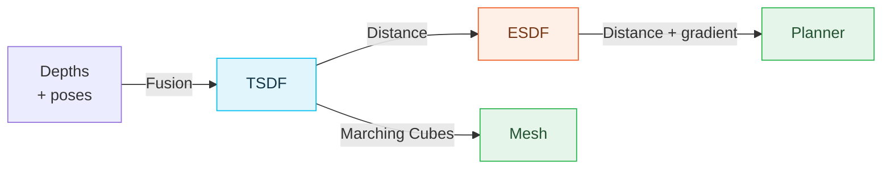
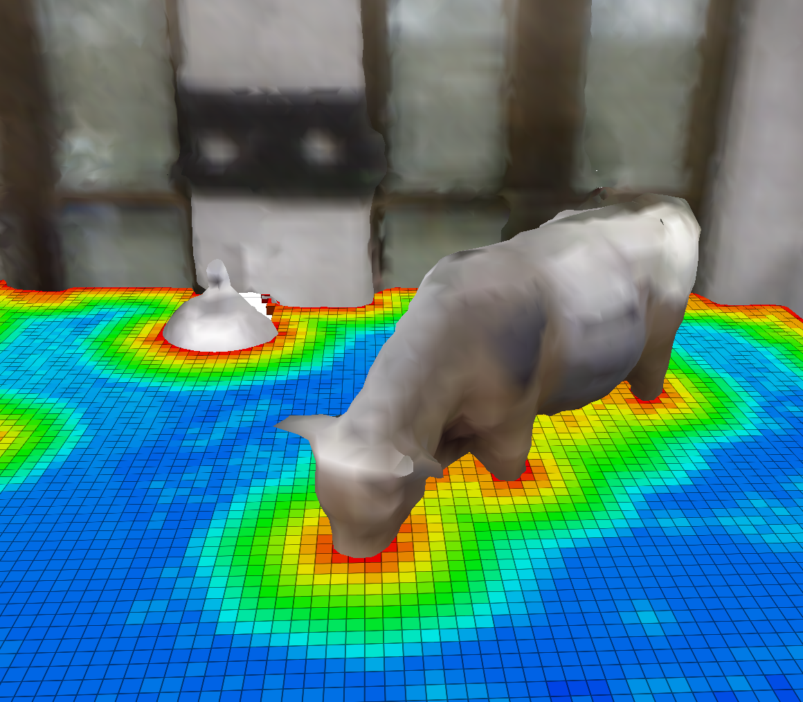
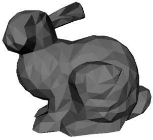
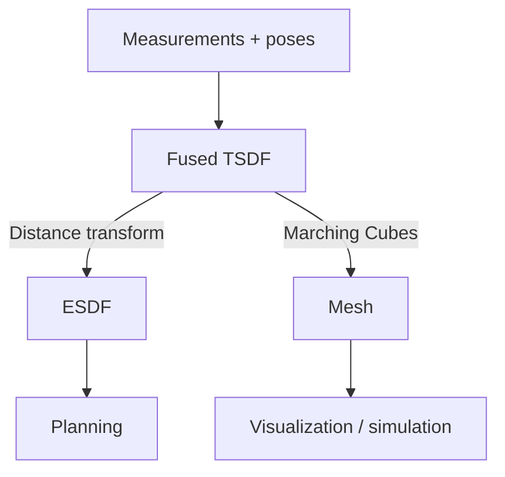
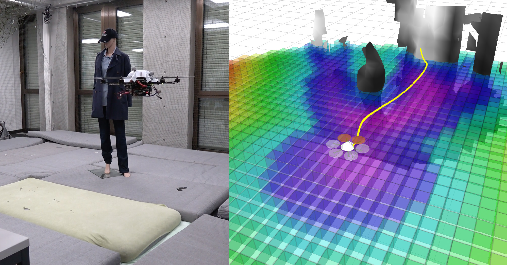

# 3D Map Representations

**INF8422: Robot Perception and Spatial Intelligence**

<span class="text-sm opacity-70">Sparse and dense 3D representations</span>

Prof. Pierre-Yves Lajoie


<div class="cover-footer-bar mt-4">
  <span style="background:#CF1C24" />
  <span style="background:#F15A22" />
  <span style="background:#25B34B" />
  <span style="background:#00BDF2" />
</div>

---
hideInToc: true
---

# Agenda

<div class="grid grid-cols-2 gap-8 mt-8">
<div>

### 1. Describe the map

Occupancy, elevation, primitives, semantics.

### 2. Store the data

Voxels, hash tables and octrees.

### 3. Represent surfaces

ESDF, TSDF and meshes.

</div>
<div>

### 4. Choose based on context

Environment, dynamics and task.

### 5. Move to action

Path search, margins, optimization and exploration.

</div>
</div>

---
layout: section
---

# Surface and Volume Representations

---
hideInToc: true
---

# What Is a Map?

<div class="grid grid-cols-2 gap-6 mt-3">
<div>

The **same scene** can be represented in multiple ways depending on the task:


<p class="text-xs text-center text-gray-500 mt-1">The same scanned tree: point cloud · elevation map · multi-level surface · voxels <em>(Hornung et al., OctoMap 2013)</em></p>

</div>
<div>

**Choice of representation depending on the task:**

| **Task** | **Ideal representation** |
|---|---|
| Localization | Sparse points, landmarks |
| Autonomous navigation | Occupancy grid / ESDF |
| Surface inspection | Dense mesh |
| Path planning | ESDF (distance gradients) |
| Simulation / AR | Textured mesh |
| Semantic understanding | Semantic map + objects |

<InfoBlock title="No universal representation">

Each representation is a trade-off between memory, build speed, access speed, and accuracy.
Modern systems often combine several representations in parallel.

</InfoBlock>

</div>
</div>

---
hideInToc: true
---

# The 3 Fundamental Questions

<div class="grid grid-cols-3 gap-4 mt-4">
<div class="border rounded-lg p-4" style="border-color:#CF1C24">

### Q1 — What to estimate?

**Occupancy** or **Distance**?

- P(occupied) → navigation, exploration
- SDF/TSDF → surface reconstruction, fusion
- ESDF → planning (distance gradients)

</div>
<div class="border rounded-lg p-4" style="border-color:#F15A22">

### Q2 — How to represent it?

**Explicit** or **Implicit**?

- **Explicit:** direct geometry (triangles, points)
- **Implicit:** function $f(\mathbf{x})$ whose zero level set is the surface

</div>
<div class="border rounded-lg p-4" style="border-color:#25B34B">

### Q3 — Which data structure?

**Grid**, **Tree** or **Hash table**?

- Uniform grid: simple, $O(1)$ access, $O(N^3)$ memory
- Octree: hierarchical, multi-resolution, $O(\log N)$
- Spatial hash map: amortized $O(1)$, extensible domain. Hash collisions and storage overhead.

</div>
</div>

<!--div class="mt-4">
<AlertBlock title="Thread running through the course">

These 3 questions structure all the representations we will see.
Each system (Voxblox, OctoMap, KinectFusion…) is a particular choice on these 3 questions.

</AlertBlock>
</div-->

---
hideInToc: true
---

# Explicit vs Implicit — How to Describe Geometry?

<div class="grid grid-cols-2 gap-6 mt-3">
<div>

## Explicit Representation
Geometry is **directly encoded**:
- Triangles, polygons and points
- The surface can be iterated over
- Direct access to geometric elements

**Advantages:** fast rendering, direct modification
**Disadvantages:** connectivity to maintain; spatial queries require a dedicated structure


</div>
<div>

## Implicit Representation
The surface is the **zero level set** of a function $f(\mathbf{x})$:
$$\mathcal{S} = \{ \mathbf{x} \mid f(\mathbf{x}) = 0 \}$$

**Advantages:** flexible topology, natural interpolation, gradients available
**Disadvantages:** surface extraction required (e.g. Marching Cubes)
</div>
</div>

**Two ways to describe the same surface:**

| | **Explicit** | **Implicit** |
|---|---|---|
| **Stored surface** | Points, triangles | Zero set of $f$ |
| **Typical query** | Iterate over geometric elements | Evaluate $f(\mathbf{x})$ |

---
hideInToc: true
---

# Explicit vs. Implicit — Interactive Visualization

Move and deform the objects on the 2D map, then "extract" the explicit mesh.

<ImplicitExplicitAnimation class="mt-1" />

---
layout: section
disabled: true
---

# Estimated Quantities: Occupancy vs Distance

---
hideInToc: true
---

# 2D Occupancy Grid — the Classic Map

<div class="grid grid-cols-2 gap-6 mt-3">
<div>

The **2D occupancy grid** is the historical and most widespread representation in mobile robotics (Elfes & Moravec, 1985).

- The ground plane is divided into square cells $m_k$
- Each cell stores $P(m_k = \text{occupied}) \in [0,1]$
- Three useful states: **free** / **occupied** / **unknown**

**Ubiquitous in practice:**
- ROS **costmaps** (`nav2`, `move_base`)
- 2D planning (A\*, Dijkstra)
- Vacuum cleaners, warehouse AGVs, service robots

</div>
<div>

<InfoBlock title="From 2D to 3D">

The same probabilistic formalism (log-odds, sensor model) **generalizes directly** to 3D:

$$\text{2D grid } (i,j) \;\longrightarrow\; \text{3D grid } (i,j,k)$$

Only the dimension changes; the updates remain identical. The next slides cover the **3D** case (more general), but everything applies to the 2D case too.

</InfoBlock>

<AlertBlock>

In 2D memory is $O(N^2)$; in 3D it explodes to $O(N^3)$ → hence the sparse structures (octree, hashing) seen later.

</AlertBlock>

</div>
</div>

---
hideInToc: true
---

# Occupancy Maps (*Occupancy Maps*)

<div class="grid grid-cols-2 gap-6 mt-3">
<div>

**Principle:** divide the space into cells $m_k$ and estimate:
$$P(m_k \mid z_{1:t},\, x_{1:t})$$

**Independence assumption** (between cells):
$$P(m \mid z_{1:t}) = \prod_k P(m_k \mid z_{1:t})$$

Each cell is classified: **Free** / **Occupied** / **Unknown**

**Sensor model:**
- The ray passes through → free cell
- The ray stops → occupied cell

</div>
<div>

<div class="flex justify-center">
<svg viewBox="0 0 220 150" width="215">
  <!-- grille 6x6 -->
  <g stroke="#e2e8f0" stroke-width="1" fill="none">
    <rect v-for="n in 36" :key="n" :x="10 + ((n-1)%6)*32" :y="6 + Math.floor((n-1)/6)*22" width="32" height="22"/>
  </g>
  <!-- cellules libres traversées (bleu) -->
  <g fill="#00BDF2" style="opacity:0.35">
    <rect x="10" y="116" width="32" height="22"/><rect x="42" y="94" width="32" height="22"/>
    <rect x="74" y="72" width="32" height="22"/><rect x="106" y="50" width="32" height="22"/>
  </g>
  <!-- cellule occupée (impact, rouge) -->
  <rect x="138" y="28" width="32" height="22" fill="#CF1C24" style="opacity:0.75"/>
  <!-- rayon -->
  <line x1="16" y1="135" x2="150" y2="42" stroke="#F15A22" stroke-width="2" stroke-dasharray="4,2"/>
  <circle cx="16" cy="135" r="4" fill="#334155"/>
  <text x="16" y="148" style="font-size:7px;fill:#334155;font-family:sans-serif">sensor</text>
  <text x="150" y="24" style="font-size:7px;fill:#CF1C24;font-weight:700;font-family:sans-serif">occupied</text>
  <text x="60" y="90" style="font-size:7px;fill:#0284c7;font-weight:700;font-family:sans-serif">free</text>
</svg>
</div>
<p class="text-xs text-center text-gray-500">Inverse model: traversed cells = free, impact = occupied</p>

**Advantages:**
- Simple and efficient
- Explicitly distinguishes free / occupied / unknown
- Essential for exploration (finding unknown areas)
- Correction if the space becomes free (object moved)

**Disadvantages:**
- Fixed discretization (no multi-resolution)
- Does not capture spatial correlation
- $O(N^3)$ memory for a uniform 3D grid

</div>
</div>

---
hideInToc: true
---

# Log-Odds Update

<div class="grid grid-cols-2 gap-6 mt-3">
<div>

**Log-odds ratio:**
$$l(x) = \log \frac{p(x)}{1 - p(x)}$$

Key property: the update becomes **additive**, which is much more stable.

**Log-odds update:**

$$l(m_k \mid z_{1:t}) = l(m_k \mid z_{1:t-1}) + l(m_k \mid z_t) - l_0$$

where $l_0 = \log \frac{P(m_k)}{1-P(m_k)}$ is the prior log-odds.

**Sensor model:**
$$l_{free} < 0 \quad \text{(ray passes through)}$$
$$l_{occ} > 0 \quad \text{(ray stops)}$$

</div>
<div>

**Inverse conversion** to recover the occupancy probability:
$$p(m_k) = 1 - \frac{1}{1 + \exp(l(m_k))}$$

**Clamping:** $l \in [l_{min}, l_{max}]$ to prevent saturation.

<!--ExampleBlock title="Typical values">

Velodyne/Octomap: $l_{free} = -0.85$, $l_{occ} = +2.19$, $l_0 = 0$

After 5 "free" observations: $l = -4.25 \to P = 0.014$

After 5 "occupied" observations: $l = +10.95 \to P = 0.9999$

</ExampleBlock-->

</div>
</div>

---
hideInToc: true
---

# Log-Odds Update — Interactive Visualization

Each ray adds $l_{free}$ to the traversed cells and $l_{occ}$ to the impact cell. Follow a cell along the sigmoid $P = 1- 1/(1+e^{-l})$ and the effect of *clamping*.

<LogOddsUpdateAnimation class="mt-1" />


---
hideInToc: true
---

# Elevation Maps (2.5D)

<div class="grid grid-cols-2 gap-6 mt-3">
<div>

**Principle:** a horizontal grid $(x,y)$ where each cell stores a **single height** $z = h(x,y)$.

$$h : \mathbb{R}^2 \to \mathbb{R}$$

**"2.5D"**: between 2D (flat grid) and 3D (full volume). It captures the ground relief without the cost of a dense 3D voxel grid.

**Advantages:**
- Very **compact** and fast (one value per cell)
- Ideal for **ground navigation** (rovers, legged robots)
- Slope gradients directly available

**Fundamental limit — overhangs:**
A single height per cell → **impossible** to represent a bridge, a tunnel, a branch (two surfaces at the same $(x,y)$).

</div>
<div>

<InfoBlock title="Multi-Level Surface (MLS) maps">

Extension: store **multiple** heights (surfaces) per cell → handles overhangs, while remaining much lighter than a dense 3D grid.

</InfoBlock>

<ExampleBlock title="Systems">

**GridMap** (ANYbotics, quadruped robots), **Elevation Mapping** (locomotion on rough terrain), DEM maps (remote sensing, photogrammetry).

</ExampleBlock>

<AlertBlock>

**Classic** representation in ground robotics, often preferred over 3D voxels when the world is essentially terrain.

</AlertBlock>

</div>
</div>

---
hideInToc: true
---

# 2.5D Elevation Maps — Interactive Visualization

<div></div>

**▶ Scan**: the map is built hit by hit. Same measurements, two storage rules; in 2.5D the bridge deck *overwrites* the ground; in MLS the hits are grouped into surfaces.

<ElevationMapAnimation class="mt-1" />

---
hideInToc: true
---

# Plane and Primitive Maps

<div class="grid grid-cols-2 gap-6 mt-3">
<div>

**Idea:** in a **structured** environment (indoors, factories), the geometry reduces to a few **primitives**: planes (walls, floor, ceiling), cylinders, spheres.

**Plane fitting** (per cell or region):
$$\mathbf{n}^\top \mathbf{p} + d = 0, \quad \|\mathbf{n}\| = 1$$
, where $d$ is the distance of the plane from the origin.

**Extraction**: **RANSAC** (robust to outliers) or region growing on the normals.

**Advantages:**
- Extremely **compact** (a wall = 4 numbers $(\mathbf{n}, d)$ vs. millions of points)
- **Robust**: averages many noisy measurements
- Strong constraints for SLAM (planes as landmarks)

</div>
<div>

<div class="flex justify-center mt-1">
<svg viewBox="0 0 250 120" width="240">
  <!-- points along a wall (vertical) + floor (horizontal) -->
  <g fill="#00BDF2">
    <circle cx="42" cy="18" r="2"/><circle cx="46" cy="34" r="2"/><circle cx="40" cy="50" r="2"/>
    <circle cx="45" cy="66" r="2"/><circle cx="41" cy="82" r="2"/><circle cx="47" cy="96" r="2"/>
    <circle cx="70" cy="100" r="2"/><circle cx="95" cy="103" r="2"/><circle cx="120" cy="99" r="2"/>
    <circle cx="145" cy="104" r="2"/><circle cx="170" cy="101" r="2"/><circle cx="195" cy="103" r="2"/>
  </g>
  <!-- fitted planes -->
  <line x1="43" y1="10" x2="43" y2="104" stroke="#CF1C24" stroke-width="2.5"/>
  <text x="20" y="14" style="font-size:8px;fill:#CF1C24;font-family:sans-serif">wall</text>
  <line x1="40" y1="102" x2="205" y2="102" stroke="#25B34B" stroke-width="2.5"/>
  <text x="150" y="116" style="font-size:8px;fill:#25B34B;font-family:sans-serif">floor</text>
  <text x="120" y="30" style="font-size:8px;fill:#64748b;font-style:italic;font-family:sans-serif">RANSAC → planes</text>
</svg>
</div>

<InfoBlock title="Planar SLAM">

Use planes as **constraints/landmarks** in the factor graph: very efficient indoors. E.g.: **CPA-SLAM**, planar LiDAR (LOAM = edges + planes).

</InfoBlock>

<AlertBlock>

Limited to **structured** environments, unsuited to vegetation or semi- or unstructured terrain.

</AlertBlock>

</div>
</div>

---
hideInToc: true
---

# Semantic Maps

<div class="grid grid-cols-2 gap-6 mt-3">
<div>

**Idea:** enrich each geometric element (voxel, point, triangle) with a **label**: the map says *where* **and** *what*.

**Bayesian fusion of labels** (per cell): a segmentation network predicts $p_k(c \mid \text{image})$ per pixel; reprojected onto the voxel, we accumulate:
$$P_k(c) \propto P_{k-1}(c) \cdot p_k(c \mid \text{image})$$

The same multiplicative logic as log-odds, but **multi-class**.

**Three levels:**
- **Semantic**: class per cell (wall, chair...)
- **Instance**: chair #1 ≠ chair #2
- **Panoptic**: differentiates between *stuff* (wall, floor) and *things* (objects)

</div>
<div>

<div class="flex justify-center">
<svg viewBox="0 0 250 120" width="235">
  <!-- voxelized room (cross-section) -->
  <g stroke="white" stroke-width="0.6">
    <!-- left + right wall -->
    <rect v-for="r in 6" :key="`w${r}`" x="18" :y="8 + (r-1)*16" width="16" height="16" fill="#64748b"/>
    <rect v-for="r in 6" :key="`x${r}`" x="216" :y="8 + (r-1)*16" width="16" height="16" fill="#64748b"/>
    <!-- floor -->
    <rect v-for="c in 11" :key="`f${c}`" :x="34 + (c-1)*16.5" y="88" width="16.5" height="16" fill="#a8a29e"/>
    <!-- table -->
    <rect x="70" y="72" width="50" height="8" fill="#F15A22"/>
    <rect x="76" y="80" width="8" height="8" fill="#F15A22"/><rect x="106" y="80" width="8" height="8" fill="#F15A22"/>
    <!-- plant -->
    <rect x="170" y="64" width="16" height="24" fill="#25B34B"/>
  </g>
  <!-- labels -->
  <text x="26" y="4" text-anchor="middle" style="font-size:6.5px;fill:#64748b;font-family:sans-serif">wall</text>
  <text x="125" y="116" text-anchor="middle" style="font-size:6.5px;fill:#78716c;font-family:sans-serif">floor</text>
  <text x="95" y="66" text-anchor="middle" style="font-size:6.5px;fill:#F15A22;font-weight:700;font-family:sans-serif">table #1</text>
  <text x="178" y="58" text-anchor="middle" style="font-size:6.5px;fill:#15803d;font-weight:700;font-family:sans-serif">plant #1</text>
  <text x="125" y="40" text-anchor="middle" style="font-size:7px;fill:#94a3b8;font-style:italic;font-family:sans-serif">each voxel: geometry + P(class)</text>
</svg>
</div>

<ExampleBlock title="Systems">

**Kimera-Semantics** (semantic mesh), **Panoptic Multi-TSDFs** (one TSDF submap per object). TSDF and mesh representations are detailed later.

</ExampleBlock>

<InfoBlock title="What this unlocks">

Contextual navigation ("go to the kitchen"), manipulation (grasp *the cup*), targeted inspection, long-term maps (objects move, walls don't).

</InfoBlock>

<AlertBlock>

The **geometry** always comes from the representations in this course, the neural network only provides the labels.

</AlertBlock>

</div>
</div>

---
hideInToc: true
---

# Voxels

<div class="grid grid-cols-2 gap-6 mt-3">
<div>

**Voxel = "Volumetric Pixel"**: regular discretization of 3D space.

Each voxel $(i,j,k)$ holds a property:
- $P(\text{occupied})$ → occupancy map
- TSDF value → surface reconstruction
- Color, semantic label, etc.

**Direct access:** $(i,j,k)$ indexing → $O(1)$

**Immediate neighborhood:** the 6 (face), 18 (edge), or 26 (corner) neighbors

**Problem:** $O(N^3)$ memory — most voxels are empty!

Example: 100m × 100m × 10m at 5 cm → $\sim 8 \times 10^8$ voxels

</div>
<div>

<!-- IMAGE: voxel_grid.png — Grille 3D de voxels colorés par leur valeur TSDF (bleu=libre, rouge=occupé) avec un robot visible -->

**Key observation:** 3D surfaces form a 2D **manifold** in 3D space → nearly all voxels are empty.

<InfoBlock title="Storing only the useful voxels">

Rather than a dense $O(N^3)$ grid, we allocate only the $S$ voxels that are needed ($S \ll N^3$) via **sparse structures**: an octree or a spatial hash table.

</InfoBlock>

<AlertBlock>

The next slides compare **spatial hash tables** and **octrees**.

</AlertBlock>

</div>
</div>


---
layout: section
disabled: true
---

# Data Structures for Dense Mapping

---
hideInToc: true
---

# The Challenge of Dense Data

<div class="grid grid-cols-2 gap-6 mt-3">
<div>

**Concrete example:**

100m × 100m × 10m map at 5 cm resolution:

$$M = \frac{100 \times 100 \times 10}{0.05^3} \approx 8 \times 10^8 \text{ voxels}$$

At 4 bytes per voxel → **3.2 GB** of RAM just for the grid, **empty for the most part**.

**Key observation:**

The real environment is **sparse**:
- Most of the space is empty (air)
- 3D surfaces are **2D manifolds** in a 3D space
- Reconstruction favors surfaces; navigation also needs free space

</div>
<div>

**Goal:** store **only** what is needed.

<AlertBlock title="Fundamental trade-off">

**Uniform grid:** access $O(1)$, memory $O(N^3)$

**Octree:** access $O(\log N)$, memory $O(S)$

**Spatial hash map:** amortized access $O(1)$, memory $O(S)$

$N$: resolution per axis; $S$: stored elements, often $S\ll N^3$.

No universal solution. Also depends on hardware (CPU/GPU) and on the task.

</AlertBlock>

</div>
</div>

---
hideInToc: true
---

# Spatial Hash Maps

<div class="grid grid-cols-2 gap-6 mt-3">
<div>

**Principle:** divide space into **blocks** (groups of voxels) and map them via a hash function.

**Spatial hash function:**
$$h(i, j, k) = (i \cdot p_1 \oplus j \cdot p_2 \oplus k \cdot p_3) \mod M$$

where $p_1, p_2, p_3$ are large prime numbers.

**Structure:**
- Key: block coordinates $(i,j,k)$
- Value: pointer to the voxel block

**Voxel Hashing (Niessner 2013):**
- Blocks of $8^3 = 512$ voxels (GPU-friendly)
- Dense inside each block (linear array)
- Sparse at the block level (hash map)

</div>
<div>

**Advantages:**
- Amortized $O(1)$ access (like a classic hash table)
- **Infinite** domain (no predefined bounds)
- Memory: only allocates observed blocks

**Considerations:**
- No memory locality: no segment-based access
- Collisions: rare with a good hash function
- Block granularity: access vs. memory overhead trade-off

<InfoBlock title="Example: Voxblox">

Voxblox uses hash-indexed voxel blocks for real-time mapping.

</InfoBlock>

</div>
</div>

---
hideInToc: true
disabled: true
---

# Spatial Hash Maps — Interactive Visualization

<div></div>

The robot moves through an L-shaped corridor: only the **observed** blocks are allocated via $h(i,j,k)$ — space that is never seen costs nothing in memory.

<HashMapSpatialAnimation class="mt-1" />

---
hideInToc: true
---

# Trees and Octrees

<div class="grid grid-cols-2 gap-6 mt-3">
<div>

**Principle:** recursive **hierarchical** decomposition of space.

**Octree:** each octant is divided into 8 children of size $1/2$.

A node is **subdivided** only if its content is heterogeneous (surface + free space).

**Advantages:**
- **Intrinsic multi-resolution**: uniform areas stay coarse
- Efficient compression of uniform free/occupied areas
- Fast neighborhood search

**Disadvantages:**
- $O(\log N)$ access (tree descent)
- Less GPU-friendly than the hash map

</div>
<div>


<p class="text-xs text-center text-gray-500 mt-1">Octree of the Freiburg campus (292 × 167 × 28 m, 20 cm), height in color <em>(OctoMap 2013)</em></p>

**OctoMap (Hornung 2013):**
- Probabilistic octree with log-odds
- **Pruning:** merge children if same value → compression
- Open source, integrated into ROS
- Standard representation for mobile navigation

<ExampleBlock title="Adaptive resolution">

OctoMap allows querying at different resolutions:
$2^k$ × minimum resolution, by going up the tree.

</ExampleBlock>

</div>
</div>

---
hideInToc: true
---

# Trees and Octrees — Interactive Visualization

<div></div>

Click to add/remove obstacles: subdivision only goes deeper where the content is **heterogeneous**. Compare the number of nodes to that of a dense grid.

<OctreeDecompositionAnimation class="mt-1" />

---
hideInToc: true
disabled: true
---

# Hybrid Data Structures

<div class="grid grid-cols-2 gap-6 mt-3">
<div>

**Idea:** combine the advantages of the hash map ($O(1)$ access) and the dense grid (memory locality, GPU).

### Voxel Hashing / Hashed Voxel Grids (Niessner 2013)
- **Hash map of blocks** (e.g., $8^3$ voxels per block)
- Each block is **dense** (linear array) → GPU-friendly
- Sparse handling only at the block level

### VDB — Volumetric Dynamic B-tree (Museth 2013)
- Volumetric B+ tree with very large fan-out
- VFX industry standard (OpenVDB → DreamWorks, Pixar)
- Now used in robotics (VDB-Fusion, VDB-EDT)
- Near-constant access, multi-resolution, fast iterators
- Open-source library: **nanovdb** for GPU

</div>
<div>

**Comparison:**

| Structure | Access | Multi-resolution | GPU | Domain |
|---|---|---|---|---|
| Uniform grid | $O(1)$ | No | ✓✓ | Bounded |
| Octree (OctoMap) | $O(\log N)$ | Yes | ✗ | Unbounded |
| Voxel Hashing | Amortized $O(1)$ | No | ✓✓ | Unbounded |
| VDB | Amortized $O(1)$ | Yes | ✓ (NanoVDB) | Unbounded |

<InfoBlock title="Current trend">

VDB is establishing itself as the standard for dense mapping in robotics:
**VDB-Fusion**, **VDB-EDT** (for ESDF), **nvblox** (NVIDIA, NanoVDB on GPU).

</InfoBlock>

</div>
</div>

---
hideInToc: true
---

# Implicit Surfaces

<div class="grid grid-cols-2 gap-6 mt-3">
<div>

**Reminder**: surface = zero level set of $f : \mathbb{R}^3 \to \mathbb{R}$, with $f < 0$ inside, $f > 0$ outside.

**Not all implicit functions are equal:**

- $f_1(x,y) = x^2 + y^2 - r^2$: the **sign** is correct, but the value is not in the right units (some m²...)
- $f_2(x,y) = \sqrt{x^2 + y^2} - r$: the value **is** the signed distance to the circle

**SDF (*Signed Distance Function*):**
$$f(\mathbf{p}) = \pm\, d(\mathbf{p}, \mathcal{S})$$

**Free normal:**
$$\mathbf{n} = \frac{\nabla f}{\|\nabla f\|} \qquad \left(\text{regular SDF}: \|\nabla f\| = 1\right)$$

</div>
<div>

**Why we want an SDF:**

1. **Direct safety margin**: $f(\mathbf{p}) > r_{robot} \iff$ no collision ($r_{robot}$ is the robot's bounding radius)
2. **Gradient = avoidance direction**: $\nabla f$ points outward
3. **Flexible topology**: the union is described by $\min(f_1,f_2)$; the resulting field is not necessarily an exact distance everywhere (as in the explicit / implicit animation)

<InfoBlock title="The logical next step">

Two distance fields useful in robotics: the **ESDF** (Euclidean, for planning) and the **TSDF** (projective and truncated, for fusion).

</InfoBlock>

</div>
</div>

---
hideInToc: true
---

# ESDF — Distance to the Nearest Surface

<div class="grid grid-cols-2 gap-7 mt-4">
<div>

**ESDF**: signed Euclidean distance field.

$$d(\mathbf{x}) = s(\mathbf{x})\min_{\mathbf{p}\in\mathcal S}\|\mathbf{x}-\mathbf{p}\|_2$$

- **Outside:** $d>0$
- **Surface:** $d=0$
- **Inside:** $d<0$

$\mathcal S$ is the obstacle surface; $s\in\{-1,+1\}$ indicates the side.

<InfoBlock title="Occupancy → distance">

Occupancy answers **"is this occupied?"**; the ESDF answers **"how far is the obstacle?"**

</InfoBlock>

</div>
<div>

<svg viewBox="0 0 300 145" width="340" class="mx-auto">
  <rect x="180" y="15" width="100" height="110" rx="4" fill="#fee2e2"/>
  <line x1="180" y1="15" x2="180" y2="125" stroke="#CF1C24" stroke-width="3"/>
  <circle cx="65" cy="70" r="5" fill="#00BDF2"/>
  <line x1="65" y1="70" x2="180" y2="70" stroke="#00BDF2" stroke-width="2"/>
  <text x="105" y="60" style="font-size:14px" fill="#0369a1">d &gt; 0</text>
  <circle cx="230" cy="70" r="5" fill="#CF1C24"/>
  <line x1="180" y1="70" x2="230" y2="70" stroke="#CF1C24" stroke-width="2"/>
  <text x="207" y="60" style="font-size:14px" fill="#991b1b">d &lt; 0</text>
  <text x="20" y="135" style="font-size:12px" fill="#475569">free space</text>
  <text x="162" y="140" style="font-size:12px" fill="#475569">surface</text>
</svg>

**For planning:**

- Compare $d$ to the **robot radius + margin**.
- Use $\nabla d$ to move away from obstacles.
- Interpolate the grid to query a continuous position.

<p class="text-sm text-gray-600">On a grid, accuracy depends on resolution and the surface convention.</p>

</div>
</div>

<!--
The ideal ESDF measures the distance to the continuous surface. The following slides
compute an exact transform at discrete sites (voxel centers).
Two transforms toward the opposite classes give a signed approximation
with a zero interpolated between the classes, not an exact distance to the faces.
The gradient can be undefined at equal distance from several surfaces.
The unknown remains masked; a computed distance is not proof of free space.
-->

---
hideInToc: true
---

# Building the ESDF — Initialize, Then Sweep X

<div class="grid grid-cols-2 gap-7 mt-4">
<div>

**1. Define the grid**: domain and voxel size $h$.

**2. Initialize the sites**:
- observed obstacle → **0**;
- other sites → **$\infty$**;
- keep the **observed / unknown** mask separately.

**3. For each row along X:**

**Forward** pass →
$$g_i\leftarrow\min(g_i,\,g_{i-1}+1)$$

**Backward** pass ←
$$g_i\leftarrow\min(g_i,\,g_{i+1}+1)$$

</div>
<div>

**One row — distances in number of voxels**

<table class="edt-example">
<tr><th>Initial</th><td>∞</td><td>∞</td><td class="obstacle">0</td><td>∞</td><td>∞</td><td>∞</td><td class="obstacle">0</td></tr>
<tr><th>Forward →</th><td>∞</td><td>∞</td><td class="obstacle">0</td><td>1</td><td>2</td><td>3</td><td class="obstacle">0</td></tr>
<tr><th>Backward ←</th><td>2</td><td>1</td><td class="obstacle">0</td><td>1</td><td>2</td><td>1</td><td class="obstacle">0</td></tr>
</table>

<InfoBlock title="Why two directions?">

The nearest obstacle can be **to the left or to the right**.
After both passes, each site knows its distance to an obstacle **on this row**.

</InfoBlock>

To combine the axes, we then keep the **squares**: $D_X=g^2$.

<p class="text-sm text-gray-600">Without an obstacle on a row, its values stay at ∞ at this stage.</p>

</div>
</div>

<style>
.edt-example { width: 100%; margin: 18px 0; text-align: center; }
.edt-example td { min-width: 30px; background: #e0f2fe; }
.edt-example td.obstacle { background: #fee2e2; color: #991b1b; font-weight: 700; }
.edt-example th { text-align: left; white-space: nowrap; }
</style>

<!--
Convention for this first phase: g in voxel units. The +1 recurrences
are exact for this binary 1D distance. They are applied in both directions
on each row, without propagating between rows. Unknown is not a source.
The transform is geometric: distances do not follow free paths.
Reference: Meijster, Roerdink and Hesselink, ISMM 2000, first phase.
https://www.cs.rug.nl/~roe/publications/DistTrafoLinearTime-ISMM2000.pdf
-->

---
hideInToc: true
---

# Building the ESDF — Completing Y, Z and the Sign

<div class="grid grid-cols-2 gap-7 mt-4">
<div>

**4. Combining axes into squared distances**

For each column Y:
$$D_{XY}(x,y)=\min_j\big[D_X(x,j)+(y-j)^2\big]$$

- **Forward** pass: select the useful candidates.
- **Backward** pass: evaluate the minimum at each site.
- In 3D, repeat the same operation along **Z**.

**5. Take the square root and convert to meters**
$$d_{\mathrm{ext}}=h\sqrt{D_{XYZ}}$$

Three axes, a linear amount of work per row: **$O(M)$** for $M$ voxels total.

</div>
<div>

**The combination is Euclidean**

<svg viewBox="0 0 280 110" width="300" class="mx-auto">
<path d="M40 15 L40 90 L140 90 Z" fill="#e0f2fe" stroke="#00BDF2" stroke-width="2"/>
<circle cx="40" cy="15" r="5" fill="#CF1C24"/>
<circle cx="140" cy="90" r="5" fill="#0369a1"/>
<text x="20" y="58" style="font-size:13px" fill="#475569">3</text>
<text x="85" y="108" style="font-size:13px" fill="#475569">4</text>
<text x="110" y="43" style="font-size:14px" fill="#0369a1">√(3² + 4²) = 5</text>
</svg>

**6. Distinguishing interior and exterior**

- Observed free: **positive** distance to occupied sites.
- Occupied: **negative** distance to free sites, obtained by a second transform.
- Unknown: **no usable distance** for navigation.

<p class="text-sm text-gray-600">Discrete convention: distances to the <strong>centers of the opposite class</strong>. Zero lies between the classes.</p>

</div>
</div>

<InfoBlock title="When the map changes">

Recompute the affected distances. The following demonstration replays the passes over the whole small grid.

</InfoBlock>

<!--
On Y then Z, simply repeating min(neighbor+1) would produce a Manhattan distance.
The exact 1D transform minimizes f(j)+(i-j)^2: we build the lower envelope
of the parabolas in the forward pass, then evaluate it in the backward pass. Sites
of infinite cost are ignored; a row with no candidate remains infinite. The result is combined
across all axes before the square root. The 2D animation uses this computation, also shared
with the trajectory optimization animation.
For the sign: d=+h*sqrt(EDT(occupied)) in free space, -h*sqrt(EDT(free)) in
occupied space. This approximates the distance to the physical surface; there is no universal
h/2 offset, particularly at diagonals. An occupancy grid already provides the class,
no flood-fill is necessary. An unobserved domain stays masked, never
classified as interior by default. With an open surface, a closed solid cannot be inferred
from mere absence of observation.
Incremental recomputation can extend beyond the modified voxels: a removed obstacle
may have influenced a large region. Bounding d alone does not reduce
memory; the allocated domain must also be limited. These optimizations remain
outside the main thread of the course.
Sources: Meijster et al., ISMM 2000; Felzenszwalb and Huttenlocher, ToC 2012.
https://www.cs.rug.nl/~roe/publications/DistTrafoLinearTime-ISMM2000.pdf
https://cs.brown.edu/people/pfelzens/papers/dt-final.pdf
-->

---
hideInToc: true
---

# ESDF — Forward and Backward Passes

Follow **X → Y → root and sign**. Click on a cell to add or remove an obstacle, then observe the new field.

<ESDFPassesAnimation class="mt-2" />

---
hideInToc: true
---

# TSDF — Truncated Signed Distance Field

<div class="grid grid-cols-2 gap-6 mt-3">
<div>

Each voxel stores a **signed projective distance** $F$, truncated and fused, along with a **weight** $W$.

- **positive** sign → in front of the surface (free space)
- **negative** sign → just behind the observed surface (interior side)

**Example — a wall seen by a depth camera:**

| **Voxel position** | **Value** |
|---|---|
| On the wall | $0$ |
| 5 cm in front (air) | $+0.05$ |
| 5 cm into the wall (solid) | $-0.05$ |
| 2 m into the room ($\delta = 10$ cm) | $+0.10$ (capped) |

**Difference from ESDF:** distance measured **along the sensor's ray** (projective), not the global Euclidean distance.


</div>
<div>

**Truncation of the projective distance:**
$$f(\mathbf{p}) = \max(-\delta,\, \min(\delta,\, d_{measured} - d_{point}))$$

The distance is capped at $\pm\delta$. Voxels more than $\delta$ behind the surface are not integrated.

**Weighted update (KinectFusion):**
$$F_{k+1}(\mathbf{x}) = \frac{W_k(\mathbf{x})\, F_k(\mathbf{x}) + w_k\, d_k}{W_k(\mathbf{x}) + w_k}$$
<span class="text-xs opacity-75">$f,d$: value of **one** isolated measurement &nbsp;·&nbsp; $F,W$: **fused** value/weight in memory &nbsp;·&nbsp; $w$: weight of a measurement</span>

**Unknown:** $W=0$. No surface should be inferred from a voxel with no observation.


<div class="flex justify-center">
<svg viewBox="0 0 230 130" width="245">
  <!-- capteur -->
  <path d="M 15 60 l -8 -6 l 0 12 Z" fill="#334155"/>
  <text x="4" y="78" style="font-size:8px;fill:#334155">sensor</text>
  <!-- rayon du capteur, prolongé jusqu'à la surface -->
  <line x1="15" y1="60" x2="195" y2="70" stroke="#94a3b8" stroke-width="1"/>
  <!-- surface (mur), hachures côté solide -->
  <line x1="145" y1="5" x2="200" y2="125" stroke="#334155" stroke-width="2.5"/>
  <line x1="156.75" y1="30" x2="165.9" y2="25.9" stroke="#334155" stroke-width="1.5"/>
  <line x1="168" y1="55" x2="177.1" y2="50.9" stroke="#334155" stroke-width="1.5"/>
  <line x1="179.25" y1="80" x2="188.4" y2="75.9" stroke="#334155" stroke-width="1.5"/>
  <line x1="190.5" y1="105" x2="199.6" y2="100.9" stroke="#334155" stroke-width="1.5"/>
  <text x="195" y="15" style="font-size:8px;fill:#334155">surface</text>
  <!-- voxel p -->
  <circle cx="110" cy="65" r="3" fill="#CF1C24"/>
  <text x="103" y="58" style="font-size:8px;fill:#CF1C24;font-weight:700">p</text>
  <!-- A : point atteint le long du rayon (utilisé par le TSDF) -->
  <circle cx="174" cy="68" r="2.5" fill="#F15A22"/>
  <text x="178" y="66" style="font-size:8px;fill:#F15A22">A</text>
  <!-- B : point réellement le plus proche (perpendiculaire, utilisé par l'ESDF) -->
  <circle cx="162" cy="42" r="2.5" fill="#00BDF2"/>
  <text x="167" y="40" style="font-size:8px;fill:#00BDF2">B</text>
  <!-- d_proj : p -> A -->
  <line x1="110" y1="65" x2="174" y2="68" stroke="#F15A22" stroke-width="1.3" stroke-dasharray="3,2"/>
  <text x="122" y="80" style="font-size:8px;fill:#F15A22;font-weight:700">d_proj (TSDF)</text>
  <!-- d_eucl : p -> B -->
  <line x1="110" y1="65" x2="162" y2="42" stroke="#00BDF2" stroke-width="1.3" stroke-dasharray="3,2"/>
  <text x="88" y="42" style="font-size:8px;fill:#00BDF2;font-weight:700">d_eucl (ESDF)</text>
</svg>
</div>

</div>
</div>

---
hideInToc: true
---

# TSDF — Interactive Visualization

The measurements are **noisy**: the weighted average $F \leftarrow (W F + w\,d)/(W + w)$ smooths the zero crossing as observations accumulate; $W_{max}$ keeps the voxel correctable.
<span class="text-xs opacity-75">($F,W$: value and weight already fused at the voxel &nbsp;·&nbsp; $d,w$: value and weight of the new measurement)</span>

<TSDFRayCastAnimation class="mt-1" />

---
hideInToc: true
---

# TSDF for Fusion, ESDF for Planning

The **TSDF fuses observations**; the **ESDF provides distances** useful to the planner.

<div class="tsdf-benefits grid grid-cols-3 gap-6 mt-4">
<div>

### 1. Reduce noise

The TSDF keeps a **weighted average** of distances and a cumulative weight. Repeated observations stabilize the surface.

<p class="text-sm">Biases, pose errors, and outliers require additional handling.</p>

</div>
<div>

### 2. Integrate quickly

The depth discrepancy is computed **along the ray**, without searching for the nearest obstacle in every direction.

<p class="text-sm">Local and parallelizable update; the ESDF adds a distance computation over the map.</p>

</div>
<div>

### 3. Reconstruct the surface

Interpolating **$F=0$** locates the surface between voxel centers. Marching Cubes extracts a mesh from it.

<p class="text-sm">Accuracy depends on the measurements and poses. An ESDF can also have a sub-voxel zero.</p>

</div>
</div>

<div class="tsdf-hybrid-flow mt-3">



</div>

<p class="text-sm mt-2">The ESDF updates <strong>incrementally</strong>: only the affected distances are recomputed. An unfiltered false obstacle can influence an entire region.</p>

<style>
.tsdf-benefits h3 { font-weight: 600; margin-bottom: 0.55rem; }
.tsdf-benefits > div > p:last-child { color: #475569; margin-top: 0.6rem; }
.tsdf-hybrid-flow { width: 100%; text-align: center; }
</style>

<!--
Fusion assumes that observations are expressed in a common frame using
sufficiently accurate poses. Averaging reduces random noise; it does not
guarantee outlier rejection or bias removal.
Here the TSDF stores distances in meters, not normalized values.
Integration can traverse rays or project voxels into the depth image. The
distance computation is projective in both cases.
An ESDF can be produced from an already-filtered occupancy map: the TSDF is
not a universal prerequisite. Here, we present Voxblox's architecture.
The TSDF representation is suited to fusion and surface extraction; the ESDF
provides distance and gradient for the planner's collision costs.
The ability to interpolate a zero is not exclusive to the TSDF; an ESDF
derived from a continuous surface is not necessarily limited to occupied centers.
References: Newcombe et al., KinectFusion, ISMAR 2011, sections 3.3 and 3.4.
https://www.microsoft.com/en-us/research/wp-content/uploads/2016/02/ismar2011.pdf
Oleynikova et al., Voxblox, IROS 2017, sections III to V, figure 2.
https://arxiv.org/pdf/1611.03631
-->

---
hideInToc: true
clicks: 4
---

# TSDF → ESDF: Starting from the Surface, Extending the Distances

The TSDF localizes the **surface**; from it we derive a **distance field for planning**.

<TSDFToESDFAnimation :step="$clicks" />

<!--
Ideal 1D example, inspired by Voxblox's fixed-band principle. The ray is
perpendicular to the wall x=0: the projective and Euclidean distances coincide
before truncation. h=0.2 m, δ=0.4 m. The centers are at
[-0.7; -0.5; -0.3; -0.1; +0.1; +0.3; +0.5] m.
All are observed except the last one (W=0), which remains unknown at every step.
TSDF values are expressed in meters, without normalization.

[click] We fix a narrow band |F| < h: the +0.1 and −0.1 m seeds.
Their value preserves the offset between the voxel center and the surface.
Setting these seeds to zero would artificially shift the surface.
[click] First neighbor on each side: +0.3 and −0.3 m. We propagate |d|,
then keep the sign of the side of the surface. Known voxels outside the band
are initially at a large distance, represented here as "to compute."
[click] The next voxel to the left receives +0.5 m, beyond the truncation.
[click] The last voxel to the left receives +0.7 m. The surface position
has not changed; we now have distances beyond δ.

This addition of h is exact for our line perpendicular to the wall.
In 2D/3D, we compare candidates coming from different surfaces. Do not
naively repeat +h along X/Y/Z: that would give a Manhattan metric.
A Euclidean transform targets the straight-line norm to the nearest surface;
Voxblox uses a quasi-Euclidean propagation and projective seeds,
so its ESDF remains an approximation. The animation illustrates the principle,
not the raise/lower queues nor the algorithm's incremental updates.

Link with the previous passes: the binary pipeline can also threshold
the sign, then apply the two EDTs. But it loses the sub-voxel offset.
Here, we present directly the variant that preserves distances near zero.
Do not extrapolate the sign to the entire unobserved interior of an object.
Source: Oleynikova et al., Voxblox, IROS 2017, section V.
https://arxiv.org/html/1611.03631#S5
-->

---
hideInToc: true
---

# TSDF and ESDF — Visualizations in the Literature

<div class="distance-field-literature grid grid-cols-2 gap-7 mt-3">
<div>

### TSDF — KinectFusion


**Variation in a band near the surface.**<br>
White: truncated positive distance.<br>
Gray: voxels without valid measurement.

<div class="literature-source">

Newcombe et al., **KinectFusion**, ISMAR 2011.<br>
[Figure 4, left panel](https://www.microsoft.com/en-us/research/wp-content/uploads/2016/02/ismar2011.pdf#page=4).

</div>
</div>
<div>

### ESDF — Voxblox



**Distance to surfaces in free space.**<br>
Colored cross-section: ESDF values.<br>
3D mesh: reference for the reconstructed scene.

<div class="literature-source">

Oleynikova et al., **Voxblox**, preprint 2016.<br>
[Figure 1, arXiv:1611.03631v1](https://arxiv.org/pdf/1611.03631v1#page=1).

</div>
</div>
</div>

<p class="text-sm mt-3" style="color:#475569">Different scenes; colors and scales specific to each publication.</p>

<style>
.distance-field-literature h3 { font-weight: 600; margin-bottom: 0.65rem; }
.literature-field-image { width: 100%; height: 250px; object-fit: contain; border: 1px solid #e2e8f0; border-radius: 4px; margin-bottom: 0.55rem; }
.literature-source { font-size: 12px; line-height: 1.35; margin-top: 0.6rem; color: #475569; }
</style>

<!--
Two distance field figures extracted from the original PDFs, without recoloring
or image generation. The scenes and scales are not identical.
Left: Newcombe et al., KinectFusion: Real-Time Dense Surface Mapping and
Tracking, ISMAR 2011, figure 4, left panel (page 4 of the PDF). The original
caption distinguishes the white truncated positive region, the variation around
zero, and the gray voxels without valid measurement. The figure uses mu for the
truncation threshold, named delta in the previous slides.
https://www.microsoft.com/en-us/research/wp-content/uploads/2016/02/ismar2011.pdf
Right: Oleynikova et al., Voxblox: Building 3D Signed Distance Fields for
Planning, arXiv:1611.03631v1, November 11, 2016, figure 1 (page 1 of the PDF).
The caption describes a life-size fiberglass cow reconstructed from Kinect
measurements, overlaid with a cross-section of the ESDF. The colors
indicate the distance to the surface. The mesh does not represent the ESDF
values: it is the colored cross-section that shows the field in free space.
https://arxiv.org/pdf/1611.03631v1
This figure differs from figure 1 of the IROS 2017 version (arXiv v2), hence
the explicit reference to the 2016 version. See images/literature/SOURCES.md.
-->

---
hideInToc: true
---

# Comparison: Occupancy vs Implicit

<div class="mt-3">

| Criterion | Occupancy Map | Implicit Surface (TSDF/ESDF) |
|---|---|---|
| **Nature** | Probabilistic ($P \in [0,1]$) | Geometric (signed distance) |
| **Construction** | Probabilistic fusion of observations | TSDF: fusion; ESDF: distance transform |
| **Queries** | Probability or class after thresholding | Interpolated value and gradient where it exists |
| **Free/Unknown** | State or observation history | TSDF weight / observation mask to keep |
| **Surface** | Boundary between discrete classes | Interpolated zero level |
| **Typical use** | Navigation, exploration | Reconstruction, physics, planning |

</div>

<div class="grid grid-cols-2 gap-4 mt-3">
<div>
<InfoBlock title="When to choose occupancy?">

Autonomous robot needing to distinguish free / unknown / occupied space.
Exploration: the robot must know where it has not yet looked.

</InfoBlock>
</div>
<div>
<InfoBlock title="When to choose TSDF/ESDF?">

High-precision 3D reconstruction (inspection, AR), or trajectory planning
requiring interpolated distances and gradients.

</InfoBlock>
</div>
</div>

---
hideInToc: true
disabled: true
---

# ✋ Checkpoint — Occupancy or Distance?

For each robot, **which quantity should be estimated**? Think before you click.

<div class="grid grid-cols-3 gap-4 mt-4">
<div class="border rounded-lg p-3" style="border-color:#CF1C24">

**🛸 Drone exploring an unknown collapsed building**

<div v-click="1">

→ **Occupancy grid**: needs *free / occupied / **unknown*** — exploration targets the unknown, and you never fly through an unobserved zone as if it were safe.

</div>
</div>
<div class="border rounded-lg p-3" style="border-color:#F15A22">

**🔍 Robotic arm scanning a mechanical part for inspection**

<div v-click="2">

→ **TSDF**: weighted fusion that smooths sensor noise, surface extractable as a precise mesh (Marching Cubes).

</div>
</div>
<div class="border rounded-lg p-3" style="border-color:#25B34B">

**🚁 Quadrotor skimming obstacles at 5 m/s**

<div v-click="3">

→ **ESDF**: the planner requires $d(\mathbf{x})$ **and** $\nabla d$ to be continuous to optimize the trajectory (end of the lecture).

</div>
</div>
</div>

<div v-click="4" class="mt-4">
<InfoBlock>

Neither is "better": the **task** determines the quantity — and real systems often maintain several in parallel (Voxblox: TSDF **and** ESDF).

</InfoBlock>
</div>


---
hideInToc: true
---

# Meshes

<div class="grid grid-cols-2 gap-7 mt-4">
<div>

A surface represented by **vertices connected into triangles**.

$$\mathbf V\in\mathbb R^{n_v\times3},\qquad \mathbf F\in\mathbb N^{n_f\times3}$$

- **Vertices**: 3D coordinates.
- **Faces**: three vertex indices per triangle.
- **Explicit connectivity** between elements.
- Normals, colors, and textures for rendering.

**Uses:** visualization, inspection, simulation, and export to 3D tools.

<InfoBlock title="From a fused volume">

**TSDF → Marching Cubes → mesh**.<br>
The mesh can be extracted on demand or updated for modified blocks.

</InfoBlock>

</div>
<div>


<p class="text-sm text-center"><strong>1,000 triangles</strong>: the surface is an assembly of flat faces.</p>
<p class="text-xs text-center text-gray-500">Garland et Heckbert, SIGGRAPH 1997, fig. 9.<br><a href="https://www.cs.princeton.edu/courses/archive/fall04/cos526/papers/garland97.pdf#page=7">Surface Simplification Using Quadric Error Metrics</a></p>

</div>
</div>

<!--
Original figure from the paper, extracted unmodified. It is an example of a
simplified mesh, not a TSDF output. The source also shows the dense model
and a 100-triangle version; QEM simplification is not developed further here.
A mesh is not necessarily closed (watertight). A closed, oriented surface
makes inside/outside queries and volumetric simulation easier.
-->

---
hideInToc: true
---

# From TSDF to Mesh — Marching Cubes

Extract the isosurface **$F=0$**, cube by cube.

<div class="grid grid-cols-2 gap-7 mt-3">
<div>

**1. Walk through the cells**

Each cube connects **8 neighboring TSDF samples**.

**2. Find the zero crossings**

On an edge with opposite signs, interpolate the vertex:
$$\mathbf v=\mathbf p_A+\frac{F_A}{F_A-F_B}(\mathbf p_B-\mathbf p_A)$$

**3. Connect the vertices into triangles**

The 8 signs form a binary code: **256 configurations** → a triangle table.

</div>
<div>

<svg viewBox="0 0 250 130" width="290" class="mx-auto">
<path d="M40 100 L40 35 L130 35 L130 100 Z M40 35 L85 10 L175 10 L130 35 M175 10 L175 75 L130 100" fill="none" stroke="#94a3b8" stroke-width="2"/>
<path d="M40 100 L85 75 L175 75 M85 75 L85 10" fill="none" stroke="#cbd5e1" stroke-dasharray="4 3"/>
<path d="M40 65 L80 100 L76 80 Z" fill="#25B34B" stroke="#15803d" stroke-width="2"/>
<circle cx="40" cy="100" r="5" fill="#CF1C24"/>
<circle cx="40" cy="35" r="5" fill="#00BDF2"/><circle cx="130" cy="100" r="5" fill="#00BDF2"/>
<circle cx="85" cy="75" r="5" fill="#00BDF2"/>
<text x="20" y="108" fill="#CF1C24" style="font-size:16px">−</text>
<text x="23" y="30" fill="#0369a1" style="font-size:16px">+</text>
<text x="135" y="113" fill="#0369a1" style="font-size:16px">+</text>
<text x="140" y="55" fill="#15803d" style="font-size:12px">triangle</text>
<path d="M139 59 L74 88" stroke="#15803d"/>
</svg>

**4. Compute the normals**

The direction of the gradient of $F$ gives the normal, useful for lighting.

**5. Assemble the mesh**

Combine vertices and faces; share common vertices, remove degenerate triangles, export (**PLY / OBJ**).

</div>
</div>

<p class="text-xs mt-3 text-gray-500">Lorensen and Cline, SIGGRAPH 1987 — <a href="https://graphics.stanford.edu/courses/cs164-10-spring/Handouts/paper_p163-lorensen.pdf">Marching Cubes: A High Resolution 3D Surface Construction Algorithm</a>.</p>

<!--
The centers of eight adjacent voxels serve as nodes of the interpolation cube.
We work on observed samples: no surface should be created between a valid
value and an unknown value arbitrarily treated as zero.
The interpolated vertex is exact for the linear model on the edge, not for
the physical surface. Ambiguous cases require a consistent choice between cells.
Normals: n=grad(F)/||grad(F)||, gradient estimated by finite differences with
valid samples. Avoid normalizing a zero gradient.
The 256 configurations include symmetries; the classic table has 15
base cases, but this detail is not needed to understand the pipeline.
-->

---
hideInToc: true
---

# Marching Cubes — From Field to Facets

On the left, the **2D analogy (Marching Squares)**: signs → crossed edges → interpolated segments. On the right, **Marching Cubes in 3D** produces triangles.

<MarchingCubesAnimation class="mt-2" />

These synthetic fields illustrate the extraction of an isosurface. In a fused TSDF, we extract the **$F=0$** level.

---
hideInToc: true
---

# Conversions — One Map, Multiple Uses

<div class="grid grid-cols-2 gap-7 mt-4">
<div>

**From observations and their poses:**

- Probabilistic fusion → **occupancy**.
- Fusion of depth deviations → **TSDF**.

**From the fused map:**

- Occupancy or TSDF → **ESDF**: distances for planning.
- TSDF → **Marching Cubes** → mesh: surface for visualization or simulation.

<InfoBlock title="Complementary outputs">

The mesh describes the **surface**; the ESDF describes the **distances in the volume**.

</InfoBlock>

</div>
<div>



</div>
</div>

<!--
The two outputs are separate branches. There is no need to go through
a mesh before producing the ESDF. An occupancy map is also a valid input.
We do not reintroduce ray-tracing algorithms here.
-->

---
hideInToc: true
disabled: true
---

# ✋ Checkpoint — Which Data Structure?

Same voxel map, three contexts. **Which structure** do you choose?

<div class="grid grid-cols-3 gap-4 mt-4">
<div class="border rounded-lg p-3" style="border-color:#CF1C24">

**🏙️ Real-time mapping of an entire neighborhood, embedded GPU (Jetson)**

<div v-click="1">

→ **Voxel hashing / VDB** (nvblox): infinite domain, $O(1)$ access, dense **GPU-friendly** blocks — the octree parallelizes poorly.

</div>
</div>
<div class="border rounded-lg p-3" style="border-color:#F15A22">

**🕳️ Underground exploration, minimal memory, multi-resolution queries**

<div v-click="2">

→ **Octree (OctoMap)**: *pruning* of uniform zones, queries at $2^k \times$ the resolution by walking up the tree, explicit unknown.

</div>
</div>
<div class="border rounded-lg p-3" style="border-color:#25B34B">

**🏠 Bounded 60 m² apartment, CPU, maximum simplicity**

<div v-click="3">

→ **Dense grid**: at this scale memory is trivial, $(i,j,k)$ indexing beats any structure — don't over-engineer.

</div>
</div>
</div>

<div v-click="4" class="mt-4">
<InfoBlock>

Reread the table on the "Hybrid Structures" slide: the winning row changes depending on which column matters (**access, memory, GPU, domain**).

</InfoBlock>
</div>

---
layout: section
---

# Practical Considerations

---
hideInToc: true
---

# Environment: Structured vs Unstructured

<div class="grid grid-cols-2 gap-6 mt-3">
<div>

### Structured (e.g., factories, warehouses)
- **Known or simple** geometry: planes, cylinders
- CAD maps often sufficient
- **Lightweight representations** (parametric planes, fixed landmarks)
- Localization via CAD-LiDAR matching

### Unstructured / Unknown (e.g., forest, rubble)
- Arbitrary shape → dense representations required
- **Free/unknown** information crucial for safe exploration
- **Voxels/Octrees**: explicitly distinguish unobserved areas
- Points/meshes alone: absence of surface does not prove space is free

</div>
<div>

<!-- IMAGE: structured_vs_unstructured.png — Left: structured corridor with simple plane, right: unstructured forest with dense TSDF -->

<AlertBlock title="Autonomous exploration">

For an exploring robot (e.g., Mars rover, rescue drone), the
**free/unknown** distinction is critical: the robot must not navigate in the unknown
as if it were safe.

Occupancy maps (OctoMap) excel here.
In a TSDF, the weights indicate available observations; the planner must also handle the unknown.

</AlertBlock>

</div>
</div>

---
hideInToc: true
---

# Dynamic Environment — Ghosts in the Map

A mobile object leaves its position, but its old observations persist: the map contains a **false obstacle**, or *ghost*.

<DynamicMapAnimation class="mt-2" />

<div class="grid grid-cols-3 gap-5 mt-2 text-sm">
<div><strong>Naive integration</strong><br>Traces fade away slowly once the space is seen as free again.</div>
<div><strong>Masking</strong><br>Exclude measurements of the mobile object before fusion.</div>
<div><strong>Correction</strong><br>Remove traces contradicted by new observations.</div>
</div>

<!--
Animation adapted from robot_perception_2026.md (MRSS), component
../summer-school/components/DynamicMapAnimation.vue. Educational simulation
on a log-odds grid, not a reproduction of DynaSLAM or ERASOR.
The mask is perfect by construction: in practice, detection makes mistakes.
Correction requires three contradicting observations and avoids cells
near the impact point. Filtering dynamic data also benefits TSDFs;
it is not limited to explicit maps. Tracking mobile objects separately
is another solution, developed in the course on dynamics.
-->

---
hideInToc: true
---

# Which Representation for Which Task?

<div class="mt-3">

| Task | Recommended repr. | Why |
|---|---|---|
| **Localization** | Points and primitives | Lightweight, fast scan-matching |
| **Navigation / Planning** | Occupancy grid + ESDF | Free/unknown, distance gradients |
| **3D Reconstruction** | TSDF + Marching Cubes → Mesh | Smoothing, surface topology |
| **Visualization** | Textured mesh | Direct GPU rendering |
| **Physics Simulation** | Watertight mesh, SDF | Collision detection, FEM |
| **Autonomous Exploration** | OctoMap (probabilistic octree) | Multi-resolution, explicit unknown |
| **Manipulation** | Mesh + SDF | Precise surfaces, gradients |
| **Semantic Understanding** | Semantic voxels, Panoptic | Semantic and geometric fusion |

</div>

<div class="mt-3">
<InfoBlock title="Modern hybrid systems">

Robust systems combine multiple representations:
**TSDF** for fusion → **ESDF** for planning; in parallel, **TSDF → Mesh** for visualization.
nvblox (NVIDIA Isaac) does all three on GPU.

</InfoBlock>
</div>

---
hideInToc: true
---

# Summary — Map Representations

<div class="grid grid-cols-2 gap-6 mt-3">
<div>

### Geometry
| Representation | Key | Use |
|---|---|---|
| **Elevation / MLS** | Heights per cell | Traversability |
| **Primitives** | Planes, cylinders | Structured environments |
| **Mesh** | Explicit topology | Visualization, physics |

### Volumes
| Representation | Key | Use |
|---|---|---|
| **Occupancy grid** | P(occ), free/unknown | Navigation |
| **TSDF** | Projective distance | Fusion, reconstruction |
| **ESDF** | Signed Euclidean distance | Planning |
| **Semantic** | Labels on geometry | Scene understanding |

</div>
<div>

### Data structures
| Structure | Access | Memory |
|---|---|---|
| Uniform grid | $O(1)$ | $O(N^3)$ |
| OctoMap | $O(\log N)$ | $O(S)$ |
| Spatial hashing | $O(1)$ on average | $O(S)$ |

<!-- ### Learned trends
- **NeRF**: scene encoded in an MLP → photorealistic
- **3DGS**: explicit gaussians → real-time
- **Neural SLAM**: NICE-SLAM, MonoGS, Photo-SLAM -->

<AlertBlock>

No universal solution, the right choice depends on the trio
**(robot, environment, task)**.

</AlertBlock>

</div>
</div>

---
layout: section
disabled: true
---

# Case Study: Voxblox

---
hideInToc: true
disabled: true
---

# Voxblox: Incremental 3D ESDFs for MAV Planning

<div class="grid grid-cols-2 gap-6 mt-3">
<div>

**Reference:** Oleynikova et al., IROS 2017

**Context:**
- MAVs (drones) moving fast in unknown environments
- Constraints: **CPU only** (no heavy GPU), real-time
- Planning requires an ESDF for collision gradients $(d, \nabla d)$

**Main contributions:**
1. **Incremental** TSDF construction with quadratic weighting
2. **Incremental** ESDF construction from the TSDF (novel algorithm)
3. **Grouped Raycasting** → 20x faster
4. Validated on an AscTec Firefly (embedded Intel Core i7)

</div>
<div>


<p class="text-xs text-center text-gray-500 mt-1">MAV planning online in unknown space — real map and trajectories <em>(Oleynikova et al., IROS 2017)</em></p>

**System architecture:**

```
Stereo/RGB-D sensor
      ↓
 [TSDF Layer]   ← incremental fusion
      ├── propagation → [ESDF] → [TrajOpt]
      └── Marching Cubes → [Mesh]
```

</div>
</div>

---
layout: section
---

# From Representations to Planning

---
hideInToc: true
---

# The Map at the Service of Action

<div class="grid grid-cols-2 gap-6 mt-3">
<div>

The map is **not an end in itself**, it serves the loop:

$$\text{perceive} \to \text{map} \to \text{plan} \to \text{act}$$

The choice of representation determines **which planners are possible**:

| **Representation** | **Planner** | **Example** |
|---|---|---|
| Occupancy grid | Graph search | A\*, D\* Lite (nav2) |
| ESDF | Trajectory optimization | CHOMP, TrajOpt, MPPI |
| Elevation map | Locomotion / footsteps | ANYmal, rovers |
| Mesh + SDF | Manipulation | GraspIt, contact |
| Occupancy (unknown) | Exploration | Frontiers |

</div>
<div>

<InfoBlock title="The 3 questions, revisited">

**Q1 (what to estimate)** takes on its full meaning here: graph search is satisfied with **occupied/free**, continuous optimization requires **distance and its gradient**.

</InfoBlock>

<AlertBlock title="The criterion that matters">

A beautiful map that is too slow to query is useless to the planner: it is **query time** ($d(\mathbf{x})$, $\nabla d$, collision) that dictates the choice, not the beauty of the reconstruction.

</AlertBlock>

<ExampleBlock title="One map, two outputs">

Depths fused into the TSDF can feed an ESDF for trajectory planning and a mesh for inspection.

</ExampleBlock>

</div>
</div>

---
hideInToc: true
---

# Path Planning on Occupancy Grids

<div class="grid grid-cols-2 gap-6 mt-3">
<div>

**Formulation:** the **free** cells form an 8-connected graph, edge costs $\{1, \sqrt{2}\}$.

**Dijkstra:** explores by increasing cost $g(n)$ — concentric "circles" from the start. Optimal, but visits many nodes.

**A\*:** adds a heuristic towards the goal:
$$f(n) = \underbrace{g(n)}_{\text{cost from start}} + \underbrace{h(n)}_{\text{estimate to goal}}$$

**Admissibility:** if $h$ **never overestimates** the true remaining cost (e.g. Euclidean distance), A\* finds a path with the **same optimal cost** as Dijkstra, often exploring fewer nodes.

</div>
<div>


<InfoBlock title="Why 8-connected?">

Diagonals at $\sqrt{2}$ allow 45° movements. The path remains constrained by the grid directions; it can be longer than a continuous path.

</InfoBlock>

<AlertBlock>

The grid gives a **geometric** zigzag path — without dynamics or smoothing. Trajectory optimization, presented after the search methods, can smooth it.

</AlertBlock>

</div>
</div>

---
hideInToc: true
---

# A\* vs Dijkstra — Interactive Visualization

<div></div>

Run **both** algorithms: same optimal cost, but A\* generally explores fewer nodes. The $r_{robot}$ setting inflates obstacles via the distance field.

<AStarGridAnimation class="mt-1" />

---
hideInToc: true
---

# RRT* — Interactive Visualization

<RrtStarAnimation class="mt-1" />

---
hideInToc: true
---

# Obstacle Inflation and Safety Margin

<div class="grid grid-cols-2 gap-6 mt-3">
<div>

Planning for a robot **of radius $r$** in the real map $\equiv$ planning for a **point** robot in a map where obstacles are **inflated by $r$**.

**With a distance field, inflation becomes a threshold:**
$$\text{forbidden}(\mathbf{x}) \iff d(\mathbf{x}) \leq r_{robot} + m$$

$m$: margin for discretization and map uncertainty.

No morphological dilation to recompute: a simple **threshold on the ESDF**, adjustable on the fly (different robot, different margin).

**Beyond the fixed threshold:** costmaps can add a decreasing cost zone ($\propto e^{-\alpha(d - r)}$). The path prefers to stay away from walls without it being forbidden.

</div>
<div>

<ExampleBlock title="Non-circular robots">

For a rectangular footprint (car), inflation by a single radius is conservative. Solutions: multiple covering circles, or exact footprint checking on critical cells (nav2: `footprint`).

</ExampleBlock>

<AlertBlock>

Too large a margin → "impassable" corridors; too small → collisions. It's a **safety parameter**, to be validated experimentally.

</AlertBlock>

</div>
</div>

---
hideInToc: true
---

# Trajectory Optimization on the ESDF

<div class="grid grid-cols-2 gap-6 mt-3">
<div>

**Representation:** trajectory discretized into $N$ **waypoints** $\mathbf{q}_1, \dots, \mathbf{q}_N$ ($\mathbf{q}_1$ = start, $\mathbf{q}_N$ = goal, fixed). We start from a coarse path and **deform** it.

**Total cost to minimize:**
$$J(\mathbf{q}) = \lambda_s \underbrace{\sum_i \|\mathbf{q}_{i+1} - \mathbf{q}_i\|^2}_{\text{smoothness}} + \lambda_c \underbrace{\sum_i c\big(d(\mathbf{q}_i)\big)}_{\text{collision}}$$

$d(\mathbf{q}_i)$: ESDF at waypoint $\mathbf{q}_i$ (signed distance to the nearest obstacle) &nbsp;·&nbsp; $\lambda_s, \lambda_c > 0$: smoothness/avoidance weights. Smoothness is minimal along a straight line → it penalizes zigzags.

**Hinge penalty** (zero far from obstacles):
$$c(d) = \begin{cases} (\epsilon - d)^2 & d < \epsilon \\ 0 & d \geq \epsilon \end{cases}$$

$\epsilon$: safety margin — the cost grows **quadratically** as it approaches an obstacle (up to $d<0$ = collision).

</div>
<div>

<div class="flex justify-center">
<svg viewBox="0 0 220 120" width="270">
  <circle cx="140" cy="65" r="16" fill="#CF1C24" opacity="0.85"/>
  <circle cx="140" cy="65" r="30" fill="none" stroke="#F15A22" stroke-width="1" stroke-dasharray="4,3"/>
  <polyline points="15,95 60,85 150,45 200,60" fill="none" stroke="#94a3b8" stroke-width="1.3" stroke-dasharray="5,4"/>
  <line x1="150" y1="45" x2="147.15" y2="50.7" stroke="#334155" stroke-width="1" stroke-dasharray="2,2"/>
  <text x="128" y="52" style="font-size:6.5px;fill:#334155">d(q_i)</text>
  <line x1="150" y1="45" x2="158.9" y2="27.1" stroke="#25B34B" stroke-width="2"/>
  <path d="M 158.9 27.1 l -5.5 1.5 l 3 4.5 Z" fill="#25B34B"/>
  <text x="163" y="24" style="font-size:7px;fill:#25B34B;font-weight:700">∇d</text>
  <circle cx="150" cy="45" r="3.5" fill="#CF1C24" stroke="white" stroke-width="1"/>
  <text x="153" y="40" style="font-size:7px;fill:#CF1C24;font-weight:700">q_i</text>
  <text x="110" y="112" text-anchor="middle" style="font-size:6.5px;fill:#64748b;font-style:italic">dashed orange = margin ε · q_i pushed along +∇d</text>
</svg>
</div>

**The gradient:**
$$\nabla_{\mathbf{q}_i} c = c'(d)\, \nabla d(\mathbf{q}_i) = -2(\epsilon - d)\, \nabla d(\mathbf{q}_i)$$

$\nabla d(\mathbf{q}_i)$: gradient of the ESDF at that point, points **away** from the nearest obstacle.

<InfoBlock title="The update mechanics">

This recipe (smoothness + penalty on the ESDF) is at the core of methods like CHOMP or TrajOpt. The next slide details how this gradient updates each waypoint, iteration after iteration.

</InfoBlock>

</div>
</div>

---
hideInToc: true
---

# Gradient Descent: Waypoint Update

<div class="grid grid-cols-2 gap-6 mt-3">
<div>

**Update rule** (one gradient descent step):
$$\mathbf{q}_i \leftarrow \mathbf{q}_i - \eta\, \nabla_{\mathbf{q}_i} J(\mathbf{q})$$

$\eta$: step size (*learning rate*) — too large → oscillations, too small → slow convergence.

The total gradient $\nabla_{\mathbf{q}_i} J$ is the sum of **two forces** applied to each waypoint:

**1. Smoothing gradient** ($\mathbf{q}_i$ appears in 2 terms of the sum, with $\mathbf{q}_{i-1}$ and $\mathbf{q}_{i+1}$):
$$\nabla_{\mathbf{q}_i}(\text{smoothing}) = 2\big(2\mathbf{q}_i - \mathbf{q}_{i-1} - \mathbf{q}_{i+1}\big)$$

This term vanishes when $\mathbf{q}_i$ is exactly **halfway** between its two neighbors: it pulls each waypoint toward the average of its neighbors, like a taut string.

**2. Collision gradient** (seen in the previous slide), active only if $d < \epsilon$:
$$\nabla_{\mathbf{q}_i}(\text{collision}) = -2\lambda_c(\epsilon - d)\,\nabla d(\mathbf{q}_i)$$

</div>
<div>

<div class="flex justify-center">
<svg viewBox="0 0 220 120" width="270">
  <circle cx="110" cy="78" r="14" fill="#CF1C24" opacity="0.8"/>
  <polyline points="30,80 85,50 150,60" fill="none" stroke="#94a3b8" stroke-width="1.3"/>
  <circle cx="30" cy="80" r="3" fill="#334155"/>
  <text x="17" y="93" style="font-size:6.5px;fill:#334155">q_i-1</text>
  <circle cx="150" cy="60" r="3" fill="#334155"/>
  <text x="152" y="55" style="font-size:6.5px;fill:#334155">q_i+1</text>
  <circle cx="90" cy="70" r="2.5" fill="white" stroke="#1e40af" stroke-width="1.2"/>
  <text x="93" y="82" style="font-size:6.2px;fill:#1e40af">midpoint of neighbors</text>
  <circle cx="85" cy="50" r="3.5" fill="#F15A22" stroke="white" stroke-width="1"/>
  <text x="60" y="45" style="font-size:7px;fill:#F15A22;font-weight:700">q_i</text>
  <line x1="85" y1="50" x2="88" y2="62" stroke="#1e40af" stroke-width="2"/>
  <path d="M 88 62 l -4.5 -3 l -1 5.3 Z" fill="#1e40af"/>
  <text x="94" y="63" style="font-size:6.5px;fill:#1e40af;font-weight:700">smoothing</text>
  <line x1="85" y1="50" x2="74.4" y2="39.4" stroke="#25B34B" stroke-width="2"/>
  <path d="M 74.4 39.4 l 5.5 0.8 l -2.2 -5 Z" fill="#25B34B"/>
  <text x="45" y="35" style="font-size:6.5px;fill:#25B34B;font-weight:700">collision</text>
  <line x1="85" y1="50" x2="77.4" y2="51.4" stroke="#334155" stroke-width="1.5" stroke-dasharray="2,2"/>
  <circle cx="77.4" cy="51.4" r="2.8" fill="#334155"/>
  <text x="42" y="68" style="font-size:6.5px;fill:#334155;font-style:italic">q_i after the step</text>
</svg>
</div>

The net displacement is the **vector sum** of the two forces: the trajectory smooths out and moves away from obstacles **simultaneously**, one small step at a time.

<AlertBlock title="Local minima">

Gradient descent can get stuck (U-shaped obstacle). Standard pipeline: **A\*/RRT for the coarse initialization** → optimization for refinement. The two worlds are complementary.

</AlertBlock>

</div>
</div>

---
hideInToc: true
---

# Trajectory Optimization — Interactive Visualization

<div></div>

True gradient descent: waypoints within margin $\epsilon$ are pushed along $+\nabla d$ (interpolated ESDF), smoothing retensions the trajectory.

<TrajOptESDFAnimation class="mt-1" />

---
hideInToc: true
---

# Frontier-Based Exploration

<div class="grid grid-cols-2 gap-6 mt-3">
<div>

**The inverse problem:** so far the map existed. How do we **build it efficiently**? Where should the robot go?

**Frontier** (Yamauchi, 1997): a **free** cell adjacent to at least one **unknown** cell. That's where new measurements will bring information.

**Greedy strategy:**
1. Detect frontiers (grid scan)
2. Go to the nearest frontier (A\*)
3. Scan → the map expands → repeat
4. No more frontiers → exploration **complete**

**Variants:** expected information gain, cost-utility, multi-robot exploration (frontier sharing).

</div>
<div>

<div class="flex justify-center">
<svg viewBox="0 0 250 140" width="240">
  <!-- unknown (background) -->
  <rect x="10" y="6" width="230" height="126" fill="#94a3b8" style="opacity:0.55" rx="3"/>
  <!-- discovered free zone -->
  <path d="M 30 125 L 30 60 Q 30 40 55 40 L 120 40 L 120 80 L 165 80 L 165 125 Z" fill="#f8fafc"/>
  <!-- observed walls -->
  <path d="M 30 60 Q 30 40 55 40 L 120 40" fill="none" stroke="#CF1C24" stroke-width="3.5"/>
  <line x1="120" y1="40" x2="120" y2="80" stroke="#CF1C24" stroke-width="3.5"/>
  <!-- frontiers -->
  <line x1="120" y1="80" x2="165" y2="80" stroke="#25B34B" stroke-width="4" stroke-dasharray="6,3"/>
  <line x1="165" y1="80" x2="165" y2="125" stroke="#25B34B" stroke-width="4" stroke-dasharray="6,3"/>
  <text x="176" y="76" style="font-size:8px;fill:#15803d;font-weight:700">frontiers</text>
  <!-- robot -->
  <circle cx="60" cy="105" r="6" fill="#334155" stroke="white" stroke-width="1.5"/>
  <text x="60" y="122" text-anchor="middle" style="font-size:7px;fill:#334155">robot</text>
  <!-- path to frontier -->
  <path d="M 66 102 Q 110 95 138 82" fill="none" stroke="#F15A22" stroke-width="2" stroke-dasharray="4,3"/>
  <text x="105" y="112" style="font-size:7px;fill:#F15A22">A* to frontier</text>
  <text x="200" y="30" style="font-size:8px;fill:#475569;font-weight:700">unknown</text>
  <text x="60" y="55" style="font-size:8px;fill:#64748b">free</text>
</svg>
</div>

<AlertBlock>

Exploration requires distinguishing **free / occupied / unknown**. An occupancy map distinguishes these states. In a TSDF, $W=0$ signals an absence of observation; this mask must be passed on to the conversions and the planner.

</AlertBlock>

</div>
</div>

---
hideInToc: true
---

# Exploration par Frontières — Animation

Le robot découvre la carte, choisit une **frontière**, puis **replanifie** lorsque de nouveaux obstacles apparaissent.

<div style="height: 374px; margin-top: 8px">
  <ExploreReplanAnimation />
</div>

<p class="text-xs text-gray-600 mt-2">Planification optimiste : l’inconnu est supposé traversable.<br>Gris : inconnu · blanc : libre · noir : obstacle · cases vertes : frontières · ligne verte : chemin · cône bleu : champ de vision.</p>

<!--
Animation reprise du cours d'introduction à la robotique INF3995, A2026 :
../../../../INF3995/A2026/cours-robotique/components/ExploreReplanAnimation.vue

Lancer « Explorer », puis mettre en pause pour montrer la carte partielle,
les frontières vertes, la cible et le chemin. Le bouton « 1 pas » permet de
suivre les déplacements ; la vitesse accélère la découverte de l'environnement.
Les murs en pointillé montrent la vérité terrain au public uniquement : le
planificateur ne les utilise pas avant qu'ils soient observés.

La démonstration classe les groupes de frontières selon leur taille divisée
par la distance augmentée d'une constante : elle illustre une variante
coût-utilité, plutôt que la seule frontière la plus proche.
Le cône bleu indique le champ de vision nominal ; les rayons de mesure sont
arrêtés par les murs, qui masquent donc ce qui se trouve derrière eux.

Le planificateur autorise ici l'inconnu pour illustrer la replanification
lorsqu'un obstacle est découvert. Ce choix optimiste n'est pas une garantie
que le chemin soit libre. La simulation a également un repli qui relâche
l'inflation si aucun chemin n'est trouvé : ce n'est pas un modèle de sûreté
pour un robot de taille finie. Montrer la bascule « costmap inflatée » pour
faire le lien avec les marges de sécurité vues précédemment.

Le message de fin signifie qu'aucune cible admissible n'est trouvée par cette
heuristique, pas nécessairement que 100 % de l'environnement a été observé.
-->

---
layout: section
disabled: true
---

# Towards Learned Representations

---
hideInToc: true
disabled: true
---

# Paradigm Shift: Deep Learning

<div class="grid grid-cols-2 gap-6 mt-3">
<div>

### NeRF — Neural Radiance Fields (Mildenhall 2020)

An MLP implicitly encodes the entire scene:
$$F_\Theta(\mathbf{x}, \mathbf{d}) \to (\mathbf{c}, \sigma)$$

- $\mathbf{x} \in \mathbb{R}^3$: 3D position
- $\mathbf{d} \in S^2$: viewing direction
- $\mathbf{c} \in \mathbb{R}^3$: RGB color
- $\sigma \in \mathbb{R}^+$: volumetric density
- $\Theta$: network weights

**Differentiable rendering:** novel view synthesis by ray marching:
$$C(\mathbf{r}) = \int_{t_n}^{t_f} T(t)\, \sigma(\mathbf{r}(t))\, \mathbf{c}(\mathbf{r}(t), \mathbf{d})\, dt$$

</div>
<div>

### Neural Implicit Surfaces
Learn the SDF directly:
$$F_\Theta(\mathbf{x}) \to (d, \mathbf{n})$$

Can **complete** unobserved surfaces thanks to priors learned on large datasets.

### 3D Gaussian Splatting (Kerbl 2023)
Back to **explicit** representations:
- Scene = point cloud of anisotropic 3D gaussians $(\boldsymbol{\mu}, \boldsymbol{\Sigma}, \mathbf{c}, \alpha)$
- Ultra-fast rendering by differentiable rasterization
- NeRF quality + real-time speed

<InfoBlock title="Course 6">

NeRF and 3DGS will be covered in Course 6 (Photorealistic Representations).
Course 5 introduces learned methods for SLAM.

</InfoBlock>

</div>
</div>

---
hideInToc: true
disabled: true
---

# Neural SLAM — iMAP and NICE-SLAM

<div class="grid grid-cols-2 gap-6 mt-3">
<div>

### iMAP (Sucar 2021)
- A single shared MLP: encodes the entire map
- Joint pose + map optimization
- **Limitation:** bounded network capacity (catastrophic forgetting)

### NICE-SLAM (Zhu 2022)
**Hybrid approach:**
- **Feature grid**: voxels with latent vectors (features)
- **MLP decoder**: feature → geometry / color
- Scalable: the grid grows with the map

**Pipeline:** image → features → trilinear interpolation in the grid → the MLP decodes (SDF, color) → Gauss-Newton on poses + grid

</div>
<div>


<p class="text-xs text-center text-gray-500 mt-1">NICE-SLAM pipeline: hierarchical feature grid → MLP decoders → differentiable rendering <em>(Zhu et al., 2022)</em></p>

**General trend:**

| Method | Map | Update | Scalability |
|---|---|---|---|
| KinectFusion | TSDF voxels | Incremental | Limited |
| iMAP | Single MLP | Co-optimization | Very limited |
| NICE-SLAM | Grid + MLP | Co-optimization | Medium |
| **3DGS-SLAM** | Gaussians | Differentiable | Good |

<AlertBlock>

These methods remain **research** (2021–2024).
For embedded robotics, TSDF + Hashing remains the industry standard.

</AlertBlock>

</div>
</div>

---
hideInToc: true
disabled: true
---

# Looking Ahead to the Next Courses

<div class="grid grid-cols-2 gap-6 mt-3">
<div>

### What We've Established

**3D Structures:**
- Sensors → Point clouds (LiDAR, RGB-D)
- Q1 (Occupancy or Distance) → usage
- Q2/Q3: representations + data structures
- Voxblox: TSDF + ESDF + Hashing on embedded CPU

**These structures are the very foundation** of learned systems.
NeRF and 3DGS replace the TSDF but inherit the same questions.

</div>
<div>

### Course 5 — Deep Learning Representations

- **Depth / Pose via DL:** SfMLearner, MonoDepth2, DVSO, D3VO
- **Optical flow:** RAFT → measurements for dense SLAM
- **Learned SLAM:** DROID-SLAM, DUSt3R, VGGT
- **Place recognition:** NetVLAD, SuperPoint, AnyLoc

### Course 6 — Photorealistic Representations

- **NeRF**: volumetric rendering via MLP → photorealistic quality
- **3D Gaussian Splatting**: 100+ FPS real-time

<InfoBlock title="Throughline">

Classical → Hybrid (grid + NN) → Purely learned.
Each step gains expressiveness but loses interpretability and geometric constraints.

</InfoBlock>

</div>
</div>

---
hideInToc: true
---

# ✋ Checkpoint — Compose the Full Stack

Representation(s) + data structure + planner, for each robot:

<div class="grid grid-cols-3 gap-4 mt-4">
<div class="border rounded-lg p-3" style="border-color:#CF1C24">

**Vacuum robot**

<div v-click="1">

→ Dense **2D occupancy grid** (bounded area) + **A\*** on a costmap with inflation.

The world is a plane: 3D would be wasteful.

</div>
</div>
<div class="border rounded-lg p-3" style="border-color:#F15A22">

**Bridge inspection drone**

<div v-click="2">

→ **TSDF** (voxel hashing, extensible domain) → **mesh** for the inspection report, + **ESDF** to navigate around the structure.

</div>
</div>
<div class="border rounded-lg p-3" style="border-color:#25B34B">

**Rover on rough terrain**

<div v-click="3">

→ **2.5D elevation map**: slope gradients for traversability, very lightweight.

A tunnel on the route? → switch to **MLS**.

</div>
</div>
</div>

<div v-click="4" class="mt-4">
<AlertBlock>

The full reasoning chain: **(robot, environment, task)** → Q1 quantity → Q2 abstraction → Q3 structure → planner.

</AlertBlock>
</div>

---
hideInToc: true
---

# End of Course — Recap

<div class="grid grid-cols-2 gap-7 mt-4">
<div>

### Representing and storing

- **Occupancy**: free, occupied, unknown; fusion in log-odds.
- **Elevation / MLS, primitives, semantics**: adapt the content to the task.
- **Voxels, hashing, octrees**: organizing the data.

### Fusing and converting

- **ESDF**: Euclidean transform by passes.
- **TSDF**: weighted fusion of depth measurements.
- **Marching Cubes**: extract a triangulated mesh.

</div>
<div>

### Using the map

- **Dynamic environment**: avoiding ghosts.
- **A\*, RRT\***: searching for a path.
- **ESDF**: safety margin and trajectory optimization.
- **Frontiers**: exploring unknown space.

<InfoBlock title="The common thread">

**Quantity → representation → storage → action**.<br>
The choice depends on the robot, the environment, and the task.

</InfoBlock>

**Next courses:** learned representations for perception and mapping.

</div>
</div>
