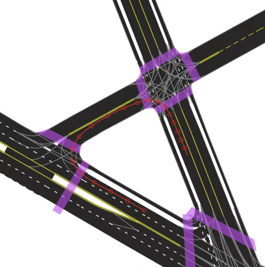
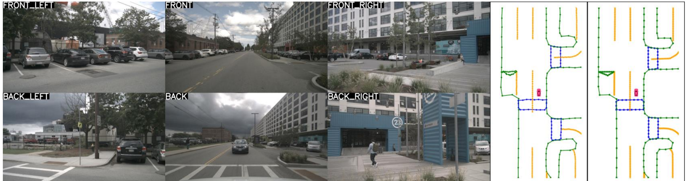
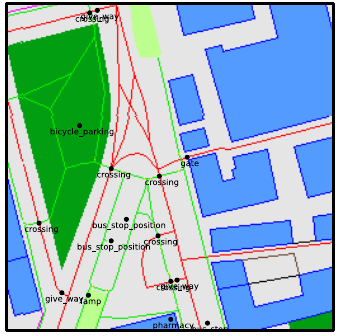

# Cartes pour la conduite autonome

Construire une représentation géométrique et topologique exploitable par le véhicule.

<!--
Présenter la question centrale et annoncer les objectifs de ce bloc.
-->

---
hideInToc: true
class: map-illustration-slide
---

# Cartes pour la planification sur route

<figure>

<figcaption>Un extrait de carte HD d’Argoverse 2.</figcaption>
</figure>

Une carte haute définition, **HD**, décrit les voies, leurs limites, les traversées et les connexions utiles à la conduite.

- **Blanc / jaune** : marquages et limites des voies.
- **Violet** : passages piétons.
- **Gris, aux intersections** : corridors implicites entre les voies.
- **Rouge** : trajectoire du véhicule, affichée comme repère.

Wilson et al., Argoverse 2, NeurIPS Datasets and Benchmarks 2021. Illustration du <a href="https://argoverse.github.io/user-guide/">guide officiel : Vector Map, Lane-Level Geometry</a>.

<!--
Une carte peut être produite localement en ligne ou disponible avant le trajet. L’image est une carte de référence, pas une prédiction du modèle ni une photo aérienne. Les polylignes Argoverse 2 portent des coordonnées 3D même si le rendu est vu du dessus. Les corridors gris montrent la continuité des voies dans les intersections ; la trajectoire rouge appartient au scénario et ne constitue pas un marquage de la route. La planification exploite cette représentation structurée plutôt que directement les pixels. Pointer un passage piéton et suivre un corridor entre deux branches de l’intersection.
-->

---
hideInToc: true
class: map-illustration-slide
---

# BEV: Vue à vol d’oiseau

La vue à vol d’oiseau, **BEV** (*bird’s-eye view*), réunit les observations dans un même repère au sol, autour du véhicule.

Six caméras · prédictions reprojetées en pointsSegmentation BEV

<i style="background:#159ad6" /> Véhicules<i style="background:#f28b58" /> Surface carrossable<i style="background:#58b8a0" /> Voies

À droite, une <strong>prédiction sémantique dans le plan du sol</strong> : on peut comparer les positions et les distances autour du véhicule.

Philion et Fidler, Lift-Splat-Shoot, ECCV 2020, figure 1. <a href="https://www.ecva.net/papers/eccv_2020/papers_ECCV/papers/123590188.pdf">Article et figure</a>.

<!--
BEV est une représentation ; elle peut contenir des caractéristiques, des probabilités ou des objets. Les caractéristiques de plusieurs hauteurs peuvent être comprimées dans une même cellule. Ici, la figure montre des sorties sémantiques de Lift-Splat-Shoot, pas les caractéristiques latentes internes ni une photo prise depuis le ciel. Les points colorés sur les six images sont les prédictions BEV reprojetées dans les caméras ; ce ne sont pas des mesures LiDAR. Faire retrouver les véhicules bleus et la route orange dans les deux vues. Une carte HD et une vue BEV désignent des notions différentes : richesse géométrique et sémantique pour HD, repère et organisation spatiale pour BEV.
-->

---
hideInToc: true
---

# BEV à partir d'image

Un pixel $\tilde u=(u,v,1)^\top$ définit un rayon. Pour une profondeur axiale $d$ :

$$
X_C(d)=dK^{-1}\tilde u,\qquad X_V(d)=R_{V\leftarrow C}X_C(d)+t_{V\leftarrow C}.
$$

<StepFlow :steps='["Pixel 2D", "Rayon dans la caméra", "Hypothèses de profondeur", "Points dans le repère du véhicule"]' />

<InfoBlock title="Ambiguïté">

Sans profondeur ou hypothèse de surface, un pixel ne détermine pas un point 3D unique.

</InfoBlock>

<ExampleBlock title="Si la voiture est équipée d'un LiDAR" v-click>

On peut estimer la profondeur des pixels en les associant au nuage de points capté par le LiDAR.

</ExampleBlock>

<!--
Faire varier d avec un pixel fixé. La pose extrinsèque déplace et tourne tout le rayon ; elle ne résout pas l’ambiguïté de profondeur.
-->

---
hideInToc: true
class: figure-slide
---

# Lift : distribuer la caractéristique dans la profondeur

Pour chaque pixel, le réseau prédit un **vecteur visuel** $f(u)$ et des poids de profondeur $p(d_k\mid u)$, dont la somme vaut 1.

$$
F(u,d_k)=p(d_k\mid u)f(u).
$$

Chaque profondeur reçoit une copie du vecteur, multipliée par son poids. La calibration détermine où placer cette contribution sur le rayon.

**Exemple scalaire :** $f(u)=2$, avec des poids de 0,25 à 10 m et 0,75 à 20 m. Les contributions valent **0,5** et **1,5**.

Philion et Fidler, ECCV 2020, Figure 3. <a href="https://arxiv.org/abs/2008.05711">Article et source de la figure</a>.

<!--
Dans Lift-Splat-Shoot, la distribution peut être apprise à partir des pertes BEV sans profondeur métrique étiquetée. Une distribution latente n’est pas nécessairement calibrée comme une mesure de profondeur.
-->

---
hideInToc: true
---

# Splat : accumuler dans les cellules au sol

Les points sont exprimés dans le repère véhicule. Pour chaque cellule $c$, on additionne **uniquement les contributions qui y tombent** :

$$
\mathcal I_c=\{(u,k)\mid\mathrm{cellule}(X_V(u,d_k))=c\},\qquad
F_{\mathrm{BEV}}(c)=\sum_{(u,k)\in\mathcal I_c}p(d_k\mid u)f(u).
$$

L’indice $(u,k)$ désigne un pixel et une hypothèse de profondeur. Plusieurs pixels ou caméras peuvent contribuer à la même cellule.

<InfoBlock title="Une grille de caractéristiques (features)">

Les features ne sont pas des probabilités d’occupation. Par exemple, ils peuvent être des prédictions de classe (piétons, voitures, etc.).

</InfoBlock>

<!--
Définir résolution et bornes de la grille. Les cellules sont des piliers verticaux agrégés dans le plan au sol. La quantification des positions et la somme des caractéristiques sont distinctes ; ne pas prétendre que toutes les variantes sont différentiables par rapport à chaque coordonnée. L’indice u inclut la caméra dans le cas multivue.
-->

---
hideInToc: true
class: example-flow-slide
---

# Comment apprendre la représentation BEV ?

Dans Lift-Splat-Shoot, une tâche définie au sol peut superviser toute la chaîne :

<StepFlow :steps='["Images calibrées", "Caractéristiques + poids de profondeur", "Lift + Splat", "Comparaison avec les annotations"]' />

<ExampleBlock title="Une cellule occupée par un véhicule">

L’annotation indique « véhicule ». La tête BEV lui attribue une probabilité de $0{,}2$ : sa perte d’entropie croisée vaut $-\ln(0{,}2)\approx1{,}61$.

Cette erreur rétropropage vers les caractéristiques visuelles et les poids de profondeur qui ont contribué à la grille.

</ExampleBlock>

Les poids de profondeur peuvent ainsi être appris **sans annotations métriques de profondeur**. Ils ne sont pas nécessairement des mesures de profondeur calibrées.

Philion et Fidler, ECCV 2020. <a href="https://arxiv.org/abs/2008.05711">Lift, Splat, Shoot</a>.

<!--
La probabilité de classe en BEV et les poids de profondeur latents sont deux distributions distinctes. L’exemple illustre une cellule ; l’objectif agrège les cellules annotées. La géométrie de projection utilise intrinsèques et extrinsèques connus ; elle n’est pas entièrement apprise. LSS démontre un apprentissage par segmentation BEV sans capteur de profondeur à l’entraînement ou à l’inférence.
-->

---
hideInToc: true
class: lab-slide
---

# Suivre un pixel jusqu’à la grille BEV

<LabFrame><LiftSplatLab /></LabFrame>

Changer le pixel, la profondeur dominante et son incertitude. Suivre le déplacement et l’étalement dans la grille.

<!--
Étape fait apparaître image, rayon, puis BEV. La valeur de caractéristique est fixée à 1 pour que la masse soit lisible. La somme des contributions reste 1. La grille illustrée projette les coordonnées latérales et longitudinales.
-->

---
hideInToc: true
class: figure-slide
disabled: true
---

# Projeter vers la grille ou échantillonner depuis la grille

Deux façons d’organiser le transfert d’information : projeter des caractéristiques depuis l’image, ou échantillonner les images depuis des positions 3D définies.

Dans les deux cas, calibration, visibilité et profondeur influencent le résultat.

Harley et al., Simple-BEV, ICRA 2023, Figure 1. <a href="https://simple-bev.github.io/simple_bev_sep30.pdf">Article et source de la figure</a>.

<!--
Simple-BEV sert à comparer les schémas géométriques sans développer un nouveau catalogue d’architectures.
-->

---
hideInToc: true
---

# Quels éléments une carte doit-elle représenter ?

| Élément | Géométrie possible | Information utile |
|---|---|---|
| Ligne / bordure | Polyligne | Position et séparation |
| Voie | Ligne centrale et limites | Largeur, direction, continuité |
| Passage piéton | Polygone ou limites | Zone de traversée |
| Intersection | Connexions entre voies | Mouvements autorisés |

<StepFlow :steps='["Points", "Polylignes / polygones", "Classes sémantiques", "Relations topologiques"]' />

<ExampleBlock title="Une bordure sous forme de polyligne">

Dans le repère véhicule ($x$ vers l’avant, $y$ vers la gauche) : $[(0,2),(5,2),(10,3)]\,\mathrm m$, classe « bordure ». Les points décrivent son tracé ; la classe indique son sens pour le robot.

</ExampleBlock>

<!--
Une ligne centrale ne contient pas à elle seule toute la surface de la voie. Les annotations varient entre jeux de données ; définir le schéma exact avant la loss.
-->

---
hideInToc: true
disabled: true
---

# La topologie décrit les connexions

La proximité géométrique de deux voies ne suffit pas à autoriser un passage. La topologie indique successeurs, prédécesseurs, adjacences et mouvements possibles.

$$
G=(V,E),\qquad (i,j)\in E\Rightarrow\text{connexion autorisée de }i\text{ vers }j.
$$

Les nœuds $V$ peuvent représenter des segments de voie ; les arêtes $E$ codent leurs relations.

<ExampleBlock title="Contre-exemple">

Deux routes qui se croisent sur l’image peuvent passer sur un pont et sous ce pont. La connexion doit être vérifiée en 3D.

</ExampleBlock>

<!--
Demander si un virage à gauche est géométriquement possible mais interdit. Séparer connectivité, direction et règles de circulation.
-->

---
hideInToc: true
disabled: true
---

# Projeter une annotation d’image sur le sol

Pour une caméra sans inclinaison, à hauteur $h$, un point **sur un sol plan** se projette à la ligne $v$ :

$$
v-v_0=\frac{f_yh}{z}\qquad\Longrightarrow\qquad z=\frac{f_yh}{v-v_0}.
$$

$v_0$ : horizon ; $f_y$ : focale verticale en pixels ; $z$ : distance vers l’avant en mètres. L’axe image $v$ est orienté vers le bas.

<ExampleBlock title="Un marquage sous l’horizon">

Avec $h=1{,}5\,\mathrm m$ et $f_y=800\,\mathrm{px}$ :

à 100 pixels sous l’horizon, $z=800\times1{,}5/100=12\,\mathrm m$ ; à 50 pixels, $z=24\,\mathrm m$.

</ExampleBlock>

<AlertBlock title="L’hypothèse de surface est essentielle">

La projection convient aux marquages au sol. Elle échoue pour un point sur un piéton ou une route non plane. Près de l’horizon, une petite erreur en pixels peut déplacer fortement le point au sol.

</AlertBlock>

<!--
Pour un plan connu, on peut employer une homographie. Avec inclinaison de caméra, utiliser extrinsèques et intersection rayon-plan. La démo permet de modifier la hauteur et l’élévation du point. Le cas v=v0 n’a pas d’intersection finie avec le sol dans ce modèle.
-->

---
hideInToc: true
class: lab-slide
disabled: true
---

# Voir l’erreur causée par l’hypothèse de sol

<LabFrame><MapProjectionLab /></LabFrame>

Augmenter la hauteur du point observé, puis modifier la hauteur supposée de la caméra.

<!--
Avec hauteur point=0 et hauteur caméra=1.5, la projection retrouve 12 m. Avec hauteur point=.75, elle estime 24 m. À 1.5 m, le point arrive à l’horizon : l’intersection au sol n’est plus finie.
-->

---
hideInToc: true
class: map-illustration-slide
---

# Construire une carte locale en ligne

Le modèle estime les éléments visibles autour du véhicule à chaque instant. Le résultat peut compléter une carte existante ou fonctionner sans carte locale préétablie.

Six vues caméra de la même scènePrédictionAnnotation

<i style="background:#6756df" /> Passages piétons<i style="background:#e4a317" /> Séparations de voies<i style="background:#268641" /> Limites de chaussée

Pour l'entraînement: Il faut comparer les deux cartes. Les <strong>points et lignes prédits</strong> doivent retrouver la géométrie et la classe de chaque élément annoté.

Liao et al., MapTR, ICLR 2023, figure 1, première scène recadrée. <a href="https://arxiv.org/abs/2208.14437">Article et figure</a>.

<!--
Expliciter les labels : polylignes, classes et éventuellement relations. Les éléments hors du champ ou occultés demandent une politique d’annotation cohérente. L’extrait conserve la première scène Cloudy de la figure originale, sans recomposer les images ou les résultats. Les intitulés français et la légende traduisent les colonnes Surrounding Views / Prediction / GT et les trois classes originales. Repérer le passage piéton violet à gauche du véhicule dans les deux cartes. Cette sortie MapTR décrit des instances vectorielles ; elle n’implique pas une prédiction explicite de toutes les relations topologiques.
-->

---
hideInToc: true
class: figure-slide
---

# Exemple MapTR : prédire des éléments vectoriels

Le modèle prédit un ensemble d’éléments de carte, chacun décrit par des points.

L’apprentissage associe les prédictions aux annotations et tient compte des permutations valides des points. Puisqu'une même ligne lue dans les deux sens peut représenter la même géométrie.

Liao et al., MapTR, ICLR 2023, Figure 4. <a href="https://arxiv.org/abs/2208.14437">Article et source de la figure</a>.

<!--
La figure d’architecture sert à suivre entrées, représentation et sorties. Les détails d’attention restent facultatifs.
-->

---
hideInToc: true
---

# Définir la fonction de perte pour les éléments de carte

Après appariement des instances, comparer la classe et la géométrie. Pour les **points échantillonnés** des polylignes prédites $P$ et annotées $Q$ :

$$
d_{\mathrm{Ch}}(P,Q)=
\underbrace{\frac1{|P|}\sum_{p\in P}\min_{q\in Q}\|p-q\|}_{\text{prédiction vers annotation}}+
\underbrace{\frac1{|Q|}\sum_{q\in Q}\min_{p\in P}\|q-p\|}_{\text{annotation vers prédiction}}.
$$

Pour chaque point, chercher son **plus proche voisin**, puis moyenner les distances. Refaire le calcul dans l’autre sens.

<ExampleBlock title="Une bordure décalée de 20 cm" v-click>

$P=\{(0;0),(1;0)\}$ et $Q=\{(0;0{,}2),(1;0{,}2)\}$ en mètres. Les voisins les plus proches sont tous à $0{,}2\,\mathrm m$.

Les deux moyennes donnent $d_{\mathrm{Ch}}=0{,}2+0{,}2=0{,}4\,\mathrm m$.

</ExampleBlock>

<!--
Convention choisie : somme de deux moyennes, distances non carrées, aucun facteur1/2. D’autres protocoles diffèrent. Chamfer est une illustration de comparaison géométrique et ne représente pas la totalité de la perte MapTR. Selon la méthode, ajouter ordre, direction et relations.
-->

---
hideInToc: true
---

# Pourquoi comparer les polylignes dans les deux sens ?

Une bordure réelle échantillonnée en $Q=\{0,1,2\}$ mètres, mais prédite seulement en $P=\{0,1\}$ : une partie manque.

| Sens | Distances aux plus proches voisins | Moyenne |
|---|---|---:|
| $P\to Q$ | $0\to0$ : $0$ ; $1\to1$ : $0$ | $0$ |
| $Q\to P$ | $0\to0$ : $0$ ; $1\to1$ : $0$ ; $2\to1$ : $1$ | $1/3\,\mathrm m$ |

<ExampleBlock title="La partie manquante impacte la fonction de perte" v-click>

Tous les points prédits sont corrects : le premier sens ne pénalise rien. Le second détecte que le point à 2 m n’est pas couvert. Au total, $d_{\mathrm{Ch}}=1/3\,\mathrm m$.

Donc, ça favorise la complétude des prédictions.

</ExampleBlock>

<!--
Cas 1D sur un même axe, pour isoler le rôle des deux termes. L’échantillonnage influence la distance : comparer des protocoles cohérents.
-->

---
hideInToc: true
---

# Aligner les observations successives

Une observation ancienne doit être exprimée dans le repère courant :

$$
X_{V_t}=T_{V_t\leftarrow V_{t-1}}X_{V_{t-1}}.
$$

<StepFlow :steps='["Carte locale ancienne", "Estimation du mouvement", "Observation actuelle", "Fusion / association"]' />

<ExampleBlock title="">

Un point statique est à **10 m devant le véhicule**. Le véhicule avance de 2 m : dans le nouveau repère, ce point est à **8 m**. Sans estimation du mouvement, on fusionnerait à tort les positions 10 m et 8 m. Une erreur de recalage peut ainsi dédoubler une bordure.

</ExampleBlock>

<!--
Distinguer mouvement du véhicule et changements de la scène. Les acteurs mobiles ne doivent pas être fusionnés comme une géométrie statique persistante.
-->

---
hideInToc: true
class: demo-slide
disabled: true
---

# Observer le recalage temporel

<DemoFrame><TemporalBevWarp /></DemoFrame>

Modifier le mouvement estimé pour observer le réalignement des observations dans le repère courant.

<!--
Utiliser les contrôles de translation et rotation. Expliquer que l’alignement est géométrique avant que les caractéristiques soient fusionnées.
-->

---
hideInToc: true
---

# Construire à l’échelle d’un réseau routier

<StepFlow :steps='["Observations de flotte", "Alignement géographique", "Fusion des éléments", "Contrôle et publication"]' />

| Source | Apport | Limite à traiter |
|---|---|---|
| Carte de navigation / OpenStreetMap | Structure routière et connexions approximatives | Précision, complétude, actualité |
| Imagerie aérienne | Couverture et vue globale | Occultations, résolution, date |
| Capteurs de véhicules | Détails récents au niveau de la route | Couverture inégale, calibration |
| Correction humaine | Arbitrage des cas ambigus | Coût et traçabilité |

<ExampleBlock title="En pratique: Cartographier une nouvelle bretelle">

La vue aérienne suggère le tracé ; plusieurs passages de véhicules mesurent les marquages et bordures. Après alignement, les observations sont fusionnées et un annotateur humain vérifie que la carte est correcte.

</ExampleBlock>

<!--
Ce pipeline est une synthèse pédagogique, pas la reproduction d’un système industriel particulier. Les sources ont des échelles, dates et incertitudes différentes.
-->

---
hideInToc: true
class: map-illustration-slide
zoom: 0.93
---

# Utilisation de cartes publiques. Ex: OpenStreetMap (OSM)

OSM, disponible gratuitement est une carte routière mondiale bâti à l'aide de données publiques et de crowdsourcing. Elle décrit notamment des routes et des bâtiments par des **lignes, polygones et attributs** et peut donc servir de base pour se localiser ou créer une carte HD.

<figure>
<figcaption>Carte OSM et position GPS approximative</figcaption>

</figure>

→<small>Rasteriser (discrétiser sur une grille) par classe</small>

<figure>
<figcaption>Raster sémantique</figcaption>

</figure>

<i style="background:#549bff" /> Bâtiments<i style="background:#009e10" /> Parcs<i style="background:#bcff8f" /> Herbe<i style="background:#ff0000" /> Routes (lignes)

Il peut être utile de se servir de ces cartes comme base (imparfaite) pour la planification à long-terme et de les complémenter avec les données des capteurs à bord du véhicule pour la planification à court-terme. Notamment pour détecter les changements, corriger la géométrie et détecter les objets dynamiques (piétons, voitures, etc.). 

Sarlin et al., OrienterNet, CVPR 2023, figure 2, deux panneaux recadrés. <a href="https://openaccess.thecvf.com/content/CVPR2023/papers/Sarlin_OrienterNet_Visual_Localization_in_2D_Public_Maps_With_Neural_Matching_CVPR_2023_paper.pdf">Article</a>. Données © <a href="https://www.openstreetmap.org/copyright">OpenStreetMap contributors</a>.

<!--
Ces deux panneaux proviennent d’OrienterNet, qui utilise les cartes pour la localisation visuelle. Ils illustrent ici l’encodage de la source OSM, sans attribuer cette architecture à P-MapNet. La tache rouge du premier panneau est l’a priori GPS, pas une classe sémantique. Les couleurs du raster distinguent les catégories de la représentation choisie par les auteurs ; OSM n’impose pas un rendu unique. La légende est vérifiée dans maploc/osm/viz.py du dépôt officiel : building=(84,155,255), park=(0,158,16), grass=(188,255,143), road=(255,0,0). La carte montre aussi des chemins en vert vif et de petits objets ponctuels ; les quatre classes de la légende servent de repères, sans couvrir toutes les catégories. Des détails tels que passages piétons ou nombre de voies peuvent être présents dans OSM, selon la zone ; leur couverture et leur précision ne sont pas garanties comme celles d’une carte HD de référence. La rasterisation ne crée pas l’information absente. Les lignes noires et flèches de la figure sont conservées de l’original.
-->

---
hideInToc: true
class: map-illustration-slide
disabled: true
---

# Utiliser une carte de navigation comme information a priori

<figure>

OSM + référenceCapteurs seuls+ prior SD+ priors SD et HD

<figcaption>P-MapNet : effet des deux sources d’a priori.</figcaption>
</figure>

**À gauche**, le squelette routier issu d’OSM ne coïncide pas exactement avec la carte HD annotée.

**De gauche à droite dans les prédictions :**

1. Les capteurs seuls laissent des éléments manquants.
2. Le prior **SD** apporte la structure routière, notamment au loin.
3. Le prior **HD appris** aide à régulariser les formes prédites.

Une carte standard guide l’estimation ; les observations restent nécessaires pour retrouver la géométrie locale.

Jiang et al., P-MapNet, IEEE RA-L 2024, figure 1(b). <a href="https://arxiv.org/abs/2403.10521">Article et figure</a>.

<!--
Ne pas assimiler carte de navigation et vérité terrain. Les erreurs de géoréférencement peuvent déplacer le prior par rapport aux observations. SD signifie standard definition, ici un squelette extrait d’OpenStreetMap. Le panneau gauche superpose ce squelette noir à la carte HD annotée pour illustrer le désalignement. Les trois panneaux suivants montrent baseline, prior SD, puis priors SD et HD. Le prior HD est un modèle de formes appris par autoencodage masqué sur des cartes ; ce n’est pas la fourniture d’une carte HD exacte du lieu à l’inférence. Les régions encadrées par les auteurs pointent des éléments récupérés ou régularisés. Cette comparaison qualitative illustre le mécanisme sans garantir une amélioration dans toutes les scènes.
-->

---
hideInToc: true
class: figure-slide
disabled: true
---

# Une carte existante peut aider l’estimation

MapEX étudie comment intégrer une carte existante dans l’estimation à partir de capteurs.

Le système doit bénéficier des éléments encore valides et pouvoir corriger ceux qui ne correspondent plus aux observations.

L’ancienneté seule ne prouve pas qu’un élément a changé.

Sun et al., MapEX, WACV 2025, Figure 1. <a href="https://openaccess.thecvf.com/content/WACV2025/html/Sun_Mind_the_Map_Accounting_for_Existing_Maps_When_Estimating_Online_WACV_2025_paper.html">Article et source de la figure</a>.

<!--
Figure comparative des entrées capteurs seuls et capteurs avec carte. Le cours propose ensuite un modèle probabiliste pédagogique distinct de l’architecture MapEX.
-->

---
hideInToc: true
---

# Détecter un changement durable

<StepFlow :steps='["Conflit observation / carte", "Vérifier pose et visibilité", "Accumuler des indices", "Proposer une correction"]' />

Lorsqu'on observe l'environnement, on doit accumuler les indices avant de modifier une carte HD.

Une ligne absente peut simplement être occultée et donc ne pas être visible temporairement. Une ligne en apparence déplacée peut être l'effet d’une erreur de calibration.

Donc détecte une changement durable (permanent) dans la carte nécessite plusieurs indices cohérents. Par exemple, plusieurs passages de véhicule remarquant le même changement.

<InfoBlock title="Traçabilité">

Conserver date, provenance et incertitude. Une mise à jour validée doit pouvoir être distinguée d’une observation isolée.

Ça permet de bâtir des cartes HD très fiables pouvant être partagées par une flotte de véhicule. Évidemment le processus est long et coûteux, d'où les déploiements graduels et limités de Waymo, Zoox, et autres compagnies de voitures autonomes.

</InfoBlock>

<!--
Présenter la différence entre absence de preuve et preuve d’absence. Une zone non observée ne doit pas être traitée comme vide.
-->

---
hideInToc: true
disabled: true
---

# Quantifier l’effet d’une nouvelle observation

Exemple bayésien simplifié : $C$ signifie « la carte a changé ». Au départ, $P(C)=0{,}10$. Un désaccord visible $D$ est plus probable si la carte a changé :

$$
\underbrace{\frac{P(C\mid D)}{1-P(C\mid D)}}_{\text{rapport après observation}}
=\underbrace{\frac{P(C)}{1-P(C)}}_{\text{rapport avant observation}}
\underbrace{\frac{P(D\mid C)}{P(D\mid\neg C)}}_{0{,}85/0{,}10=8{,}5}.
$$

| Désaccords visibles | Rapport $o=P(C)/(1-P(C))$ | Probabilité $P(C)=o/(1+o)$ |
|---|---:|---:|
| Aucun | $1/9$ | $10\,\%$ |
| Un | $(1/9)\times8{,}5$ | $48{,}6\,\%$ |
| Deux | $(1/9)\times8{,}5^2$ | $88{,}9\,\%$ |

<InfoBlock title="Voir un désaccord, ou ne rien voir">

Une occultation n’est pas un désaccord observé : elle n’apporte ici aucune mise à jour. Des vues répétées et corrélées ne comptent pas comme autant de preuves indépendantes.

</InfoBlock>

<!--
La démo met à jour les odds par un rapport de vraisemblance. Une occultation ne produit pas de mesure. Les passages sont supposés indépendants ; en pratique les erreurs peuvent être corrélées.
-->

---
hideInToc: true
---

# Une carte abstraite supporte plusieurs scénarios

<StepFlow :steps='["Géométrie et connexions", "Règles et priorités", "Acteurs et comportements", "Simulation"]' />

Les cartes qu'on construient fournissent un support spatial non seulement pour la navigation, mais aussi pour la simulation.

On peut les utiliser pour créer des scénarios en ajoutant des véhicules, des piétons, leurs états et leurs comportements. Une carte d'une même intersection permet de simuler un grand nombre de variations.

<InfoBlock title="Abstraction">

Le fait que la carte n'est qu'une collection d'objet, il est facile d'en ajouter ou retirer pour simuler des scénarios de conduite.

Beaucoup plus simple que de générer des données cohérentes et réalistes de caméras ou LiDAR pour les divers scénarios.

</InfoBlock>

<!--
Éviter de confondre dynamique des acteurs et mise à jour de la carte. La simulation affichée illustre les dépendances ; elle ne constitue pas une validation de sécurité automobile.
-->

---
hideInToc: true
class: lab-slide
---

# Explorer une intersection avec un piéton

<LabFrame><IntersectionLab /></LabFrame>

Faire varier l’instant de départ du piéton et la décision de céder le passage. Comparer les trajectoires sur une carte identique.

<!--
Retirer céder le passage puis tester plusieurs départs. Lire la distance minimale sur tout le scénario, pas seulement la distance actuelle. Le comportement d’arrêt est simplifié et ne modélise pas une dynamique réaliste de freinage.
-->
