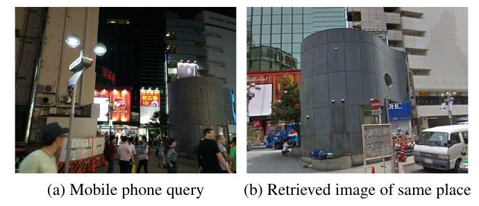

# Supervision multimodale

Apprendre avec une source d’étiquettes différente du signal utilisé à l’inférence.

<!--
Présenter la question centrale et annoncer les objectifs de ce bloc.
-->

---
hideInToc: true
---

# Les entrées et les étiquettes peuvent changer de modalité

| Entrée du modèle | Source de supervision | Exemple de tâche |
|---|---|---|
| Image | Profondeur LiDAR | Estimation de profondeur |
| Image | Pose d’un modèle 3D | Estimation de pose d’objet |
| Image | Positions GNSS | Reconnaissance de lieux |
| Nuage LiDAR | Trajectoire géoréférencée | Reconnaissance de lieux 3D |

<InfoBlock title="Correspondance entre données">

Les modalités doivent être synchronisées et correctement associées. Leur bruit se transmet aux étiquettes.

</InfoBlock>

<AlertBlock title="Exemple: Reconnaissance de lieux">

Nous allons voir un exemple: la reconnaissance de lieux.

L'objectif est de répliquer la capacité de relocalisation d'un GPS à l'aide seulement d'images ou de scans LiDAR. Le modèle appris peut ensuite être utilisé lorsque les signaux GNSS (GPS) ne sont plus disponibles.

</AlertBlock>

<!--
GNSS : système mondial de navigation par satellites. GPS est une constellation GNSS. Utiliser GNSS pour le concept général et GPS lorsque c’est la source indiquée par un article.
-->

---
hideInToc: true
class: figure-slide
---

# Retrouver un lieu déjà vu auparavant

Une image requête est comparée à une base d’images de référence.

Étant donné que les images sont prises à des moments différents. Un défi est de retrouver un lieu malgré un changement d’éclairage, de conditions météo ou d'occultations.

Le résultat est: une **association candidate** (paire d'images), accompagnée d’un score (confiance/invertitude).

Arandjelović et al., NetVLAD, CVPR 2016, Figure 1. <a href="https://arxiv.org/abs/1511.07247">Article et source de la figure</a>.

<!--
La figure présente une réussite qualitative. Elle ne garantit pas la robustesse à toutes les nuits, toutes les saisons ou toutes les villes.
-->

---
hideInToc: true
class: example-flow-slide
---

# La reconnaissance de lieux est une recherche

$$
z_q=f_\theta(I_q),\qquad z_j=f_\theta(I_j),\qquad j^*=\arg\min_j d(z_q,z_j).
$$

<StepFlow :steps='["Image requête", "Descripteur global", "Recherche dans la base de données", "Candidats les plus proches"]' />

Le descripteur global est un vecteur compact associé à l’image entière. Les vecteurs de la base sont calculés et indexés à l’avance.

<AlertBlock title="Ambiguïté visuelle">

Deux lieux distincts peuvent se ressembler. Conserver plusieurs candidats avant de vérifier la géométrie.

</AlertBlock>

---
hideInToc: true
---

# Un descripteur global résume les caractéristiques locales

Un encodeur produit un vecteur local $f_i\in\mathbb R^D$ à chaque pixel ou patch dans l'image. L’agrégation résume ces vecteurs en **un descripteur pour l’image**.

<StepFlow :steps='["Carte 20 × 30", "600 vecteurs de taille 128", "Moyenne sur les patches", "Un vecteur de taille 128"]' />

Le descripteur conserve les informations apprises pour reconnaître le lieu. Ses valeurs ne sont pas des coordonnées géographiques.

<!--
Introduire la distance euclidienne et, pour des vecteurs normalisés, le lien avec la similarité cosinus. Le voisin le plus proche n’est pas nécessairement une correspondance valide.
-->

---
hideInToc: true
---

# De la recherche à la fermeture de boucle

<StepFlow :steps='["Requête → candidat", "Correspondances locales", "Vérification géométrique", "Facteur de pose relative"]' />

Une fermeture de boucle relie deux poses d’un même graphe lorsqu’un lieu est revisité. La vérification géométrique fournit une transformation relative mesurée et son incertitude.

<AlertBlock title="Échelle de la mesure">

Une paire d’images monoculaires fournit généralement une translation à une échelle inconnue. Une contrainte métrique complète exige une information supplémentaire.

</AlertBlock>

<ExampleBlock title="Exemple: Un robot revient devant l’entrée du laboratoire">

Le robot retrouve une ancienne image de l’entrée. Des correspondances RGB-D vérifiées permettent d’estimer le déplacement relatif entre les deux prises de vue et d’ajouter la contrainte au graphe.

</ExampleBlock>

<!--
Exemples : profondeur, stéréo, nuage 3D ou carte métrique pour lever l’ambiguïté. RANSAC rejette des associations erronées ; le score du descripteur ne remplace pas cette étape.
-->

---
hideInToc: true
---

# Résidu d’une fermeture de boucle

$$
r_{ij}=\operatorname{Log}\!\left(Z_{ij}^{-1}T_i^{-1}T_j\right)\in\mathbb R^6.
$$

| Quantité | Lecture |
|---|---|
| $Z_{ij}$ | Pose mesurée du repère $j$ vers le repère $i$|
| $T_i=T_{W\leftarrow i}$, $T_j=T_{W\leftarrow j}$ | Poses des deux caméras dans le monde |
| $T_i^{-1}T_j$ et $Z_{ij}$ | Deux transformations du repère $j$ vers le repère $i$ |
| $Z_{ij}^{-1}T_i^{-1}T_j$ | Identité si prédiction et mesure coïncident |
| $\operatorname{Log}(\cdot)$ | Convertit le désaccord en six composantes locales |

<!--
Log est le logarithme de la transformation rigide SE(3), pas le logarithme appliqué séparément à ses éléments. Les trois composantes de translation de l’espace tangent sont couplées à la rotation dans le cas général. Ordre des six composantes et convention de covariance doivent correspondre. La démo réduit le graphe à SE(2).
-->

---
hideInToc: true
disabled: true
---

# Pondérer une contrainte selon son incertitude

Le même résidu n’a pas le même poids selon la précision attendue de la mesure :

$$
E=r^\top\Sigma^{-1}r
\qquad\text{et, sur un seul axe,}\qquad
E=\left(\frac{r}{\sigma}\right)^2.
$$

| Résidu $r$ | Écart-type $\sigma$ | Résidu normalisé | Coût |
|---|---|---:|---:|
| $0{,}5\,\mathrm m$ | $0{,}1\,\mathrm m$ | $5$ | $25$ |
| $0{,}5\,\mathrm m$ | $1\,\mathrm m$ | $0{,}5$ | $0{,}25$ |

<InfoBlock title="Plus la mesure est précise, plus le désaccord pèse">

La covariance $\Sigma$ met translations et rotations à l’échelle de leurs incertitudes. Une fermeture de boucle fausse mais déclarée très précise peut fortement déformer le graphe.

</InfoBlock>

<!--
Sigma contient des variances et covariances ; sigma est un écart-type. Pour une covariance diagonale, le coût est la somme des carrés de résidus divisés par leurs écarts-types. Les composantes de rotation sont en radians, celles de translation en mètres. Ce coût quadratique correspond à un modèle gaussien local ; une perte robuste peut limiter les aberrations, sans remplacer la vérification géométrique.
-->

---
hideInToc: true
class: lab-slide
---

# Ajouter une fermeture de boucle au graphe

<LabFrame><LoopClosureLab /></LabFrame>

Choisir une bonne ou une mauvaise association, puis cliquer sur « Optimiser » et observer la trajectoire.

<!--
Le robot revient près de T₂, la troisième pose ; T₀ sert seulement à fixer le repère. La bonne reconnaissance relie T₁₀ à T₂ ; la mauvaise confond deux entrées semblables et relie T₁₀ à T₆ avec une mesure incompatible. Choisir l’association ne déplace pas les poses : le bouton Optimiser lance les itérations de Gauss–Newton en SE(2), avec recherche de pas. La fermeture est fortement pondérée, sans rejet robuste. Comparer la baisse du coût à l’erreur au trajet réel : une mauvaise association peut réduire le coût tout en repliant le graphe. Changer de scénario rétablit la même odométrie initiale.
-->

---
hideInToc: true
---

# Utiliser la position GNSS d’une image retrouvée

<StepFlow :steps='["Image de référence j", "Position GNSS pⱼ", "Association visuelle", "Ancrage de la pose requête"]' />

Une base géolocalisée fournit une position approximative du lieu reconnu, même si la requête ne dispose pas de GNSS.

<AlertBlock title="Ancrage approximatif">

La requête et la référence peuvent être prises à plusieurs mètres l’une de l’autre. Cette différence s’ajoute au bruit du GNSS.

</AlertBlock>

<ExampleBlock title="Localiser un robot sans réception GNSS">

Une image du robot reconnaît une façade présente dans une base de données géolocalisée. La position de la référence donne un voisinage plausible.

</ExampleBlock>

<!--
Ne pas transférer aveuglément une orientation ou une pose complète depuis la référence. Les coordonnées latitude/longitude doivent être converties dans un repère métrique local cohérent.
-->

---
hideInToc: true
---

# Résidu d’un ancrage géographique approximatif

Avec $t_i$ la position de la caméra requête dans un repère métrique commun :

$$
r_i^{\mathrm{geo}}=t_i-p_j^{\mathrm{GNSS}},\qquad E_i^{\mathrm{geo}}=(r_i^{\mathrm{geo}})^\top\Sigma_{\mathrm{geo}}^{-1}r_i^{\mathrm{geo}}.
$$

Ce facteur suppose que les positions des deux prises de vue sont suffisamment proches. Son incertitude doit couvrir l’erreur GNSS, le décalage de prise de vue et les défauts d’association.

<ExampleBlock title="Un ancrage dans un repère local, en mètres" v-click>

Si $t_i=(12,5,0)$ et $p_j=(10,4,0)$, alors $r_i^{\mathrm{geo}}=(2,1,0)\,\mathrm m$. Avec $\Sigma_{\mathrm{geo}}=4I\,\mathrm m^2$, le coût vaut $(2^2+1^2)/4=1{,}25$.

</ExampleBlock>

<!--
L’approximation n’est valable que si le voisinage géographique est assez restreint. Dans un système réel, estimer et valider la covariance sur des données représentatives. Ne pas compter deux fois une même information corrélée.
-->

---
hideInToc: true
class: lab-slide
disabled: true
---

# Ajouter un ancrage GNSS au graphe

<LabFrame><FactorGraphLab mode="gnss"/></LabFrame>

Comparer un ancrage souple et un ancrage trop confiant. Observer le cercle d’incertitude et la trajectoire.

<!--
La position de la référence est volontairement proche mais différente de celle de la dernière caméra. Le facteur ne constitue pas une mesure GNSS de la requête. Le graphe reste en SE(2) pour être lisible.
-->

---
hideInToc: true
---

# Comment créer un jeu de données d'entraînement pour la reconnaissance de lieux

D'abord, on peut sélectionner des paires positives et négatives à partir des positions GNSS.

Pour des images géolocalisées en $p_i$ et $p_j$ :

$$
\|p_i-p_j\|<r_+\Rightarrow\text{positif possible},\qquad \|p_i-p_j\|>r_-\Rightarrow\text{négatif possible},\quad r_->r_+.
$$

Une zone intermédiaire est ignorée pour réduire les ambiguïtés. La proximité spatiale donne une supervision faible : les images peuvent regarder dans des directions opposées.

<AlertBlock title="Bruit d’étiquetage">

Bruit GNSS, rues parallèles, façades répétitives et changements de point de vue produisent des paires trompeuses.

</AlertBlock>

<ExampleBlock title="Rayons illustratifs : 10 m et 25 m">

À 6 m : positif possible. À 18 m : paire ignorée. À 40 m : négatif possible. Deux images à 6 m peuvent toutefois regarder des façades opposées ; la proximité seule ne suffit pas.

</ExampleBlock>

<!--
Les rayons dépendent du jeu de données et de l’application. Les valeurs de la démo sont pédagogiques, sans prétendre constituer un protocole universel.
-->

---
hideInToc: true
---

# Négatifs faciles, difficiles et faux négatifs

| Type | Distance géographique | Distance descripteurs | Effet |
|---|---|---|---|
| Facile | Lieux distincts | Grande | Perte souvent nulle |
| Difficile | Lieux distincts | Petite | Signal d’apprentissage utile |
| Faux négatif | Même lieu ou recouvrement réel | Petite | Signal d’apprentissage erroné |

<StepFlow :steps='["Candidats géographiques", "Descripteurs actuels", "Sélection des négatifs", "Vérification des ambiguïtés"]' />

<ExampleBlock title="Requête : l’entrée d’un stationnement">

**Négatif facile :** une forêt. **Négatif difficile :** l’entrée semblable d’un autre stationnement. **Faux négatif :** la même entrée, géolocalisée trop loin à cause d’une erreur GNSS.

</ExampleBlock>

<!--
La sélection peut se faire dans le mini-lot ou dans une mémoire de descripteurs. Les plus difficiles ne sont pas toujours les plus fiables au début de l’entraînement.
-->

---
hideInToc: true
class: lab-slide
disabled: true
---

# Sélectionner les paires avec une supervision bruitée

<LabFrame><MiningLab /></LabFrame>

Faire varier le rayon positif et le biais GNSS, puis comparer négatif facile et négatif difficile.

<!--
Repérer le candidat C : visuellement proche selon le descripteur mais géographiquement éloigné. Montrer comment un biais GNSS change l’ensemble des positifs possibles.
-->

---
hideInToc: true
---

# Comment entraîner: Un réseau siamois

$$
z_a=f_\theta(I_a),\qquad z_b=f_\theta(I_b).
$$

<StepFlow :steps='["Deux observations", "Même encodeur fθ", "Deux vecteurs comparables", "Perte de distance"]' />

Les deux branches utilisent les mêmes paramètres. La perte apprend une géométrie où les exemples compatibles sont proches.

<ExampleBlock title="Le même carrefour, de jour et de nuit">

Chaque image traverse le même encodeur. La paire positive encourage des descripteurs proches malgré l’éclairage ; les gradients des deux branches mettent à jour les mêmes poids.

</ExampleBlock>

<!--
Dessiner deux branches qui pointent vers le même θ. Deux réseaux ayant la même architecture mais des poids indépendants ne constituent pas le partage montré ici.
-->

---
hideInToc: true
---

# Perte contrastive : apprendre avec des paires

Distance entre descripteurs : $D=\|z_a-z_b\|_2$. Avec $y=1$ pour un positif et une marge $m>0$ :

$$
\ell_{\mathrm{paire}}=
\begin{cases}
D^2 & y=1\quad\text{(même lieu)},\\
\max(0,m-D)^2 & y=0\quad\text{(lieux différents)}.
\end{cases}
$$

| Paire, avec $m=1$ | Distance $D$ | Perte | Effet recherché |
|---|---:|---:|---|
| Carrefour de jour / même carrefour de nuit | $0{,}4$ | $0{,}4^2=0{,}16$ | Rapprocher les descripteurs |
| Deux carrefours différents | $0{,}4$ | $(1-0{,}4)^2=0{,}36$ | Les séparer |
| Deux carrefours différents | $1{,}2$ | $0$ | Déjà assez éloignés |

<InfoBlock title="La marge fixe une séparation suffisante">

Les négatifs au-delà de $m$ ne contribuent plus à cette perte. $D$ mesure un écart dans l’espace des descripteurs, pas une distance en mètres entre lieux.

</InfoBlock>

<!--
Forme équivalente : yD²+(1-y)max(0,m-D)². La convention y=1 positif doit être annoncée car certains codes l’inversent. Les paramètres de l’encodeur sont mis à jour, pas les images. Une normalisation des descripteurs change la plage des distances possibles ; adapter la marge.
-->

---
hideInToc: true
class: lab-slide
---

# Rapprocher les positifs, séparer les négatifs dans l'espace des descripteurs

<LabFrame><MetricLab mode="contrastive"/></LabFrame>

Changer le type de paire et la marge, puis appliquer des pas de gradient.

<!--
La démo utilise des coordonnées d’embedding directement optimisées. Un vrai réseau reçoit ces gradients par la règle de chaîne ; les images elles-mêmes ne se déplacent pas.
-->

---
hideInToc: true
---

# Perte triplet : imposer une marge relative

Ancre $a$ : carrefour de nuit ; positif $p$ : même carrefour de jour ; négatif $n$ : un autre carrefour.

$$
\ell_{\mathrm{tri}}=\max\!\left(0,\underbrace{\|z_a-z_p\|_2}_{d_{ap}}-
\underbrace{\|z_a-z_n\|_2}_{d_{an}}+m\right).
$$

On veut $d_{an}\geq d_{ap}+m$ : le négatif doit être plus éloigné que le positif **d’au moins la marge**.

| $d_{ap}=0{,}4$, $m=0{,}2$ | Distance négative $d_{an}$ | Perte |
|---|---:|---:|
| Négatif plus loin, mais marge insuffisante | $0{,}5$ | $0{,}4-0{,}5+0{,}2=0{,}1$ |
| Marge satisfaite | $0{,}7$ | $\max(0,-0{,}1)=0$ |

<InfoBlock title="Avantage">

La fonction de perte triplet est plus stable. On évite de rapprocher puis éloigner les descripteurs successivement. On fait les deux en même temps.

</InfoBlock>

<!--
La mise à jour peut déplacer ancre, positif et négatif ; on ne force pas seulement le négatif à bouger. Une perte nulle n’exige pas une distance positive égale à zéro. Ici, distances non carrées, comme dans la démo. Certaines publications utilisent des carrés : ne pas changer de convention implicitement.
-->

---
hideInToc: true
class: lab-slide
---

# Voir l’effet de la perte triplet

<LabFrame><MetricLab /></LabFrame>

Déplacer ancre, positif et négatif. Modifier la marge, puis suivre les mises à jour des trois points.

<!--
Placer le positif plus loin que le négatif. Les trois gradients contribuent ; l’ancre peut aussi se déplacer. Lorsque la marge est satisfaite, la perte et le gradient s’annulent.
-->

<!--
Exemple d’agrégation : moyenne, GeM ou NetVLAD. La moyenne globale perd l’organisation spatiale explicite des positions ; l’encodeur peut néanmoins intégrer du contexte. La dimension influence stockage et recherche. Traiter le cas de norme nulle dans une implémentation.
-->

---
hideInToc: true
disabled: true
---

# NetVLAD : agréger des résidus locaux

NetVLAD compare chaque caractéristique locale à des **centres appris**, puis résume les écarts :

$$
V_k=\sum_i a_{ik}(f_i-c_k),\qquad \sum_k a_{ik}=1.
$$

| Symbole | Sens |
|---|---|
| $i$, $f_i\in\mathbb R^D$ | Position dans l’image et sa caractéristique locale |
| $k$, $c_k\in\mathbb R^D$ | Centre appris auquel on compare cette caractéristique |
| $a_{ik}$ | Part de la contribution de $f_i$ envoyée au centre $k$ |
| $V_k\in\mathbb R^D$ | Somme des résidus pondérés pour ce centre |

Concaténer les $K$ vecteurs $V_k$, puis normaliser. Avec $K=4$ et $D=128$, on obtient **512 valeurs** avant une éventuelle réduction de dimension.

Arandjelović et al., CVPR 2016. <a href="https://arxiv.org/abs/1511.07247">NetVLAD</a>.

<!--
L’affectation est souple, donc différentiable, et les centres sont appris avec l’encodeur. La somme des poids vaut1 sur k pour chaque i, pas sur les positions i pour un centre donné. La méthode utilise notamment une normalisation par centre avant la normalisation globale. Le résidu retient une information sur la direction des écarts, pas seulement un nombre d’affectations.
-->

---
hideInToc: true
disabled: true
---

# NetVLAD : calculer la contribution à un centre

Exemple scalaire avec un centre $c_k=2$ et deux caractéristiques locales :

| Caractéristique $f_i$ | Poids $a_{ik}$ | Résidu $f_i-c_k$ | Contribution |
|---|---:|---:|---:|
| $3$ | $0{,}8$ | $+1$ | $+0{,}8$ |
| $1$ | $0{,}2$ | $-1$ | $-0{,}2$ |

<ExampleBlock title="Additionner les écarts pondérés" v-click>

$V_k=0{,}8(3-2)+0{,}2(1-2)=0{,}6$. Ce centre reçoit un résidu net positif. Des contributions de signes opposés peuvent se compenser.

</ExampleBlock>

Pour chaque caractéristique, les poids restants vont aux autres centres. Avec des vecteurs, le même calcul s’applique composante par composante.

<!--
Ces chiffres sont pédagogiques. Ici les deux poids sur i s’additionnent par hasard à1 ; la contrainte porte sur la somme des centres k pour un même i. Une somme de résidus ne reconstruit pas tous les détails locaux, mais conserve une information différente d’un simple histogramme d’affectations.
-->

---
hideInToc: true
class: demo-slide
disabled: true
---

# Observer l’agrégation NetVLAD

<DemoFrame><NetVLADAnimation /></DemoFrame>

Suivre l’affectation des caractéristiques et l’agrégation de leurs résidus autour des centres.

<!--
Relier les couleurs aux centres. Les valeurs de la démonstration sont synthétiques ; le réseau réel apprend les caractéristiques et les affectations.
-->

---
hideInToc: true
class: example-flow-slide
---

# Le pipeline d’apprentissage et de recherche

Pipeline: d'apprentissage:
<StepFlow :steps='["Collecter + géolocaliser", "Séparer les lieux", "Former paires / triplets", "Entraîner l’encodeur"]' />

Pipeline: de recherche:
<StepFlow :steps='["Encoder toute la base de données", "Indexer les vecteurs", "Rechercher les candidats", "Vérifier puis localiser"]' />

<!--
Distinguer pipeline hors ligne et traitement de la requête. Les images de référence à rechercher sont autorisées au test comme base de données ; leurs étiquettes ne servent pas à régler les paramètres du modèle.
-->

---
hideInToc: true
class: figure-slide
---

# Les conditions visuelles peuvent être très variées

Jour/nuit, météo, saisons, structure et point de vue modifient l’apparence.

Une bonne évaluation doit séparer ces facteurs et inclure des exemples réellement différents des données d’entraînement.

Warburg et al., Mapillary SLS, CVPR 2020, Figure 2. <a href="https://openaccess.thecvf.com/content_CVPR_2020/html/Warburg_Mapillary_Street-Level_Sequences_A_Dataset_for_Lifelong_Place_Recognition_CVPR_2020_paper.html">Article et source de la figure</a>.

<!--
La figure montre des paires réelles du jeu Mapillary Street-Level Sequences. Ne pas attribuer chaque colonne sans relire la légende originale ; présenter les types de variation ensemble.
-->

---
hideInToc: true
---

# Apprendre des robustesses ciblées

| Variation | Approches concrètes | Évaluation |
|---|---|---|
| Saisons | Positifs multitemporels ; caractéristiques locales stables | Revisites été/hiver indépendantes |
| Météo | Collectes diversifiées ; augmentations photométriques et dégradations plausibles | Vraies séquences pluie/brouillard |
| Heure du jour | Couples jour/nuit ; entraînement avec fortes variations d’éclairage | Requêtes nocturnes réservées |
| Point de vue | Positifs multivues, EigenPlaces ; vérification géométrique locale | Déplacements latéraux et vues opposées |

<InfoBlock title="Limite">

Une augmentation synthétique aide à couvrir une variation ; elle ne remplace pas l’évaluation sur des observations réelles.

</InfoBlock>

<!--
Références : Patch-NetVLAD, Hausler et al., CVPR 2021 ; NetVLAD, Arandjelović et al., CVPR 2016 ; EigenPlaces, Berton et al., ICCV 2023. Ne pas promettre une invariance absolue.
-->

---
hideInToc: true
class: figure-slide
disabled: true
---

# EigenPlaces : organiser les vues pendant l’apprentissage

La sélection des exemples expose le modèle à différentes vues d’un même point d’intérêt.

L’objectif est d’apprendre un descripteur qui conserve l’identité du lieu malgré le déplacement du point de vue.

La qualité des positifs est donc aussi importante que la forme de la perte.

Berton et al., EigenPlaces, ICCV 2023, Figure 3. <a href="https://openaccess.thecvf.com/content/ICCV2023/html/Berton_EigenPlaces_Training_Viewpoint_Robust_Models_for_Visual_Place_Recognition_ICCV_2023_paper.html">Article et source de la figure</a>.

<!--
Décrire les positions de caméra et leurs directions. La figure illustre la construction de groupes, pas une architecture de capteur.
-->

---
hideInToc: true
disabled: true
---

# Évaluer la recherche avant l’intégration au graphe

$$
\mathrm{Recall@}K=\frac{\text{requêtes avec au moins un candidat valide parmi les }K\text{ premiers}}{\text{nombre de requêtes}}.
$$

Préciser ce qui rend un candidat valide : distance géographique, recouvrement ou vérification géométrique. Mesurer également temps de recherche et mémoire.

<InfoBlock title="Deux évaluations">

Une reconnaissance correcte au niveau du lieu ne garantit pas une transformation relative assez précise pour le graphe. Évaluer séparément la localisation géométrique.

</InfoBlock>

<ExampleBlock title="Sur 100 requêtes de test" v-click>

Un candidat valide est premier pour 72 requêtes, et présent parmi les cinq premiers pour 89. **Recall@1 = 72 % ; Recall@5 = 89 %.** Cela ne signifie pas que 89 % des cinq candidats sont corrects.

</ExampleBlock>

<!--
K est ici le nombre de candidats, sans lien avec les intrinsèques caméra. Pour un système de fermeture de boucle, les faux positifs acceptés sont particulièrement importants.
-->

---
hideInToc: true
class: figure-slide
---

# Scan Context : Reconnaissance de lieux avec LiDAR

Le plan horizontal est divisé en anneaux et secteurs.

Chaque cellule conserve une hauteur maximale, produisant une matrice qui décrit la structure autour du capteur.

Le descripteur original est construit explicitement, sans entraînement supervisé.

Kim et Kim, Scan Context, IROS 2018, Figure 1. <a href="https://gisbi-kim.github.io/publication/kim2018scan/">Article et source de la figure</a>.

<!--
Une rotation autour de la verticale correspond approximativement à un décalage circulaire des secteurs. La translation ne se réduit pas à ce décalage.
-->

---
hideInToc: true
class: lab-slide
---

# Construire et aligner un descripteur polaire

<LabFrame><ScanContextLab /></LabFrame>

Faire tourner le nuage, puis rechercher le décalage de colonnes qui minimise la distance.

<!--
La démo possède six anneaux et douze secteurs. À une rotation de 60 degrés correspondent deux secteurs. Aligner doit ramener le score près de zéro pour ce cas synthétique sans bruit.
-->

---
hideInToc: true
---

# Reconnaissance LiDAR : du candidat à la contrainte

<StepFlow :steps='["Nuage LiDAR", "Descripteur / Scan Context", "Candidats + orientation", "Recalage 3D vérifié"]' />

Le LiDAR apporte une géométrie moins dépendante de l’éclairage. Les changements de structure, les occultations et les déplacements latéraux restent difficiles.

<!--
Le recalage final, par exemple ICP avec contrôles de qualité, doit fournir une mesure relative et sa validité. Une estimation de lacet issue de Scan Context n’est pas une pose 6-DoF complète.
-->
