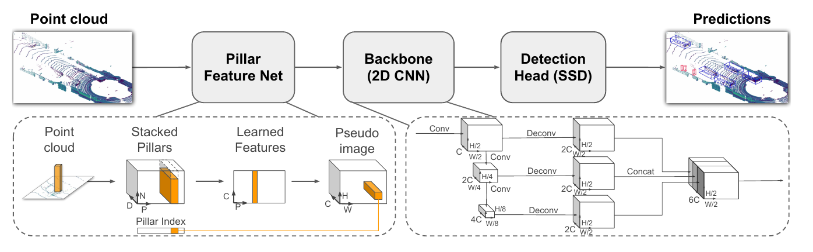
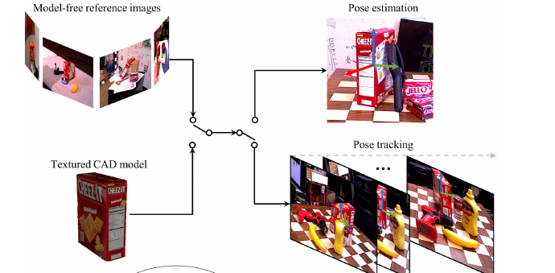
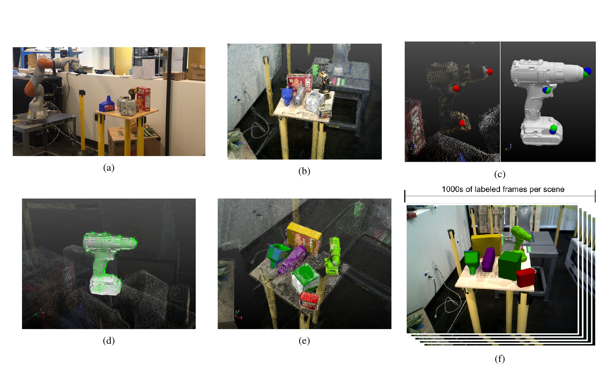
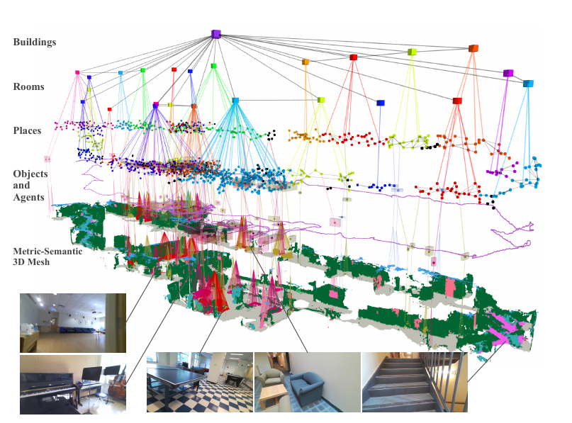

# Représentations par objets

Détecter, localiser, orienter et organiser les objets d’une scène.

<!--
Présenter la question centrale et annoncer les objectifs de ce bloc.
-->

---
hideInToc: true
---

# Que doit contenir une représentation d’objet ?

| Sortie | Information | Usage robotique |
|---|---|---|
| Classe + boîte 2D | Catégorie et région dans l’image | Sélection de régions, suivi visuel |
| Boîte 3D | Centre, dimensions, orientation | Distance, encombrement, collision |
| Pose d’un objet connu | Transformation du modèle vers le capteur | Préhension, assemblage, inspection |
| Nœud dans une carte | Identité persistante et relations | Recherche d’objets, navigation sémantique |

<StepFlow :steps='["Observer", "Détecter", "Estimer la géométrie", "Associer dans la carte"]' />

<!--
Une boîte représente un volume approximatif. La pose suppose un repère d’objet et, pour les méthodes présentées, une géométrie ou une convention de référence.
-->

---
hideInToc: true
---

# Détection 2D : les données d’entraînement

Une image peut contenir un nombre variable d’objets :

$$
Y=\{(c_j,b_j)\}_{j=1}^{M},\quad b_j=(u_j,v_j,w_j,h_j).
$$

Pour chaque objet, $c_j$ est la classe ; $(u_j,v_j)$ est le **coin supérieur gauche** et $(w_j,h_j)$ la largeur et la hauteur, en pixels.

<ExampleBlock title="Exemple">

Exemple : une image annotée avec deux voitures et un piéton. Le détecteur doit prédire leurs classes, leurs positions et leurs dimensions dans l’image.

</ExampleBlock>

<StepFlow :steps='["Images annotées", "Encodeur partagé", "Classes + boîtes", "Association aux cibles"]' />

<!--
Définir ici u,v comme coin supérieur gauche, w,h comme dimensions. Certains réseaux utilisent centre et dimensions ; ne pas mélanger les conventions. Montrer une annotation manquante comme source de faux négatif.
-->

---
hideInToc: true
---

# YOLO : détecter en une seule passe

**YOLO — You Only Look Once** prédit les classes et les boîtes à partir de l’image entière, en une passe du réseau. Exemple présenté : **YOLOv8**.

<YoloDiagram />

À $640\times640$ pixels, les trois cartes donnent $80^2+40^2+20^2=8\,400$ positions de prédiction. Les résolutions différentes aident à détecter des objets de tailles variées.

Redmon et al., <a href="https://arxiv.org/abs/1506.02640">YOLO, CVPR 2016</a> ; exemple moderne : <a href="https://docs.ultralytics.com/models/yolov8/">Ultralytics YOLOv8</a>. Schéma pédagogique.

<!--
L’image schématique contient une voiture et un piéton. Le dessin des cartes illustre leurs tailles relatives, pas leur contenu appris. Pour YOLOv8 standard P3/P4/P5, strides8,16,32 et entrée carrée640 donnent8400 positions, pas8400 objets. L’encodeur extrait les caractéristiques ; la fusion combine plusieurs résolutions ; les têtes calculent les classes et les boîtes en parallèle.
Ce support prend YOLOv8 comme exemple précis, sans attribuer tous ces détails à YOLOv1 ou aux variantes plus récentes. YOLOv8 est anchor-free : points de référence, pas de boîtes d’ancrage de formes prédéfinies. Les scores de classe utilisent des sigmoïdes indépendantes, pas un softmax sur une classe « aucun objet », ni une branche d’objectness séparée. À l’entraînement, TaskAlignedAssigner sélectionne des candidats à partir de leur position, du score de la classe cible et du recouvrement. Plusieurs candidats peuvent être positifs pour le même objet. Les cibles négatives font baisser les scores ; la régression est supervisée sur les positifs. Les détails BCE, CIoU et Distribution Focal Loss restent un approfondissement.
Implémentation vérifiée : ultralytics v8.2.0, yolov8.yaml, utils/tal.py et utils/loss.py.
-->

---
hideInToc: true
---

# YOLO : garder les détections utiles

À l’inférence, YOLOv8 peut proposer plusieurs boîtes pour un même objet. Deux étapes réduisent ces candidats : **seuil de score**, puis **suppression des doublons (NMS)**.

<YoloDiagram mode="candidates" />

Seuils : score $0{,}50$ ; IoU $0{,}50$.

| Candidat | Classe | Score |
|---|---|---:|
| A | Voiture | $0{,}92$ |
| B | Voiture | $0{,}78$ |
| C | Piéton | $0{,}88$ |
| D, non dessiné | Voiture | $0{,}20$ |

La **NMS** conserve la boîte de meilleur score, puis écarte les boîtes de même classe qui la recouvrent trop. Elle répète ce choix parmi les candidates restantes.

<ExampleBlock title="Quelles boîtes conserver ?" v-click>

D est écartée par le seuil de score. Comme $\mathrm{IoU}(A,B)\approx0{,}85>0{,}50$, A est gardée et B supprimée. Il reste **A et C**.

</ExampleBlock>

NMS : non-maximum suppression ; IoU : intersection sur union. <a href="https://github.com/ultralytics/ultralytics/blob/v8.2.0/ultralytics/utils/ops.py">Post-traitement de YOLOv8</a>. Les seuils sont pédagogiques.

<!--
Le seuil de score et le seuil IoU ont ici la même valeur .50, mais règlent deux décisions différentes. Scores et seuils sont fictifs. Les boîtes du dessin A=(50,45,120,80), B=(60,45,120,80), en coin supérieur gauche et dimensions, donnent intersection8800, union10400, IoU=.8461538. NMS par classe : le piéton C ne concurrence pas les voitures. Une forte IoU est un indice de doublon, pas une preuve ; deux objets réellement proches peuvent être confondus. NMS ne fusionne pas les boîtes et ne garantit pas la justesse des détections.
Le filtrage et la NMS montrés ici interviennent à l’inférence ; ils sont distincts de l’affectation aux annotations pendant l’entraînement. Le calcul détaillé d’IoU sert ensuite à relier pertes, doublons et évaluation. Le schéma générique de perte qui suit n’est pas la formule exacte de YOLOv8 ; sa tête standard utilise BCE pour les classes, CIoU et DFL pour les boîtes.
Certaines variantes YOLO proposent une inférence sans NMS. Ne pas universaliser cette étape à toute la famille.
-->

---
hideInToc: true
---

# Une perte pour la classe, une perte pour la boîte

Une fois chaque prédiction associée à sa cible, on corrige **ce qu’est l’objet** et **où il se trouve** :

$$
L_{\mathrm{det}}=\lambda_{\mathrm{cls}}L_{\mathrm{cls}}+\lambda_{\mathrm{box}}L_{\mathrm{box}}+\lambda_{\mathrm{IoU}}L_{\mathrm{IoU}}.
$$

| Terme | Ce qu’il compare | Exemple d’erreur |
|---|---|---|
| Classification | Probabilités et classe cible | Une voiture classée piéton |
| Régression de boîte | Coordonnées prédites et annotées | Une boîte décalée de 40 pixels |
| Recouvrement | Régions couvertes par les boîtes | Une boîte trop grande malgré un bon centre |

<InfoBlock title="Les poids λ équilibrent les contributions">

Les termes ont des échelles différentes. Leur pondération et leur forme exacte dépendent du détecteur. Une boîte parfaite peut encore avoir une mauvaise classe.

</InfoBlock>

<!--
Ne pas présenter cette somme comme universelle. Dans DetectionLab, entropie croisée et Huber normalisée sont additionnées ; IoU est affichée séparément. Les variantes de GIoU peuvent donner un signal lorsque les boîtes ne se recouvrent pas.
-->

---
hideInToc: true
---

# IoU : combien de surface les boîtes partagent-elles ?

L’intersection sur union compare la partie commune à toute la région couverte :

$$
\mathrm{IoU}(A,B)=\frac{|A\cap B|}{|A\cup B|}
=\frac{|A\cap B|}{|A|+|B|-|A\cap B|}.
$$

Deux boîtes de $100\times100$ pixels, à la même hauteur, décalées horizontalement de 40 pixels :

| Quantité | Calcul | Aire en pixels carrés |
|---|---|---:|
| Intersection | $(100-40)\times100$ | $6\,000$ |
| Union | $10\,000+10\,000-6\,000$ | $14\,000$ |

<ExampleBlock title="Un recouvrement visible peut rester insuffisant" v-click>

$\mathrm{IoU}=6\,000/14\,000\approx0{,}43$. À un seuil d’évaluation de $0{,}50$, cette localisation ne suffit pas, même si la classe est correcte.

</ExampleBlock>

<!--
La soustraction évite de compter deux fois l’intersection. IoU=0 si les boîtes sont disjointes ; IoU=1 si elles coïncident. Distinguer le seuil d’évaluation d’une perte optimisée à l’entraînement.
-->

---
hideInToc: true
class: lab-slide
---

# Visualisation IoU

<LabFrame><DetectionLab /></LabFrame>

Faire coïncider les boîtes, puis rendre la classe incorrecte : les deux erreurs se contrôlent séparément.

<!--
Boîte cible [150,100,130,88]. Mettre x=150, y=100, largeur=130 pour IoU=1 et perte boîte=0. Diminuer le score voiture : la classification reste mauvaise malgré une boîte parfaite.
-->

---
hideInToc: true
---

# Évaluer les détections au bon niveau

Une détection correcte combine une classe correcte et un recouvrement suffisant avec une annotation. Une même annotation ne doit pas valider plusieurs prédictions.

$$
\mathrm{précision}=\frac{VP}{VP+FP},\qquad \mathrm{rappel}=\frac{VP}{VP+FN}.
$$

$VP$ : vrais positifs ; $FP$ : faux positifs ; $FN$ : faux négatifs.

<InfoBlock title="Du score à la performance">

La précision moyenne, AP, résume la courbe précision–rappel. Toujours préciser les classes et seuils de recouvrement du protocole.

</InfoBlock>

<ExampleBlock title="Trois piétons annotés, quatre détections" v-click>

Deux piétons sont correctement détectés, un est manqué ; une boîte est un doublon et une autre vise un poteau. Donc $VP=2$, $FP=2$, $FN=1$ : **précision = 50 %**, **rappel ≈ 67 %**.

</ExampleBlock>

<!--
Distinguer seuil de confiance et seuil IoU. Une AP ne se compare qu’entre protocoles identiques ; les pertes d’entraînement ne sont pas directement des métriques de détection.
-->

---
hideInToc: true
---

# Du seuil de confiance à la courbe précision–rappel

Pour une classe et un seuil IoU fixés, trier les détections par score décroissant. Exemple : **trois piétons annotés**.

| Score | Détection ajoutée | Précision cumulée | Rappel cumulé |
|---|---|---:|---:|
| $0{,}95$ | Piéton 1 : VP | $1/1=100\,\%$ | $1/3$ |
| $0{,}90$ | Poteau : FP | $1/2=50\,\%$ | $1/3$ |
| $0{,}80$ | Piéton 2 : VP | $2/3\approx67\,\%$ | $2/3$ |
| $0{,}60$ | Doublon du piéton 1 : FP | $2/4=50\,\%$ | $2/3$ |
| $0{,}40$ | Piéton 3 : VP | $3/5=60\,\%$ | $3/3$ |

Abaisser le seuil fait entrer davantage de détections. Le rappel augmente ou reste constant ; la précision peut monter ou descendre.

**AP** résume la courbe précision–rappel selon le protocole d’interpolation. Ce n’est pas la moyenne des cinq précisions du tableau.

Exemple fictif, annotations sans cas « crowd » ni ignorés. <a href="https://github.com/cocodataset/cocoapi/blob/master/PythonAPI/pycocotools/cocoeval.py">Protocole de référence COCO</a>.

<!--
Fixer par exemple IoU≥.5. À seuil .8, garder trois prédictions : précision=2/3 et rappel=2/3. AP utilise les scores pour ordonner les détections ; on n’évalue pas à un seul seuil de confiance. COCO échantillonne 101 rappels et moyenne aussi plusieurs seuils IoU. Comparer des résultats exige le même protocole.
-->

---
hideInToc: true
class: lab-slide
---

# Faire varier le seuil de détection

<LabFrame label="Image synthétique · scores fixes · classe : piéton · sans NMS"><PrecisionRecallLab /></LabFrame>

Abaisser le seuil ou cliquer sur la courbe. Entre deux scores, les détections et le point restent identiques.

<!--
L’image est synthétique, produite avec ImageGen, et les boîtes/scores sont construits pour la pédagogie. Aucun détecteur n’est exécuté. Trois annotations piéton, cinq prédictions A .95, B .90, C .80, D .60, E .40 : mêmes nombres que le tableau précision-rappel. Toutes les prédictions prétendent détecter un piéton ; B vise le poteau, D est un doublon de A. Le seuil de score varie ; le seuil IoU d’évaluation reste à .50. La liste de candidats reste fixe et conserve volontairement le doublon D : aucune NMS n’est appliquée dans cet exemple. Pour évaluer un système déployé, fixer aussi sa règle de post-traitement et évaluer ses sorties correspondantes.
Au départ, seuil .80 : A, B et C sont visibles, VP=2 FP=1 FN=1, précision=rappel=2/3. Monter à .95 : un seul vrai positif, précision1 et rappel1/3. Descendre à .90 ajoute le poteau : rappel inchangé, précision1/2. À .60, le doublon ajoute encore un FP sans changer le rappel. À .40, les trois piétons sont trouvés : rappel1, précision3/5. Chaque annotation ne peut être appariée qu’une fois, dans l’ordre décroissant des scores. Les FP et FN sont déterminés par comparaison aux annotations, une information indisponible à l’inférence ordinaire.
Les points reliés donnent la courbe empirique brute de cet exemple à une seule image ; la liaison est un guide visuel, pas une interpolation AP ni une performance mesurée d’un modèle. Le point saute aux scores des prédictions, il ne parcourt pas continûment les segments. À seuil1, aucune prédiction n’est retenue : précision0/0 indéfinie, rappel0, aucun point artificiel ajouté à la courbe. Cliquer Balayer le seuil anime les cinq ajouts ; la lecture s’arrête en quittant la diapositive. Les annotations peuvent être masquées, sans changer l’évaluation.
-->

---
hideInToc: true
class: example-flow-slide
---

# RGB-D : passer de l’image à des points métriques

Le pixel $(u,v)$ et sa profondeur axiale $d=D(u,v)$ donnent un point dans le repère caméra :

$$
X_C=\begin{bmatrix}(u-c_x)d/f_x\\(v-c_y)d/f_y\\d\end{bmatrix}
=dK^{-1}\begin{bmatrix}u\\v\\1\end{bmatrix}.
$$

Soustraire le point principal $(c_x,c_y)$, diviser par les focales $(f_x,f_y)$, puis multiplier par la profondeur : les pixels deviennent des mètres.

<ExampleBlock title="Un point sur une boîte à saisir" v-click>

$f_x=f_y=500\,\mathrm{px}$, $(c_x,c_y)=(320,240)$, $(u,v)=(370,240)$ et $d=2\,\mathrm m$ donnent $X_C=(0{,}20\,;\,0\,;\,2)\,\mathrm m$ : **20 cm à droite** de l’axe optique.

</ExampleBlock>

Pour le véhicule : $X_V=R_{V\leftarrow C}X_C+t_{V\leftarrow C}$. La calibration extrinsèque fixe ce changement de repère.

<!--
La profondeur doit être alignée sur l’image couleur. D est ici la profondeur axiale Z, pas la portée euclidienne le long du rayon. Si le capteur donne une portée, normaliser le rayon. Les focales et le point principal sont en pixels ; les translations et la profondeur doivent utiliser la même unité métrique.
-->

---
hideInToc: true
---

# Paramétrer une boîte 3D

Pour des objets supposés verticaux :

$$
b=(c_x,c_y,c_z,l,w,h,\psi).
$$

- $c$ : centre, en mètres.
- $l,w,h$ : dimensions.
- $\psi$ : orientation autour de la verticale.

Une orientation générale nécessite une rotation 3D.

<StepFlow :steps='["Centre", "Dimensions", "Orientation"]' />

<InfoBlock title="Hypothèse physique">

Une boîte de véhicule ne nécessite qu'un seul angle lacet (yaw), puisqu'on assume que la voiture a ses quatre roues au sol. Par contre, un outil pouvant être tenu dans toutes les orientations demande trois degrés de liberté de rotation.

</InfoBlock>

<!--
Distinguer la convention véhicule z vertical de la convention caméra z optique. Les libellés de la démonstration sont dans le repère caméra ; les dimensions suivent les axes locaux de la boîte.
-->

---
hideInToc: true
class: lab-slide
disabled: true
---

# Relier boîte 3D, nuage et image

<LabFrame><ObjectPoseLab /></LabFrame>

Modifier la profondeur, la longueur et la rotation. Observer la projection et le volume 3D simultanément.

<!--
Les points sont synthétiques et partagés entre les deux vues. L’orientation de cette démonstration est une rotation autour d’un axe caméra ; la convention de lacet véhicule dépend du repère choisi.
-->

---
hideInToc: true
class: figure-slide
---

# Une détection LiDAR versus caméra

En haut : nuages de points et boîtes en vue de dessus.

En bas : reprojection des boîtes dans les images.

Les images aident ici à **visualiser** le résultat ; PointPillars utilise le LiDAR pour cette détection.

Lang et al., PointPillars, CVPR 2019, Figure 3. <a href="https://arxiv.org/abs/1812.05784">Article et source de la figure</a>.

<!--
Figure qualitative KITTI. Ne pas laisser croire qu’une visualisation sur image implique une entrée image du réseau.
-->

---
hideInToc: true
class: figure-slide
---

# PointPillars : du nuage à une pseudo-image

1. Regrouper les points en colonnes verticales.
2. Encoder les points de chaque colonne.
3. Organiser les vecteurs dans une grille.
4. Prédire classes et boîtes 3D.

La grille facilite le traitement par des convolutions 2D.

Lang et al., PointPillars, CVPR 2019, Figure 2. <a href="https://arxiv.org/abs/1812.05784">Article et source de la figure</a>.

<!--
Montrer sur la figure où apparaissent les points bruts, les piliers et les sorties. Une pseudo-image ne correspond pas à une photographie.
-->

---
hideInToc: true
disabled: true
---

# Apprendre à détecter dans un nuage LiDAR

Données : points $(x,y,z)$, parfois intensité, puis classes et boîtes 3D annotées.

$$
L=L_{\mathrm{classe}}+\lambda_c L_{\mathrm{centre}}+\lambda_d L_{\mathrm{dimensions}}+\lambda_r L_{\mathrm{rotation}}.
$$

Les dimensions et positions sont normalisées selon le détecteur.

<InfoBlock title="Autre paramétrisation">

CenterPoint prédit une carte de chaleur des centres en BEV, puis régresse hauteur, dimensions, orientation et éventuellement vitesse.

</InfoBlock>

<StepFlow :steps='["Nuage", "Caractéristiques BEV", "Centres et attributs", "Boîtes orientées"]' />

<!--
Source : Yin et al., Center-based 3D Object Detection and Tracking, CVPR 2021, arXiv:2006.11275. Les termes détaillés et leurs pondérations sont spécifiques à la méthode.
-->

---
hideInToc: true
---

# Images et LiDAR : des informations complémentaires

| Critère | Images | LiDAR |
|---|---|---|
| Apparence et catégories | Texture et couleur riches | Géométrie, intensité éventuelle |
| Échelle métrique | Ambiguë en monoculaire | Mesure directe de distance |
| Densité | Dense en pixels | Clairsemée, surtout à longue portée |
| Conditions difficiles | Sensible à l’éclairage | Sensible aussi à la pluie, au brouillard et aux occultations |
| Fusion | Calibration et synchronisation nécessaires | Même exigence pour une fusion cohérente |

<InfoBlock title="Décision de conception">

Choisir selon le capteur, la tâche et les conditions de déploiement. Une fusion mal calibrée peut dégrader une estimation.

</InfoBlock>

<ExampleBlock title="Un piéton attend au bord de la route">

L’image aide à reconnaître le piéton ; les retours LiDAR sur son corps renseignent sa distance. La fusion doit associer les pixels et les points du même piéton, au même instant.

</ExampleBlock>

<!--
Éviter la généralisation « LiDAR robuste à toute météo ». Expliquer les erreurs temporelles lorsqu’un objet bouge entre deux mesures.
-->

---
hideInToc: true
---

# Estimer la pose d’un objet connu

Pour plusieurs applications, il est nécessaire d'estimer la pose d'un objet.

Le cas le plus simple est lorsqu'on connaît à priori la géométrie de l'objet. Par exemple, on peut avoir un modèle CAO (CAD en anglais) de l'objet.

Le modèle CAO définit les points sur l'objet dans le repère objet $O$. La pose les exprime dans le repère caméra $C$ :

$$
X_C=\underbrace{R_{C\leftarrow O}X_O}_{\text{tourner les axes de l’objet}}+
\underbrace{t_{C\leftarrow O}}_{\text{placer son origine}}.
$$

**Six degrés de liberté** : trois pour la translation et trois pour la rotation. Les dimensions de l’objet sont fournies par son modèle.

<!--
Rotation positive dans un repère direct. Le calcul R puis t correspond à T caméra←objet, qui appartient à SE(3). Pour commander la prise, il faut également la calibration entre caméra et robot. Ne pas inverser cette transformation implicitement.
-->

---
hideInToc: true
class: figure-slide
---

# Un modèle CAO fourni à l’inférence

1. On cherche l'objet dans l'image et détermine sa position et boîte englobante.
2. Pour obtenir l'orientation de l'objet, on associe les points du modèle 3D (CAO) avec les points dans la boîte englobante.
3. Une fois les points associés, on peut calculer l'orientation (ex: à la manière d'ICP et PnP).

Wen et al., FoundationPose, CVPR 2024, Figure 1, partie supérieure. <a href="https://nvlabs.github.io/FoundationPose/">Article et source de la figure</a>.

<!--
Rester sur le cas modèle CAO. La figure montre également le cas sans modèle ; expliquer ce panneau sans développer son rendu implicite.
-->

---
hideInToc: true
class: example-flow-slide
---

# Correspondances puis estimation géométrique

Pour chaque point, on connaît sa position **3D dans le modèle** $X_k^O$ et son **pixel observé** $u_k$. La pose $T$ reste à estimer :

$$
\hat T=\arg\min_T\sum_k\left\|u_k-\underbrace{\pi\!\left(KTX_k^O\right)}_{\text{pixel prédit pour cette pose}}\right\|^2.
$$

<StepFlow :steps='["Point CAO", "Pose candidate T", "Projection dans l’image", "Écart au pixel observé"]' />

<ExampleBlock title="Le résidu est mesuré dans l’image">

Un coin observé en $(320,240)$ est projeté en $(324,237)$ : le résidu vaut $(-4,3)$ pixels.

Sa contribution à la somme est $(-4)^2+3^2=25\,\mathrm{px}^2$.

</ExampleBlock>

**PnP** estime la pose à partir de ces correspondances ; un raffinement réduit l’erreur de reprojection.

<!--
π effectue la division perspective : (x,y,z) devient (x/z,y/z). K est connu. Les correspondances peuvent être prédites par un réseau ; PnP est l’étape géométrique. La formule représente l’objectif de reprojection, pas tous les détails d’un solveur PnP. RANSAC peut écarter les mauvaises correspondances. Une géométrie dégénérée ou des symétries peuvent produire des ambiguïtés.
-->

---
hideInToc: true
class: figure-slide
---

# PoseCNN : prédire la pose avec des exemples annotés

Des caractéristiques (features) partagées alimentent trois sorties : segmentation, translation et rotation.

Les cibles d’entraînement contiennent des poses connues. La rotation est régressée sous forme de quaternion.

Le modèle est spécialisé pour les objets appris.

Xiang et al., PoseCNN, RSS 2018, Figure 2. <a href="https://rse-lab.cs.washington.edu/projects/posecnn/">Article et source de la figure</a>.

<!--
Les modèles CAO servent aussi à définir le repère et les pertes ; ne pas présenter régression supervisée et connaissance de la géométrie comme des catégories exclusives.
-->

---
hideInToc: true
class: lab-slide
disabled: true
---

# Manipuler les six degrés de liberté d’une pose

<LabFrame><ObjectPoseLab mode="pose"/></LabFrame>

Observer les axes de l’objet et sa projection lorsque translation et orientation changent.

<!--
La démo expose trois translations et trois rotations. Distinguer ces six degrés de liberté des six valeurs de la représentation continue d’une rotation.
-->

---
hideInToc: true
---

# Quaternions : normalisation et double représentation

Un quaternion unitaire $q=(q_w,q_x,q_y,q_z)$ représente une rotation :

$$
\|q\|_2=1,\qquad R(q)=R(-q).
$$

Normaliser la sortie du réseau avant de former la matrice de rotation.

<AlertBlock title="Ambiguïté de signe">

Une perte naïve $\|\hat q-q\|^2$ peut pénaliser deux rotations identiques.

Une possibilité :

$$
\min\left(\|\hat q-q\|^2,\|\hat q+q\|^2\right).
$$

</AlertBlock>

<ExampleBlock title="Même orientation, erreur artificielle" v-click>

$q=(1,0,0,0)$ et $\hat q=(-1,0,0,0)$ laissent tous deux l’objet sans rotation. Pourtant $\|\hat q-q\|^2=4$ ; la perte qui tient compte du signe vaut $0$.

</ExampleBlock>

<!--
La distance géodésique sur SO(3) est une autre option. La normalisation nécessite de traiter les sorties de norme proche de zéro.
-->

---
hideInToc: true
disabled: true
---

# Représentation continue 6D d’une rotation

Le réseau prédit deux vecteurs $a,b\in\mathbb R^3$. On en construit **trois axes unitaires perpendiculaires**, donc une rotation :

| Étape | Calcul | Rôle |
|---|---|---|
| 1. Normaliser $a$ | $e_1=a/\lVert a\rVert$ | Fixer le premier axe |
| 2. Retirer de $b$ sa composante selon $e_1$ | $b_\perp=b-(e_1^\top b)e_1$ | Obtenir une direction perpendiculaire |
| 3. Compléter la base | $e_2=b_\perp/\lVert b_\perp\rVert$, $e_3=e_1\times e_2$ | Former $R=[e_1\ e_2\ e_3]$ |

La construction suppose $a\neq0$ et $b$ non colinéaire à $a$.

<InfoBlock title="Six valeurs pour une rotation">

Cette représentation facilite la régression en évitant certaines discontinuités. Elle code une rotation à **trois degrés de liberté** ; la translation doit être prédite séparément.

</InfoBlock>

Zhou et al., CVPR 2019. <a href="https://arxiv.org/abs/1812.07035">On the Continuity of Rotation Representations in Neural Networks</a>.

<!--
Les sorties a nulles ou a et b colinéaires rendent la construction dégénérée ; prévoir des garde-fous numériques. La continuité n’est pas une garantie de performance de l’apprentissage.
-->

---
hideInToc: true
disabled: true
---

# Construire la rotation à partir de deux vecteurs

Sorties du réseau : $a=(2,0,0)$ et $b=(1,3,0)$. Ces vecteurs ne sont ni unitaires ni perpendiculaires.

| Opération | Résultat |
|---|---|
| Normaliser $a$ | $e_1=(1,0,0)$ |
| Calculer la composante de $b$ selon $e_1$ | $(e_1^\top b)e_1=(1,0,0)$ |
| Retirer cette composante | $b_\perp=(1,3,0)-(1,0,0)=(0,3,0)$ |
| Normaliser le reste | $e_2=(0,1,0)$ |
| Produit vectoriel | $e_3=(0,0,1)$ |

<ExampleBlock title="Quelle orientation obtient-on ?" v-click>

$R=[e_1\ e_2\ e_3]=I$ : aucune rotation. Les longueurs de $a,b$ et l’obliquité de $b$ ont été retirées pour obtenir une base valide.

</ExampleBlock>

<!--
Si b=(1,0,0), le reste b_perp est nul : il n’existe plus de deuxième direction. Demander ce qui échoue avant d’utiliser le laboratoire de rotations. Les colonnes de R sont les axes de l’objet exprimés dans le repère de destination.
-->

---
hideInToc: true
class: lab-slide
disabled: true
---

# Comparer quaternion et base construite à partir de 6D

<LabFrame><RotationLab /></LabFrame>

Inverser le signe du quaternion, puis modifier l’obliquité des vecteurs prédits.

<!--
Changer q en −q ne modifie pas les axes. L’obliquité est retirée par orthogonalisation. Montrer les trois axes finaux et les deux vecteurs d’entrée.
-->

---
hideInToc: true
disabled: true
---

# Symétries : deux poses peuvent expliquer la même observation

Comparer les points du modèle transformés :

$$
\mathrm{ADD}=\frac1{|M|}\sum_{X\in M}\|\hat RX+\hat t-(RX+t)\|.
$$

$M$ est l’ensemble des points du modèle. On mesure le déplacement de **chaque même point**, puis on moyenne.

**Exemple :** si seule la translation est erronée de 2 cm, tous les points sont décalés de 2 cm : $\mathrm{ADD}=0{,}02\,\mathrm m$.

<ExampleBlock title="Objet symétrique">

Pour un cylindre sans texture, plusieurs rotations peuvent donner la même apparence. Une métrique avec correspondances symétriques, telle ADD-S, évite certaines pénalisations artificielles.

</ExampleBlock>

<!--
ADD : average distance of model points. ADD-S utilise le plus proche voisin entre points transformés. Distinguer symétrie géométrique et symétrie d’apparence ; une texture peut lever l’ambiguïté.
-->

---
hideInToc: true
---

# Annoter une reconstruction pour superviser plusieurs vues

<StepFlow :steps='["Images + SfM", "Densification + maillage", "Annotation en 3D", "Reprojection visible"]' />

La structure à partir du mouvement, **SfM**, estime les caméras et une géométrie à partir d’images. **SfM** est l'équivalent du SLAM, mais hors ligne, donc sans contrainte d'exécution temps réel. Une reconstruction dense et un maillage permettent ensuite une annotation spatiale.

<InfoBlock title="Économiser l’annotation">

Une annotation 3D peut servir à de nombreuses images. Il faut des poses cohérentes, une scène suffisamment statique et un traitement des occultations.

</InfoBlock>

<!--
COLMAP : Schönberger et Frahm, Structure-from-Motion Revisited, CVPR 2016. SfM seul fournit généralement une géométrie clairsemée ; la densification et le maillage sont des étapes supplémentaires. Sans référence métrique, l’échelle peut rester ambiguë.
-->

---
hideInToc: true
class: figure-slide
---

# Annoter une scène reconstruite

Le pipeline collecte une séquence RGB-D, reconstruit la scène, aligne les modèles d’objets, puis reprojette leurs étiquettes.

Marion et al., LabelFusion, ICRA 2018, Figure 1. <a href="https://labelfusion.csail.mit.edu/">Article et source de la figure</a>.

<!--
Lire les six panneaux : capture, reconstruction, correspondances guidées, alignement, objets annotés, labels dans les images.
-->

---
hideInToc: true
class: lab-slide
disabled: true
---

# Une annotation 3D, plusieurs vues supervisées

<LabFrame><AnnotationLab /></LabFrame>

Activer l’annotation du maillage, puis déplacer les caméras. Les labels suivent les projections.

<!--
Les trois vues représentent une même surface synthétique. Expliquer qu’en scène réelle un test de profondeur, comme un z-buffer, élimine les points cachés.
-->

---
hideInToc: true
disabled: true
---

# Pseudo-étiquetage : apprendre à partir d’un enseignant

L’**enseignant** produit des cibles sur les données non annotées. L’**élève** apprend à les reproduire, en plus des annotations humaines.

$$
L=L_{\mathrm{sup}}+\lambda_u\sum_{i\in U}m_i\,\ell(f_{\theta_S}(x_i),\hat y_{T,i}).
$$

| Symbole | Sens |
|---|---|
| $U$, $\hat y_{T,i}$ | Exemples non annotés et cibles proposées par l’enseignant |
| $m_i=\mathbf1[\mathrm{confiance}\geq\delta_{\mathrm{pseudo}}]$ | Garder ($1$) ou ignorer ($0$) la pseudo-étiquette |
| $\lambda_u$ | Poids accordé à cette supervision supplémentaire |

<ExampleBlock title="Filtrer avant de calculer la perte">

Seuil $0{,}90$ : une voiture de confiance $0{,}92$ est retenue ; une détection à $0{,}60$ est ignorée. Avec des pertes $0{,}3$ et $0{,}8$, puis $\lambda_u=0{,}5$, la contribution vaut $0{,}5(1\times0{,}3+0\times0{,}8)=0{,}15$.

</ExampleBlock>

<!--
Les chiffres sont pédagogiques. Une confiance élevée ne prouve pas la justesse ; les erreurs peuvent être renforcées. L’enseignant peut être fixe ou évoluer, par exemple par moyenne mobile theta_T←mu theta_T+(1-mu) theta_S. Pour mu=.9, ancien poids2 et élève4 donnent2.2. Mean Teacher : Tarvainen et Valpola, NeurIPS2017, arXiv:1703.01780. Ne pas attribuer tout filtrage dur à cette méthode. On traite les pseudo-cibles comme des cibles fixes pour la mise à jour de l’élève.
-->

---
hideInToc: true
class: lab-slide
disabled: true
---

# Le seuil de confiance filtre sans garantir la justesse

<LabFrame><AnnotationLab mode="teacher"/></LabFrame>

Augmenter le seuil réduit la quantité de pseudo-étiquettes ; une erreur confiante peut subsister.

<!--
À .75, cinq étiquettes sont conservées, dont une erreur confiante à .83. Souligner le biais de confirmation et l’importance d’une validation annotée.
-->

---
hideInToc: true
class: figure-slide
zoom: 1.2
---

# Des objets à une carte hiérarchique

Graphe de scène 3D: organise géométrie, objets, lieux, pièces et bâtiment dans une même hierarchie.

Les noeuds (objets, lieux, pièces) ont des étiquettes de classe et de pose.

Les relations représentent l’appartenance, la proximité et la connectivité.

**Exemple :** « Trouver une chaise dans la salle de réunion. » Le graphe relie la chaise à la pièce, puis la pièce aux lieux traversables pour y accéder.

Hughes et al., Hydra, RSS 2022, Figure 1. <a href="https://arxiv.org/abs/2201.13360">Article et source de la figure</a>.

<!--
Hydra est un système de perception spatiale complet. Les prédictions supervisées sont des entrées de la carte ; toute la hiérarchie ne résulte pas d’une unique loss supervisée.
-->

---
hideInToc: true
class: lab-slide
---

# Explorer les niveaux d’un graphe de scène

<LabFrame><SceneHierarchyLab /></LabFrame>

Changer le niveau d’abstraction et sélectionner un objet pour suivre son appartenance spatiale.

<!--
Demander comment répondre à « trouver une chaise dans la salle de réunion ». La hiérarchie réduit l’espace de recherche ; les relations spatiales servent à planifier le déplacement.
-->
