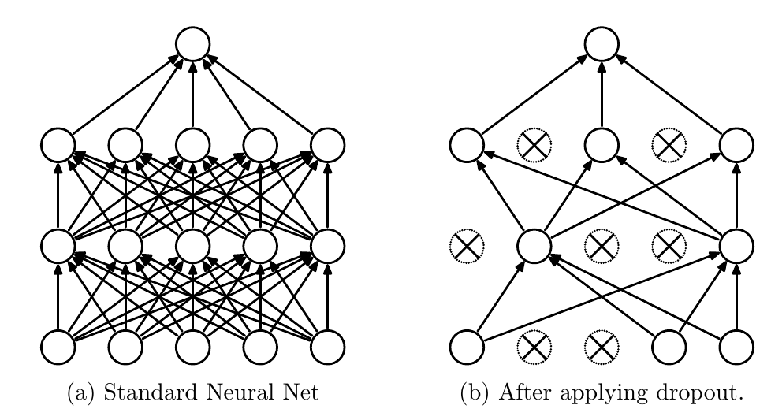

# Foundations of Supervised Learning

How do we turn annotated examples into a model that generalizes?

<!--
Present the central question and announce the objectives of this block.
-->

---
hideInToc: true
---

# One observation, one target, one prediction

<StepFlow :steps='["Observation x", "Modèle fθ(x)", "Prédiction ŷ", "Comparaison à une cible y"]' />

<div class="lesson-columns">
<div>

A robot receives an image. The target can be a **distance**, a **class**, a **box**, or a **pose**.

The parameters $\theta$ are adjusted on labeled examples.

</div>
<div>

<ExampleBlock title="Example">

For an actual distance of $8\,\mathrm m$, the model predicts $6\,\mathrm m$. The loss function quantifies this error. The error then guides the correction of the model's parameters.

</ExampleBlock>

</div>
</div>

<!--
Distinguish data, parameters, and target. The parameters are shared across observations; each example has its own target.
-->

---
hideInToc: true
---

# Learning by minimizing a cost function

For an annotated dataset $\mathcal D=\{(x_i,y_i)\}_{i=1}^{N}$:

$$
\theta^*=\arg\min_\theta L(\theta),\qquad L(\theta)=\frac1N\sum_{i=1}^{N}\ell(f_\theta(x_i),y_i).
$$

<StepFlow :steps='["Compute ŷ", "Measure ℓ against the target y", "Gradient descent and backpropagation", "The parameters θ are updated"]' />

<InfoBlock title="Key takeaway">

**Minimizing the loss function L(θ) on the training dataset allows learning the parameters θ of the prediction function f:**
$$ f_\theta(x_i) =  ŷ_i$$

</InfoBlock>

<!--
Read argmin as: look for the parameters that make the cost minimal. The function is often non-convex; we aim for a good solution, not a guarantee of a global minimum.
-->

---
hideInToc: true
---

# Train then use the model

<div class="lesson-columns">
<div>

Learn a model:
<StepFlow :steps='["Annotated data", "Gradient descent", "Learned parameters"]' />

</div>
<div>

Use a model:
<StepFlow :steps='["New observation", "Fixed parameters", "Prediction"]' />

</div>
</div>

<!--
A GNSS target can be used during training without being available during visual search. This link will be reused in multimodal labeling.
-->

---
hideInToc: true
---

# Split training, validation, and test sets

| Set | Role | What can depend on it |
|---|---|---|
| Training | Compute the loss and gradients | Network parameters |
| Validation | Compare model choices | Hyperparameters, stopping, selection |
| Test | Evaluate the chosen model | Final performance report |

<StepFlow :steps='["Data collection", "Split into independent sets", "Training", "Selection on validation", "Evaluation on test"]' />

<AlertBlock title="Avoiding contamination">

In robotics, split by trajectory, location, or session. Two consecutive frames from a video are strongly correlated.

</AlertBlock>

<!--
Example: randomly distributing all images from a given trajectory yields a test set too close to training. A city held out for testing measures a different kind of generalization than a new session in the same city.
-->

---
hideInToc: true
---

# The neuron: a transformation followed by an activation

<div class="lesson-columns">
<div>

$$
a=w^\top x+b,\qquad h=\tanh(a).
$$

- $w$ weighs the inputs; $b$ is a bias.
- $a$ is a preactivation.
- Non-linear activations make it possible to learn more complex functions.

</div>
<div>

<StepFlow :steps='["Entrées x", "Somme pondérée a", "Activation h"]' />

</div>
</div>

<!--
Mentally draw a height/roughness boundary. Mention ReLU as a very common activation; tanh is used in the demonstration because its derivative is smooth.
-->

---
hideInToc: true
---

# A network composes several transformations

$$
h^{(1)}=\phi(W_1x+b_1),\qquad h^{(2)}=\phi(W_2h^{(1)}+b_2),\qquad \hat y=g(W_3h^{(2)}+b_3).
$$

<StepFlow :steps='["Measurements", "Simple features", "Composite features", "Task-adapted output"]' />

<div class="lesson-columns">
<div>

The **weights** and **biases** constitute the parameters. An intermediate feature can describe a texture, an edge, or a structure.

</div>
<div>

<InfoBlock title="">

An encoder transforms an image or a point cloud into features.
The last layer of a network (head) estimates a class, a box, a descriptor, etc from the features.

</InfoBlock>

</div>
</div>

<!--
Do not go through every architecture here. Convolution and attention remain available in the appendix.
-->


---
hideInToc: true
---

# Regression: predicting a continuous quantity

<div class="lesson-columns">
<div>

The target is numeric: depth, position, dimensions, or velocity.

$$
e=\hat y-y,\qquad \ell_{\mathrm{quad}}=\frac12e^2,\qquad \frac{\partial\ell}{\partial\hat y}=e.
$$

The gradient indicates which direction to correct the prediction.

</div>
<div>

<ExampleBlock title="Worked example">

True distance: $8\,\mathrm m$. Prediction: $6\,\mathrm m$.

$e=-2\,\mathrm m$, $\ell=\frac12 \cdot (-2)^2\,\mathrm m^2$ and $\partial\ell/\partial\hat y=-2\,\mathrm m$.

Descending the gradient **increases** the prediction $\hat y$ to reduce the error.

</ExampleBlock>

</div>
</div>


---
hideInToc: true
---

# Regression example: from an image to a steering angle

<LabFrame label="Imitation driving example · scenes and illustrative values"><SteeringRegressionLab /></LabFrame>

<p class="lab-caption">A 2D image → a scalar. Here, the angle is normalized between −1 and +1; it could also be expressed in radians.</p>

<!--
Each training pair associates a front-facing image with the steering angle recorded at the same instant, for example from a driver. The image contains the road, the markings, and the upcoming curves. This is regression of a command by imitation from perception data.
The three scenes are three annotated examples, not three classes: the output can take any continuous value in the interval. The slider simulates a prediction; no network processes the image here. Start: y=0.6, prediction=0.2, error=-0.4, loss=0.08. Move the slider to 0.6, then change the scene. Converting to radians requires defining the physical reference angle; the positive sign to the right is the convention chosen in this example.
-->

---
hideInToc: true
class: example-flow-slide
---

# Classification: from scores to probabilities

For $C$ classes, the network predicts scores $s_1,\ldots,s_C$ called logits:

$$
p_c=\frac{\exp(s_c)}{\sum_{k=1}^{C}\exp(s_k)},\qquad \sum_c p_c=1.
$$

<StepFlow :steps='["Image", "Scores [2, 1, 0]", "Softmax", "[0.665 ; 0.245 ; 0.090]"]' />

<ExampleBlock title="Classifying a region observed by the robot" v-click>

In the order **road, pedestrian, vehicle**, these scores give 66.5%, 24.5% and 9.0%. The model chooses "road". If the annotation is "pedestrian", this prediction is incorrect.

</ExampleBlock>

<InfoBlock title="Key takeaway">

Scores can be negative. Probabilities are positive and normalized. The largest score remains the most probable class.

</InfoBlock>

<!--
For numerical stability, subtract the maximum score before the exponential. A high softmax probability is not a guarantee of good calibration.
-->

---
hideInToc: true
---

# Cross-entropy: the probability of the correct class

A region contains a **pedestrian**. What probability does the model assign to this annotation?

<div class="lesson-columns">
<div>

| Class $c$ | Target $y_c$ | Prediction $p_c$ |
|---|---:|---:|
| Road | 0 | 0.6652 |
| **Pedestrian** | **1** | **0.2447** |
| Vehicle | 0 | 0.0900 |

The **one-hot** label is 1 for the correct class, 0 for the others. The probabilities $p_c$ come from the softmax.

</div>
<div>

Cross-entropy compares the target $y$ to the predicted distribution $p$:

$$
\ell_{\mathrm{CE}}=-\sum_{c=1}^{C}y_c\ln p_c.
$$

Only the term for the annotated class $c^*$ remains:

$$
\ell_{\mathrm{CE}}=-\ln p_{c^*}.
$$

</div>
</div>

<ExampleBlock title="The target selects the &quot;pedestrian&quot; term" v-click>

$$
\ell=-[0\ln p_{\mathrm{road}}+1\ln p_{\mathrm{pedestrian}}+0\ln p_{\mathrm{vehicle}}]
=-\ln(0{.}2447)\approx1{.}408.
$$

Minimizing this loss encourages the model to assign **more probability to the pedestrian**.

</ExampleBlock>

<!--
Reuse the scores [2,1,0] in order road, pedestrian, vehicle. The probabilities in the table are rounded to four decimals; their displayed sum is 0.9999. The target is the annotation, not the network's winning class. Ask which term of the sum survives, then reveal the computation. ln denotes the natural logarithm.
The name cross-entropy comes from H(y,p) = −Σ y_c ln p_c: the target distribution y weights the cost −ln p_c supplied by the prediction p. Here y is one-hot, so its own entropy is zero; we are not simply minimizing the entropy of p. A confident prediction on the wrong class is still penalized.
The fact that the terms for non-target classes are zero does not mean their logits receive no gradient: the softmax couples the probabilities. The combined gradient with respect to the logits is p−y. This formulation assumes mutually exclusive classes; for several simultaneous labels, use suitably adapted binary outputs.
-->

---
hideInToc: true
---

# Why a logarithmic loss?

With $p=p_{c^*}$, the loss $-\ln p$ decreases as the probability of the correct class increases.

<div class="lesson-columns">
<div>

<CrossEntropyCurve />

At $p=1$: zero loss. If $p\to0$: loss $\to+\infty$.

</div>
<div>

<ExampleBlock title="Two correct predictions, two losses">

The target is "pedestrian"; order: road, pedestrian, vehicle.

| Predicted probabilities | Loss |
|---|---:|
| $(0.4;\ 0.5;\ 0.1)$ | $0.693$ |
| $(0.05;\ 0.9;\ 0.05)$ | $0.105$ |

The pedestrian comes first in both cases, but the second prediction gives it more probability.

</ExampleBlock>

</div>
</div>

<InfoBlock title="What we are training">

The loss evaluates the **probability of the annotation**, beyond a simple correct/incorrect verdict. On a mini-batch, we take the average of the losses of the examples.

</InfoBlock>

<!--
The points on the curve use the values −ln(0.8)=0.223 and −ln(0.1)=2.303. A probability ten times smaller again, 0.01, gives 4.605. Each time the probability is divided by ten, ln(10) is added to the loss. The logarithm is natural.
Why exactly a logarithm? Under the usual assumption of examples independent conditionally on the model, maximizing the likelihood of the annotations amounts to maximizing the product of the p(y_i|x_i). The logarithm turns this product into a sum. Minimizing the sum of −ln p(y_i|x_i), or its average, is therefore a maximum-likelihood estimation.
The limits 0 and 1 are ideal: with finite logits, the softmax gives probabilities strictly between 0 and 1. In code, compute the loss from the logits via log-sum-exp to avoid log(0) due to rounding. A low training loss does not guarantee good calibration on new data.
-->

---
hideInToc: true
class: lab-slide
---

# Manipulating scores and cross-entropy

<LabFrame><LossLab mode="classification"/></LabFrame>

<p class="lab-caption">Target "pedestrian": increasing its score decreases the loss. Then change the target to compare.</p>

<!--
Start: the target is pedestrian, but the road has the highest score. Read p(target)=0.2447 then −ln p(target)=1.408. Increase the pedestrian's score and watch its probability rise while the loss falls. Then increase the road's score: the pedestrian's probability drops and the loss rises. The outputs are linked by the softmax normalization.
Without changing the scores, choose a different annotation: the bars stay the same, but the probability used in the loss changes. The gradients shown follow the order road, pedestrian, vehicle. The gradient p−y of the target logit is negative: a descent step increases this score; the other gradients are positive and their scores decrease.
-->

---
hideInToc: true
---

# Chain rule connects the loss to the parameters

Changing a weight changes an activation, then the prediction, then the loss. The chain rule measures **how this effect propagates**.

$$
a=w_1x+b_1,\qquad h=\tanh(a),\qquad \hat y=w_2h+b_2,\qquad \ell=\tfrac12(\hat y-y)^2.
$$

$$
\frac{\partial\ell}{\partial w_1}=
(\hat y-y)\times w_2\times(1-h^2)\times x.
$$

| $\hat y-y$ | $w_2$ | $1-h^2$ | $x$ |
|---|---|---|---|
| Slope of the loss | Effect of $h$ on $\hat y$ | Slope of the activation | Effect of $w_1$ on $a$ |

<InfoBlock title="Backpropagating">

The forward pass provides $a,h,\hat y$. The backward pass multiplies the local derivatives to obtain the sensitivity of the loss to each parameter.

</InfoBlock>

<!--
The gradient is a local sensitivity, not the optimal value of the weight. Multiply along a path; add contributions when several paths meet at a parameter. The factor 1/2 simplifies the derivative of the quadratic loss.
-->

---
hideInToc: true
---

# Backpropagation: one weight, one computation, one effect

Steering angle example: $x=1$, $y=0.3$, with $w_1=b_1=0$, $w_2=0.5$ and $b_2=0.1$.

| Forward computation | Value | Local derivative for the backward pass |
|---|---:|---|
| $a=w_1x+b_1$ | $0$ | $\partial a/\partial w_1=x=1$ |
| $h=\tanh(a)$ | $0$ | $\partial h/\partial a=1-h^2=1$ |
| $\hat y=w_2h+b_2$ | $0.1$ | $\partial\hat y/\partial h=w_2=0.5$ |
| $\ell=\tfrac12(\hat y-y)^2$ | $0.02$ | $\partial\ell/\partial\hat y=-0.2$ |

<ExampleBlock title="Which weight should be increased?" v-click>

$\partial\ell/\partial w_1=(-0.2)\times0.5\times1\times1=-0.1$.

With $\eta=0.2$, $w_1'=0-0.2(-0.1)=0.02$. Changing only this weight, $\hat y'\approx0.110$: the angle gets closer to the target $0.3$.

</ExampleBlock>

<!--
Ask for the sign before revealing the answer. To isolate its effect, only w1 is changed here; an ordinary training step updates all the parameters. tanh(.02)*.5+.1 = .1099987.
-->

---
hideInToc: true
class: lab-slide
disabled: true
---

# Backpropagating through a hand-computable network

<LabFrame><BackpropLab /></LabFrame>

<p class="lab-caption">Read the derivatives from right to left, then apply θ ← θ − η∇L.</p>

<!--
Use Step to go from the forward pass to the derivatives. Compute the sign of ∂ℓ/∂w₁ before revealing it. Update several times and watch the prediction get closer to y=2.
-->

---
hideInToc: true
---

# Gradient descent: choosing a direction and a step size

<div class="lesson-columns">
<div>

$$
\theta_{k+1}=\theta_k-\eta\nabla_\theta L(\theta_k).
$$

- The gradient points toward the steepest local increase.
- The minus sign gives a descent direction.
- $\eta>0$ controls the step length.

</div>
<div>

<ExampleBlock title="A numerical step">

$L(w)=\tfrac12(w-3)^2$.

At $w=1$, $\nabla L=-2$.

With $\eta=0.2$: $w'=1-0.2(-2)=1.4$.

The loss goes from $2$ to $1.28$.

</ExampleBlock>

</div>
</div>

<!--
For a quadratic with curvature a, convergence requires 0<η<2/a. Do not transpose this bound carelessly to a deep network.
-->

---
hideInToc: true
---

# Full-batch, SGD and mini-batches

A mini-batch $B$ contains $|B|$ examples. We **average their gradients**, then perform an update:

$$
g_B=\frac1{|B|}\sum_{i\in B}\nabla_\theta\ell_i,\qquad \theta\leftarrow\theta-\eta g_B.
$$

| Method | Examples per update | For 3,200 images, in one epoch |
|---|---:|---:|
| Full batch | All examples | 1 update |
| SGD, one example at a time | 1 | 3,200 updates |
| Mini-batch | 32 in this example | 100 updates |

<ExampleBlock title="Two examples don't always push in the same direction" v-click>

For the same weight, two images give gradients $-2$ and $+1$. The mini-batch gives $g_B=(-2+1)/2=-0.5$: with $\eta=0.2$, the weight increases by $0.1$.

</ExampleBlock>

<!--
An epoch is one full pass over the data. The full batch gives the exact gradient of the current empirical objective; a random mini-batch provides a cheaper but noisier estimate of it. In practice, SGD also often refers to the algorithm used with mini-batches.
-->

---
hideInToc: true
class: lab-slide
---

# Comparing optimization trajectories

<LabFrame><OptimizationLab /></LabFrame>

<p class="lab-caption">Same objective and same starting point. Change η then the mini-batch size; observe stability, noise and speed.</p>

<!--
Compare η=0.12 and mini-batch=1, then 6 and 24. At 24, the two trajectories coincide. Increase η toward 2.8 to trigger divergence. The ellipses represent the levels of the quadratic computed from the data.
-->

---
hideInToc: true
disabled: true
---

# The learning rate changes the behavior

Same objective $L(w)=\tfrac12(w-3)^2$, same start $w_0=1$ and minimum at $w=3$:

$$
w_{k+1}=w_k-\eta(w_k-3).
$$

| Rate $\eta$ | $w_0\to w_1\to w_2\to w_3$ | Behavior |
|---|---|---|
| $0.2$ | $1\to1.4\to1.72\to1.976$ | Gradual approach |
| $1.5$ | $1\to4\to2.5\to3.25$ | Diminishing oscillations |
| $3$ | $1\to7\to-5\to19$ | Moving away from the minimum |

<InfoBlock title="Overshooting the minimum does not always mean diverging">

Here, the gap to the minimum is multiplied by $1-\eta$ at each step. It shrinks if $|1-\eta|<1$, so if $0<\eta<2$.

</InfoBlock>

<!--
This bound applies only to this curvature-1 quadratic. For a network, monitor loss and gradients; lowering the rate can help near a solution. A gap between training and validation also calls for a generalization analysis.
-->

---
hideInToc: true
---

# When learning more degrades generalization

<div class="lesson-columns">
<div>

A very flexible model can learn details specific to the examples and to annotation noise. Its training loss then keeps decreasing, while its validation loss increases.

</div>
<div>

<StepFlow :steps='["Shared signal", "Example-specific details", "Memorized noise"]' />

</div>
</div><InfoBlock title="Overfitting">

Overfitting is diagnosed by the generalization gap, not solely by a low training loss.

</InfoBlock>

<ExampleBlock title="Overfitting is like over-memorizing" v-click>

The model associates a red building with a right turn. It predicts angles well on this route, but gets it wrong on an unfamiliar road where a red building precedes a left turn.

</ExampleBlock>

<!--
A gap between the curves can also reveal a distribution shift. Do not present every rise in validation loss as sole proof of memorization.
-->

---
hideInToc: true
class: lab-slide
---

# Choosing the model with validation

<LabFrame><GeneralizationLab /></LabFrame>

<p class="lab-caption">Explore capacity, noise and regularization. Choose an epoch, then freeze the model before revealing the test.</p>

<!--
The simulator trains a radial basis function regression on 12 noisy observations; validation and test each have 50 independent observations. Start with capacity=16, noise=.55, λ=0. Compare with λ=.015. The curves are computed, not hand-drawn.
-->

---
hideInToc: true
---

# Regularize: limit solutions that are too fragile

The goal of regularization is to prevent overfitting and ensure generalization.

Example of regularization: L2 penalty on the network weights:

$$
L_{\mathrm{reg}}(\theta)=\underbrace{\frac1N\sum_i\ell_i}_{\text{data fit}}+
\underbrace{\lambda\sum_j\theta_j^2}_{\text{penalty on weights}}.
$$

Two solutions give the **same data loss** $0.10$. With $\lambda=0.01$:

| Weights | $\lVert\theta\rVert^2$ | Penalty | Total cost |
|---|---:|---:|---:|
| $\theta_A=(3,4)$ | $25$ | $0.25$ | $0.35$ |
| $\theta_B=(1,2)$ | $5$ | $0.05$ | **$0.15$** |

<InfoBlock title="A preference, to be tuned on validation">

Here the objective prefers B. However, a $\lambda$ that is too large can prevent learning the signal: a low norm does not guarantee good generalization.

</InfoBlock>

<!--
The two solutions and their equal losses are hypothetical. The penalty depends on the parameterization and the scale of the inputs. Do not systematically conflate L2 penalization and weight decay: their relationship depends on the optimizer.
-->

---
hideInToc: true
disabled: true
---

# Early stopping: also choosing the training duration

Track the **mean squared error on the normalized angle**. Save the parameters when validation improves, then restore the best model.

| Epoch | Training error | Validation error |
|---|---:|---:|
| 10 | $0.06$ | $0.05$ |
| 20 | $0.03$ | **$0.04$** |
| 30 | $0.02$ | $0.05$ |
| 40 | $0.01$ | $0.07$ |

<ExampleBlock title="Which model should be used for steering?" v-click>

In this fictional example, keep the weights from epoch 20. Epoch 40 explains the training trajectories better, but predicts the validation ones less well.

</ExampleBlock>

<!--
Patience avoids stopping at the first fluctuation. The criterion and the patience are tuned using validation. The test set is only used after the final selection; it is used neither to choose the epoch nor to tune lambda.
-->

---
hideInToc: true
class: figure-slide
---

# Dropout Regularization: Learning with Sub-networks

<div class="lesson-columns">
<div>



</div>
<div>

During training, each activation is kept with probability $1-p$.

$$
\tilde h=\frac{mh}{1-p},\quad m\sim\mathrm{Bernoulli}(1-p).
$$

At inference, generally, all activations are used: $\tilde h=h$.

Dropout reduces the number of activations and parameters affected during training. General rule: fewer parameters for the same amount of data reduces the risk of overfitting.

</div>
</div>

<div class="citation">Srivastava et al., JMLR 2014, Figure 1. <a href="https://jmlr.org/papers/v15/srivastava14a.html">Paper and source of the figure</a>.</div>

<!--
The original figure shows dropped neurons. Our formula uses the inverted dropout convention, with compensation during training.
-->

---
hideInToc: true
class: lab-slide
disabled: true
---

# Observing dropout masks

<LabFrame><RegularizationLab /></LabFrame>

<p class="lab-caption">Change the mask, then switch to inference. The retained activations are compensated for during training.</p>

<!--
Do not confuse dropout with permanent removal of neurons. The sum varies from one mask to another, but its expectation matches the sum without masking.
-->

---
hideInToc: true
---

# Augmenting Robotics Data

| Observation | Useful transformations | Consistency to preserve |
|---|---|---|
| Color image | Lighting, contrast, blur, occlusion | Class identity and physical boundaries |
| Image + boxes | Cropping, translation, resizing | Boxes and masks transformed together |
| RGB-D / multiview | Transformations consistent across sensors | Depth, intrinsics, correspondences |
| LiDAR point cloud | Rotation about the vertical axis, noise, point removal | Boxes and poses in the same frame |

<AlertBlock title="Validity of examples">

An augmentation must represent a plausible variation of the task. An arbitrary rotation of gravity can produce an impossible scene and hurt training.

</AlertBlock>

<!--
For an image resizing, fx, fy, cx, cy change. For an active rotation of a cloud, transform all corresponding geometric targets.
-->

---
hideInToc: true
class: lab-slide
disabled: true
---

# Transform the image and its annotations together

<LabFrame><RegularizationLab mode="augmentation"/></LabFrame>

<p class="lab-caption">Move the object, then disable the label transformation to visualize the resulting error.</p>

<!--
The scene is synthetic. Show that brightness can change without moving the box, whereas a geometric translation requires transforming the annotation.
-->

---
hideInToc: true
---

# A complete learning loop

<StepFlow :steps='["Mini-batch + augmentation", "Prediction + loss", "Backpropagation", "Update"]' />


```python
for x, y in training_loader:
    x, y = augment_together(x, y)
    optimizer.zero_grad()
    prediction = model(x)
    loss = criterion(prediction, y)
    loss.backward()
    optimizer.step()
```

**Image-angle example:** a mini-batch contains 32 RGB images ($x$: $32\times3\times H\times W$) and 32 angles ($y$: $32\times1$). The model predicts one angle per image.

Validation in evaluation mode, without gradients; save the best model according to the chosen criterion.

<!--
Present this code as pseudocode for the PyTorch loop. Explain that zero_grad avoids unintended accumulation. Framework details are not the point of the course.
-->

---
hideInToc: true
disabled: true
---

# Check the basics before tackling objects

| Situation | Expected diagnosis or action |
|---|---|
| Training and validation both stay poor | Check capacity, optimization, data, or target |
| Training drops, validation climbs back up | Early stopping, regularization, more diverse data |
| Loss explodes after an update | Check rate, gradients, normalization, and computations |
| The test set is used to pick the rate | Build an independent validation set |

<InfoBlock title="Transfer question">

For a new task: identify the inputs, the targets, the loss, the data split, and the selection criterion.

</InfoBlock>

<!--
Have students propose causes before reading the right-hand column. Several explanations can be compatible with a curve; ask for an experiment that can tell them apart.
-->
