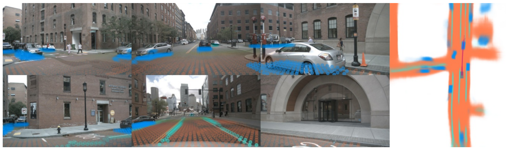
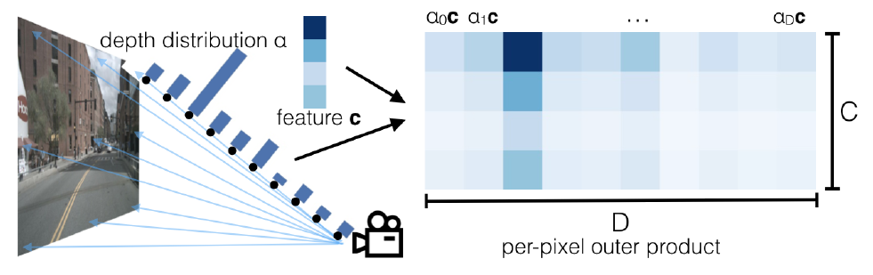
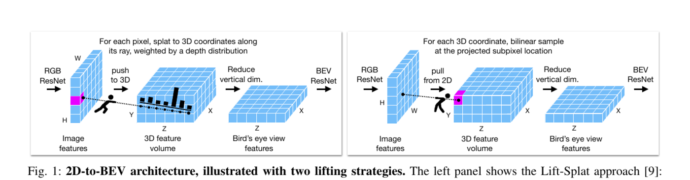
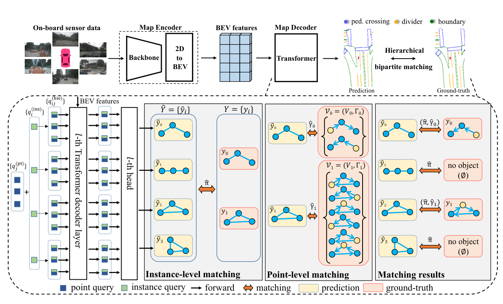
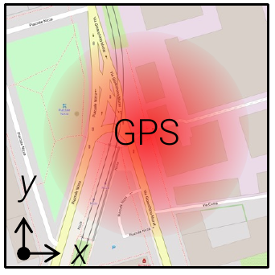
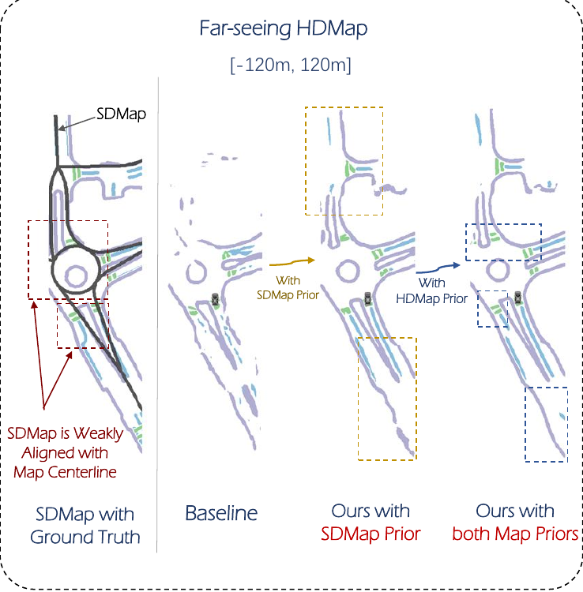
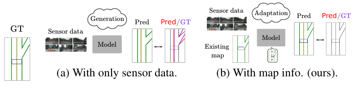

# Maps for Autonomous Driving

Build a geometric and topological representation the vehicle can use.

<!--
Present the central question and announce the objectives of this block.
-->

---
hideInToc: true
class: map-illustration-slide
---

# Maps for on-road planning

<figure>

<figcaption>An excerpt of an HD map from Argoverse 2.</figcaption>
</figure>

A high-definition map, **HD**, describes the lanes, their boundaries, crossings, and connections relevant to driving.

- **White / yellow**: lane markings and boundaries.
- **Purple**: pedestrian crossings.
- **Gray, at intersections**: implicit corridors between lanes.
- **Red**: vehicle trajectory, shown as a reference.

Wilson et al., Argoverse 2, NeurIPS Datasets and Benchmarks 2021. Illustration from the <a href="https://argoverse.github.io/user-guide/">official guide: Vector Map, Lane-Level Geometry</a>.

<!--
A map can be produced locally online or made available before the trip. The image is a reference map, not a model prediction or an aerial photo. Argoverse 2 polylines carry 3D coordinates even though the rendering is seen from above. The gray corridors show the continuity of lanes through intersections; the red trajectory belongs to the scenario and is not a road marking. Planning exploits this structured representation rather than the pixels directly. Point out a pedestrian crossing and follow a corridor between two branches of the intersection.
-->

---
hideInToc: true
class: map-illustration-slide
---

# BEV: Bird's-Eye View

The bird's-eye view, **BEV** (*bird's-eye view*), brings observations together in a single frame on the ground, around the vehicle.

Six cameras · predictions reprojected as pointsBEV segmentation

<i style="background:#159ad6" /> Vehicles<i style="background:#f28b58" /> Drivable surface<i style="background:#58b8a0" /> Lanes

On the right, a <strong>semantic prediction in the ground plane</strong>: positions and distances around the vehicle can be compared.

Philion and Fidler, Lift-Splat-Shoot, ECCV 2020, figure 1. <a href="https://www.ecva.net/papers/eccv_2020/papers_ECCV/papers/123590188.pdf">Paper and figure</a>.

<!--
BEV is a representation; it can contain features, probabilities, or objects. Features from several heights can be compressed into a single cell. Here, the figure shows semantic outputs from Lift-Splat-Shoot, not the internal latent features or a photo taken from the sky. The colored points on the six images are the BEV predictions reprojected into the cameras; they are not LiDAR measurements. Have students find the blue vehicles and orange road in both views. An HD map and a BEV view denote different notions: geometric and semantic richness for HD, frame and spatial organization for BEV.
-->

---
hideInToc: true
---

# BEV from image

A pixel $\tilde u=(u,v,1)^\top$ defines a ray. For an axial depth $d$:

$$
X_C(d)=dK^{-1}\tilde u,\qquad X_V(d)=R_{V\leftarrow C}X_C(d)+t_{V\leftarrow C}.
$$

<StepFlow :steps='["Pixel 2D", "Rayon dans la caméra", "Hypothèses de profondeur", "Points dans le repère du véhicule"]' />

<InfoBlock title="Ambiguity">

Without depth or a surface hypothesis, a pixel does not determine a unique 3D point.

</InfoBlock>

<ExampleBlock title="If the car is equipped with a LiDAR" v-click>

We can estimate the depth of pixels by associating them with the point cloud captured by the LiDAR.

</ExampleBlock>

<!--
Vary d with a fixed pixel. The extrinsic pose translates and rotates the whole ray; it does not resolve the depth ambiguity.
-->

---
hideInToc: true
class: figure-slide
---

# Lift: spreading the feature across depth

For each pixel, the network predicts a **visual vector** $f(u)$ and depth weights $p(d_k\mid u)$, which sum to 1.

$$
F(u,d_k)=p(d_k\mid u)f(u).
$$

Each depth receives a copy of the vector, multiplied by its weight. Calibration determines where to place this contribution along the ray.

**Scalar example:** $f(u)=2$, with weights of 0.25 at 10 m and 0.75 at 20 m. The contributions are **0.5** and **1.5**.

Philion and Fidler, ECCV 2020, Figure 3. <a href="https://arxiv.org/abs/2008.05711">Paper and figure source</a>.

<!--
In Lift-Splat-Shoot, the distribution can be learned from BEV losses without labeled metric depth. A latent distribution is not necessarily calibrated as a depth measurement.
-->

---
hideInToc: true
---

# Splatting: accumulating into ground-plane cells

The points are expressed in the vehicle frame. For each cell $c$, we sum **only the contributions that fall into it**:

$$
\mathcal I_c=\{(u,k)\mid\mathrm{cell}(X_V(u,d_k))=c\},\qquad
F_{\mathrm{BEV}}(c)=\sum_{(u,k)\in\mathcal I_c}p(d_k\mid u)f(u).
$$

The index $(u,k)$ denotes a pixel and a depth hypothesis. Several pixels or cameras can contribute to the same cell.

<InfoBlock title="A feature grid">

The features are not occupancy probabilities. For example, they can be class predictions (pedestrians, cars, etc.).

</InfoBlock>

<!--
Define the grid's resolution and bounds. Cells are vertical pillars aggregated onto the ground plane. Position quantization and the summation of features are distinct; do not claim that every variant is differentiable with respect to every coordinate. The index u includes the camera in the multi-view case.
-->

---
hideInToc: true
class: example-flow-slide
---

# How to learn the BEV representation?

In Lift-Splat-Shoot, a task defined on the ground can supervise the entire pipeline:

<StepFlow :steps='["Calibrated images", "Features + depth weights", "Lift + Splat", "Comparison with annotations"]' />

<ExampleBlock title="A cell occupied by a vehicle">

The annotation indicates "vehicle". The BEV head assigns it a probability of $0{,}2$: its cross-entropy loss is $-\ln(0{,}2)\approx1{,}61$.

This error backpropagates to the visual features and depth weights that contributed to the grid.

</ExampleBlock>

The depth weights can thus be learned **without metric depth annotations**. They are not necessarily calibrated depth measurements.

Philion and Fidler, ECCV 2020. <a href="https://arxiv.org/abs/2008.05711">Lift, Splat, Shoot</a>.

<!--
The BEV class probability and the latent depth weights are two distinct distributions. The example illustrates one cell; the objective aggregates annotated cells. The projection geometry uses known intrinsics and extrinsics; it is not entirely learned. LSS demonstrates BEV segmentation learning without a depth sensor at training or inference time.
-->

---
hideInToc: true
class: lab-slide
---

# Following a Pixel to the BEV Grid

<LabFrame><LiftSplatLab /></LabFrame>

Change the pixel, the dominant depth and its uncertainty. Follow the displacement and spread in the grid.

<!--
The step reveals the image, the ray, then the BEV. The feature value is fixed at 1 so the mass is legible. The sum of contributions stays 1. The grid shown projects the lateral and longitudinal coordinates.
-->

---
hideInToc: true
class: figure-slide
disabled: true
---

# Projecting to the grid or sampling from the grid

Two ways to organize the transfer of information: project features from the image, or sample the images from defined 3D positions.

In both cases, calibration, visibility, and depth influence the result.

Harley et al., Simple-BEV, ICRA 2023, Figure 1. <a href="https://simple-bev.github.io/simple_bev_sep30.pdf">Paper and source of the figure</a>.

<!--
Simple-BEV is used to compare geometric schemes without developing a new catalog of architectures.
-->

---
hideInToc: true
---

# What elements should a map represent?

| Element | Possible geometry | Useful information |
|---|---|---|
| Line / boundary | Polyline | Position and separation |
| Lane | Center line and boundaries | Width, direction, continuity |
| Crosswalk | Polygon or boundaries | Crossing zone |
| Intersection | Connections between lanes | Permitted movements |

<StepFlow :steps='["Points", "Polylines / polygons", "Semantic classes", "Topological relations"]' />

<ExampleBlock title="A curb as a polyline">

In the vehicle frame ($x$ forward, $y$ to the left): $[(0,2),(5,2),(10,3)]\,\mathrm m$, class "curb". The points describe its path; the class indicates its meaning for the robot.

</ExampleBlock>

<!--
A center line alone does not contain the full surface of the lane. Annotations vary between datasets; define the exact schema before the loss.
-->

---
hideInToc: true
disabled: true
---

# Topology describes the connections

Geometric proximity between two lanes is not enough to allow a crossing. Topology indicates successors, predecessors, adjacencies, and possible movements.

$$
G=(V,E),\qquad (i,j)\in E\Rightarrow\text{connection allowed from }i\text{ to }j.
$$

The nodes $V$ can represent lane segments; the edges $E$ encode their relations.

<ExampleBlock title="Counterexample">

Two roads that cross on the image may pass over a bridge and under that same bridge. The connection must be verified in 3D.

</ExampleBlock>

<!--
Ask whether a left turn is geometrically possible but forbidden. Separate connectivity, direction, and traffic rules.
-->

---
hideInToc: true
disabled: true
---

# Projecting an image annotation onto the ground

For a camera with no tilt, at height $h$, a point **on a flat ground plane** projects to row $v$:

$$
v-v_0=\frac{f_yh}{z}\qquad\Longrightarrow\qquad z=\frac{f_yh}{v-v_0}.
$$

$v_0$: horizon; $f_y$: vertical focal length in pixels; $z$: forward distance in meters. The image axis $v$ points downward.

<ExampleBlock title="A marking below the horizon">

With $h=1.5\,\mathrm m$ and $f_y=800\,\mathrm{px}$:

at 100 pixels below the horizon, $z=800\times1.5/100=12\,\mathrm m$; at 50 pixels, $z=24\,\mathrm m$.

</ExampleBlock>

<AlertBlock title="The surface assumption is essential">

The projection works for ground markings. It fails for a point on a pedestrian or a non-flat road. Near the horizon, a small pixel error can shift the ground point substantially.

</AlertBlock>

<!--
For a known plane, a homography can be used. With camera tilt, use extrinsics and ray-plane intersection. The demo lets you change the point's height and elevation. The case v=v0 has no finite intersection with the ground in this model.
-->

---
hideInToc: true
class: lab-slide
disabled: true
---

# See the error caused by the ground assumption

<LabFrame><MapProjectionLab /></LabFrame>

Increase the height of the observed point, then change the assumed height of the camera.

<!--
With point height=0 and camera height=1.5, the projection recovers 12 m. With point height=.75, it estimates 24 m. At 1.5 m, the point reaches the horizon: the intersection with the ground is no longer finite.
-->

---
hideInToc: true
class: map-illustration-slide
---

# Building a local map online

The model estimates the visible elements around the vehicle at each instant. The result can complement an existing map or work without a pre-established local map.

Six camera views of the same scenePredictionAnnotation

<i style="background:#6756df" /> Pedestrian crossings<i style="background:#e4a317" /> Lane dividers<i style="background:#268641" /> Road boundaries

For training: the two maps must be compared. The <strong>predicted points and lines</strong> must recover the geometry and class of each annotated element.

Liao et al., MapTR, ICLR 2023, figure 1, first scene cropped. <a href="https://arxiv.org/abs/2208.14437">Paper and figure</a>.

<!--
Spell out the labels: polylines, classes, and possibly relations. Elements outside the field of view or occluded require a consistent annotation policy. The excerpt keeps the first Cloudy scene from the original figure, without recomposing the images or the results. The French headings and legend translate the Surrounding Views / Prediction / GT columns and the three original classes. Spot the purple pedestrian crossing to the left of the vehicle in both maps. This MapTR output describes vectorized instances; it does not imply an explicit prediction of all topological relations.
-->

---
hideInToc: true
class: figure-slide
---

# Example: MapTR — predicting vector elements

The model predicts a set of map elements, each described by points.

Training matches predictions to annotations and accounts for valid point permutations. Because the same line read in both directions can represent the same geometry.

Liao et al., MapTR, ICLR 2023, Figure 4. <a href="https://arxiv.org/abs/2208.14437">Paper and figure source</a>.

<!--
The architecture figure is used to follow inputs, representation, and outputs. Attention details remain optional.
-->

---
hideInToc: true
---

# Defining the loss function for map elements

After matching instances, compare class and geometry. For the **sampled points** of predicted polylines $P$ and annotated $Q$:

$$
d_{\mathrm{Ch}}(P,Q)=
\underbrace{\frac1{|P|}\sum_{p\in P}\min_{q\in Q}\|p-q\|}_{\text{prediction to annotation}}+
\underbrace{\frac1{|Q|}\sum_{q\in Q}\min_{p\in P}\|q-p\|}_{\text{annotation to prediction}}.
$$

For each point, find its **nearest neighbor**, then average the distances. Redo the computation in the other direction.

<ExampleBlock title="A border offset by 20 cm" v-click>

$P=\{(0,0),(1,0)\}$ and $Q=\{(0,0.2),(1,0.2)\}$ in meters. The nearest neighbors are all at $0.2\,\mathrm m$.

Both averages give $d_{\mathrm{Ch}}=0.2+0.2=0.4\,\mathrm m$.

</ExampleBlock>

<!--
Chosen convention: sum of two averages, non-squared distances, no factor of 1/2. Other protocols differ. Chamfer is an illustration of geometric comparison and does not represent the entirety of the MapTR loss. Depending on the method, add order, direction, and relations.
-->

---
hideInToc: true
---

# Why compare the polylines in both directions?

A real boundary sampled at $Q=\{0,1,2\}$ meters, but predicted only at $P=\{0,1\}$: part of it is missing.

| Direction | Distances to nearest neighbors | Mean |
|---|---|---:|
| $P\to Q$ | $0\to0$: $0$; $1\to1$: $0$ | $0$ |
| $Q\to P$ | $0\to0$: $0$; $1\to1$: $0$; $2\to1$: $1$ | $1/3\,\mathrm m$ |

<ExampleBlock title="The missing part affects the loss function" v-click>

All predicted points are correct: the first direction penalizes nothing. The second detects that the point at 2 m is not covered. In total, $d_{\mathrm{Ch}}=1/3\,\mathrm m$.

So this favors completeness of the predictions.

</ExampleBlock>

<!--
1D case on a single axis, to isolate the role of the two terms. Sampling influences the distance: compare consistent protocols.
-->

---
hideInToc: true
---

# Aligning successive observations

An old observation must be expressed in the current frame:

$$
X_{V_t}=T_{V_t\leftarrow V_{t-1}}X_{V_{t-1}}.
$$

<StepFlow :steps='["Old local map", "Motion estimation", "Current observation", "Fusion / association"]' />

<ExampleBlock title="">

A static point is **10 m ahead of the vehicle**. The vehicle moves forward 2 m: in the new frame, this point is at **8 m**. Without motion estimation, the positions 10 m and 8 m would be wrongly fused. A registration error can thus duplicate a curb.

</ExampleBlock>

<!--
Distinguish vehicle motion from scene changes. Moving actors must not be fused as persistent static geometry.
-->

---
hideInToc: true
class: demo-slide
disabled: true
---

# Observing temporal registration

<DemoFrame><TemporalBevWarp /></DemoFrame>

Modify the estimated motion to observe the observations realign in the current frame.

<!--
Use the translation and rotation controls. Explain that alignment is geometric before features are fused.
-->

---
hideInToc: true
---

# Building at the scale of a road network

<StepFlow :steps='["Fleet observations", "Geographic alignment", "Element fusion", "Review and publication"]' />

| Source | Contribution | Limitation to address |
|---|---|---|
| Navigation map / OpenStreetMap | Road structure and approximate connections | Accuracy, completeness, freshness |
| Aerial imagery | Coverage and global view | Occlusions, resolution, date |
| Vehicle sensors | Recent road-level detail | Uneven coverage, calibration |
| Human correction | Arbitration of ambiguous cases | Cost and traceability |

<ExampleBlock title="In practice: Mapping a new ramp">

The aerial view suggests the layout; several vehicle passes measure the markings and curbs. After alignment, the observations are fused and a human annotator verifies that the map is correct.

</ExampleBlock>

<!--
This pipeline is a pedagogical synthesis, not the reproduction of a particular industrial system. The sources have different scales, dates, and uncertainties.
-->

---
hideInToc: true
class: map-illustration-slide
zoom: 0.93
---

# Using public maps. E.g.: OpenStreetMap (OSM)

OSM, freely available, is a worldwide road map built from public data and crowdsourcing. It notably describes roads and buildings using **lines, polygons and attributes**, and can therefore serve as a basis for localization or for building an HD map.

<figure>
<figcaption>OSM map and approximate GPS position</figcaption>

</figure>

→<small>Rasterize (discretize on a grid) by class</small>

<figure>
<figcaption>Semantic raster</figcaption>

</figure>

<i style="background:#549bff" /> Buildings<i style="background:#009e10" /> Parks<i style="background:#bcff8f" /> Grass<i style="background:#ff0000" /> Roads (lines)

It can be useful to use these maps as an (imperfect) basis for long-term planning and to complement them with onboard sensor data for short-term planning. Notably to detect changes, correct the geometry, and detect dynamic objects (pedestrians, cars, etc.). 

Sarlin et al., OrienterNet, CVPR 2023, figure 2, two cropped panels. <a href="https://openaccess.thecvf.com/content/CVPR2023/papers/Sarlin_OrienterNet_Visual_Localization_in_2D_Public_Maps_With_Neural_Matching_CVPR_2023_paper.pdf">Paper</a>. Data © <a href="https://www.openstreetmap.org/copyright">OpenStreetMap contributors</a>.

<!--
These two panels come from OrienterNet, which uses maps for visual localization. They illustrate here the encoding of the OSM source, without attributing this architecture to P-MapNet. The red blob in the first panel is the GPS prior, not a semantic class. The raster colors distinguish the categories of the representation chosen by the authors; OSM does not impose a single rendering. The legend is verified in maploc/osm/viz.py of the official repository: building=(84,155,255), park=(0,158,16), grass=(188,255,143), road=(255,0,0). The map also shows bright green paths and small point objects; the four classes in the legend serve as reference points, without covering all categories. Details such as crosswalks or number of lanes may be present in OSM, depending on the area; their coverage and accuracy are not guaranteed like those of a reference HD map. Rasterization does not create information that is absent. The black lines and arrows in the figure are kept from the original.
-->

---
hideInToc: true
class: map-illustration-slide
disabled: true
---

# Using a navigation map as prior information

<figure>

OSM + referenceSensors only+ SD prior+ SD and HD priors

<figcaption>P-MapNet: effect of the two prior sources.</figcaption>
</figure>

**On the left**, the road skeleton from OSM does not exactly coincide with the annotated HD map.

**From left to right in the predictions:**

1. Sensors alone leave missing elements.
2. The **SD** prior contributes road structure, especially at range.
3. The learned **HD** prior helps regularize the predicted shapes.

A standard map guides the estimation; observations remain necessary to recover the local geometry.

Jiang et al., P-MapNet, IEEE RA-L 2024, figure 1(b). <a href="https://arxiv.org/abs/2403.10521">Paper and figure</a>.

<!--
Do not equate a navigation map with ground truth. Georeferencing errors can shift the prior relative to the observations. SD stands for standard definition, here a skeleton extracted from OpenStreetMap. The left panel overlays this black skeleton on the annotated HD map to illustrate the misalignment. The next three panels show baseline, SD prior, then SD and HD priors. The HD prior is a shape model learned by masked autoencoding on maps; it is not the provision of an exact HD map of the location at inference time. The regions boxed by the authors point to recovered or regularized elements. This qualitative comparison illustrates the mechanism without guaranteeing improvement in every scene.
-->

---
hideInToc: true
class: figure-slide
disabled: true
---

# An existing map can help estimation

MapEX studies how to integrate an existing map into estimation from sensors.

The system must benefit from elements that are still valid while being able to correct those that no longer match the observations.

Age alone does not prove that an element has changed.

Sun et al., MapEX, WACV 2025, Figure 1. <a href="https://openaccess.thecvf.com/content/WACV2025/html/Sun_Mind_the_Map_Accounting_for_Existing_Maps_When_Estimating_Online_WACV_2025_paper.html">Article and source of the figure</a>.

<!--
Comparative figure of sensor-only inputs and sensor-with-map inputs. The course then proposes a pedagogical probabilistic model distinct from the MapEX architecture.
-->

---
hideInToc: true
---

# Detecting a Persistent Change

<StepFlow :steps='["Observation / map conflict", "Check pose and visibility", "Accumulate evidence", "Propose a correction"]' />

When observing the environment, evidence must be accumulated before modifying an HD map.

A missing line may simply be occluded and thus not visible temporarily. A line that appears to have moved may be the effect of a calibration error.

So detecting a persistent (permanent) change in the map requires several consistent pieces of evidence. For example, several vehicle passes noticing the same change.

<InfoBlock title="Traceability">

Keep date, provenance, and uncertainty. A validated update must be distinguishable from an isolated observation.

This makes it possible to build highly reliable HD maps that can be shared by a fleet of vehicles. Of course, the process is long and costly, hence the gradual, limited deployments from Waymo, Zoox, and other self-driving car companies.

</InfoBlock>

<!--
Present the difference between absence of evidence and evidence of absence. An unobserved area should not be treated as empty.
-->

---
hideInToc: true
disabled: true
---

# Quantifying the effect of a new observation

Simplified Bayesian example: $C$ means "the map has changed". Initially, $P(C)=0.10$. A visible discrepancy $D$ is more likely if the map has changed:

$$
\underbrace{\frac{P(C\mid D)}{1-P(C\mid D)}}_{\text{ratio after observation}}
=\underbrace{\frac{P(C)}{1-P(C)}}_{\text{ratio before observation}}
\underbrace{\frac{P(D\mid C)}{P(D\mid\neg C)}}_{0.85/0.10=8.5}.
$$

| Visible discrepancies | Ratio $o=P(C)/(1-P(C))$ | Probability $P(C)=o/(1+o)$ |
|---|---:|---:|
| None | $1/9$ | $10\,\%$ |
| One | $(1/9)\times8.5$ | $48.6\,\%$ |
| Two | $(1/9)\times8.5^2$ | $88.9\,\%$ |

<InfoBlock title="Seeing a discrepancy, or seeing nothing">

An occlusion is not an observed discrepancy: it provides no update here. Repeated, correlated views do not count as independent pieces of evidence.

</InfoBlock>

<!--
The demo updates the odds by a likelihood ratio. An occlusion produces no measurement. Passes are assumed independent; in practice, errors can be correlated.
-->

---
hideInToc: true
---

# An abstract map supports multiple scenarios

<StepFlow :steps='["Geometry and connections", "Rules and priorities", "Actors and behaviors", "Simulation"]' />

The maps we build provide a spatial support not only for navigation, but also for simulation.

We can use them to create scenarios by adding vehicles, pedestrians, their states and their behaviors. A map of a single intersection allows simulating a large number of variations.

<InfoBlock title="Abstraction">

Because the map is just a collection of objects, it is easy to add or remove them to simulate driving scenarios.

Much simpler than generating coherent and realistic camera or LiDAR data for the various scenarios.

</InfoBlock>

<!--
Avoid confusing actor dynamics with map updates. The simulation shown illustrates dependencies; it does not constitute an automotive safety validation.
-->

---
hideInToc: true
class: lab-slide
---

# Explore an intersection with a pedestrian

<LabFrame><IntersectionLab /></LabFrame>

Vary the pedestrian's departure time and the yield decision. Compare the trajectories on an identical map.

<!--
Remove yielding then test several departure times. Read the minimum distance over the whole scenario, not just the current distance. The stopping behavior is simplified and does not model realistic braking dynamics.
-->
