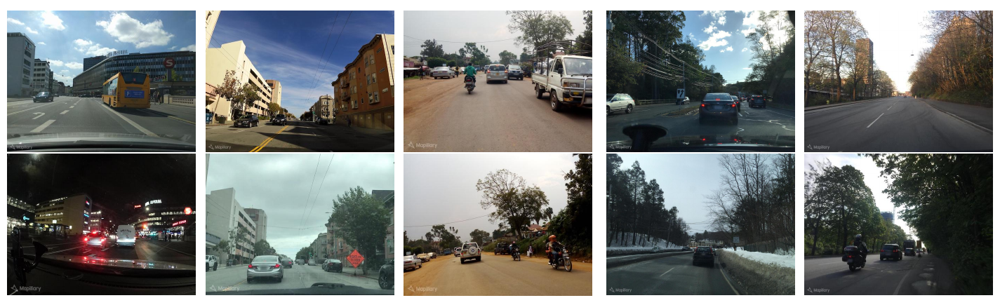
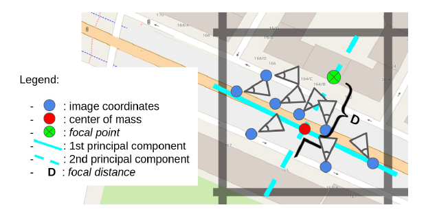
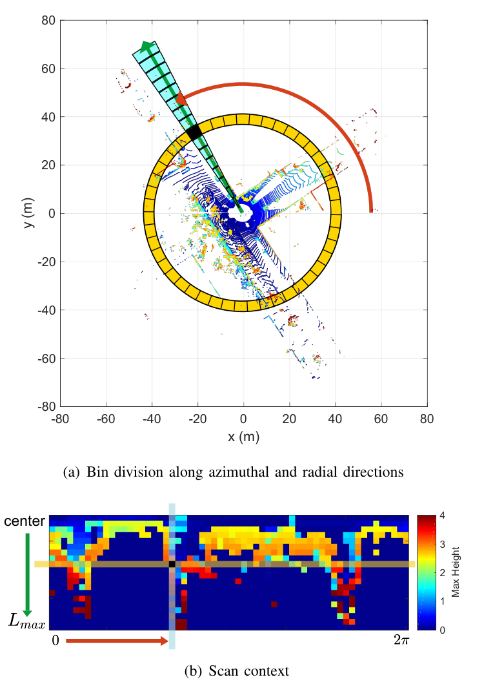

# Multimodal Supervision

Learn with a label source different from the signal used at inference.

<!--
Present the central question and announce the objectives of this block.
-->

---
hideInToc: true
---

# Inputs and labels can change modality

| Model input | Supervision source | Example task |
|---|---|---|
| Image | LiDAR depth | Depth estimation |
| Image | Pose of a 3D model | Object pose estimation |
| Image | GNSS positions | Place recognition |
| LiDAR point cloud | Georeferenced trajectory | 3D place recognition |

<InfoBlock title="Correspondence between data">

The modalities must be synchronized and correctly matched. Their noise carries over to the labels.

</InfoBlock>

<AlertBlock title="Example: Place recognition">

We will look at an example: place recognition.

The goal is to replicate a GPS's relocalization capability using only images or LiDAR scans. The learned model can then be used when GNSS (GPS) signals are no longer available.

</AlertBlock>

<!--
GNSS: global navigation satellite system. GPS is a GNSS constellation. Use GNSS for the general concept and GPS when that is the source named by a paper.
-->

---
hideInToc: true
class: figure-slide
---

# Recognizing a place seen before

A query image is compared to a database of reference images.

Since the images are taken at different times. A challenge is to recognize a place despite changes in lighting, weather conditions, or occlusions.

The result is: a **candidate association** (pair of images), along with a score (confidence/uncertainty).

Arandjelović et al., NetVLAD, CVPR 2016, Figure 1. <a href="https://arxiv.org/abs/1511.07247">Article and figure source</a>.

<!--
The figure presents a qualitative success. It does not guarantee robustness to every night, every season, or every city.
-->

---
hideInToc: true
class: example-flow-slide
---

# Place recognition is a search

$$
z_q=f_\theta(I_q),\qquad z_j=f_\theta(I_j),\qquad j^*=\arg\min_j d(z_q,z_j).
$$

<StepFlow :steps='["Query image", "Global descriptor", "Search in the database", "Nearest candidates"]' />

The global descriptor is a compact vector associated with the entire image. The vectors in the database are computed and indexed ahead of time.

<AlertBlock title="Visual ambiguity">

Two distinct places can look alike. Keep several candidates before checking the geometry.

</AlertBlock>

---
hideInToc: true
---

# A global descriptor summarizes local characteristics

An encoder produces a local vector $f_i\in\mathbb R^D$ at each pixel or patch in the image. Aggregation summarizes these vectors into **one descriptor for the image**.

<StepFlow :steps='["20 × 30 map", "600 vectors of size 128", "Average over the patches", "One vector of size 128"]' />

The descriptor retains the information learned to recognize the place. Its values are not geographic coordinates.

<!--
Introduce Euclidean distance and, for normalized vectors, the link with cosine similarity. The nearest neighbor is not necessarily a valid match.
-->

---
hideInToc: true
---

# From Retrieval to Loop Closure

<StepFlow :steps='["Query → candidate", "Local correspondences", "Geometric verification", "Relative pose factor"]' />

A loop closure links two poses of the same graph when a place is revisited. Geometric verification provides a measured relative transformation and its uncertainty.

<AlertBlock title="Measurement scale">

A pair of monocular images typically provides a translation at an unknown scale. A complete metric constraint requires additional information.

</AlertBlock>

<ExampleBlock title="Example: A robot returns in front of the lab entrance">

The robot retrieves an old image of the entrance. Verified RGB-D correspondences make it possible to estimate the relative displacement between the two shots and add the constraint to the graph.

</ExampleBlock>

<!--
Examples: depth, stereo, 3D point cloud or metric map to resolve the ambiguity. RANSAC rejects erroneous associations; the descriptor score does not replace this step.
-->

---
hideInToc: true
---

# Loop closure residual

$$
r_{ij}=\operatorname{Log}\!\left(Z_{ij}^{-1}T_i^{-1}T_j\right)\in\mathbb R^6.
$$

| Quantity | Reading |
|---|---|
| $Z_{ij}$ | Measured pose from frame $j$ to frame $i$|
| $T_i=T_{W\leftarrow i}$, $T_j=T_{W\leftarrow j}$ | Poses of the two cameras in the world |
| $T_i^{-1}T_j$ and $Z_{ij}$ | Two transformations from frame $j$ to frame $i$ |
| $Z_{ij}^{-1}T_i^{-1}T_j$ | Identity if prediction and measurement coincide |
| $\operatorname{Log}(\cdot)$ | Converts the discrepancy into six local components |

<!--
Log is the logarithm of the SE(3) rigid transformation, not the logarithm applied separately to its elements. The three translation components of the tangent space are coupled to the rotation in the general case. The order of the six components and the covariance convention must match. The demo reduces the graph to SE(2).
-->

---
hideInToc: true
disabled: true
---

# Weighting a constraint by its uncertainty

The same residual does not carry the same weight depending on the expected precision of the measurement:

$$
E=r^\top\Sigma^{-1}r
\qquad\text{and, on a single axis,}\qquad
E=\left(\frac{r}{\sigma}\right)^2.
$$

| Residual $r$ | Standard deviation $\sigma$ | Normalized residual | Cost |
|---|---|---:|---:|
| $0.5\,\mathrm m$ | $0.1\,\mathrm m$ | $5$ | $25$ |
| $0.5\,\mathrm m$ | $1\,\mathrm m$ | $0.5$ | $0.25$ |

<InfoBlock title="The more precise the measurement, the more the disagreement weighs">

The covariance $\Sigma$ scales translations and rotations by their uncertainties. A loop closure that is wrong but declared very precise can strongly distort the graph.

</InfoBlock>

<!--
Sigma contains variances and covariances; sigma is a standard deviation. For a diagonal covariance, the cost is the sum of squared residuals divided by their standard deviations. Rotation components are in radians, translation components in meters. This quadratic cost corresponds to a local Gaussian model; a robust loss can limit the effect of outliers, without replacing geometric verification.
-->

---
hideInToc: true
class: lab-slide
---

# Add a loop closure to the graph

<LabFrame><LoopClosureLab /></LabFrame>

Choose a good or a bad association, then click "Optimize" and observe the trajectory.

<!--
The robot comes back near T₂, the third pose; T₀ only serves to fix the frame. The correct recognition links T₁₀ to T₂; the incorrect one confuses two similar entries and links T₁₀ to T₆ with an incompatible measurement. Choosing the association does not move the poses: the Optimize button launches Gauss-Newton iterations in SE(2), with step search. The closure is heavily weighted, with no robust rejection. Compare the drop in cost to the error against the actual path: a bad association can reduce the cost while folding the graph onto itself. Switching scenarios restores the same initial odometry.
-->

---
hideInToc: true
---

# Using the GNSS position of a retrieved image

<StepFlow :steps='["Image de référence j", "Position GNSS pⱼ", "Association visuelle", "Ancrage de la pose requête"]' />

A geolocated database provides an approximate position of the recognized place, even if the query has no GNSS.

<AlertBlock title="Approximate anchoring">

The query and the reference may have been taken several meters apart. This difference adds to the GNSS noise.

</AlertBlock>

<ExampleBlock title="Localizing a robot without GNSS reception">

An image from the robot recognizes a facade present in a geolocated database. The position of the reference gives a plausible neighborhood.

</ExampleBlock>

<!--
Do not blindly transfer an orientation or a full pose from the reference. Latitude/longitude coordinates must be converted into a consistent local metric frame.
-->

---
hideInToc: true
---

# Residual of an approximate geographic anchor

With $t_i$ the position of the query camera in a common metric frame:

$$
r_i^{\mathrm{geo}}=t_i-p_j^{\mathrm{GNSS}},\qquad E_i^{\mathrm{geo}}=(r_i^{\mathrm{geo}})^\top\Sigma_{\mathrm{geo}}^{-1}r_i^{\mathrm{geo}}.
$$

This factor assumes that the positions of the two shots are close enough. Its uncertainty must cover the GNSS error, the shot offset, and association errors.

<ExampleBlock title="An anchor in a local frame, in meters" v-click>

If $t_i=(12,5,0)$ and $p_j=(10,4,0)$, then $r_i^{\mathrm{geo}}=(2,1,0)\,\mathrm m$. With $\Sigma_{\mathrm{geo}}=4I\,\mathrm m^2$, the cost is $(2^2+1^2)/4=1.25$.

</ExampleBlock>

<!--
The approximation only holds if the geographic neighborhood is narrow enough. In a real system, estimate and validate the covariance on representative data. Do not count the same correlated information twice.
-->

---
hideInToc: true
class: lab-slide
disabled: true
---

# Adding a GNSS anchor to the graph

<LabFrame><FactorGraphLab mode="gnss"/></LabFrame>

Compare a soft anchor and an overconfident anchor. Observe the uncertainty circle and the trajectory.

<!--
The reference position is deliberately close to but different from the last camera's. The factor is not a GNSS measurement of the query. The graph stays in SE(2) to remain readable.
-->

---
hideInToc: true
---

# How to build a training dataset for place recognition

First, positive and negative pairs can be selected from GNSS positions.

For images geolocated at $p_i$ and $p_j$:

$$
\|p_i-p_j\|<r_+\Rightarrow\text{possible positive},\qquad \|p_i-p_j\|>r_-\Rightarrow\text{possible negative},\quad r_->r_+.
$$

An intermediate zone is ignored to reduce ambiguities. Spatial proximity gives weak supervision: the images may face opposite directions.

<AlertBlock title="Labeling noise">

GNSS noise, parallel streets, repetitive facades, and viewpoint changes produce misleading pairs.

</AlertBlock>

<ExampleBlock title="Illustrative radii: 10 m and 25 m">

At 6 m: possible positive. At 18 m: pair ignored. At 40 m: possible negative. Two images at 6 m can still face opposite facades; proximity alone is not enough.

</ExampleBlock>

<!--
The radii depend on the dataset and the application. The demo values are pedagogical and do not claim to be a universal protocol.
-->

---
hideInToc: true
---

# Easy Negatives, Hard Negatives, and False Negatives

| Type | Geographic distance | Descriptor distance | Effect |
|---|---|---|---|
| Easy | Distinct places | Large | Loss is often zero |
| Hard | Distinct places | Small | Useful learning signal |
| False negative | Same place or real overlap | Small | Misleading learning signal |

<StepFlow :steps='["Candidats géographiques", "Descripteurs actuels", "Sélection des négatifs", "Vérification des ambiguïtés"]' />

<ExampleBlock title="Query: the entrance of a parking lot">

**Easy negative:** a forest. **Hard negative:** the similar entrance of another parking lot. **False negative:** the same entrance, geolocated too far away because of a GNSS error.

</ExampleBlock>

<!--
Selection can be done within the mini-batch or in a descriptor memory. The hardest ones are not always the most reliable early in training.
-->

---
hideInToc: true
class: lab-slide
disabled: true
---

# Selecting pairs under noisy supervision

<LabFrame><MiningLab /></LabFrame>

Vary the positive radius and the GNSS bias, then compare easy negative and hard negative.

<!--
Identify candidate C: visually close according to the descriptor but geographically distant. Show how a GNSS bias changes the set of possible positives.
-->

---
hideInToc: true
---

# How to train: A siamese network

$$
z_a=f_\theta(I_a),\qquad z_b=f_\theta(I_b).
$$

<StepFlow :steps='["Two observations", "Same encoder fθ", "Two comparable vectors", "Distance loss"]' />

Both branches use the same parameters. The loss learns a geometry where compatible examples are close.

<ExampleBlock title="The same intersection, by day and by night">

Each image passes through the same encoder. The positive pair encourages descriptors to stay close despite the lighting; the gradients from both branches update the same weights.

</ExampleBlock>

<!--
Draw two branches pointing to the same θ. Two networks with the same architecture but independent weights do not constitute the sharing shown here.
-->

---
hideInToc: true
---

# Contrastive loss: learning with pairs

Distance between descriptors: $D=\|z_a-z_b\|_2$. With $y=1$ for a positive and a margin $m>0$:

$$
\ell_{\mathrm{pair}}=
\begin{cases}
D^2 & y=1\quad\text{(same place)},\\
\max(0,m-D)^2 & y=0\quad\text{(different places)}.
\end{cases}
$$

| Pair, with $m=1$ | Distance $D$ | Loss | Desired effect |
|---|---:|---:|---|
| Intersection by day / same intersection at night | $0{.}4$ | $0{.}4^2=0{.}16$ | Pull descriptors closer |
| Two different intersections | $0{.}4$ | $(1-0{.}4)^2=0{.}36$ | Push them apart |
| Two different intersections | $1{.}2$ | $0$ | Already far enough apart |

<InfoBlock title="The margin sets a sufficient separation">

Negatives beyond $m$ no longer contribute to this loss. $D$ measures a gap in descriptor space, not a distance in meters between places.

</InfoBlock>

<!--
Equivalent form: yD²+(1-y)max(0,m-D)². The convention y=1 for positive must be stated explicitly, since some code bases reverse it. The encoder's parameters get updated, not the images. Normalizing the descriptors changes the range of possible distances; adjust the margin accordingly.
-->

---
hideInToc: true
class: lab-slide
---

# Bring positives closer, push negatives apart in descriptor space

<LabFrame><MetricLab mode="contrastive"/></LabFrame>

Change the pair type and the margin, then apply gradient steps.

<!--
The demo uses embedding coordinates that are directly optimized. A real network receives these gradients through the chain rule; the images themselves do not move.
-->

---
hideInToc: true
---

# Triplet loss: enforcing a relative margin

Anchor $a$: intersection at night; positive $p$: same intersection during the day; negative $n$: a different intersection.

$$
\ell_{\mathrm{tri}}=\max\!\left(0,\underbrace{\|z_a-z_p\|_2}_{d_{ap}}-
\underbrace{\|z_a-z_n\|_2}_{d_{an}}+m\right).
$$

We want $d_{an}\geq d_{ap}+m$: the negative must be farther than the positive **by at least the margin**.

| $d_{ap}=0.4$, $m=0.2$ | Negative distance $d_{an}$ | Loss |
|---|---:|---:|
| Negative farther, but margin insufficient | $0.5$ | $0.4-0.5+0.2=0.1$ |
| Margin satisfied | $0.7$ | $\max(0,-0.1)=0$ |

<InfoBlock title="Advantage">

The triplet loss function is more stable. We avoid pulling descriptors closer and then pushing them apart successively. We do both at the same time.

</InfoBlock>

<!--
The update can move the anchor, positive, and negative; we don't force only the negative to move. A zero loss does not require a positive distance equal to zero. Here, distances are not squared, as in the demo. Some publications use squares: do not implicitly switch convention.
-->

---
hideInToc: true
class: lab-slide
---

# See the Effect of Triplet Loss

<LabFrame><MetricLab /></LabFrame>

Move the anchor, positive, and negative. Adjust the margin, then follow the updates of the three points.

<!--
Place the positive farther than the negative. All three gradients contribute; the anchor can also move. Once the margin is satisfied, the loss and gradient vanish.
-->

<!--
Aggregation example: mean, GeM, or NetVLAD. Global average pooling loses the explicit spatial layout of positions; the encoder can still incorporate context. Dimensionality affects storage and retrieval. Handle the zero-norm case in an implementation.
-->

---
hideInToc: true
disabled: true
---

# NetVLAD: aggregating local residuals

NetVLAD compares each local feature to **learned centers**, then summarizes the differences:

$$
V_k=\sum_i a_{ik}(f_i-c_k),\qquad \sum_k a_{ik}=1.
$$

| Symbol | Meaning |
|---|---|
| $i$, $f_i\in\mathbb R^D$ | Position in the image and its local feature |
| $k$, $c_k\in\mathbb R^D$ | Learned center this feature is compared to |
| $a_{ik}$ | Share of $f_i$'s contribution sent to center $k$ |
| $V_k\in\mathbb R^D$ | Sum of weighted residuals for this center |

Concatenate the $K$ vectors $V_k$, then normalize. With $K=4$ and $D=128$, this gives **512 values** before any dimensionality reduction.

Arandjelović et al., CVPR 2016. <a href="https://arxiv.org/abs/1511.07247">NetVLAD</a>.

<!--
The assignment is soft, hence differentiable, and the centers are learned together with the encoder. The sum of weights equals 1 over k for each i, not over positions i for a given center. The method notably uses a per-center normalization before the global normalization. The residual retains information about the direction of the differences, not just a count of assignments.
-->

---
hideInToc: true
disabled: true
---

# NetVLAD: computing the contribution to a center

Scalar example with a center $c_k=2$ and two local features:

| Feature $f_i$ | Weight $a_{ik}$ | Residual $f_i-c_k$ | Contribution |
|---|---:|---:|---:|
| $3$ | $0.8$ | $+1$ | $+0.8$ |
| $1$ | $0.2$ | $-1$ | $-0.2$ |

<ExampleBlock title="Summing the weighted deviations" v-click>

$V_k=0.8(3-2)+0.2(1-2)=0.6$. This center receives a net positive residual. Contributions of opposite signs can cancel out.

</ExampleBlock>

For each feature, the remaining weights go to the other centers. With vectors, the same computation applies component-wise.

<!--
These numbers are for teaching purposes. Here the two weights on i happen to add up to 1; the constraint is on the sum over centers k for a given i. A sum of residuals does not reconstruct every local detail, but it retains information different from a simple assignment histogram.
-->

---
hideInToc: true
class: demo-slide
disabled: true
---

# Observing NetVLAD Aggregation

<DemoFrame><NetVLADAnimation /></DemoFrame>

Follow the assignment of features and the aggregation of their residuals around the centers.

<!--
Link the colors to the centers. The values in the demonstration are synthetic; the real network learns the features and the assignments.
-->

---
hideInToc: true
class: example-flow-slide
---

# The training and retrieval pipeline

Pipeline: training:
<StepFlow :steps='["Collect + geolocate", "Separate places", "Form pairs / triplets", "Train the encoder"]' />

Pipeline: retrieval:
<StepFlow :steps='["Encode the entire database", "Index the vectors", "Search for candidates", "Verify then localize"]' />

<!--
Distinguish the offline pipeline from query processing. The reference images to be searched are allowed at test time as a database; their labels are not used to tune the model's parameters.
-->

---
hideInToc: true
class: figure-slide
---

# Visual conditions can vary widely

Day/night, weather, seasons, structure, and viewpoint change appearance.

A good evaluation should separate these factors and include examples that are genuinely different from the training data.

Warburg et al., Mapillary SLS, CVPR 2020, Figure 2. <a href="https://openaccess.thecvf.com/content_CVPR_2020/html/Warburg_Mapillary_Street-Level_Sequences_A_Dataset_for_Lifelong_Place_Recognition_CVPR_2020_paper.html">Paper and figure source</a>.

<!--
The figure shows real pairs from the Mapillary Street-Level Sequences dataset. Do not attribute each column without checking the original caption; present the types of variation together.
-->

---
hideInToc: true
---

# Learning targeted robustness

| Variation | Concrete approaches | Evaluation |
|---|---|---|
| Seasons | Multi-temporal positives; stable local features | Independent summer/winter revisits |
| Weather | Diversified collections; photometric augmentations and plausible degradations | Real rain/fog sequences |
| Time of day | Day/night pairs; training with strong lighting variations | Held-out nighttime queries |
| Viewpoint | Multi-view positives, EigenPlaces; local geometric verification | Lateral displacements and opposing views |

<InfoBlock title="Limitation">

A synthetic augmentation helps cover a variation; it does not replace evaluation on real observations.

</InfoBlock>

<!--
References: Patch-NetVLAD, Hausler et al., CVPR 2021; NetVLAD, Arandjelović et al., CVPR 2016; EigenPlaces, Berton et al., ICCV 2023. Do not promise absolute invariance.
-->

---
hideInToc: true
class: figure-slide
disabled: true
---

# EigenPlaces: organizing views during training

Example selection exposes the model to different views of the same point of interest.

The goal is to learn a descriptor that preserves the identity of the place despite the shift in viewpoint.

The quality of the positives is therefore just as important as the shape of the loss.

Berton et al., EigenPlaces, ICCV 2023, Figure 3. <a href="https://openaccess.thecvf.com/content/ICCV2023/html/Berton_EigenPlaces_Training_Viewpoint_Robust_Models_for_Visual_Place_Recognition_ICCV_2023_paper.html">Paper and figure source</a>.

<!--
Describe the camera positions and their directions. The figure illustrates the construction of groups, not a sensor architecture.
-->

---
hideInToc: true
disabled: true
---

# Evaluating retrieval before graph integration

$$
\mathrm{Recall@}K=\frac{\text{queries with at least one valid candidate among the top }K\text{}}{\text{number of queries}}.
$$

Specify what makes a candidate valid: geographic distance, overlap, or geometric verification. Also measure search time and memory.

<InfoBlock title="Two evaluations">

Correct recognition at the place level does not guarantee a relative transformation accurate enough for the graph. Evaluate geometric localization separately.

</InfoBlock>

<ExampleBlock title="Over 100 test queries" v-click>

A valid candidate ranks first for 72 queries, and appears among the top five for 89. **Recall@1 = 72%; Recall@5 = 89%.** This does not mean 89% of the five candidates are correct.

</ExampleBlock>

<!--
Here, K is the number of candidates, unrelated to the camera intrinsics. For a loop closure system, accepted false positives matter especially.
-->

---
hideInToc: true
class: figure-slide
---

# Scan Context: LiDAR Place Recognition

The horizontal plane is divided into rings and sectors.

Each cell keeps a maximum height, producing a matrix that describes the structure around the sensor.

The original descriptor is built explicitly, without supervised training.

Kim and Kim, Scan Context, IROS 2018, Figure 1. <a href="https://gisbi-kim.github.io/publication/kim2018scan/">Paper and figure source</a>.

<!--
A rotation around the vertical axis roughly corresponds to a circular shift of the sectors. Translation does not reduce to this shift.
-->

---
hideInToc: true
class: lab-slide
---

# Building and aligning a polar descriptor

<LabFrame><ScanContextLab /></LabFrame>

Rotate the point cloud, then search for the column shift that minimizes the distance.

<!--
The demo has six rings and twelve sectors. A rotation of 60 degrees corresponds to two sectors. Aligning should bring the score close to zero for this synthetic, noise-free case.
-->

---
hideInToc: true
---

# LiDAR Loop Closure: From Candidate to Constraint

<StepFlow :steps='["Nuage LiDAR", "Descripteur / Scan Context", "Candidats + orientation", "Recalage 3D vérifié"]' />

LiDAR provides geometry that is less dependent on lighting. Structural changes, occlusions, and lateral shifts remain difficult.

<!--
The final registration, for example ICP with quality checks, must provide a relative measurement and its validity. A yaw estimate from Scan Context is not a complete 6-DoF pose.
-->
