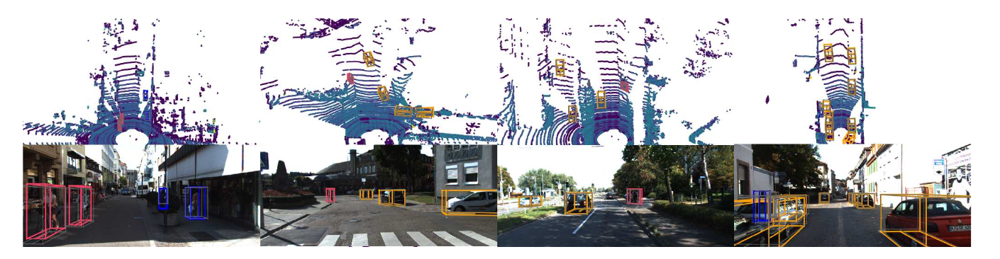
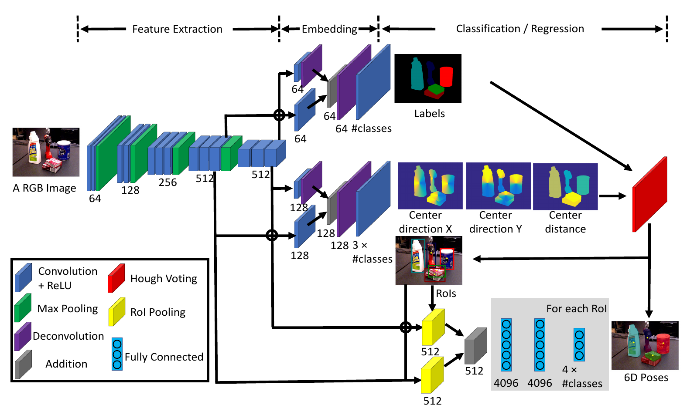

# Object-Based Representations

Detect, locate, orient, and organize the objects in a scene.

<!--
Present the central question and announce the objectives of this block.
-->

---
hideInToc: true
---

# What should an object representation contain?

| Output | Information | Robotic use |
|---|---|---|
| Class + 2D box | Category and region in the image | Region selection, visual tracking |
| 3D box | Center, dimensions, orientation | Distance, footprint, collision |
| Pose of a known object | Transformation from model to sensor | Grasping, assembly, inspection |
| Node in a map | Persistent identity and relationships | Object search, semantic navigation |

<StepFlow :steps='["Observe", "Detect", "Estimate geometry", "Associate in the map"]' />

<!--
A box represents an approximate volume. Pose assumes an object frame and, for the methods presented, a geometry or reference convention.
-->

---
hideInToc: true
---

# 2D Detection: Training Data

An image can contain a variable number of objects:

$$
Y=\{(c_j,b_j)\}_{j=1}^{M},\quad b_j=(u_j,v_j,w_j,h_j).
$$

For each object, $c_j$ is the class; $(u_j,v_j)$ is the **top-left corner** and $(w_j,h_j)$ the width and height, in pixels.

<ExampleBlock title="Example">

Example: an image annotated with two cars and a pedestrian. The detector must predict their classes, positions, and dimensions in the image.

</ExampleBlock>

<StepFlow :steps='["Annotated images", "Shared encoder", "Classes + boxes", "Matching to targets"]' />

<!--
Define here u,v as top-left corner, w,h as dimensions. Some networks use center and dimensions; do not mix conventions. Show a missing annotation as a source of false negatives.
-->

---
hideInToc: true
---

# YOLO: detect in a single pass

**YOLO — You Only Look Once** predicts classes and boxes from the entire image, in a single pass of the network. Example presented: **YOLOv8**.

<YoloDiagram />

At $640\times640$ pixels, the three maps give $80^2+40^2+20^2=8\,400$ prediction positions. The different resolutions help detect objects of varying sizes.

Redmon et al., <a href="https://arxiv.org/abs/1506.02640">YOLO, CVPR 2016</a>; modern example: <a href="https://docs.ultralytics.com/models/yolov8/">Ultralytics YOLOv8</a>. Pedagogical diagram.

<!--
The schematic image contains a car and a pedestrian. The drawing of the maps illustrates their relative sizes, not their learned content. For standard YOLOv8 P3/P4/P5, strides 8, 16, 32 and a square 640 input give 8400 positions, not 8400 objects. The encoder extracts features; the fusion combines several resolutions; the heads compute classes and boxes in parallel.
This material takes YOLOv8 as a specific example, without attributing all these details to YOLOv1 or to more recent variants. YOLOv8 is anchor-free: reference points, not predefined anchor box shapes. The class scores use independent sigmoids, not a softmax over a "no object" class, nor a separate objectness branch. During training, TaskAlignedAssigner selects candidates based on their position, the target class score, and overlap. Several candidates can be positive for the same object. Negative targets lower the scores; regression is supervised on the positives. The BCE, CIoU, and Distribution Focal Loss details remain a deeper dive.
Verified implementation: ultralytics v8.2.0, yolov8.yaml, utils/tal.py and utils/loss.py.
-->

---
hideInToc: true
---

# YOLO: keeping the useful detections

At inference, YOLOv8 can propose several boxes for the same object. Two steps reduce these candidates: **score threshold**, then **duplicate suppression (NMS)**.

<YoloDiagram mode="candidates" />

Thresholds: score $0{.}50$; IoU $0{.}50$.

| Candidate | Class | Score |
|---|---|---:|
| A | Car | $0{.}92$ |
| B | Car | $0{.}78$ |
| C | Pedestrian | $0{.}88$ |
| D, not drawn | Car | $0{.}20$ |

**NMS** keeps the box with the best score, then discards boxes of the same class that overlap it too much. It repeats this choice among the remaining candidates.

<ExampleBlock title="Which boxes to keep?" v-click>

D is discarded by the score threshold. Since $\mathrm{IoU}(A,B)\approx0{.}85>0{.}50$, A is kept and B is removed. This leaves **A and C**.

</ExampleBlock>

NMS: non-maximum suppression; IoU: intersection over union. <a href="https://github.com/ultralytics/ultralytics/blob/v8.2.0/ultralytics/utils/ops.py">YOLOv8 post-processing</a>. The thresholds are for teaching purposes.

<!--
The score threshold and the IoU threshold here share the same value .50, but govern two different decisions. Scores and thresholds are fictitious. The boxes in the drawing A=(50,45,120,80), B=(60,45,120,80), given as top-left corner and dimensions, yield intersection8800, union10400, IoU=.8461538. Per-class NMS: pedestrian C does not compete with cars. A high IoU is a hint of duplication, not proof; two genuinely close objects can be confused. NMS does not merge boxes and does not guarantee the correctness of detections.
The filtering and NMS shown here happen at inference; they are distinct from the assignment to annotations during training. The detailed IoU computation is then used to connect losses, duplicates and evaluation. The generic loss diagram that follows is not the exact YOLOv8 formula; its standard head uses BCE for classes, CIoU and DFL for boxes.
Some YOLO variants offer NMS-free inference. Do not generalize this step to the whole family.
-->

---
hideInToc: true
---

# One loss for the class, one loss for the box

Once each prediction is matched to its target, we correct **what the object is** and **where it is located**:

$$
L_{\mathrm{det}}=\lambda_{\mathrm{cls}}L_{\mathrm{cls}}+\lambda_{\mathrm{box}}L_{\mathrm{box}}+\lambda_{\mathrm{IoU}}L_{\mathrm{IoU}}.
$$

| Term | What it compares | Example error |
|---|---|---|
| Classification | Probabilities and target class | A car classified as a pedestrian |
| Box regression | Predicted and annotated coordinates | A box offset by 40 pixels |
| Overlap | Regions covered by the boxes | A box that is too large despite a good center |

<InfoBlock title="The λ weights balance the contributions">

The terms have different scales. Their weighting and exact form depend on the detector. A perfect box can still have the wrong class.

</InfoBlock>

<!--
Do not present this sum as universal. In DetectionLab, cross-entropy and normalized Huber are added together; IoU is shown separately. GIoU variants can give a signal when the boxes do not overlap.
-->

---
hideInToc: true
---

# IoU: how much surface do the boxes share?

Intersection over union compares the shared part to the whole region covered:

$$
\mathrm{IoU}(A,B)=\frac{|A\cap B|}{|A\cup B|}
=\frac{|A\cap B|}{|A|+|B|-|A\cap B|}.
$$

Two boxes of $100\times100$ pixels, at the same height, offset horizontally by 40 pixels:

| Quantity | Calculation | Area in square pixels |
|---|---|---:|
| Intersection | $(100-40)\times100$ | $6\,000$ |
| Union | $10\,000+10\,000-6\,000$ | $14\,000$ |

<ExampleBlock title="A visible overlap can still be insufficient" v-click>

$\mathrm{IoU}=6\,000/14\,000\approx0{.}43$. At an evaluation threshold of $0{.}50$, this localization is not enough, even if the class is correct.

</ExampleBlock>

<!--
The subtraction avoids double-counting the intersection. IoU=0 if the boxes are disjoint; IoU=1 if they coincide. Distinguish the evaluation threshold from a loss optimized at training time.
-->

---
hideInToc: true
class: lab-slide
---

# IoU Visualization

<LabFrame><DetectionLab /></LabFrame>

Make the boxes coincide, then make the class wrong: the two errors are controlled separately.

<!--
Target box [150,100,130,88]. Set x=150, y=100, width=130 for IoU=1 and box loss=0. Decrease the car score: the classification stays wrong despite a perfect box.
-->

---
hideInToc: true
---

# Evaluating detections at the right level

A correct detection combines a correct class with sufficient overlap with an annotation. A single annotation must not validate multiple predictions.

$$
\mathrm{precision}=\frac{TP}{TP+FP},\qquad \mathrm{recall}=\frac{TP}{TP+FN}.
$$

$TP$: true positives; $FP$: false positives; $FN$: false negatives.

<InfoBlock title="From score to performance">

Average precision, AP, summarizes the precision-recall curve. Always specify the classes and overlap thresholds of the protocol.

</InfoBlock>

<ExampleBlock title="Three annotated pedestrians, four detections" v-click>

Two pedestrians are correctly detected, one is missed; one box is a duplicate and another targets a pole. So $TP=2$, $FP=2$, $FN=1$: **precision = 50%**, **recall ≈ 67%**.

</ExampleBlock>

<!--
Distinguish confidence threshold from IoU threshold. An AP is only comparable between identical protocols; training losses are not directly detection metrics.
-->

---
hideInToc: true
---

# From Confidence Threshold to the Precision–Recall Curve

For a fixed class and IoU threshold, sort detections by decreasing score. Example: **three annotated pedestrians**.

| Score | Detection added | Cumulative precision | Cumulative recall |
|---|---|---:|---:|
| $0{.}95$ | Pedestrian 1: TP | $1/1=100\,\%$ | $1/3$ |
| $0{.}90$ | Pole: FP | $1/2=50\,\%$ | $1/3$ |
| $0{.}80$ | Pedestrian 2: TP | $2/3\approx67\,\%$ | $2/3$ |
| $0{.}60$ | Duplicate of pedestrian 1: FP | $2/4=50\,\%$ | $2/3$ |
| $0{.}40$ | Pedestrian 3: TP | $3/5=60\,\%$ | $3/3$ |

Lowering the threshold lets more detections in. Recall increases or stays constant; precision can go up or down.

**AP** summarizes the precision–recall curve following the interpolation protocol. It is not the average of the five precisions in the table.

Fictional example, annotations without "crowd" or ignored cases. <a href="https://github.com/cocodataset/cocoapi/blob/master/PythonAPI/pycocotools/cocoeval.py">COCO reference protocol</a>.

<!--
Fix, for example, IoU≥.5. At threshold .8, keep three predictions: precision=2/3 and recall=2/3. AP uses the scores to rank detections; we do not evaluate at a single confidence threshold. COCO samples 101 recall points and also averages over several IoU thresholds. Comparing results requires the same protocol.
-->

---
hideInToc: true
class: lab-slide
---

# Varying the detection threshold

<LabFrame label="Synthetic image · fixed scores · class: pedestrian · no NMS"><PrecisionRecallLab /></LabFrame>

Lower the threshold or click on the curve. Between two scores, the detections and the point remain unchanged.

<!--
The image is synthetic, produced with ImageGen, and the boxes/scores are built for pedagogical purposes. No detector is run. Three pedestrian annotations, five predictions A .95, B .90, C .80, D .60, E .40: same numbers as the precision-recall table. All predictions claim to detect a pedestrian; B targets the pole, D is a duplicate of A. The score threshold varies; the evaluation IoU threshold stays at .50. The candidate list stays fixed and deliberately keeps the duplicate D: no NMS is applied in this example. To evaluate a deployed system, also fix its post-processing rule and evaluate its corresponding outputs.
Starting at threshold .80: A, B and C are visible, TP=2 FP=1 FN=1, precision=recall=2/3. Raising to .95: only one true positive, precision=1 and recall=1/3. Lowering to .90 adds the pole: recall unchanged, precision=1/2. At .60, the duplicate adds one more FP without changing recall. At .40, all three pedestrians are found: recall=1, precision=3/5. Each annotation can be matched only once, in decreasing order of score. FP and FN are determined by comparison against the annotations, information unavailable at ordinary inference time.
The connected points give the raw empirical curve for this single-image example; the connection is a visual guide, not an AP interpolation or a measured model performance. The point jumps to the prediction scores, it does not continuously traverse the segments. At threshold=1, no prediction is retained: precision=0/0 undefined, recall=0, no artificial point added to the curve. Clicking Sweep the threshold animates the five additions; playback stops on leaving the slide. Annotations can be hidden, without changing the evaluation.
-->

---
hideInToc: true
class: example-flow-slide
---

# RGB-D: from image to metric points

The pixel $(u,v)$ and its axial depth $d=D(u,v)$ give a point in the camera frame:

$$
X_C=\begin{bmatrix}(u-c_x)d/f_x\\(v-c_y)d/f_y\\d\end{bmatrix}
=dK^{-1}\begin{bmatrix}u\\v\\1\end{bmatrix}.
$$

Subtract the principal point $(c_x,c_y)$, divide by the focal lengths $(f_x,f_y)$, then multiply by the depth: pixels become meters.

<ExampleBlock title="A point on a box to grasp" v-click>

$f_x=f_y=500\,\mathrm{px}$, $(c_x,c_y)=(320,240)$, $(u,v)=(370,240)$ and $d=2\,\mathrm m$ give $X_C=(0.20\,;\,0\,;\,2)\,\mathrm m$: **20 cm to the right** of the optical axis.

</ExampleBlock>

For the vehicle: $X_V=R_{V\leftarrow C}X_C+t_{V\leftarrow C}$. The extrinsic calibration fixes this frame change.

<!--
The depth must be aligned with the color image. D here is the axial depth Z, not the Euclidean range along the ray. If the sensor gives a range, normalize the ray. The focal lengths and the principal point are in pixels; the translations and the depth must use the same metric unit.
-->

---
hideInToc: true
---

# Parameterizing a 3D box

For objects assumed to be vertical:

$$
b=(c_x,c_y,c_z,l,w,h,\psi).
$$

- $c$: center, in meters.
- $l,w,h$: dimensions.
- $\psi$: orientation about the vertical axis.

A general orientation requires a 3D rotation.

<StepFlow :steps='["Center", "Dimensions", "Orientation"]' />

<InfoBlock title="Physical assumption">

A vehicle box only needs a single yaw angle, since the car is assumed to have all four wheels on the ground. On the other hand, a tool that can be held in any orientation requires three rotational degrees of freedom.

</InfoBlock>

<!--
Distinguish the vehicle convention with a vertical z from the camera convention with an optical z. The demonstration's labels are in the camera frame; the dimensions follow the box's local axes.
-->

---
hideInToc: true
class: lab-slide
disabled: true
---

# Relate 3D box, point cloud, and image

<LabFrame><ObjectPoseLab /></LabFrame>

Change the depth, length, and rotation. Observe the projection and the 3D volume simultaneously.

<!--
The points are synthetic and shared between the two views. This demonstration's orientation is a rotation around a camera axis; the vehicle's yaw convention depends on the chosen frame.
-->

---
hideInToc: true
class: figure-slide
---

# A LiDAR versus camera detection

Top: point clouds and boxes in bird's-eye view.

Bottom: reprojection of the boxes into the images.

The images help here to **visualize** the result; PointPillars uses the LiDAR for this detection.

Lang et al., PointPillars, CVPR 2019, Figure 3. <a href="https://arxiv.org/abs/1812.05784">Paper and figure source</a>.

<!--
Qualitative KITTI figure. Do not let it suggest that a visualization on an image implies an image input to the network.
-->

---
hideInToc: true
class: figure-slide
---

# PointPillars: from point cloud to pseudo-image

1. Group the points into vertical pillars.
2. Encode the points in each pillar.
3. Arrange the vectors in a grid.
4. Predict classes and 3D boxes.

The grid makes processing with 2D convolutions easier.

Lang et al., PointPillars, CVPR 2019, Figure 2. <a href="https://arxiv.org/abs/1812.05784">Paper and figure source</a>.

<!--
Show on the figure where the raw points, the pillars, and the outputs appear. A pseudo-image does not correspond to a photograph.
-->

---
hideInToc: true
disabled: true
---

# Learning to detect in a LiDAR point cloud

Data: points $(x,y,z)$, sometimes intensity, then annotated classes and 3D boxes.

$$
L=L_{\mathrm{class}}+\lambda_c L_{\mathrm{center}}+\lambda_d L_{\mathrm{dimensions}}+\lambda_r L_{\mathrm{rotation}}.
$$

Dimensions and positions are normalized according to the detector.

<InfoBlock title="Alternative parametrization">

CenterPoint predicts a heatmap of centers in BEV, then regresses height, dimensions, orientation, and optionally velocity.

</InfoBlock>

<StepFlow :steps='["Point cloud", "BEV features", "Centers and attributes", "Oriented boxes"]' />

<!--
Source: Yin et al., Center-based 3D Object Detection and Tracking, CVPR 2021, arXiv:2006.11275. The detailed terms and their weights are specific to the method.
-->

---
hideInToc: true
---

# Images and LiDAR: complementary information

| Criterion | Images | LiDAR |
|---|---|---|
| Appearance and categories | Rich texture and color | Geometry, possibly intensity |
| Metric scale | Ambiguous in monocular | Direct distance measurement |
| Density | Dense in pixels | Sparse, especially at long range |
| Difficult conditions | Sensitive to lighting | Also sensitive to rain, fog, and occlusions |
| Fusion | Calibration and synchronization needed | Same requirement for coherent fusion |

<InfoBlock title="Design decision">

Choose based on the sensor, the task, and the deployment conditions. Poorly calibrated fusion can degrade an estimate.

</InfoBlock>

<ExampleBlock title="A pedestrian is waiting at the roadside">

The image helps recognize the pedestrian; the LiDAR returns on their body provide their distance. The fusion must associate the pixels and points of the same pedestrian, at the same instant.

</ExampleBlock>

<!--
Avoid the generalization "LiDAR is robust to any weather." Explain the temporal errors when an object moves between two measurements.
-->

---
hideInToc: true
---

# Estimating the pose of a known object

For several applications, it is necessary to estimate the pose of an object.

The simplest case is when the geometry of the object is known a priori. For example, one may have a CAD model (CAD) of the object.

The CAD model defines the points on the object in the object frame $O$. The pose expresses them in the camera frame $C$:

$$
X_C=\underbrace{R_{C\leftarrow O}X_O}_{\text{rotate the object's axes}}+
\underbrace{t_{C\leftarrow O}}_{\text{place its origin}}.
$$

**Six degrees of freedom**: three for translation and three for rotation. The dimensions of the object are provided by its model.

<!--
Positive rotation in a right-handed frame. Computing R then t corresponds to T camera←object, which belongs to SE(3). To command the gripper, the calibration between camera and robot is also needed. Do not implicitly invert this transformation.
-->

---
hideInToc: true
class: figure-slide
---

# A CAD model provided at inference time

1. We look for the object in the image and determine its position and bounding box.
2. To obtain the orientation of the object, we match the points of the 3D (CAD) model with the points in the bounding box.
3. Once the points are matched, we can compute the orientation (e.g., in the manner of ICP and PnP).

Wen et al., FoundationPose, CVPR 2024, Figure 1, partie supérieure. <a href="https://nvlabs.github.io/FoundationPose/">Article et source de la figure</a>.

<!--
Stay on the case with a CAD model. The figure also shows the case without a model; explain this panel without going into detail on its implicit rendering.
-->

---
hideInToc: true
class: example-flow-slide
---

# Correspondences, then geometric estimation

For each point, we know its **3D position in the model** $X_k^O$ and its **observed pixel** $u_k$. The pose $T$ remains to be estimated:

$$
\hat T=\arg\min_T\sum_k\left\|u_k-\underbrace{\pi\!\left(KTX_k^O\right)}_{\text{pixel predicted for this pose}}\right\|^2.
$$

<StepFlow :steps='["CAD point", "Candidate pose T", "Projection into the image", "Deviation from observed pixel"]' />

<ExampleBlock title="The residual is measured in the image">

A corner observed at $(320,240)$ is projected at $(324,237)$: the residual is $(-4,3)$ pixels.

Its contribution to the sum is $(-4)^2+3^2=25\,\mathrm{px}^2$.

</ExampleBlock>

**PnP** estimates the pose from these correspondences; a refinement step reduces the reprojection error.

<!--
π performs the perspective division: (x,y,z) becomes (x/z,y/z). K is known. Correspondences can be predicted by a network; PnP is the geometric step. The formula represents the reprojection objective, not every detail of a PnP solver. RANSAC can discard bad correspondences. Degenerate geometry or symmetries can produce ambiguities.
-->

---
hideInToc: true
class: figure-slide
---

# PoseCNN: predicting pose with annotated examples

Shared features (features) feed three outputs: segmentation, translation, and rotation.

The training targets contain known poses. Rotation is regressed as a quaternion.

The model is specialized for the objects it was trained on.

Xiang et al., PoseCNN, RSS 2018, Figure 2. <a href="https://rse-lab.cs.washington.edu/projects/posecnn/">Paper and figure source</a>.

<!--
CAD models are also used to define the frame and the losses; do not present supervised regression and geometric knowledge as mutually exclusive categories.
-->

---
hideInToc: true
class: lab-slide
disabled: true
---

# Manipulating the six degrees of freedom of a pose

<LabFrame><ObjectPoseLab mode="pose"/></LabFrame>

Observe the object's axes and its projection as translation and orientation change.

<!--
The demo exposes three translations and three rotations. Distinguish these six degrees of freedom from the six values of the continuous representation of a rotation.
-->

---
hideInToc: true
---

# Quaternions: normalization and double representation

A unit quaternion $q=(q_w,q_x,q_y,q_z)$ represents a rotation:

$$
\|q\|_2=1,\qquad R(q)=R(-q).
$$

Normalize the network's output before forming the rotation matrix.

<AlertBlock title="Sign ambiguity">

A naive loss $\|\hat q-q\|^2$ can penalize two identical rotations.

One option:

$$
\min\left(\|\hat q-q\|^2,\|\hat q+q\|^2\right).
$$

</AlertBlock>

<ExampleBlock title="Same orientation, artificial error" v-click>

$q=(1,0,0,0)$ and $\hat q=(-1,0,0,0)$ both leave the object unrotated. Yet $\|\hat q-q\|^2=4$; the loss that accounts for sign equals $0$.

</ExampleBlock>

<!--
Geodesic distance on SO(3) is another option. Normalization requires handling outputs whose norm is close to zero.
-->

---
hideInToc: true
disabled: true
---

# Continuous 6D Representation of a Rotation

The network predicts two vectors $a,b\in\mathbb R^3$. From these we build **three perpendicular unit axes**, hence a rotation:

| Step | Computation | Role |
|---|---|---|
| 1. Normalize $a$ | $e_1=a/\lVert a\rVert$ | Fix the first axis |
| 2. Remove from $b$ its component along $e_1$ | $b_\perp=b-(e_1^\top b)e_1$ | Obtain a perpendicular direction |
| 3. Complete the basis | $e_2=b_\perp/\lVert b_\perp\rVert$, $e_3=e_1\times e_2$ | Form $R=[e_1\ e_2\ e_3]$ |

The construction assumes $a\neq0$ and $b$ not collinear with $a$.

<InfoBlock title="Six values for one rotation">

This representation eases regression by avoiding certain discontinuities. It encodes a rotation with **three degrees of freedom**; translation must be predicted separately.

</InfoBlock>

Zhou et al., CVPR 2019. <a href="https://arxiv.org/abs/1812.07035">On the Continuity of Rotation Representations in Neural Networks</a>.

<!--
Zero outputs for a, or a and b collinear, make the construction degenerate; plan for numerical safeguards. Continuity is not a guarantee of learning performance.
-->

---
hideInToc: true
disabled: true
---

# Building a Rotation from Two Vectors

Network outputs: $a=(2,0,0)$ and $b=(1,3,0)$. These vectors are neither unit nor perpendicular.

| Operation | Result |
|---|---|
| Normalize $a$ | $e_1=(1,0,0)$ |
| Compute the component of $b$ along $e_1$ | $(e_1^\top b)e_1=(1,0,0)$ |
| Remove this component | $b_\perp=(1,3,0)-(1,0,0)=(0,3,0)$ |
| Normalize the remainder | $e_2=(0,1,0)$ |
| Cross product | $e_3=(0,0,1)$ |

<ExampleBlock title="What orientation do we get?" v-click>

$R=[e_1\ e_2\ e_3]=I$: no rotation. The lengths of $a,b$ and the skew of $b$ have been removed to obtain a valid basis.

</ExampleBlock>

<!--
If b=(1,0,0), the remainder b_perp is zero: there is no longer a second direction. Ask what fails before using the rotation lab. The columns of R are the object's axes expressed in the destination frame.
-->

---
hideInToc: true
class: lab-slide
disabled: true
---

# Comparing a quaternion and a frame built from a 6D representation

<LabFrame><RotationLab /></LabFrame>

Flip the sign of the quaternion, then modify the skew of the predicted vectors.

<!--
Changing q to −q does not change the axes. Skew is removed by orthogonalization. Show the three final axes and the two input vectors.
-->

---
hideInToc: true
disabled: true
---

# Symmetries: two poses can explain the same observation

Compare the transformed model points:

$$
\mathrm{ADD}=\frac1{|M|}\sum_{X\in M}\|\hat RX+\hat t-(RX+t)\|.
$$

$M$ is the set of model points. We measure the displacement of **each corresponding point**, then average.

**Example:** if only the translation is off by 2 cm, all points are shifted by 2 cm: $\mathrm{ADD}=0.02\,\mathrm m$.

<ExampleBlock title="Symmetric object">

For a textureless cylinder, several rotations can produce the same appearance. A metric with symmetric correspondences, such as ADD-S, avoids some artificial penalties.

</ExampleBlock>

<!--
ADD: average distance of model points. ADD-S uses the nearest neighbor between transformed points. Distinguish geometric symmetry from appearance symmetry; a texture can lift the ambiguity.
-->

---
hideInToc: true
---

# Annotating a Reconstruction to Supervise Multiple Views

<StepFlow :steps='["Images + SfM", "Densification + maillage", "Annotation en 3D", "Reprojection visible"]' />

Structure from motion, **SfM**, estimates cameras and a geometry from images. **SfM** is the offline equivalent of SLAM, so it is not bound by real-time execution constraints. A dense reconstruction and a mesh then enable spatial annotation.

<InfoBlock title="Saving on annotation">

A single 3D annotation can serve many images. It requires consistent poses, a sufficiently static scene, and handling of occlusions.

</InfoBlock>

<!--
COLMAP: Schönberger and Frahm, Structure-from-Motion Revisited, CVPR 2016. SfM alone typically yields a sparse geometry; densification and meshing are additional steps. Without a metric reference, scale can remain ambiguous.
-->

---
hideInToc: true
class: figure-slide
---

# Annotating a Reconstructed Scene

The pipeline collects an RGB-D sequence, reconstructs the scene, aligns object models, then reprojects their labels.

Marion et al., LabelFusion, ICRA 2018, Figure 1. <a href="https://labelfusion.csail.mit.edu/">Paper and figure source</a>.

<!--
Read the six panels: capture, reconstruction, guided matching, alignment, annotated objects, labels in the images.
-->

---
hideInToc: true
class: lab-slide
disabled: true
---

# One 3D annotation, several supervised views

<LabFrame><AnnotationLab /></LabFrame>

Enable mesh annotation, then move the cameras. Labels follow the projections.

<!--
The three views represent the same synthetic surface. Explain that in a real scene, a depth test, such as a z-buffer, removes hidden points.
-->

---
hideInToc: true
disabled: true
---

# Pseudo-labeling: learning from a teacher

The **teacher** produces targets on unlabeled data. The **student** learns to reproduce them, in addition to human annotations.

$$
L=L_{\mathrm{sup}}+\lambda_u\sum_{i\in U}m_i\,\ell(f_{\theta_S}(x_i),\hat y_{T,i}).
$$

| Symbol | Meaning |
|---|---|
| $U$, $\hat y_{T,i}$ | Unlabeled examples and targets proposed by the teacher |
| $m_i=\mathbf1[\mathrm{confidence}\geq\delta_{\mathrm{pseudo}}]$ | Keep ($1$) or discard ($0$) the pseudo-label |
| $\lambda_u$ | Weight given to this additional supervision |

<ExampleBlock title="Filtering before computing the loss">

Threshold $0.90$: a car with confidence $0.92$ is kept; a detection at $0.60$ is discarded. With losses $0.3$ and $0.8$, then $\lambda_u=0.5$, the contribution equals $0.5(1\times0.3+0\times0.8)=0.15$.

</ExampleBlock>

<!--
The numbers are for illustration. High confidence does not prove correctness; errors can be reinforced. The teacher can be fixed or evolve, for example by moving average theta_T←mu theta_T+(1-mu) theta_S. For mu=.9, old weight2 and student4 give2.2. Mean Teacher: Tarvainen and Valpola, NeurIPS2017, arXiv:1703.01780. Do not attribute every hard filtering scheme to this method. Pseudo-targets are treated as fixed targets for the student update.
-->

---
hideInToc: true
class: lab-slide
disabled: true
---

# The confidence threshold filters without guaranteeing correctness

<LabFrame><AnnotationLab mode="teacher"/></LabFrame>

Raising the threshold reduces the number of pseudo-labels; a confident error can still remain.

<!--
At .75, five labels are kept, including a confident error at .83. Emphasize confirmation bias and the importance of annotated validation.
-->

---
hideInToc: true
class: figure-slide
zoom: 1.2
---

# From objects to a hierarchical map

3D scene graph: organizes geometry, objects, places, rooms and building in a single hierarchy.

Nodes (objects, places, rooms) have class and pose labels.

Relations represent membership, proximity and connectivity.

**Example:** "Find a chair in the meeting room." The graph connects the chair to the room, then the room to the traversable places used to reach it.

Hughes et al., Hydra, RSS 2022, Figure 1. <a href="https://arxiv.org/abs/2201.13360">Paper and figure source</a>.

<!--
Hydra is a complete spatial perception system. Supervised predictions are inputs to the map; the whole hierarchy does not result from a single supervised loss.
-->

---
hideInToc: true
class: lab-slide
---

# Explore the levels of a scene graph

<LabFrame><SceneHierarchyLab /></LabFrame>

Change the level of abstraction and select an object to track its spatial membership.

<!--
Ask how to answer "find a chair in the meeting room". The hierarchy narrows the search space; spatial relations are used to plan the trajectory.
-->
