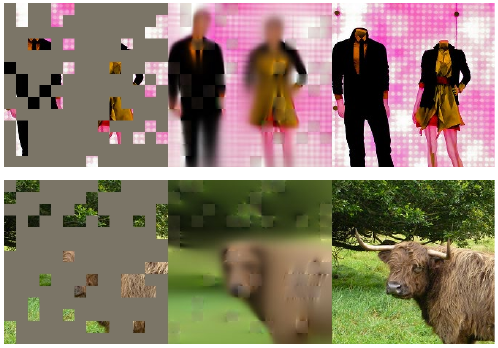

# La reconstruction comme signal d’apprentissage

<MaskedLearning mode="overview" :stage="$clicks" />

L’observation originale fournit une cible sans annotation humaine.

---
storyboard: S33
class: ssl-slide
clicks: 2
---

# Blocs visibles et masqués

<MaskedLearning mode="mask" :stage="$clicks" />

---
storyboard: S34
class: ssl-slide
clicks: 3
---

# Architecture de MAE

<MaskedLearning mode="architecture" :stage="$clicks" />

---
storyboard: S35
class: ssl-slide
clicks: 2
---

# Perte de reconstruction aux positions masquées

<MaskedLearning mode="loss" :stage="$clicks" />

---
storyboard: S36
class: ssl-slide
clicks: 1
---

# Reconstruction plausible et ambiguïté

  

    
Entrée masquéeReconstruction MAEImage originale

    
  

  
<InfoBlock title="Plusieurs complétions possibles">Le contexte visible ne détermine pas chaque détail masqué.</InfoBlock>
= 1" class="ssl-caption">Les sorties diffèrent des originaux, avec une structure de scène plausible.

= 1" class="small-note">La plausibilité visuelle ne prouve ni compréhension sémantique ni précision robotique.

<SSLControls />

<a href="https://arxiv.org/html/2111.06377v3">He et al., MAE, CVPR 2022 · Fig. 3, deux exemples les plus à droite · arXiv v3</a> · Images de validation COCO; modèle préentraîné sur ImageNet

---
storyboard: S37
class: ssl-slide
clicks: 1
---

# Que demande de conserver une cible de prédiction ?

<PredictionDemand :stage="$clicks" />

---
storyboard: S38
class: ssl-slide
clicks: 2
---

# JEPA: Prédire dans l'espace des caractéristiques

<FeaturePrediction mode="features" :stage="$clicks" />

Changer le calcul de cible pour qu'elle soit dans l’espace intermédiaire des caractéristiques.
Sans avoir à décoder dans l'espace de prédiction (ex: image).
Permet d'apprendre des concepts plus abstraits. Entraînement à grande échelle plus efficace.

---
storyboard: S39
class: ssl-slide
clicks: 2
---

# JEPA: Contexte et positions cibles

<FeaturePrediction mode="positions" :stage="$clicks" />

---
storyboard: S40
class: ssl-slide
clicks: 3
---

# JEPA: Perte de caractéristiques et mises à jour des cibles

<FeaturePrediction mode="updates" :stage="$clicks" />

---
storyboard: S41
class: ssl-slide
clicks: 2
---

# Architecture d’I-JEPA

<PredictiveArchitecture :stage="$clicks" />

---
storyboard: S42
class: ssl-slide
clicks: 2
---

# Cibles de pixels et cibles de caractéristiques

<PredictionSummary :stage="$clicks" />

