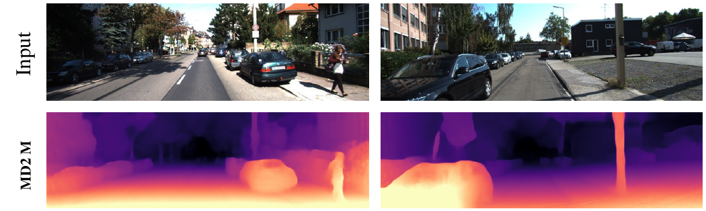

# Apprendre la profondeur à partir de plusieurs observations

<GeometryLab mode="intro" :stage="$clicks" />

La structure de scène et le mouvement caméra peuvent fournir un signal d’apprentissage.

---
storyboard: S44
class: ssl-slide
clicks: 1
---

# Notation des poses dans le cours

<PoseFrames :stage="$clicks" />

---
storyboard: S45
class: ssl-slide
clicks: 1
---

# Projection caméra et paramètres intrinsèques

<GeometryLab mode="projection" :stage="$clicks" />

---
storyboard: S46
class: ssl-slide
clicks: 1
---

# Rétroprojeter un pixel cible

<GeometryLab mode="depth" :stage="$clicks" />

---
storyboard: S47
class: ssl-slide
clicks: 1
---

# Changer de repère caméra

<GeometryLab mode="pose" :stage="$clicks" />

---
storyboard: S48
class: ssl-slide
clicks: 2
---

# Projection source et échantillonnage

<GeometryLab mode="sampling" :stage="$clicks" />

---
storyboard: S49
class: ssl-slide
clicks: 2
---

# Perte de reconstruction photométrique

<DenseReconstruction :stage="$clicks" />

---
storyboard: S50
class: ssl-slide
clicks: 3
---

# Mettre à jour les réseaux de profondeur et de pose

<GeometryTraining :stage="$clicks" />

---
storyboard: S51
class: ssl-slide
clicks: 1
---

# Ambiguïté d’échelle monoculaire

<GeometryLab mode="scale" :stage="$clicks" />

---
storyboard: S52
class: ssl-slide
clicks: 2
---

# Objets en mouvement indépendant

<GeometryLab mode="motion" :stage="$clicks" />

---
storyboard: S53
class: ssl-slide
clicks: 2
---

# Occultation et désoccultation

<GeometryLab mode="occlusion" :stage="$clicks" />

---
storyboard: S54
class: ssl-slide
clicks: 2
---

# Limites liées à la texture et à la réflectance

<GeometryLab v-if="$clicks===0" mode="flat" :stage="0" />

<AlertBlock title="La cohérence d’apparence peut échouer">En haut : zones déformées, réfléchissantes et saturées en couleur.</AlertBlock>
=2" class="ssl-caption">En bas : frontières ambiguës et formes complexes peuvent aussi poser problème.

Exemples de l’article, avec étiquettes de méthodes et régions soulignées originales.

<SSLControls v-if="$clicks>=1" />

=1" class="citation"><a href="https://arxiv.org/pdf/1806.01260v4">Godard et al., Monodepth2, ICCV 2019 · Fig. 8 · arXiv v4</a>

---
storyboard: S55
class: ssl-slide
clicks: 3
---

# Choix de reconstruction de Monodepth2

<SourceSelection :stage="$clicks" />

---
storyboard: S56
class: ssl-slide
clicks: 1
---

# Profondeur apprise sur des images réelles

Images caméra enregistrées en haut; profondeurs monoculaires Monodepth2 prédites en bas.

=1" class="takeaway">L’apprentissage relie les observations; l’inférence prédit la profondeur d’une seule image.

<SSLControls />

<a href="https://arxiv.org/pdf/1806.01260v4">Godard et al., Monodepth2, ICCV 2019 · Fig. 7, deux premiers exemples, lignes Input et MD2 M · Partition Eigen de KITTI · arXiv v4</a>

