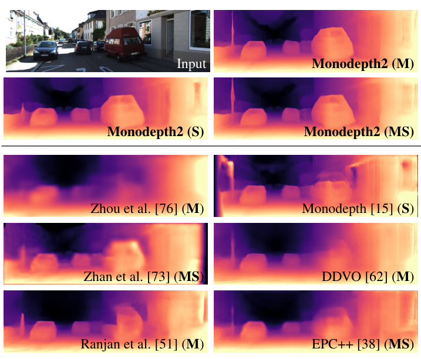

# Apprentissage auto-supervisé pour la perception robotique

**INF8422 : Perception robotique et intelligence spatiale**

Prof. Pierre-Yves Lajoie · Polytechnique Montréal

  
  <figure>
    

    <figcaption>Observation caméra et profondeur estimée <a href="https://arxiv.org/abs/1806.01260">Godard et al., Monodepth2, ICCV 2019, Fig. 1 (ligne supérieure)</a></figcaption>
  </figure>

---
layout: section
class: course-divider
storyboard: D01
section: Définition et mécanismes d’apprentissage
divider: true
dividerFor: S02
---

Section 01

# Mécanismes d’apprentissage auto-supervisé

---
src: ./sections/01-definition-and-learning.md
---

---
layout: section
class: course-divider
storyboard: D02
section: Représentations pour la perception
divider: true
dividerFor: S11
---

Section 02

# Représentations pour la perception

---
src: ./sections/02-representations.md
---

---
layout: section
class: course-divider
storyboard: D03
section: Appariement, effondrement et auto-distillation
divider: true
dividerFor: S18
---

Section 03

# Appariement, effondrement et auto-distillation

---
src: ./sections/03-matching-and-distillation.md
---

---
layout: section
class: course-divider
storyboard: D04
section: Reconstruction et prédiction de caractéristiques
divider: true
dividerFor: S32
---

Section 04

# Reconstruction et prédiction de caractéristiques

---
src: ./sections/04-reconstruction-and-feature-prediction.md
---

---
layout: section
class: course-divider
storyboard: D05
section: Supervision géométrique
divider: true
dividerFor: S43
---

Section 05

# Supervision géométrique

---
src: ./sections/05-geometric-supervision.md
---

---
layout: section
class: course-divider
storyboard: D06
section: Correspondances dans l’espace et le temps
divider: true
dividerFor: S57
---

Section 06

# Correspondances dans l’espace et le temps

---
src: ./sections/06-correspondence.md
---

---
layout: section
class: course-divider
storyboard: D07
section: Apprendre les possibilités d’action par l’expérience
divider: true
dividerFor: S65
---

Section 07

# Apprendre les possibilités d’action par l’expérience

---
src: ./sections/07-interaction-outcomes.md
---

---
layout: section
class: course-divider
storyboard: D08
section: Introduction à l’adaptation et à l’évaluation
divider: true
dividerFor: S79
---

Section 08

# Introduction à l’adaptation et à l’évaluation

---
src: ./sections/08-adaptation-and-evaluation.md
---

---
layout: section
class: course-divider
storyboard: D09
section: Références
divider: true
dividerFor: R01
---

Sources du cours

# Références

---
src: ./sections/09-references.md
---
