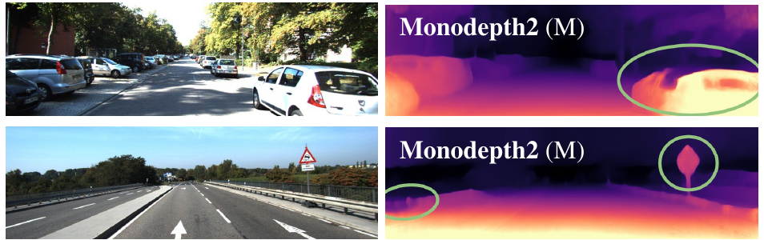

# Learning depth from multiple observations

<GeometryLab mode="intro" :stage="$clicks" />

Scene structure and camera motion can turn recorded images into a learning signal.

---
storyboard: S44
class: ssl-slide
clicks: 1
---

# The course's pose notation

<PoseFrames :stage="$clicks" />

---
storyboard: S45
class: ssl-slide
clicks: 1
---

# Camera projection and intrinsics

<GeometryLab mode="projection" :stage="$clicks" />

---
storyboard: S46
class: ssl-slide
clicks: 1
---

# Back-projecting a target pixel

<GeometryLab mode="depth" :stage="$clicks" />

---
storyboard: S47
class: ssl-slide
clicks: 1
---

# Changing camera frame

<GeometryLab mode="pose" :stage="$clicks" />

---
storyboard: S48
class: ssl-slide
clicks: 2
---

# Source projection and sampling

<GeometryLab mode="sampling" :stage="$clicks" />

---
storyboard: S49
class: ssl-slide
clicks: 2
---

# Photometric reconstruction loss

<DenseReconstruction :stage="$clicks" />

---
storyboard: S50
class: ssl-slide
clicks: 3
---

# Updating depth and pose networks

<GeometryTraining :stage="$clicks" />

---
storyboard: S51
class: ssl-slide
clicks: 1
---

# Monocular scale ambiguity

<GeometryLab mode="scale" :stage="$clicks" />

---
storyboard: S52
class: ssl-slide
clicks: 2
---

# Independently moving objects

<GeometryLab mode="motion" :stage="$clicks" />

---
storyboard: S53
class: ssl-slide
clicks: 2
---

# Occlusion and disocclusion

<GeometryLab mode="occlusion" :stage="$clicks" />

---
storyboard: S54
class: ssl-slide
clicks: 2
---

# Texture and reflectance failures

<GeometryLab v-if="$clicks===0" mode="flat" :stage="0" />

<AlertBlock title="Appearance consistency can fail">Top: distorted, reflective, and color-saturated regions.</AlertBlock>
=2" class="ssl-caption">Bottom: ambiguous boundaries and intricate shapes can also be difficult.

These are the paper’s examples, with its original method labels and highlighted regions.

<SSLControls v-if="$clicks>=1" />

=1" class="citation"><a href="https://arxiv.org/pdf/1806.01260v4">Godard et al., Monodepth2, ICCV 2019 · Fig. 8 · arXiv v4</a>

---
storyboard: S55
class: ssl-slide
clicks: 3
---

# Monodepth2's reconstruction choices

<SourceSelection :stage="$clicks" />

---
storyboard: S56
class: ssl-slide
clicks: 1
---

# Learned depth on real images

Recorded camera images above; Monodepth2 monocular depth predictions below.

=1" class="takeaway">Training relates observations; inference predicts depth from one image.

<SSLControls />

<a href="https://arxiv.org/pdf/1806.01260v4">Godard et al., Monodepth2, ICCV 2019 · Fig. 7, first two examples, Input and MD2 M rows · KITTI Eigen split · arXiv v4</a>

