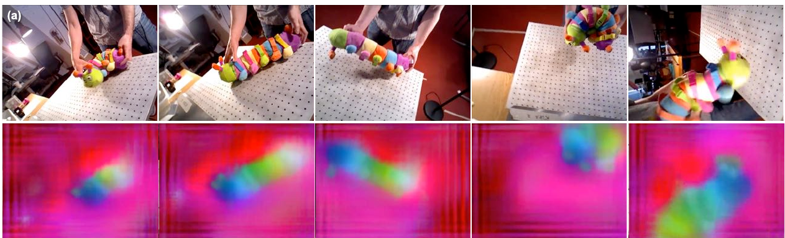

# Time as a source of related observations

<TimeRelations :stage="$clicks" />

---
storyboard: S58
class: ssl-slide
clicks: 2
---

# Time-Contrastive Networks

<TCNPaper :stage="$clicks" />

---
storyboard: S59
class: ssl-slide
clicks: 2
---

# Geometrically generated pixel matches

<CorrespondenceLab mode="pairs" :stage="$clicks" />

---
storyboard: S60
class: ssl-slide
clicks: 2
---

# Learning dense descriptors

<DescriptorTraining :stage="$clicks" />

---
storyboard: S61
class: ssl-slide
clicks: 2
---

# Matching with learned descriptors

<CorrespondenceLab mode="search" :stage="$clicks" />

---
storyboard: S62
class: ssl-slide
clicks: 2
---

# Descriptor consistency across configurations

RGB observations above · dense descriptor colors below

<svg v-if="$clicks>=1" viewBox="0 0 1263 384" aria-hidden="true"><g fill="none" stroke="white" stroke-width="8"><circle cx="140" cy="310" r="23"/><circle cx="360" cy="305" r="23"/><circle cx="550" cy="240" r="23"/></g><g fill="none" stroke="#168034" stroke-width="4"><circle cx="140" cy="310" r="23"/><circle cx="360" cy="305" r="23"/><circle cx="550" cy="240" r="23"/></g></svg>

The same object changes configuration while corresponding regions retain similar feature colors.

=2" class="takeaway">Feature colors encode descriptors, not manually assigned semantic part labels.

<SSLControls />

<a href="https://arxiv.org/pdf/1806.08756v2">Florence et al., Dense Object Nets, CoRL 2018 · Fig. 2(a), all five configurations · arXiv v2</a>

---
storyboard: S63
class: ssl-slide
clicks: 2
---

# Transferring a grasp point

<TaskPointTransfer :stage="$clicks" />

---
storyboard: S64
class: ssl-slide
clicks: 2
---

# Extension to 3D correspondence

<PointCloudCorrespondence :stage="$clicks" />

