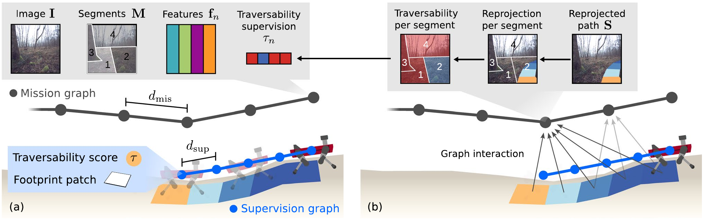

# Observation, action, outcome, target

<InteractionLearning :stage="$clicks" />

---
storyboard: S66
class: ssl-slide
clicks: 2
---

# Traversability depends on the robot

<PlatformTraversability :stage="$clicks" />

---
storyboard: S67
class: ssl-slide
clicks: 2
---

# Measuring traversal outcomes

<TerrainExperience mode="measure" :stage="$clicks" />

---
storyboard: S68
class: ssl-slide
clicks: 2
---

# Delayed supervision

<TerrainExperience mode="delay" :stage="$clicks" />

---
storyboard: S69
class: ssl-slide
clicks: 3
---

# Projecting experience into an earlier image

<TerrainExperience mode="project" :stage="$clicks" />

---
storyboard: S70
class: ssl-slide
clicks: 2
---

# Wild Visual Navigation

<b>Visual input</b>RGB images and pretrained visual features

=1"><b>Measured signal</b>Commanded versus estimated planar velocity

=2"><b>Accumulated supervision</b>Footprint scores reprojected into stored images

Experienced motion supplies targets for visual traversability estimation.

<SSLControls />

<a href="https://link.springer.com/article/10.1007/s10514-025-10202-x">Mattamala et al., WVN, Autonomous Robots 2025 · Fig. 5(a,b), journal PDF page 6</a>

---
storyboard: S71
class: ssl-slide
clicks: 2
---

# Measured outcomes and unvisited terrain

<TerrainExperience mode="coverage" :stage="$clicks" />

---
storyboard: S72
class: ssl-slide
clicks: 2
---

# Manipulation affordances

<CabinetInteraction mode="affordance" :stage="$clicks" />

---
storyboard: S73
class: ssl-slide
clicks: 2
---

# Predicting an action's outcome

<CabinetInteraction mode="predict" :stage="$clicks" />

---
storyboard: S74
class: ssl-slide
clicks: 3
---

# Automatically constructing an affordance target

<CabinetInteraction mode="execute" :stage="$clicks" />

---
storyboard: S75
class: ssl-slide
clicks: 2
---

# Losses for interaction-derived targets

<OutcomeLoss :stage="$clicks" />

---
storyboard: S76
class: ssl-slide
clicks: 2
---

# ActAIM as an interaction-learning example

<ActAIMSchematic :stage="$clicks" />

---
storyboard: S77
class: ssl-slide
clicks: 2
---

# Imperfect targets and selected experience

<TargetValidity :stage="$clicks" />

---
storyboard: S78
class: ssl-slide
clicks: 2
---

# The shared learning principle

<InteractionLearning mode="synthesis" :stage="$clicks" />

